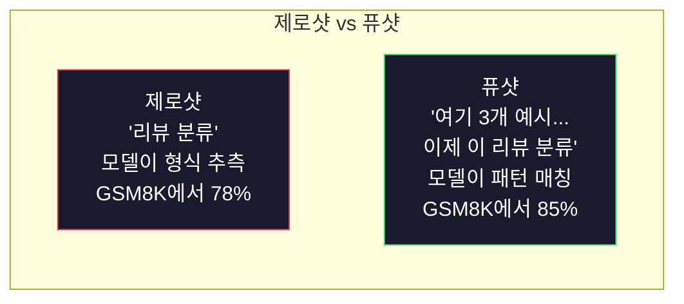
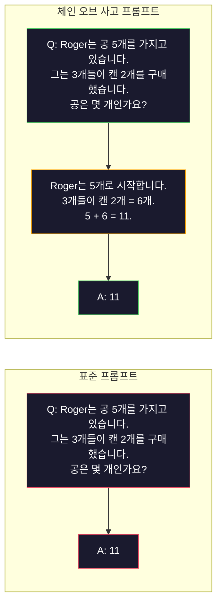
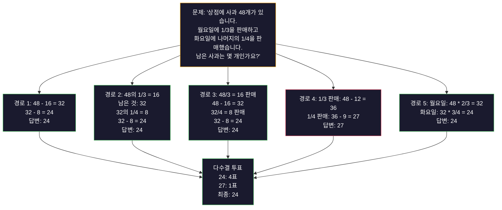
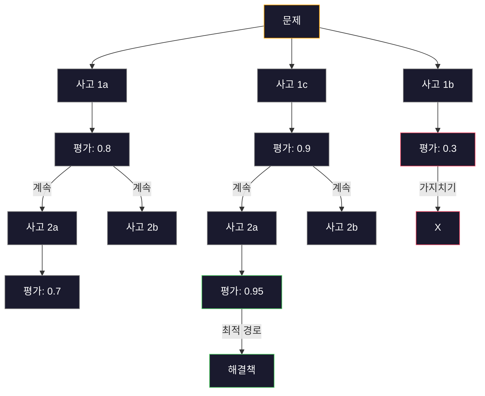

# Few-Shot, Chain-of-Thought, Tree-of-Thought

> 모델에게 무엇을 해야 하는지 알려주는 것은 프롬프팅입니다. 어떻게 생각해야 하는지 보여주는 것은 엔지니어링입니다. 동일한 모델, 동일한 작업, 동일한 데이터에서 78% 정확도와 91% 정확도의 차이는 더 나은 모델이 아닙니다. 더 나은 추론 전략입니다.

**유형:** Build  
**언어:** Python  
**사전 요구 사항:** Lesson 11.01 (프롬프트 엔지니어링)  
**소요 시간:** ~45분

## 학습 목표

- 작업 정확도를 최대화하는 예시 데모를 선택하고 포맷하여 퓨샷 프롬프팅 구현
- 수학 단어 문제와 같은 다단계 문제의 정확도 향상을 위한 체인 오브 사고(Chain-of-Thought, CoT) 추론 적용
- 여러 추론 경로를 탐색하고 최적의 경로를 선택하는 트리 오브 사고(Tree-of-Thought) 프롬프트 구축
- 표준 벤치마크에서 제로샷 vs 퓨샷 vs CoT의 정확도 향상 측정

## 문제

수학 과외 앱을 구축한다고 가정해 보세요. 프롬프트에 "이 단어 문제를 풀어보세요"라고 입력하면, GPT-5는 표준 초등 수학 벤치마크인 GSM8K에서 94%의 정확도를 달성합니다. 이미 최고점에 도달했다고 생각할 수 있습니다. 하지만 그렇지 않습니다. "사고 과정(chain-of-thought)"을 추가하면 3-4% 정확도가 더 상승합니다.

"단계별로 생각해 봅시다(Let's think step by step)"라는 5개의 단어를 추가하면 정확도가 91%로 뛰어오릅니다. 몇 가지 작업 예시를 추가하면 95%에 도달합니다. 동일한 모델, 동일한 온도(temperature), 동일한 API 비용입니다. 유일한 차이는 모델에 "스크래치 페이퍼"를 제공했다는 점입니다.

이것은 단순한 요령이 아닙니다. 이것이 바로 추론이 작동하는 방식입니다. 인간은 다단계 문제를 한 번의 정신적 도약으로 해결하지 않습니다. 트랜스포머 모델도 마찬가지입니다. 모델이 중간 토큰을 생성하도록 강제하면, 해당 토큰은 다음 토큰의 컨텍스트 일부가 됩니다. 각 추론 단계는 다음 단계를 위한 입력이 됩니다. 모델은 말 그대로 답을 계산해 나갑니다.

하지만 "단계별로 생각하기"는 시작일 뿐, 끝이 아닙니다. 만약 5가지 추론 경로를 샘플링하고 다수결로 답을 선택한다면 어떨까요? 모델이 가능성 트리를 탐색하며 가지를 평가하고 가지치기하도록 한다면? 추론과 도구 사용을 교차시킨다면? 이 아이디어들은 가설이 아닙니다. 측정 가능한 개선 효과를 입증한 공개된 기법들이며, 이 레슨에서 모두 구현해 볼 것입니다.

## 개념

## 제로샷 vs 퓨샷: 예시가 지시사항을 능가할 때

제로샷 프롬프트는 모델에 작업만 제공하고 그 외는 제공하지 않습니다. 퓨샷 프롬프트는 먼저 예시를 제공합니다.

Wei et al. (2022)는 8개의 벤치마크에서 이를 측정했습니다. 감정 분류와 같은 단순 작업에서는 제로샷과 퓨샷이 서로 2% 이내 성능 차이를 보였습니다. 다단계 산술 및 기호 추론과 같은 복잡한 작업에서는 퓨샷이 정확도를 10-25% 향상시켰습니다.

직관: 예시는 압축된 지시사항입니다. 출력 형식을 설명하는 대신 보여줍니다. 추론 과정을 설명하는 대신 시연합니다. 모델은 추상적인 지시사항을 해석하는 것보다 예시에 패턴 매칭하는 것이 더 신뢰할 수 있습니다.



**퓨샷이 승리하는 경우:** 형식 민감 작업, 분류, 구조화된 추출, 도메인 특화 용어, 특정 패턴과 매칭해야 하는 모든 작업.

**제로샷이 승리하는 경우:** 단순 사실 질문, 예시가 창의성을 제한하는 창의적 작업, 좋은 예시를 찾는 것이 좋은 지시사항을 작성하는 것보다 어려운 작업.

## 예시 선택: 유사성이 무작위보다 우수

모든 예시가 동일하지 않습니다. 대상 입력과 유사한 예시를 선택하는 것이 무작위 선택보다 분류 작업에서 5-15% 더 높은 성능을 보입니다 (Liu et al., 2022). 세 가지 원칙:

1. **의미적 유사성**: 임베딩 공간에서 입력과 가장 가까운 예시 선택
2. **라벨 다양성**: 예시에서 모든 출력 범주 포함
3. **난이도 일치**: 대상 문제의 복잡성 수준과 일치

대부분의 작업에 대한 최적의 예시 수는 3-5개입니다. 3개 미만에서는 모델이 패턴을 추출하기에 충분한 신호가 없습니다. 5개 이상에서는 감소하는 수익과 낭비되는 컨텍스트 윈도우 토큰이 발생합니다. 많은 라벨이 있는 분류 작업에서는 라벨당 하나의 예시를 사용합니다.

## 체인 오브 사고: 모델에 스크래치 페이퍼 제공

체인 오브 사고(CoT) 프롬프트는 Google Brain의 Wei et al. (2022)에 의해 소개되었습니다. 아이디어는 간단합니다. 모델에게 답만 요청하는 대신 먼저 추론 단계를 보여달라고 요청합니다.



이것이 기계적으로 작동하는 이유는? 트랜스포머가 생성하는 각 토큰은 다음 토큰의 컨텍스트가 됩니다. CoT 없이는 모델이 모든 추론을 단일 순방향 전달의 은닉 상태로 압축해야 합니다. CoT를 사용하면 모델이 중간 계산을 토큰으로 외부화합니다. 각 추론 토큰은 효과적인 계산 깊이를 확장합니다.

**GSM8K 벤치마크(초등 수학, 8.5K 문제):**

| 모델 | 제로샷 | 제로샷 CoT | 퓨샷 CoT |
|-------|-----------|---------------|--------------|
| GPT-4o | 78% | 91% | 95% |
| GPT-5 | 94% | 97% | 98% |
| o4-mini (추론) | 97% | — | — |
| Claude Opus 4.7 | 93% | 97% | 98% |
| Gemini 3 Pro | 92% | 96% | 98% |
| Llama 4 70B | 80% | 89% | 94% |
| DeepSeek-V3.1 | 89% | 94% | 96% |

**추론 모델 참고.** OpenAI의 o-시리즈(o3, o4-mini) 및 DeepSeek-R1과 같은 모델은 답변을 내보내기 전에 내부적으로 체인 오브 사고를 실행합니다. 추론 모델에 "단계별로 생각해 봅시다"를 추가하는 것은 중복되며 때로는 역효과를 낼 수 있습니다 — 이미 수행했기 때문입니다.

CoT의 두 가지 유형:

**제로샷 CoT**: 프롬프트에 "단계별로 생각해 봅시다"를 추가합니다. 예시 불필요. Kojima et al. (2022)는 이 단일 문장이 산술, 상식, 기호 추론 작업 전반에서 정확도를 향상시킨다는 것을 보여주었습니다.

**퓨샷 CoT**: 추론 단계를 포함한 예시를 제공합니다. 모델이 기대하는 정확한 추론 형식을 보기 때문에 제로샷 CoT보다 더 효과적입니다.

**CoT가 해로운 경우:** 단순 사실 회상("프랑스의 수도는?")), 단일 단계 분류, 정확도보다 속도가 중요한 작업. CoT는 쿼리당 50-200개의 추론 토큰 오버헤드를 추가합니다. 고처리량, 저복잡도 작업에서는 낭비되는 비용입니다.

## 자기 일관성: 여러 번 샘플링, 한 번 투표

Wang et al. (2023)는 자기 일관성을 소개했습니다. 통찰: 단일 CoT 경로에는 추론 오류가 포함될 수 있습니다. 그러나 N개의 독립적인 추론 경로를 샘플링(온도 > 0 사용)하고 최종 답변에 대해 다수결 투표를 하면 오류가 상쇄됩니다.



자기 일관성은 GSM8K 정확도를 단일 CoT의 56.5%에서 N=40으로 74.4%까지 향상시켰습니다. GPT-5에서는 개선이 작습니다(97% → 98%). 기본 정확도가 이미 포화 상태이기 때문입니다. 이 기법은 기본 CoT 정확도가 60-85%인 모델에서 가장 빛납니다 — 단일 경로 오류가 빈번하지만 체계적이지 않은 경우입니다. 추론 모델(o-시리즈, R1)의 경우 자기 일관성은 내장된 내부 샘플링에 포함됩니다.

트레이드오프: N개의 샘플은 API 비용과 지연 시간의 N배입니다. 실제로 N=5는 대부분의 이점을 포착합니다. N=3은 의미 있는 투표를 위한 최소값입니다. N > 10은 대부분의 작업에서 감소하는 수익을 보입니다.

## 트리 오브 사고: 분기 탐색

Yao et al. (2023)는 트리 오브 사고(ToT)를 소개했습니다. CoT가 하나의 선형 추론 경로를 따르는 반면, ToT는 여러 분기를 탐색하고 가장 유망한 것을 평가한 후 계속합니다.



ToT에는 세 가지 구성 요소가 있습니다:

1. **사고 생성**: 여러 후보 다음 단계 생성
2. **상태 평가**: 각 후보 점수 매기기 (LLM 자체를 평가자로 사용 가능)
3. **검색 알고리즘**: 트리 내에서 BFS 또는 DFS 수행, 낮은 점수 분기 가지치기

24 게임 작업(4개의 숫자를 산술 연산으로 조합하여 24 만들기)에서 표준 프롬프트를 사용한 GPT-4는 7.3%의 문제를 해결합니다. CoT를 사용하면 4.0%(CoT는 검색 공간이 넓기 때문에 오히려 해로움). ToT를 사용하면 74%입니다.

ToT는 비용이 많이 듭니다. 트리의 각 노드는 LLM 호출이 필요합니다. 분기 계수 3, 깊이 3의 트리는 최대 39개의 LLM 호출이 필요합니다. 검색 공간이 크지만 평가 가능한 문제에만 사용합니다 — 계획, 퍼즐 해결, 제약 조건이 있는 창의적 문제 해결.

## ReAct: 사고 + 행동

Yao et al. (2022)는 추론 추적과 행동을 결합했습니다. 모델은 사고(추론 생성)와 행동(도구 호출, 검색, 계산)을 번갈아 수행합니다.

```mermaid
graph LR
    Q["질문:\n에펠 탑이 위치한\n국가의 인구는\n얼마인가요?"]
    T1["사고: 에펠 탑이 있는\n국가를 찾아야 합니다"]
    A1["행동: 검색\n'에펠 탑 위치'"]
    O1["관측: 파리, 프랑스"]
    T2["사고: 이제 프랑스의\n인구를 찾아야 합니다"]
    A2["행동: 검색\n'프랑스 인구 2024'"]
    O2["관측: 6,840만 명"]
    T3["사고: 답을 얻었습니다"]
    F["답변:\n6,840만 명"]

    Q --> T1 --> A1 --> O1 --> T2 --> A2 --> O2 --> T3 --> F

    style Q fill:#1a1a2e,stroke:#ffa500,color:#fff
    style T1 fill:#1a1a2e,stroke:#51cf66,color:#fff
    style A1 fill:#1a1a2e,stroke:#e94560,color:#fff
    style O1 fill:#1a1a2e,stroke:#808080,color:#fff
    style T2 fill:#1a1a2e,stroke:#51cf66,color:#fff
    style A2 fill:#1a1a2e,stroke:#e94560,color:#fff
    style O2 fill:#1a1a2e,stroke:#808080,color:#fff
    style T3 fill:#1a1a2e,stroke:#51cf66,color:#fff
    style F fill:#1a1a2e,stroke:#51cf66,color:#fff
```



ReAct는 실제 데이터에 추론을 근거할 수 있기 때문에 지식 집약적 작업에서 순수 CoT를 능가합니다. HotpotQA(다중 홉 질문 답변)에서 GPT-4와 ReAct는 35.1% 정확 일치율을 달성한 반면 CoT만으로는 29.4%였습니다. 실제 힘은 추론 오류가 관측에 의해 수정된다는 점입니다 — 모델은 실행 중간에 계획을 업데이트할 수 있습니다.

ReAct는 현대 AI 에이전트의 기반입니다. 모든 에이전트 프레임워크(LangChain, CrewAI, AutoGen)는 사고-행동-관측 루프의 변형을 구현합니다. 14단계에서 전체 에이전트를 구축할 것입니다. 이 레슨에서는 프롬프트 패턴을 다룹니다.

## 구조화된 프롬프트: XML 태그, 구분자, 헤더

프롬프트가 복잡해지면 구조가 모델이 섹션을 혼동하지 않도록 합니다. 세 가지 접근법:

**XML 태그** (Claude에서 가장 잘 작동, 어디서나 견고함):
```
<context>
당신은 풀 리퀘스트를 검토하고 있습니다.
코드베이스는 TypeScript와 React를 사용합니다.
</context>

<task>
다음 diff에서 버그, 보안 문제, 스타일 위반을 검토하십시오.
</task>

<diff>
{diff_content}
</diff>

<output_format>
각 문제를 파일, 라인, 심각도(critical/warning/info), 설명과 함께 나열하십시오.
</output_format>
```

**마크다운 헤더** (범용):
```

## 역할  
핀테크 회사의 선임 보안 엔지니어(Senior security engineer)  

> **참고**: "Senior security engineer at a fintech company"는 직책/소속이므로 번역 시 "선임 보안 엔지니어(핀테크 회사)" 또는 "핀테크 회사의 선임 보안 엔지니어"로 처리할 수 있습니다. 문맥상 후자가 더 자연스럽습니다.  

(※ 실제 번역 시 추가 설명 없이 번역문만 제공)  

## 최종 번역:  

## 역할  
핀테크 회사의 선임 보안 엔지니어(Senior security engineer)

## 작업
이 API 엔드포인트의 취약점을 분석하라.

## Input
{api_code}

## 규칙
- OWASP Top 10에 집중
- 각 발견 사항을 평가: 치명적(critical), 높음(high), 중간(medium), 낮음(low)
- 해결 단계 포함

```mermaid
---INPUT---
{user_text}
---END INPUT---

---INSTRUCTIONS---
위 내용을 3개의 글머리 기호로 요약.
---END INSTRUCTIONS---
```

## 프롬프트 체이닝: 순차적 분해

일부 작업은 단일 프롬프트로는 너무 복잡합니다. 프롬프트 체이닝은 작업을 단계로 나누어, 한 프롬프트의 출력이 다음 프롬프트의 입력이 되도록 합니다.


프롬프트 체이닝이 단일 프롬프트보다 우수한 세 가지 이유:

1. **각 단계가 더 간단함**: 모델이 모든 것을 동시에 처리하는 대신 하나의 집중된 작업을 처리
2. **중간 출력물을 검사 가능**: 단계 사이에 검증 및 수정 가능
3. **다른 단계에 다른 모델 사용 가능**: 추출에는 저렴한 모델, 추론에는 고가의 모델 사용

## 성능 비교

| 기법 | 적합한 경우 | GSM8K 정확도 (GPT-5) | API 호출 | 토큰 오버헤드 | 복잡성 |
|-----------|----------|------------------------|-----------|----------------|------------|
| 제로샷 | 단순 작업 | 94% | 1 | 없음 | 매우 낮음 |
| 페어샷 | 형식 일치 | 96% | 1 | 200-500 토큰 | 낮음 |
| 제로샷 CoT | 빠른 추론 향상 | 97% | 1 | 50-200 토큰 | 매우 낮음 |
| 페어샷 CoT | 최대 단일 호출 정확도 | 98% | 1 | 300-600 토큰 | 낮음 |
| 자기 일관성 (N=5) | 고위험 추론 | 98.5% | 5 | 5배 토큰 비용 | 중간 |
| 추론 모델 (o4-mini) | CoT 대체 | 97% | 1 | 숨겨진 (내부 2-10배) | 매우 낮음 |
| 사고 트리 | 검색/계획 문제 | N/A (24게임 74%) | 10-40+ | 10-40배 토큰 비용 | 높음 |
| ReAct | 지식 기반 추론 | N/A (HotpotQA 35.1%) | 3-10+ | 가변적 | 높음 |
| 프롬프트 체이닝 | 복잡한 다단계 작업 | 96% (파이프라인) | 2-5 | 2-5배 토큰 비용 | 중간 |

적절한 기법은 세 가지 요소에 따라 달라집니다: 정확도 요구사항, 지연 시간 예산, 비용 허용 범위. 대부분의 프로덕션 시스템에서는 3개 샘플 자기 일관성 대체가 있는 페어샷 CoT가 90%의 사용 사례를 커버합니다.

## 구축 방법

우리는 퓨샷 프롬프팅(few-shot prompting), 사고 연쇄 추론(chain-of-thought reasoning), 자기 일관성 투표(self-consistency voting)를 결합한 수학 문제 해결기를 단일 파이프라인으로 구축할 것입니다. 그런 다음 어려운 문제를 위해 사고 나무(tree-of-thought)를 추가할 것입니다.

전체 구현은 `code/advanced_prompting.py`에 있습니다. 주요 구성 요소는 다음과 같습니다.

## 1단계: 퓨샷 예제 저장소

첫 번째 구성 요소는 퓨샷 예제를 관리하고 주어진 문제에 가장 관련성이 높은 예제를 선택합니다.

```python
GSM8K_EXAMPLES = [
    {
        "question": "Janet's ducks lay 16 eggs per day. She eats three for breakfast every morning and bakes muffins for her friends every day with four. She sells every egg at the farmers' market for $2. How much does she make every day at the farmers' market?",
        "reasoning": "Janet's ducks lay 16 eggs per day. She eats 3 and bakes 4, using 3 + 4 = 7 eggs. So she has 16 - 7 = 9 eggs left. She sells each for $2, so she makes 9 * 2 = $18 per day.",
        "answer": "18"
    },
    ...
]
```

각 예제는 질문, 추론 과정, 최종 답변의 세 부분으로 구성됩니다. 추론 과정은 일반 퓨샷 예제를 사고 연쇄(CoT) 퓨샷 예제로 변환하는 요소입니다.

## 2단계: 사고 연쇄 프롬프트 빌더

프롬프트 빌더는 시스템 메시지, 추론 과정이 포함된 퓨샷 예제, 대상 질문을 하나의 프롬프트로 조합합니다.

```python
def build_cot_prompt(question, examples, num_examples=3):
    system = (
        "You are a math problem solver. "
        "For each problem, show your step-by-step reasoning, "
        "then give the final numerical answer on the last line "
        "in the format: 'The answer is [number]'."
    )

    example_text = ""
    for ex in examples[:num_examples]:
        example_text += f"Q: {ex['question']}\n"
        example_text += f"A: {ex['reasoning']} The answer is {ex['answer']}.\n\n"

    user = f"{example_text}Q: {question}\nA:"
    return system, user
```

형식 제약("The answer is [number]")은 매우 중요합니다. 이 제약이 없으면 자기 일관성(self-consistency)이 샘플 간 답변을 추출하고 비교할 수 없습니다.

## 3단계: 자기 일관성 투표

N개의 추론 경로를 샘플링하고 다수결 답변을 선택합니다.

```python
def self_consistency_solve(question, examples, client, model, n_samples=5):
    system, user = build_cot_prompt(question, examples)

    answers = []
    reasonings = []
    for _ in range(n_samples):
        response = client.chat.completions.create(
            model=model,
            messages=[
                {"role": "system", "content": system},
                {"role": "user", "content": user}
            ],
            temperature=0.7
        )
        text = response.choices[0].message.content
        reasonings.append(text)
        answer = extract_answer(text)
        if answer is not None:
            answers.append(answer)

    vote_counts = Counter(answers)
    best_answer = vote_counts.most_common(1)[0][0] if vote_counts else None
    confidence = vote_counts[best_answer] / len(answers) if best_answer else 0

    return best_answer, confidence, reasonings, vote_counts
```

온도(temperature) 0.7은 중요합니다. 온도 0.0에서는 모든 N개의 샘플이 동일해져 목적을 상실합니다. 다양한 추론 경로를 위한 충분한 무작위성이 필요하지만, 모델이 무의미한 출력을 생성할 정도로 너무 높아서는 안 됩니다.

## 4단계: 사고 나무 해결기

선형 추론이 실패하는 문제에 대해, 사고 나무(ToT)는 여러 접근 방식을 탐색하고 가장 유망한 방향을 평가합니다.

```python
def tree_of_thought_solve(question, client, model, breadth=3, depth=3):
    thoughts = generate_initial_thoughts(question, client, model, breadth)
    scored = [(t, evaluate_thought(t, question, client, model)) for t in thoughts]
    scored.sort(key=lambda x: x[1], reverse=True)

    for current_depth in range(1, depth):
        next_thoughts = []
        for thought, score in scored[:2]:
            extensions = extend_thought(thought, question, client, model, breadth)
            for ext in extensions:
                ext_score = evaluate_thought(ext, question, client, model)
                next_thoughts.append((ext, ext_score))
        scored = sorted(next_thoughts, key=lambda x: x[1], reverse=True)

    best_thought = scored[0][0] if scored else ""
    return extract_answer(best_thought), best_thought
```

평가기(evaluator) 자체는 LLM 호출입니다. 모델에 다음과 같이 요청합니다: "0.0에서 1.0 사이의 점수로, 이 추론 경로가 문제 해결에 얼마나 유망한지 평가해주세요." 이것이 사고 나무(ToT)의 핵심 통찰입니다. 모델이 자신의 부분 해결책을 평가합니다.

## 5단계: 전체 파이프라인

파이프라인은 모든 기술을 에스컬레이션 전략과 결합합니다.

```python
def solve_with_escalation(question, examples, client, model):
    system, user = build_cot_prompt(question, examples)
    single_response = call_llm(client, model, system, user, temperature=0.0)
    single_answer = extract_answer(single_response)

    sc_answer, confidence, _, _ = self_consistency_solve(
        question, examples, client, model, n_samples=5
    )

    if confidence >= 0.8:
        return sc_answer, "self_consistency", confidence

    tot_answer, _ = tree_of_thought_solve(question, client, model)
    return tot_answer, "tree_of_thought", None
```

에스컬레이션 로직: 먼저 저렴한(단일 CoT) 방법을 시도합니다. 자기 일관성 신뢰도가 0.8 미만(5개 샘플 중 4개 미만 일치)이면 사고 나무(ToT)로 에스컬레이션합니다. 이는 비용과 정확도의 균형을 유지합니다. 대부분의 문제는 저렴하게 해결되고, 어려운 문제는 더 많은 계산 자원을 할당받습니다.

## 사용 방법

## LangChain과 함께

LangChain은 프롬프트 템플릿과 출력 파싱에 대한 내장 지원을 제공하여 few-shot 및 CoT 패턴을 단순화합니다:

```python
from langchain_core.prompts import FewShotPromptTemplate, PromptTemplate
from langchain_openai import ChatOpenAI

example_prompt = PromptTemplate(
    input_variables=["question", "reasoning", "answer"],
    template="Q: {question}\nA: {reasoning} The answer is {answer}."
)

few_shot_prompt = FewShotPromptTemplate(
    examples=examples,
    example_prompt=example_prompt,
    suffix="Q: {input}\nA: Let's think step by step.",
    input_variables=["input"]
)

llm = ChatOpenAI(model="gpt-4o", temperature=0.7)
chain = few_shot_prompt | llm
result = chain.invoke({"input": "If a train travels 120 km in 2 hours..."})
```

LangChain은 의미적 유사도 기반 예제 선택을 위한 `ExampleSelector` 클래스도 제공합니다:

```python
from langchain_core.example_selectors import SemanticSimilarityExampleSelector
from langchain_openai import OpenAIEmbeddings

selector = SemanticSimilarityExampleSelector.from_examples(
    examples,
    OpenAIEmbeddings(),
    k=3
)
```

## DSPy와 함께

DSPy는 프롬프팅 전략을 최적화 가능한 모듈로 취급합니다. CoT 프롬프트를 직접 작성하는 대신 시그니처를 정의하고 DSPy가 프롬프트를 최적화하도록 합니다:

```python
import dspy

dspy.configure(lm=dspy.LM("openai/gpt-4o", temperature=0.7))

class MathSolver(dspy.Module):
    def __init__(self):
        self.solve = dspy.ChainOfThought("question -> answer")

    def forward(self, question):
        return self.solve(question=question)

solver = MathSolver()
result = solver(question="Janet's ducks lay 16 eggs per day...")
```

DSPy의 `ChainOfThought`는 자동으로 추론 추적을 추가합니다. `dspy.majority`는 자기 일관성(self-consistency)을 구현합니다:

```python
result = dspy.majority(
    [solver(question=q) for _ in range(5)],
    field="answer"
)
```

## 비교: 처음부터 구현 vs 프레임워크

| 기능 | 처음부터 구현 (이 강의) | LangChain | DSPy |
|---------|--------------------------|-----------|------|
| 프롬프트 형식 제어 | 완전 제어 | 템플릿 기반 | 자동 |
| 자기 일관성 | 수동 투표 | 수동 | 내장 (`dspy.majority`) |
| 예제 선택 | 사용자 정의 로직 | `ExampleSelector` | `dspy.BootstrapFewShot` |
| Tree-of-Thought | 사용자 정의 트리 검색 | 커뮤니티 체인 | 내장되지 않음 |
| 프롬프트 최적화 | 수동 반복 | 수동 | 자동 컴파일 |
| 가장 적합한 용도 | 학습, 사용자 정의 파이프라인 | 표준 워크플로우 | 연구, 최적화 |

## Ship It

이 레슨은 두 가지 산출물을 생성합니다.

**1. 추론 체인 프롬프트** (`outputs/prompt-reasoning-chain.md`): 자기 일관성(self-consistency)을 갖춘 few-shot CoT(Chain-of-Thought)용 프로덕션 준비 완료 프롬프트 템플릿입니다. 예시와 문제 도메인을 해당 필드에 입력하십시오.

**2. CoT 패턴 선택 기술** (`outputs/skill-cot-patterns.md`): 작업 유형, 정확도 요구사항, 비용 제약 조건에 따라 적절한 추론 기법을 선택하기 위한 의사 결정 프레임워크입니다.

## 연습 문제

1. **성능 차이 측정**: GSM8K 문제 10개를 선택합니다. 각 문제를 제로샷(zero-shot), 퓨샷(few-shot), 제로샷 CoT(zero-shot Chain-of-Thought), 퓨샷 CoT(few-shot Chain-of-Thought) 방식으로 해결합니다. 각 방식의 정확도를 기록합니다. 어떤 기법이 모델에 가장 큰 성능 향상을 제공하나요?

2. **예시 선택 실험**: 동일한 10개 문제에 대해 무작위 예시 선택 vs 유사도 기반 수작업 예시 선택을 비교합니다. 정확도 차이를 측정합니다. 예시 품질이 예시 수보다 더 중요해지는 지점은 어디인가요?

3. **자기 일관성 비용 곡선**: 20개 GSM8K 문제에 대해 N=1, 3, 5, 7, 10으로 자기 일관성(self-consistency)을 실행합니다. 정확도 대 비용(총 토큰 수) 그래프를 그립니다. 해당 모델의 비용 대비 효율 전환점(knee of the curve)은 어디인가요?

4. **ReAct 루프 구축**: 계산기 도구를 추가하여 파이프라인을 확장합니다. 모델이 수학 표현식을 생성하면 Python의 `eval()`(샌드박스 내)로 실행하고 결과를 다시 피드백합니다. 도구 기반 추론이 순수 CoT보다 우수한 성능을 내는지 측정합니다.

5. **창의적 작업을 위한 ToT**: "웃기면서도 슬픈 6단어 이야기 생성"이라는 창의적 글쓰기 작업에 Tree-of-Thought(ToT) 솔버를 적용합니다. LLM을 평가자로 사용합니다. 분기 탐색(branching exploration)이 단일 생성(single-shot generation)보다 더 나은 창의적 결과물을 생성하나요?

## 주요 용어

| 용어 | 사람들이 말하는 표현 | 실제 의미 |
|------|----------------|----------------------|
| Few-shot prompting | "몇 가지 예시를 줘" | 입력-출력 데모를 프롬프트에 포함시켜 모델의 출력 형식과 행동을 고정 |
| Chain-of-Thought | "단계별로 생각하게 해" | 최종 답변을 생성하기 전에 모델의 유효 계산 범위를 확장하는 중간 추론 토큰 유도 |
| Self-Consistency | "여러 번 실행해" | 온도 > 0에서 N개의 다양한 추론 경로를 샘플링하고 다수결로 가장 일반적인 최종 답변 선택 |
| Tree-of-Thought | "옵션 탐색하게 해" | 각 부분 솔루션을 평가하고 유망한 경로만 확장하는 추론 분기 구조 검색 |
| ReAct | "사고 + 도구 사용" | 사고-행동-관찰 루프에서 추론 추적과 외부 행동(검색, 계산, API 호출)을 교차 실행 |
| Prompt chaining | "단계별로 나눠" | 각 출력이 다음 입력에 공급되는 순차적 프롬프트로 복잡한 작업 분해 |
| Zero-shot CoT | "'단계별로 생각해'만 추가하면 돼" | 예시 없이 프롬프트에 추론 트리거 구문 추가, 모델의 잠재 추론 능력 활용

## 추가 자료

- [Chain-of-Thought Prompting Elicits Reasoning in Large Language Models](https://arxiv.org/abs/2201.11903) -- Wei et al. 2022. Google Brain의 원본 CoT 논문. 핵심 결과는 2-3절을 참고하세요.
- [Self-Consistency Improves Chain of Thought Reasoning in Language Models](https://arxiv.org/abs/2203.11171) -- Wang et al. 2023. 자기 일관성(self-consistency) 논문. 표 1에 필요한 모든 수치가 있습니다.
- [Tree of Thoughts: Deliberate Problem Solving with Large Language Models](https://arxiv.org/abs/2305.10601) -- Yao et al. 2023. ToT 논문. 4절의 "24 게임" 결과가 하이라이트입니다.
- [ReAct: Synergizing Reasoning and Acting in Language Models](https://arxiv.org/abs/2210.03629) -- Yao et al. 2022. 현대 AI 에이전트의 기반. 3절에서 사고-행동-관찰(Thought-Action-Observation) 루프를 설명합니다.
- [Large Language Models are Zero-Shot Reasoners](https://arxiv.org/abs/2205.11916) -- Kojima et al. 2022. "단계별로 생각해 보자(Let's think step by step)" 논문. 단순함에도 불구하고 놀라운 효과를 보입니다.
- [DSPy: Compiling Declarative Language Model Calls into Self-Improving Pipelines](https://arxiv.org/abs/2310.03714) -- Khattab et al. 2023. 프롬프팅을 컴파일 문제로 접근. 수동 프롬프트 엔지니어링을 넘어서고 싶다면 참고하세요.
- [OpenAI — Reasoning models guide](https://platform.openai.com/docs/guides/reasoning) -- 체인 오브 사고가 내부 유료 "추론" 모드가 되는 경우와 프롬프트 수준의 기법이 되는 경우에 대한 벤더 가이드.
- [Lightman et al., "Let's Verify Step by Step" (2023)](https://arxiv.org/abs/2305.20050) -- 체인의 각 단계를 평가하는 프로세스 보상 모델(PRM); 결과만 평가하는 보상보다 성공적인 추론 감독 신호.
- [Snell et al., "Scaling LLM Test-Time Compute Optimally" (2024)](https://arxiv.org/abs/2408.03314) -- CoT 길이, 자기 일관성 샘플링, MCTS에 대한 체계적 연구; 정확도보다 지연 시간이 중요할 때 "단계별로 생각하기"가 적용되는 방식.