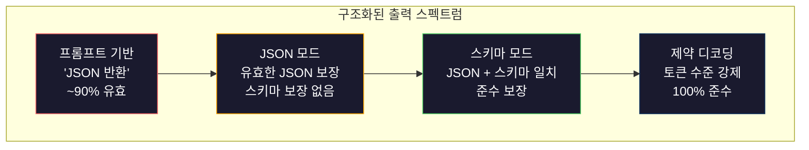
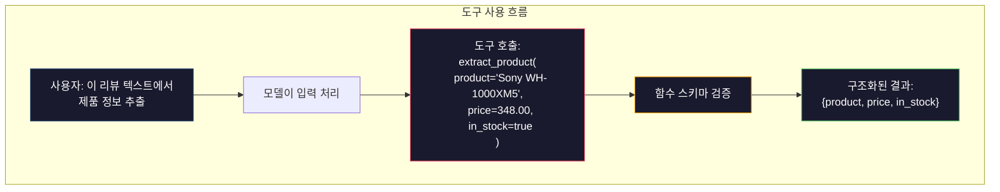

# 구조화된 출력: JSON, 스키마 검증, 제약된 디코딩

> LLM은 문자열을 반환합니다. 애플리케이션은 JSON이 필요합니다. 이 간극은 모델의 환각(hallucination)보다 더 많은 프로덕션 시스템을 망가뜨렸습니다. 구조화된 출력은 자연어(natural language)와 타입이 지정된 데이터(typed data) 사이의 다리입니다. 이를 올바르게 구현하면 LLM은 신뢰할 수 있는 API가 됩니다. 실패하면 새벽 3시에 정규 표현식으로 자유 텍스트를 파싱하게 됩니다.

**유형:** 구축(Build)  
**언어:** Python  
**사전 요구 사항:** Phase 10, Lessons 01-05 (LLMs from Scratch)  
**소요 시간:** ~90분  
**관련 내용:** Phase 5 · 20 (구조화된 출력 & 제약된 디코딩)에서는 디코더 수준의 이론(FSM/CFG 로짓 프로세서, 아웃라인, XGrammar)을 다룹니다. 이 레슨은 프로덕션 SDK 표면(OpenAI `response_format`, Anthropic 도구 사용, Instructor)에 초점을 맞춥니다. API 아래에서 발생하는 메커니즘을 이해하려면 Phase 5 · 20을 먼저 읽으세요.

## 학습 목표

- OpenAI 및 Anthropic API 파라미터를 사용하여 JSON 모드 및 스키마 제약 출력을 구현
- 잘못된 LLM 출력을 거부하고 오류 피드백으로 재시도하는 Pydantic 검증 계층 구축
- 제약된 디코딩이 후처리 없이 토큰 수준에서 유효한 JSON을 강제하는 방식 설명
- 비정형 텍스트를 타입이 지정된 데이터 구조로 안정적으로 변환하는 견고한 추출 프롬프트 설계

## 문제

LLM에 "이 텍스트에서 제품 이름, 가격, 재고를 추출하세요."라고 요청하면 다음과 같이 응답합니다:

```
The product is the Sony WH-1000XM5 headphones, which cost $348.00 and are currently in stock.
```

이는 완전히 정확한 답변입니다. 하지만 애플리케이션에는 전혀 쓸모가 없습니다. 인벤토리 시스템에는 `{"product": "Sony WH-1000XM5", "price": 348.00, "in_stock": true}`가 필요합니다. 특정 키, 특정 타입, 특정 값 제약 조건을 가진 JSON 객체가 필요합니다. 문장이 필요한 것이 아닙니다.

순진한 해결책: 프롬프트에 "JSON으로 응답하세요"를 추가합니다. 이는 90%의 경우 작동합니다. 나머지 10%에서는 모델이 JSON을 마크다운 코드 펜스로 감싸거나, "다음은 JSON입니다:" 같은 서문을 추가하거나, 괄호를 일찍 닫아 구문적으로 유효하지 않은 JSON을 생성합니다. JSON 파서가 충돌합니다. 파이프라인이 중단됩니다. try/except와 재시도 루프를 추가합니다. 재시도 시 때때로 다른 데이터가 생성됩니다. 이제 파싱 문제 위에 일관성 문제가 추가됩니다.

이는 프롬프트 엔지니어링 문제가 아닙니다. 디코딩 문제입니다. 모델은 토큰을 왼쪽에서 오른쪽으로 생성합니다. 각 위치에서 100K+ 옵션 어휘에서 가장 가능성 높은 다음 토큰을 선택합니다. 대부분의 옵션은 특정 위치에서 유효하지 않은 JSON을 생성합니다. 모델이 방금 `{"price":`를 생성했다면 다음 토큰은 숫자, 따옴표(문자열용), `null`, `true`, `false`, 또는 음수 기호여야 합니다. 그 외 모든 것은 유효하지 않은 JSON을 생성합니다. 제약 조건이 없으면 모델이 구문적으로 완전히 잘못된 영어 단어를 선택할 수 있습니다.

## 개념

## 구조화된 출력 스펙트럼

구조화된 출력 제어에는 네 가지 수준이 있으며, 각각 이전 수준보다 더 신뢰할 수 있습니다.



**프롬프트 기반** ("유효한 JSON으로 응답"): 강제 적용 없음. 모델은 일반적으로 준수하지만 때때로 그렇지 않음. 신뢰도: ~90%. 실패 모드: 마크다운 펜스, 서문 텍스트, 잘린 출력, 잘못된 구조.

**JSON 모드**: API는 출력이 유효한 JSON임을 보장합니다. OpenAI의 `response_format: { type: "json_object" }`가 이를 활성화합니다. 출력은 오류 없이 파싱됩니다. 하지만 예상 스키마와 일치하지 않을 수 있습니다. 추가 키, 잘못된 타입, 누락된 필드.

**스키마 모드**: API는 JSON 스키마를 받아 출력이 이와 일치함을 보장합니다. 2026년에는 모든 주요 제공업체가 이를 네이티브로 지원합니다: OpenAI의 `response_format: { type: "json_schema", json_schema: {...} }` (또한 `tool_choice="required"`), Anthropic의 `input_schema`를 사용한 도구 사용, Gemini의 `response_schema` + `response_mime_type: "application/json"`. 출력은 지정한 정확한 키, 타입, 제약 조건을 가집니다.

**제약 디코딩**: 생성 중 각 토큰 위치에서 디코더는 잘못된 출력을 생성하는 모든 토큰을 마스킹합니다. 스키마가 숫자를 요구하는데 모델이 문자를 출력하려 하면 해당 토큰의 확률은 0으로 설정됩니다. 모델은 유효한 출력으로 이어지는 토큰만 생성할 수 있습니다. OpenAI의 구조화된 출력 모드와 Outlines, Guidance 같은 라이브러리가 내부적으로 이를 구현합니다.

## JSON 스키마: 계약 언어

JSON 스키마는 모델(또는 검증 계층)에 출력이 가져야 할 형태를 알려주는 방법입니다. 모든 주요 구조화된 출력 시스템이 이를 사용합니다.

```json
{
  "type": "object",
  "properties": {
    "product": { "type": "string" },
    "price": { "type": "number", "minimum": 0 },
    "in_stock": { "type": "boolean" },
    "categories": {
      "type": "array",
      "items": { "type": "string" }
    }
  },
  "required": ["product", "price", "in_stock"]
}
```

이 스키마는 다음과 같이 말합니다: 출력은 문자열 `product`, 0 이상의 숫자 `price`, 불리언 `in_stock`, 선택적 문자열 배열 `categories`를 가진 객체여야 합니다. 일치하지 않는 출력은 거부됩니다.

스키마는 어려운 경우를 처리합니다: 중첩 객체, 타입이 지정된 항목 배열, 열거형(특정 값으로 문자열 제한), 패턴 매칭(문자열 정규식), 조합기(다형적 출력을 위한 oneOf, anyOf, allOf).

## 파이데이터틱 패턴

Python에서는 JSON 스키마를 직접 작성하지 않습니다. 파이데이터틱 모델을 정의하면 스키마가 자동 생성됩니다.

```python
from pydantic import BaseModel

class Product(BaseModel):
    product: str
    price: float
    in_stock: bool
    categories: list[str] = []
```

이는 위와 동일한 JSON 스키마를 생성합니다. Instructor 라이브러리(및 OpenAI SDK)는 파이데이터틱 모델을 직접 받아들입니다: 모델 클래스를 전달하면 검증된 인스턴스를 반환합니다. LLM 출력이 일치하지 않으면 Instructor가 자동으로 재시도합니다.

## 함수 호출 / 도구 사용

동일한 문제를 위한 대체 인터페이스. 모델에게 JSON을 직접 생성하도록 요청하는 대신, 타입이 지정된 매개변수를 가진 "도구"(함수)를 정의합니다. 모델은 구조화된 인수를 가진 함수 호출을 출력합니다. OpenAI는 이를 "함수 호출"이라고 부릅니다. Anthropic은 "도구 사용"이라고 부릅니다. 결과는 동일합니다: 구조화된 데이터.



도구 사용은 모델이 매개변수를 채우는 것뿐만 아니라 호출할 함수를 선택해야 할 때 선호됩니다. 10가지 다른 추출 스키마가 있고 모델이 입력에 따라 올바른 것을 선택해야 한다면, 도구 사용은 스키마 선택과 구조화된 출력을 모두 제공합니다.

## 일반적인 실패 모드

스키마 강제 적용이 있어도 구조화된 출력은 미묘한 방식으로 실패할 수 있습니다.

**환각 값**: 출력은 스키마와 일치하지만 발명된 데이터를 포함합니다. 텍스트에 $348이라고 되어 있는데 모델은 `{"price": 299.99}`를 생성합니다. 스키마 검증은 이를 잡을 수 없습니다. 타입은 맞지만 값이 틀립니다.

**열거형 혼동**: 필드를 `["in_stock", "out_of_stock", "preorder"]`로 제한했습니다. 모델은 `"available"`을 출력합니다. 의미적으로는 맞지만 허용된 집합에 없습니다. 좋은 제약 디코딩은 이를 방지합니다. 프롬프트 기반 접근법은 그렇지 않습니다.

**중첩 객체 깊이**: 깊이 중첩된 스키마(4+ 수준)는 더 많은 오류를 발생시킵니다. 각 중첩 수준은 모델이 구조를 잃을 수 있는 또 다른 지점입니다.

**배열 길이**: 모델은 배열에 너무 많거나 적은 항목을 생성할 수 있습니다. 스키마는 `minItems`와 `maxItems`를 지원하지만 모든 제공업체가 디코딩 수준에서 이를 강제하지는 않습니다.

**선택적 필드 생략**: 모델은 기술적으로는 선택적이지만 사용 사례에 중요한 필드를 생략할 수 있습니다. 데이터가 때때로 누락되더라도 스키마에서 필수로 설정하세요. 모델이 `null`을 명시적으로 생성하도록 강제합니다.

## 빌드하기

## 단계 1: JSON 스키마 검증기

Python 객체가 JSON 스키마와 일치하는지 확인하는 검증기를 처음부터 구축합니다. 이는 출력 측에서 규정 준수를 검증하는 데 사용됩니다.

```python
import json

def validate_schema(data, schema):
    errors = []
    _validate(data, schema, "", errors)
    return errors

def _validate(data, schema, path, errors):
    schema_type = schema.get("type")

    if schema_type == "object":
        if not isinstance(data, dict):
            errors.append(f"{path}: object 예상, {type(data).__name__} 수신")
            return
        for key in schema.get("required", []):
            if key not in data:
                errors.append(f"{path}.{key}: 필수 필드 누락")
        properties = schema.get("properties", {})
        for key, value in data.items():
            if key in properties:
                _validate(value, properties[key], f"{path}.{key}", errors)

    elif schema_type == "array":
        if not isinstance(data, list):
            errors.append(f"{path}: 배열 예상, {type(data).__name__} 수신")
            return
        min_items = schema.get("minItems", 0)
        max_items = schema.get("maxItems", float("inf"))
        if len(data) < min_items:
            errors.append(f"{path}: 배열 항목 수 {len(data)}, 최소 {min_items} 필요")
        if len(data) > max_items:
            errors.append(f"{path}: 배열 항목 수 {len(data)}, 최대 {max_items} 초과")
        items_schema = schema.get("items", {})
        for i, item in enumerate(data):
            _validate(item, items_schema, f"{path}[{i}]", errors)

    elif schema_type == "string":
        if not isinstance(data, str):
            errors.append(f"{path}: 문자열 예상, {type(data).__name__} 수신")
            return
        enum_values = schema.get("enum")
        if enum_values and data not in enum_values:
            errors.append(f"{path}: '{data}'은(는) 허용 값 {enum_values}에 없음")

    elif schema_type == "number":
        if not isinstance(data, (int, float)):
            errors.append(f"{path}: 숫자 예상, {type(data).__name__} 수신")
            return
        minimum = schema.get("minimum")
        maximum = schema.get("maximum")
        if minimum is not None and data < minimum:
            errors.append(f"{path}: {data}는 최소값 {minimum}보다 작음")
        if maximum is not None and data > maximum:
            errors.append(f"{path}: {data}는 최대값 {maximum}보다 큼")

    elif schema_type == "boolean":
        if not isinstance(data, bool):
            errors.append(f"{path}: 부울 예상, {type(data).__name__} 수신")

    elif schema_type == "integer":
        if not isinstance(data, int) or isinstance(data, bool):
            errors.append(f"{path}: 정수 예상, {type(data).__name__} 수신")
```

## 단계 2: Pydantic 스타일 모델-스키마 변환기

최소한의 클래스-스키마 변환기를 구축합니다. Python 클래스를 정의하고 자동으로 JSON 스키마를 생성합니다.

```python
class SchemaField:
    def __init__(self, field_type, required=True, default=None, enum=None, minimum=None, maximum=None):
        self.field_type = field_type
        self.required = required
        self.default = default
        self.enum = enum
        self.minimum = minimum
        self.maximum = maximum

def python_type_to_schema(field):
    type_map = {
        str: "string",
        int: "integer",
        float: "number",
        bool: "boolean",
    }

    schema = {}

    if field.field_type in type_map:
        schema["type"] = type_map[field.field_type]
    elif field.field_type == list:
        schema["type"] = "array"
        schema["items"] = {"type": "string"}
    elif isinstance(field.field_type, dict):
        schema = field.field_type

    if field.enum:
        schema["enum"] = field.enum
    if field.minimum is not None:
        schema["minimum"] = field.minimum
    if field.maximum is not None:
        schema["maximum"] = field.maximum

    return schema

def model_to_schema(name, fields):
    properties = {}
    required = []

    for field_name, field in fields.items():
        properties[field_name] = python_type_to_schema(field)
        if field.required:
            required.append(field_name)

    return {
        "type": "object",
        "properties": properties,
        "required": required,
    }
```

## 단계 3: 제약 조건 토큰 필터

제약 조건 디코딩을 시뮬레이션합니다. 부분 JSON 문자열과 스키마가 주어졌을 때 현재 위치에서 유효한 토큰 범주를 결정합니다.

```python
def next_valid_tokens(partial_json, schema):
    stripped = partial_json.strip()

    if not stripped:
        return ["{"]

    try:
        json.loads(stripped)
        return ["<EOS>"]
    except json.JSONDecodeError:
        pass

    last_char = stripped[-1] if stripped else ""

    if last_char == "{":
        return ['"', "}"]
    elif last_char == '"':
        if stripped.endswith('":'):
            return ['"', "0-9", "true", "false", "null", "[", "{"]
        return ["a-z", '"']
    elif last_char == ":":
        return [" ", '"', "0-9", "true", "false", "null", "[", "{"]
    elif last_char == ",":
        return [" ", '"', "{", "["]
    elif last_char in "0123456789":
        return ["0-9", ".", ",", "}", "]"]
    elif last_char == "}":
        return [",", "}", "]", "<EOS>"]
    elif last_char == "]":
        return [",", "}", "<EOS>"]
    elif last_char == "[":
        return ['"', "0-9", "true", "false", "null", "{", "[", "]"]
    else:
        return ["any"]

def demonstrate_constrained_decoding():
    partial_states = [
        '',
        '{',
        '{"product"',
        '{"product":',
        '{"product": "Sony"',
        '{"product": "Sony",',
        '{"product": "Sony", "price":',
        '{"product": "Sony", "price": 348',
        '{"product": "Sony", "price": 348}',
    ]

    print(f"{'부분 JSON':<45} {'유효한 다음 토큰'}")
    print("-" * 80)
    for state in partial_states:
        valid = next_valid_tokens(state, {})
        display = state if state else "(빈 문자열)"
        print(f"{display:<45} {valid}")
```

## 단계 4: 추출 파이프라인

모든 것을 추출 파이프라인으로 결합합니다: 스키마 정의, LLM이 구조화된 출력을 생성하는 시뮬레이션, 출력 검증, 재시도 처리.

```python
def simulate_llm_extraction(text, schema, attempt=0):
    if "headphones" in text.lower() or "sony" in text.lower():
        if attempt == 0:
            return '{"product": "Sony WH-1000XM5", "price": 348.00, "in_stock": true, "categories": ["audio", "headphones"]}'
        return '{"product": "Sony WH-1000XM5", "price": 348.00, "in_stock": true}'

    if "laptop" in text.lower():
        return '{"product": "MacBook Pro 16", "price": 2499.00, "in_stock": false, "categories": ["computers"]}'

    return '{"product": "Unknown", "price": 0, "in_stock": false}'

def extract_with_retry(text, schema, max_retries=3):
    for attempt in range(max_retries):
        raw = simulate_llm_extraction(text, schema, attempt)

        try:
            data = json.loads(raw)
        except json.JSONDecodeError as e:
            print(f"  시도 {attempt + 1}: JSON 파싱 오류 -- {e}")
            continue

        errors = validate_schema(data, schema)
        if not errors:
            return data

        print(f"  시도 {attempt + 1}: 스키마 검증 오류 -- {errors}")

    return None

product_schema = {
    "type": "object",
    "properties": {
        "product": {"type": "string"},
        "price": {"type": "number", "minimum": 0},
        "in_stock": {"type": "boolean"},
        "categories": {"type": "array", "items": {"type": "string"}},
    },
    "required": ["product", "price", "in_stock"],
}
```

## 단계 5: 전체 파이프라인 실행

```python
def run_demo():
    print("=" * 60)
    print("  구조화된 출력 파이프라인 데모")
    print("=" * 60)

    print("\n--- 스키마 정의 ---")
    product_fields = {
        "product": SchemaField(str),
        "price": SchemaField(float, minimum=0),
        "in_stock": SchemaField(bool),
        "categories": SchemaField(list, required=False),
    }
    generated_schema = model_to_schema("Product", product_fields)
    print(json.dumps(generated_schema, indent=2))

    print("\n--- 스키마 검증 ---")
    test_cases = [
        ({"product": "Test", "price": 10.0, "in_stock": True}, "유효한 객체"),
        ({"product": "Test", "price": -5.0, "in_stock": True}, "음수 가격"),
        ({"product": "Test", "in_stock": True}, "가격 누락"),
        ({"product": "Test", "price": "ten", "in_stock": True}, "가격을 문자열로"),
        ("not an object", "객체 대신 문자열"),
    ]

    for data, label in test_cases:
        errors = validate_schema(data, product_schema)
        status = "통과" if not errors else f"실패: {errors}"
        print(f"  {label}: {status}")

    print("\n--- 제약 조건 디코딩 시뮬레이션 ---")
    demonstrate_constrained_decoding()

    print("\n--- 추출 파이프라인 ---")
    texts = [
        "The Sony WH-1000XM5 headphones are priced at $348 and currently available.",
        "The new MacBook Pro 16-inch laptop costs $2499 but is sold out.",
        "This is a random sentence with no product info.",
    ]

    for text in texts:
        print(f"\n  입력: {text[:60]}...")
        result = extract_with_retry(text, product_schema)
        if result:
            print(f"  출력: {json.dumps(result)}")
        else:
            print(f"  출력: 재시도 후 실패")
```

## 사용 방법

## OpenAI 구조화 출력

```python
# from openai import OpenAI
# from pydantic import BaseModel
# client = OpenAI()
# class Product(BaseModel):
#     product: str
#     price: float
#     in_stock: bool
# response = client.beta.chat.completions.parse(
#     model="gpt-5-mini",
#     messages=[
#         {"role": "system", "content": "제품 정보를 추출하세요."},
#         {"role": "user", "content": "Sony WH-1000XM5, $348, 재고 있음"},
#     ],
#     response_format=Product,
# )
# product = response.choices[0].message.parsed
# print(product.product, product.price, product.in_stock)
```

OpenAI의 구조화 출력 모드는 내부적으로 제약된 디코딩을 사용합니다. 모델이 생성하는 모든 토큰은 Pydantic 스키마와 일치하는 출력을 보장합니다. 재시도도 필요 없고, 검증도 필요 없습니다. 제약 조건이 디코딩 프로세스에 내장되어 있습니다.

## Anthropic 도구 사용

```python
# import anthropic
# client = anthropic.Anthropic()
# response = client.messages.create(
#     model="claude-opus-4-7",
#     max_tokens=1024,
#     tools=[{
#         "name": "extract_product",
#         "description": "텍스트에서 제품 정보를 추출합니다",
#         "input_schema": {
#             "type": "object",
#             "properties": {
#                 "product": {"type": "string"},
#                 "price": {"type": "number"},
#                 "in_stock": {"type": "boolean"},
#             },
#             "required": ["product", "price", "in_stock"],
#         },
#     }],
#     messages=[{"role": "user", "content": "추출: Sony WH-1000XM5, $348, 재고 있음"}],
# )
```

Anthropic은 도구 사용을 통해 구조화 출력을 구현합니다. 모델은 입력 스키마와 일치하는 구조화된 인수를 가진 도구 호출을 생성합니다. 동일한 결과지만 다른 API 인터페이스를 제공합니다.

## Instructor 라이브러리

```python
# pip install instructor
# import instructor
# from openai import OpenAI
# from pydantic import BaseModel
# client = instructor.from_openai(OpenAI())
# class Product(BaseModel):
#     product: str
#     price: float
#     in_stock: bool
# product = client.chat.completions.create(
#     model="gpt-5-mini",
#     response_model=Product,
#     messages=[{"role": "user", "content": "Sony WH-1000XM5, $348, 재고 있음"}],
# )
```

Instructor는 모든 LLM 클라이언트를 래핑하고 자동 재시도와 검증을 추가합니다. 첫 번째 시도가 검증에 실패하면 오류를 컨텍스트로 모델에 다시 보내고 출력을 수정하도록 요청합니다. 이는 OpenAI뿐만 아니라 모든 공급자와 호환됩니다.

## Ship It

이 레슨은 `outputs/prompt-structured-extractor.md`를 생성합니다. 이는 스키마 정의를 기반으로 모든 텍스트에서 구조화된 데이터를 추출하는 재사용 가능한 프롬프트 템플릿입니다. JSON 스키마와 비정형 텍스트를 입력하면 검증된 JSON을 반환합니다.

또한 `outputs/skill-structured-outputs.md`를 생성합니다. 이는 공급자, 신뢰성 요구사항, 스키마 복잡도에 따라 적절한 구조화된 출력 전략을 선택하는 결정 프레임워크입니다.

## 연습 문제

1. 스키마 검증기를 확장하여 `oneOf`(데이터가 여러 스키마 중 정확히 하나와 일치해야 함)를 지원하도록 구현하세요. 이는 다형적 출력을 처리합니다. 예를 들어, 서로 다른 형태를 가진 `Product` 또는 `Service` 객체일 수 있는 필드를 처리할 수 있습니다.

2. 두 스키마를 비교하고 **파괴적 변경**(필수 필드 제거, 타입 변경)과 **비파괴적 변경**(선택적 필드 추가, 제약 완화)을 식별하는 "스키마 차이" 도구를 구축하세요. 이는 프로덕션 환경에서 추출 스키마의 버전 관리에 필수적입니다.

3. 더 현실적인 제약 디코딩 시뮬레이터를 구현하세요. JSON 스키마와 100개의 토큰(문자, 숫자, 구두점, 키워드)으로 구성된 어휘를 사용하여 생성 과정을 단계별로 진행하세요. 각 위치에서 유효하지 않은 토큰을 마스킹하고, 각 단계에서 어휘의 몇 퍼센트가 유효한지 측정하세요.

4. 추출 평가 도구를 구축하세요. 수작업으로 JSON 출력이 라벨링된 50개의 제품 설명을 생성하세요. 50개 전체에 대해 추출 파이프라인을 실행하고 **정확 일치**, **필드 수준 정확도**, **타입 준수**를 측정하세요. 어떤 필드가 정확하게 추출하기 가장 어려운지 식별하세요.

5. 추출 파이프라인에 "신뢰도 점수"를 추가하세요. 각 추출된 필드에 대해 모델의 신뢰도를 추정하세요(토큰 확률 기반 또는 추출을 3회 실행하여 일관성 측정). 신뢰도가 낮은 필드는 인간 검토를 위해 표시하세요.

## 주요 용어

| 용어 | 사람들이 말하는 표현 | 실제 의미 |
|------|----------------|----------------------|
| JSON 모드 | "JSON 반환" | 구문적으로 유효한 JSON 출력을 보장하지만 특정 스키마는 강제하지 않는 API 플래그 |
| 구조화된 출력 | "타입이 지정된 JSON" | 올바른 키, 타입, 제약 조건을 갖춘 특정 JSON 스키마와 일치하는 출력 |
| 제약된 디코딩 | "유도된 생성" | 각 토큰 위치에서 잘못된 출력을 생성할 수 있는 토큰을 마스킹하여 100% 스키마 준수 보장 |
| JSON 스키마 | "JSON 템플릿" | JSON 데이터의 구조, 타입, 제약 조건을 설명하는 선언적 언어 (OpenAPI, JSON Forms 등에서 사용) |
| Pydantic | "Python 데이터 클래스+" | 타입 검증 기능이 있는 데이터 모델을 정의하는 Python 라이브러리, FastAPI와 Instructor에서 JSON 스키마 생성에 사용 |
| 함수 호출 | "도구 사용" | LLM이 자유 텍스트 대신 구조화된 함수 호출(이름 + 타입이 지정된 인자)을 출력 — OpenAI와 Anthropic 모두 지원 |
| Instructor | "LLM용 Pydantic" | LLM 클라이언트를 래핑하여 검증된 Pydantic 인스턴스를 반환하고, 검증 실패 시 자동 재시도하는 Python 라이브러리 |
| 토큰 마스킹 | "어휘 필터링" | 생성 중 특정 토큰 확률을 0으로 설정하여 모델이 해당 토큰을 생성하지 못하도록 차단 |
| 스키마 준수 | "형태 일치" | 출력에 모든 필수 필드, 올바른 타입, 제약 조건 내 값이 포함되며 허용되지 않은 추가 필드가 없음 |
| 재시도 루프 | "작동할 때까지 다시 시도" | 검증 오류를 모델에 다시 보내고 출력을 수정하도록 요청 — Instructor는 구성 가능한 최대 횟수까지 자동 수행 |

## 추가 자료

- [OpenAI 구조화 출력 가이드](https://platform.openai.com/docs/guides/structured-outputs) -- OpenAI API에서 JSON 스키마 기반 제약 디코딩 공식 문서
- [Willard & Louf, 2023 -- "대규모 언어 모델을 위한 효율적 유도 생성"](https://arxiv.org/abs/2307.09702) -- 아웃라인즈 논문, JSON 스키마를 유한 상태 기계로 컴파일하여 토큰 수준 제약 적용 방법 설명
- [Instructor 문서](https://python.useinstructor.com/) -- Pydantic 검증 및 재시도를 통해 모든 LLM에서 구조화 출력을 얻는 표준 라이브러리
- [Anthropic 도구 사용 가이드](https://docs.anthropic.com/en/docs/tool-use) -- Claude가 JSON 스키마 입력 스키마로 도구 사용을 통해 구조화 출력을 구현하는 방법
- [JSON 스키마 사양](https://json-schema.org/) -- 모든 주요 구조화 출력 시스템에서 사용하는 스키마 언어 전체 사양
- [아웃라인즈 라이브러리](https://github.com/outlines-dev/outlines) -- 정규 표현식과 JSON 스키마를 유한 상태 기계로 컴파일하는 오픈소스 제약 생성 도구
- [Dong et al., "XGrammar: 대규모 언어 모델을 위한 유연하고 효율적인 구조화 생성 엔진" (MLSys 2025)](https://arxiv.org/abs/2411.15100) -- 현재 최신 문법 엔진, 토큰당 약 100ns 속도로 토큰 마스킹을 수행하는 푸시다운 오토마타 컴파일
- [Beurer-Kellner et al., "프롬프트는 프로그래밍이다: 대규모 언어 모델을 위한 쿼리 언어" (LMQL)](https://arxiv.org/abs/2212.06094) -- 제약 디코딩을 타입 및 값 제약을 가진 쿼리 언어로 구성하는 LMQL 논문
- [Microsoft Guidance (프레임워크 문서)](https://github.com/guidance-ai/guidance) -- 템플릿 기반 제약 생성, 아웃라인즈와 XGrammar의 벤더 중립적 보완 도구