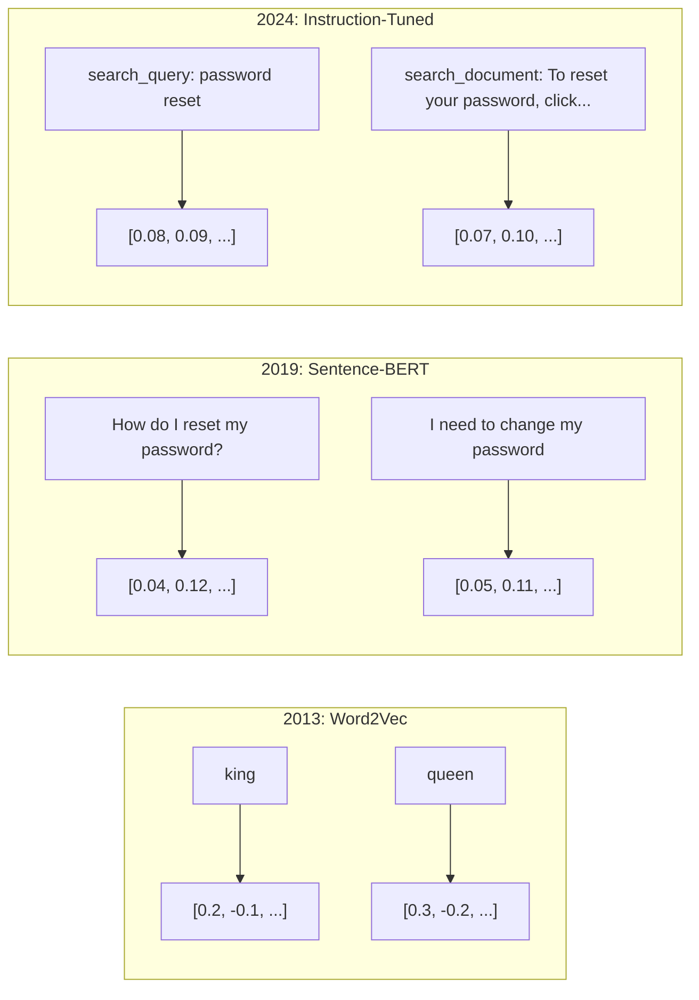
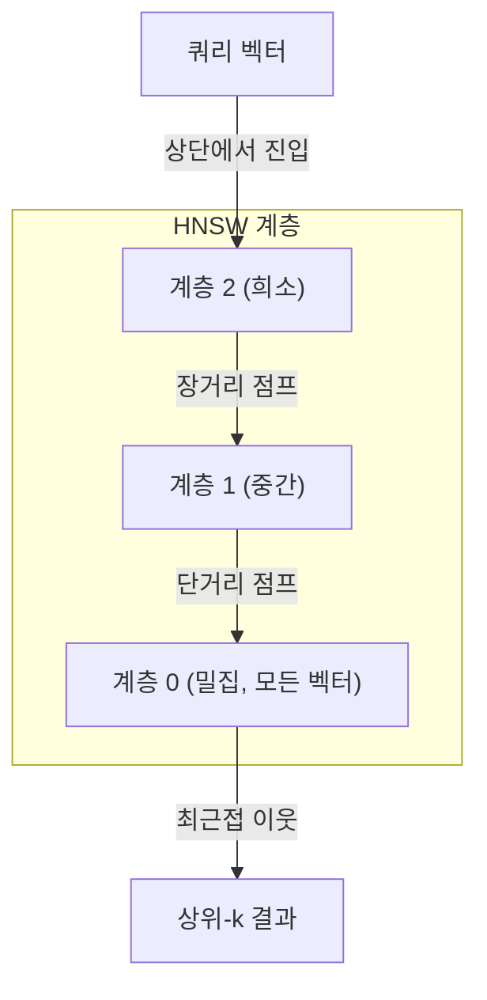

# 임베딩 & 벡터 표현

> 텍스트는 이산적(discrete)입니다. 수학은 연속적(continuous)입니다. LLM에 "유사한" 문서를 찾거나, 의미를 비교하거나, 키워드를 넘어 검색하도록 요청할 때마다, 당신은 이 두 세계 사이의 다리에 의존하고 있습니다. 그 다리가 바로 임베딩입니다. 임베딩을 이해하지 못하면 현대 AI를 이해하지 못하는 것입니다. 그냥 사용하는 것뿐입니다.

**유형:** 구축(Build)
**언어:** Python
**선수 지식:** 11단계, 레슨 01 (프롬프트 엔지니어링)
**소요 시간:** ~75분
**관련:** 5단계 · 22레슨(임베딩 모델 심층 분석)에서는 밀집(dense) vs 희소(sparse) vs 다중 벡터(multi-vector), 마트료시카 트렁케이션(Matryoshka truncation), 축별 모델 선택(per-axis model selection)을 다룹니다. 이 레슨은 프로덕션 파이프라인(벡터 DB, HNSW, 유사도 계산)에 중점을 둡니다. 모델 선택 전 5단계 · 22레슨을 먼저 읽으세요.

## 학습 목표

- API 제공업체와 오픈소스 모델을 활용한 텍스트 임베딩 생성 및 임베딩 간 코사인 유사도(cosine similarity) 계산
- 키워드 검색이 처리할 수 없는 어휘 불일치(vocabulary mismatch) 문제를 임베딩이 해결하는 이유 설명
- 정확한 키워드 매칭이 아닌 의미 기반 문서 검색(semantic search)을 위한 시맨틱 검색 인덱스 구축
- 검색 벤치마크(정밀도@k(precision@k), 재현율(recall))를 활용한 임베딩 품질 평가 및 작업에 적합한 임베딩 모델 선택

## 문제 정의

10,000개의 지원 티켓이 있습니다. 고객이 "결제가 처리되지 않았어요"라고 작성합니다. 이와 유사한 과거 티켓을 찾아야 합니다. 키워드 검색은 "결제"와 "처리되지"를 포함하는 티켓을 찾습니다. 하지만 "거래 실패", "결제가 거절됨", "청구 오류"는 놓칩니다. 이 티켓들은 완전히 다른 단어를 사용했지만 정확히 같은 문제를 설명합니다.

이것은 어휘 불일치 문제입니다. 인간 언어는 같은 것을 표현하는 수십 가지 방법을 가지고 있습니다. 키워드 검색은 각 단어를 의미가 없는 독립적인 기호로 취급합니다. "거절됨"과 "처리되지 않았음"이 같은 개념을 가리킨다는 것을 알 수 없습니다.

철자가 아닌 의미가 유사성을 결정하는 텍스트 표현이 필요합니다. "결제가 처리되지 않았어요"와 "거래가 거절됨"을 어떤 수학적 공간에서 가까이 배치하면서, "결제가 정시에 도착했어요"는 "결제"라는 단어를 공유하더라도 멀리 밀어낼 방법이 필요합니다.

그 표현이 바로 임베딩(embedding)입니다.

## 개념

### 임베딩이란?

임베딩은 텍스트의 의미를 나타내는 부동소수점 숫자의 밀집 벡터입니다. "밀집"라는 표현이 중요합니다. 모든 차원이 정보를 담고 있으며, 희소 표현(단어 가방, TF-IDF)과 달리 대부분의 차원이 0이 아닙니다.

"고양이가 매트 위에 앉았다"는 모델 크기에 따라 768~3072개의 숫자로 구성된 `[0.023, -0.041, 0.087, ..., 0.012]`와 같은 벡터로 변환됩니다. 이 숫자들은 의미를 인코딩하지만 직접 확인하지는 않습니다. 대신 비교를 수행합니다.

### Word2Vec의 혁신

2013년 구글 소속 토마시 미콜로프(Tomas Mikolov)와 동료들은 Word2Vec을 발표했습니다. 핵심 아이디어는 주변 단어(이웃 단어)로부터단어(또는 단어에서 이웃 단어)를 예측하도록 신경망을 훈련시키는 것이며, 은닉층 가중치가 의미 있는 벡터 표현이 된다는 것입니다.

유명한 결과:

```
king - man + woman = queen
```

단어 임베딩에 대한 벡터 연산은 의미적 관계를 포착합니다. "man"에서 "woman"으로의 방향은 "king"에서 "queen"으로의 방향과 대략 같습니다. 이는 기하학이 의미를 인코딩할 수 있음을 깨달은 순간이었습니다.

Word2Vec은 300차원 벡터를 생성했습니다. 각 단어는 문맥에 관계없이 하나의 벡터를 가졌습니다. "river bank"의 "bank"와 "bank account"의 "bank"는 동일한 임베딩을 가졌습니다. 이 한계는 이후 10년간의 연구를 이끌었습니다.

### 단어에서 문장으로

단어 임베딩은 단일 토큰을 표현합니다. 프로덕션 시스템은 전체 문장, 단락 또는 문서를 임베딩해야 합니다. 네 가지 접근 방식이 등장했습니다:

**평균화**: 문장 내 모든 단어 벡터의 평균을 구합니다. 저렴하고 손실이 있지만 짧은 텍스트에는 놀랍도록 괜찮은 결과를 제공합니다. 단어 순서를 완전히 무시합니다. "dog bites man"과 "man bites dog"는 동일한 임베딩을 가집니다.

**CLS 토큰**: 트랜스포머 모델(BERT, 2018)은 전체 입력을 나타내는 특수 [CLS] 토큰 임베딩을 출력합니다. 평균화보다 낫지만 [CLS] 토큰은 유사성이 아닌 다음 문장 예측을 위해 훈련되었습니다.

**대조 학습**: 유사한 쌍은 가깝게, 유사하지 않은 쌍은 멀게 모델을 명시적으로 훈련시킵니다. Sentence-BERT(Reimers & Gurevych, 2019)는 이 접근 방식을 사용하여 현대 임베딩 모델의 기반이 되었습니다. "How do I reset my password?"와 "I need to change my password"에 대해 모델은 이 두 벡터가 거의 동일해야 함을 학습합니다.

**지시문 조정 임베딩**: 최신 접근 방식입니다. E5 및 GTE와 같은 모델은 작업 접두사("search_query:", "search_document:")를 받아 어떤 종류의 임베딩을 생성할지 결정합니다. 이를 통해 하나의 모델이 여러 작업을 처리할 수 있습니다.



### 현대 임베딩 모델

시장은 소수의 프로덕션급 옵션으로 정착했습니다(2026년 초 기준 MTEB 점수, MTEB v2):

| 모델 | 제공업체 | 차원 | MTEB | 컨텍스트 | 100만 토큰당 비용 |
|-------|----------|-----------|------|---------|------------------|
| Gemini Embedding 2 | Google | 3072 (Matryoshka) | 67.7 (검색) | 8192 | $0.15 |
| embed-v4 | Cohere | 1024 (Matryoshka) | 65.2 | 128K | $0.12 |
| voyage-4 | Voyage AI | 1024/2048 (Matryoshka) | 66.8 | 32K | $0.12 |
| text-embedding-3-large | OpenAI | 3072 (Matryoshka) | 64.6 | 8192 | $0.13 |
| text-embedding-3-small | OpenAI | 1536 (Matryoshka) | 62.3 | 8192 | $0.02 |
| BGE-M3 | BAAI | 1024 (밀집+희소+ColBERT) | 63.0 다국어 | 8192 | 오픈 가중치 |
| Qwen3-Embedding | Alibaba | 4096 (Matryoshka) | 66.9 | 32K | 오픈 가중치 |
| Nomic-embed-v2 | Nomic | 768 (Matryoshka) | 63.1 | 8192 | 오픈 가중치 |

MTEB(Massive Text Embedding Benchmark) v2는 검색, 분류, 클러스터링, 재순위 지정, 요약 등 100개 이상의 작업을 다룹니다. 점수가 높을수록 좋습니다. 2026년까지 오픈 가중치 모델(Qwen3-Embedding, BGE-M3)은 대부분의 축에서 폐쇄형 호스팅 모델을 따라잡거나 능가합니다. Gemini Embedding 2는 순수 검색에서 선두를 달리며, Voyage/Cohere는 특정 도메인(금융, 법률, 코드)에서 선두를 달립니다. 항상 자체 쿼리로 벤치마크한 후 결정하세요.

### 유사도 메트릭

두 임베딩 벡터가 주어졌을 때, 유사도를 측정하는 세 가지 방법:

**코사인 유사도**: 두 벡터 사이 각도의 코사인 값입니다. 범위는 -1(반대)에서 1(동일한 방향)입니다. 크기를 무시합니다. 10단어 문장과 500단어 문서가 같은 방향을 가리키면 1.0점을 받을 수 있습니다. 이는 90%의 사용 사례에서 기본값입니다.

```
cosine_sim(a, b) = dot(a, b) / (||a|| * ||b||)
```

**내적**: 두 벡터의 원시 내적입니다. 벡터가 정규화(단위 길이)된 경우 코사인 유사도와 동일합니다. 계산 속도가 더 빠릅니다. OpenAI의 임베딩은 정규화되어 있으므로 내적과 코사인 유사도는 동일한 순위를 제공합니다.

```
dot(a, b) = sum(a_i * b_i)
```

**유클리드(L2) 거리**: 벡터 공간에서의 직선 거리입니다. 작을수록 더 유사합니다. 크기 차이에 민감합니다. 방향이 아닌 공간의 절대 위치가 중요한 경우 사용합니다.

```
L2(a, b) = sqrt(sum((a_i - b_i)^2))
```

사용 시기:

| 메트릭 | 사용 시기 | 피해야 할 시기 |
|--------|----------|------------|
| 코사인 유사도 | 길이가 다른 텍스트 비교; 대부분의 검색 작업 | 크기가 정보를 전달할 때 |
| 내적 | 임베딩이 이미 정규화된 경우; 최대 속도 | 벡터 크기가 다양할 때 |
| 유클리드 거리 | 클러스터링; 공간 최근접 이웃 문제 | 길이가 크게 다른 문서 비교 |

### 벡터 데이터베이스와 HNSW

무작위 유사도 검색은 쿼리를 모든 저장된 벡터와 비교합니다. 1536차원 벡터 100만 개일 때, 쿼리당 15억 개의 곱셈-덧셈 연산이 필요합니다. 너무 느립니다.

벡터 데이터베이스는 근사 최근접 이웃(ANN) 알고리즘으로 이 문제를 해결합니다. 가장 널리 사용되는 알고리즘은 HNSW(Hierarchical Navigable Small World)입니다:

1. 벡터의 다층 그래프 구축
2. 상위 계층은 희소 — 먼 클러스터 간 장거리 연결
3. 하위 계층은 밀집 — 근처 벡터 간 세부 연결
4. 검색은 상위 계층에서 시작하여 탐욕적으로 하강하여 정제
5. O(n) 시간 대신 O(log n) 시간에 근사 상위-k 결과 반환

HNSW는 작은 정확도 손실(일반적으로 95-99% 재현율)을 대가로 엄청난 속도 향상을 제공합니다. 1000만 벡터에서 무작위 검색은 수 초가 걸리지만, HNSW는 밀리초 단위로 처리합니다.



프로덕션 옵션:

| 데이터베이스 | 유형 | 최적 사용처 | 최대 규모 |
|----------|------|----------|-----------|
| Pinecone | 관리형 SaaS | 운영 환경, 무관리 | 수십억 |
| Weaviate | 오픈소스 | 자체 호스팅, 하이브리드 검색 | 1억+ |
| Qdrant | 오픈소스 | 고성능, 필터링 | 1억+ |
| ChromaDB | 임베디드 | 프로토타이핑, 로컬 개발 | 100만 |
| pgvector | Postgres 확장 | 이미 Postgres 사용 중 | 1000만 |
| FAISS | 라이브러리 | 인프로세스, 연구 | 10억+ |

### 청킹 전략

문서는 단일 벡터로 임베딩하기에는 너무 깁니다. 50페이지 PDF는 수십 가지 주제를 다루므로, 그 임베딩은 모든 내용의 평균이 되어 특정 주제와는 유사하지 않게 됩니다. 문서를 청크로 분할하고 각각을 임베딩합니다.

**고정 크기 청킹**: N토큰마다 M토큰 겹치도록 분할합니다. 간단하고 예측 가능합니다. 문서에 명확한 구조가 없을 때 잘 작동합니다. 512토큰 청크에 50토큰 겹침: 청크 1은 토큰 0-511, 청크 2는 토큰 462-973.

**문장 기반 청킹**: 문장 경계에서 분할하고 토큰 제한에 도달할 때까지 문장을 그룹화합니다. 각 청크는 최소 하나의 완전한 문장입니다. 고정 크기보다 낫습니다. 생각을 중간에 자르지 않기 때문입니다.

**재귀적 청킹**: 가장 큰 경계(섹션 헤더)에서 먼저 분할을 시도합니다. 여전히 너무 크면 단락 경계를 시도합니다. 그 다음 문장 경계, 마지막으로 문자 제한을 시도합니다. 이는 LangChain의 `RecursiveCharacterTextSplitter`이며, 혼합 형식 코퍼스에 잘 작동합니다.

**의미적 청킹**: 각 문장을 임베딩한 후, 임베딩이 유사한 연속 문장을 그룹화합니다. 임베딩 유사도가 임계값 아래로 떨어지면 새 청크를 시작합니다. 비용이 많이 들지만(모든 문장을 개별적으로 임베딩해야 함) 가장 일관된 청크를 생성합니다.

| 전략 | 복잡성 | 품질 | 최적 사용처 |
|----------|-----------|---------|----------|
| 고정 크기 | 낮음 | 보통 | 비정형 텍스트, 로그 |
| 문장 기반 | 낮음 | 좋음 | 기사, 이메일 |
| 재귀적 | 중간 | 좋음 | 마크다운, HTML, 혼합 문서 |
| 의미적 | 높음 | 최고 | 중요한 검색 품질 |

대부분의 시스템에 적합한 청크 크기: 256-512토큰 청크에 50토큰 겹침.

### Bi-Encoder vs Cross-Encoder

Bi-Encoder는 쿼리와 문서를 독립적으로 임베딩한 후 벡터를 비교합니다. 빠릅니다. 쿼리를 한 번 임베딩하고 미리 계산된 문서 임베딩과 비교합니다. 검색에 사용됩니다.

Cross-Encoder는 쿼리와 문서를 단일 입력으로 받아 관련성 점수를 출력합니다. 느립니다. 각 쿼리-문서 쌍을 전체 모델로 처리합니다. 하지만 쿼리와 문서 토큰에 동시에 어텐션할 수 있어 훨씬 더 정확합니다.

프로덕션 패턴: Bi-Encoder로 상위 100개 후보를 검색한 후, Cross-Encoder로 상위 10개로 재순위 지정합니다. 이는 검색-재순위 지정 파이프라인입니다.


재순위 지정 모델: Cohere Rerank 3.5(1000개 쿼리당 $2), BGE-reranker-v2(무료, 오픈소스), Jina Reranker v2(무료, 오픈소스).

### 마트료시카 임베딩

전통적인 임베딩은 전부 또는 전무입니다. 1536차원 벡터는 1536개의 부동소수점 수를 사용합니다. 재훈련 없이 256차원으로 잘라낼 수 없습니다.

마트료시카 표현 학습(Kusupati et al., 2022)은 이를 해결합니다. 모델은 첫 N차원이 가장 중요한 정보를 포착하도록 훈련됩니다. 마치 러시아 인형처럼 중첩된 구조입니다. 1536차원 마트료시카 임베딩을 256차원으로 잘라내면 정확도는 약간 손실되지만 여전히 기능합니다.

OpenAI의 text-embedding-3-small과 text-embedding-3-large는 `dimensions` 매개변수를 통해 마트료시카 잘라내기를 지원합니다. 1536 대신 256차원을 요청하면 저장 공간을 6배 줄이면서 MTEB 벤치마크에서 약 3-5%의 정확도 손실만 발생합니다.

### 이진 양자화

float32로 저장된 1536차원 임베딩은 6,144바이트를 사용합니다. 1000만 개 문서에 곱하면 벡터만 61GB가 됩니다.

이진 양자화는 각 부동소수점 수를 단일 비트로 변환합니다. 양수 값은 1, 음수 값은 0이 됩니다. 저장 공간이 6,144바이트에서 192바이트로 32배 감소합니다. 유사도는 해밍 거리(서로 다른 비트 수)로 계산되며, CPU는 단일 명령어로 처리할 수 있습니다.

정확도 손실은 검색 재현율에서 약 5-10%입니다. 일반적인 패턴: 수백만 개 벡터에 대해 이진 양자화로 1차 검색을 수행한 후, 상위 1000개를 전체 정밀도 벡터로 재점수 매깁니다. 이는 32배 적은 메모리로 전체 정밀도 정확도의 95% 이상을 달성합니다.

## 구축

우리는 벡터 데이터베이스 없이, 외부 임베딩 API 없이, 순수 Python과 numpy를 사용하여 시맨틱 검색 엔진을 처음부터 구축합니다.

### 1단계: 텍스트 청킹

```python
def chunk_text(text, chunk_size=200, overlap=50):
    words = text.split()
    chunks = []
    start = 0
    while start < len(words):
        end = start + chunk_size
        chunk = " ".join(words[start:end])
        chunks.append(chunk)
        start += chunk_size - overlap
    return chunks


def chunk_by_sentences(text, max_chunk_tokens=200):
    sentences = text.replace("\n", " ").split(".")
    sentences = [s.strip() + "." for s in sentences if s.strip()]
    chunks = []
    current_chunk = []
    current_length = 0
    for sentence in sentences:
        sentence_length = len(sentence.split())
        if current_length + sentence_length > max_chunk_tokens and current_chunk:
            chunks.append(" ".join(current_chunk))
            current_chunk = []
            current_length = 0
        current_chunk.append(sentence)
        current_length += sentence_length
    if current_chunk:
        chunks.append(" ".join(current_chunk))
    return chunks
```

### 2단계: 처음부터 임베딩 구축

L2 정규화를 사용한 TF-IDF로 간단한 밀집 임베딩을 구현합니다. 이는 신경망 임베딩은 아니지만 동일한 계약을 따릅니다: 텍스트 입력, 고정 크기 벡터 출력, 유사한 텍스트는 유사한 벡터 생성.

```python
import math
import numpy as np
from collections import Counter

class SimpleEmbedder:
    def __init__(self):
        self.vocab = []
        self.idf = []
        self.word_to_idx = {}

    def fit(self, documents):
        vocab_set = set()
        for doc in documents:
            vocab_set.update(doc.lower().split())
        self.vocab = sorted(vocab_set)
        self.word_to_idx = {w: i for i, w in enumerate(self.vocab)}
        n = len(documents)
        self.idf = np.zeros(len(self.vocab))
        for i, word in enumerate(self.vocab):
            doc_count = sum(1 for doc in documents if word in doc.lower().split())
            self.idf[i] = math.log((n + 1) / (doc_count + 1)) + 1

    def embed(self, text):
        words = text.lower().split()
        count = Counter(words)
        total = len(words) if words else 1
        vec = np.zeros(len(self.vocab))
        for word, freq in count.items():
            if word in self.word_to_idx:
                tf = freq / total
                vec[self.word_to_idx[word]] = tf * self.idf[self.word_to_idx[word]]
        norm = np.linalg.norm(vec)
        if norm > 0:
            vec = vec / norm
        return vec
```

### 3단계: 유사도 함수

```python
def cosine_similarity(a, b):
    dot = np.dot(a, b)
    norm_a = np.linalg.norm(a)
    norm_b = np.linalg.norm(b)
    if norm_a == 0 or norm_b == 0:
        return 0.0
    return float(dot / (norm_a * norm_b))


def dot_product(a, b):
    return float(np.dot(a, b))


def euclidean_distance(a, b):
    return float(np.linalg.norm(a - b))
```

### 4단계: 브루트 포스 검색을 통한 벡터 인덱스

```python
class VectorIndex:
    def __init__(self):
        self.vectors = []
        self.texts = []
        self.metadata = []

    def add(self, vector, text, meta=None):
        self.vectors.append(vector)
        self.texts.append(text)
        self.metadata.append(meta or {})

    def search(self, query_vector, top_k=5, metric="cosine"):
        scores = []
        for i, vec in enumerate(self.vectors):
            if metric == "cosine":
                score = cosine_similarity(query_vector, vec)
            elif metric == "dot":
                score = dot_product(query_vector, vec)
            elif metric == "euclidean":
                score = -euclidean_distance(query_vector, vec)
            else:
                raise ValueError(f"알 수 없는 메트릭: {metric}")
            scores.append((i, score))
        scores.sort(key=lambda x: x[1], reverse=True)
        results = []
        for idx, score in scores[:top_k]:
            results.append({
                "text": self.texts[idx],
                "score": score,
                "metadata": self.metadata[idx],
                "index": idx
            })
        return results

    def size(self):
        return len(self.vectors)
```

### 5단계: 시맨틱 검색 엔진

```python
class SemanticSearchEngine:
    def __init__(self, chunk_size=200, overlap=50):
        self.embedder = SimpleEmbedder()
        self.index = VectorIndex()
        self.chunk_size = chunk_size
        self.overlap = overlap

    def index_documents(self, documents, source_names=None):
        all_chunks = []
        all_sources = []
        for i, doc in enumerate(documents):
            chunks = chunk_text(doc, self.chunk_size, self.overlap)
            all_chunks.extend(chunks)
            name = source_names[i] if source_names else f"doc_{i}"
            all_sources.extend([name] * len(chunks))
        self.embedder.fit(all_chunks)
        for chunk, source in zip(all_chunks, all_sources):
            vec = self.embedder.embed(chunk)
            self.index.add(vec, chunk, {"source": source})
        return len(all_chunks)

    def search(self, query, top_k=5, metric="cosine"):
        query_vec = self.embedder.embed(query)
        return self.index.search(query_vec, top_k, metric)

    def search_with_scores(self, query, top_k=5):
        results = self.search(query, top_k)
        return [
            {
                "text": r["text"][:200],
                "source": r["metadata"].get("source", "unknown"),
                "score": round(r["score"], 4)
            }
            for r in results
        ]
```

### 6단계: 유사도 메트릭 비교

```python
def compare_metrics(engine, query, top_k=3):
    results = {}
    for metric in ["cosine", "dot", "euclidean"]:
        hits = engine.search(query, top_k=top_k, metric=metric)
        results[metric] = [
            {"score": round(h["score"], 4), "preview": h["text"][:80]}
            for h in hits
        ]
    return results
```

## 사용 방법

프로덕션 임베딩 API를 사용할 때 아키텍처는 동일하게 유지됩니다. 임베더만 변경됩니다:

```python
from openai import OpenAI

client = OpenAI()

def openai_embed(texts, model="text-embedding-3-small", dimensions=None):
    kwargs = {"model": model, "input": texts}
    if dimensions:
        kwargs["dimensions"] = dimensions
    response = client.embeddings.create(**kwargs)
    return [item.embedding for item in response.data]
```

OpenAI를 이용한 마트료시카 트렁케이션 -- 동일 모델, 더 적은 차원, 낮은 저장 공간:

```python
full = openai_embed(["semantic search query"], dimensions=1536)
compact = openai_embed(["semantic search query"], dimensions=256)
```

256-d 벡터는 저장 공간을 6배 적게 사용합니다. 1,000만 개 문서의 경우 10GB vs 61GB입니다. 표준 벤치마크에서 정확도 손실은 대략 3-5%입니다.

Cohere를 이용한 재랭킹:

```python
import cohere

co = cohere.ClientV2()

results = co.rerank(
    model="rerank-v3.5",
    query="환불 정책은 무엇인가요?",
    documents=["30일 이내 전액 환불...", "90일 이후 환불 불가..."],
    top_n=3
)
```

API 의존성이 없는 로컬 임베딩:

```python
from sentence_transformers import SentenceTransformer

model = SentenceTransformer("BAAI/bge-small-en-v1.5")
embeddings = model.encode(["semantic search query", "another document"])
```

VectorIndex 클래스는 이 모든 것과 호환됩니다. 임베딩 함수만 교체하고 검색 로직은 그대로 유지합니다.

## Ship It

이 레슨은 다음을 생성합니다:
- `outputs/prompt-embedding-advisor.md` -- 특정 사용 사례에 대한 임베딩 모델 및 전략 선택을 위한 프롬프트
- `outputs/skill-embedding-patterns.md` -- 프로덕션 환경에서 임베딩을 효과적으로 사용하는 방법을 에이전트에게 가르치는 스킬

## 연습 문제

1. **메트릭 비교**: 코사인 유사도, 내적(dot product), 유클리드 거리(euclidean distance)를 사용하여 샘플 문서에 대해 동일한 5개의 쿼리를 실행합니다. 각 메트릭에 대해 상위 3개 결과를 기록합니다. 어떤 쿼리에서 메트릭들이 불일치하는지 확인하고 그 이유를 설명합니다.

2. **청크 크기 실험**: 50, 100, 200, 500단어 크기의 청크로 샘플 문서를 인덱싱합니다. 각각에 대해 5개의 쿼리를 실행하고 상위 1개 유사도 점수를 기록합니다. 청크 크기와 검색 품질 간의 관계를 그래프로 나타내고, 더 큰 청크가 성능 저하를 시작하는 지점을 찾습니다.

3. **마트료시카 시뮬레이션**: 500차원 벡터를 생성하는 SimpleEmbedder를 구축합니다. 50, 100, 200, 500차원으로 축소하고 각 축소 단계에서 검색 재현율(recall)이 어떻게 저하되는지 측정합니다. 이는 실제 훈련 트릭 없이도 마트료시카 동작을 시뮬레이션합니다.

4. **이진 양자화**: 검색 엔진의 임베딩을 가져와 이진으로 변환(양수이면 1, 음수이면 0)하고 해밍 거리(Hamming distance) 검색을 구현합니다. 상위 10개 결과를 고정밀도 코사인 유사도와 비교하여 겹치는 비율을 측정합니다.

5. **문장 기반 청킹**: 고정 크기 청킹을 `chunk_by_sentences`로 대체합니다. 동일한 쿼리를 실행하고 검색 점수를 비교합니다. 문장 경계를 존중하는 것이 결과를 개선하는지 확인합니다.

## 주요 용어

| 용어 | 사람들이 말하는 것 | 실제 의미 |
|------|----------------|----------------------|
| 임베딩(Embedding) | "텍스트를 숫자로" | 기하학적 근접성이 의미적 유사성을 인코딩하는 밀집 벡터 |
| Word2Vec | "원조 임베딩" | 2013년 모델, 컨텍스트 단어 예측을 통해 단어 벡터 학습; 벡터 연산이 의미를 인코딩함을 증명 |
| 코사인 유사도(Cosine similarity) | "두 벡터의 유사도" | 벡터 간 각도의 코사인 값; 1 = 동일 방향, 0 = 직교, -1 = 반대 방향 |
| HNSW | "빠른 벡터 검색" | 계층적 탐색 가능 소형 세계 그래프 -- 다중 계층 구조로 O(log n) 근사 최근접 이웃 검색 가능 |
| 바이-인코더(Bi-encoder) | "별도 임베딩, 빠른 비교" | 쿼리와 문서를 독립적으로 벡터로 인코딩; 사전 계산 및 빠른 검색 가능 |
| 크로스-인코더(Cross-encoder) | "느리지만 정확한 재랭커" | 전체 모델을 통해 쿼리-문서 쌍을 공동으로 처리; 높은 정확도, 사전 계산 불가 |
| 마트료시카 임베딩(Matryoshka embeddings) | "잘라낼 수 있는 벡터" | 처음 N차원이 가장 중요한 정보를 포착하도록 훈련된 임베딩; 가변 크기 저장 가능 |
| 이진 양자화(Binary quantization) | "1비트 임베딩" | 부동소수점 벡터를 이진(부호 비트만)으로 변환해 32배 저장 공간 감소, 해밍 거리 검색 |
| 청킹(Chunking) | "임베딩을 위한 문서 분할" | 문서를 256-512 토큰 세그먼트로 분할해 각각 독립적으로 임베딩 및 검색 가능 |
| 벡터 데이터베이스(Vector database) | "임베딩을 위한 검색 엔진" | 벡터 저장 및 대규모 근사 최근접 이웃 검색에 최적화된 데이터 저장소 |
| 대조 학습(Contrastive learning) | "비교를 통한 학습" | 유사한 쌍 임베딩은 가깝게, 유사하지 않은 쌍 임베딩은 멀어지도록 훈련하는 접근법 |
| MTEB | "임베딩 벤치마크" | 대규모 텍스트 임베딩 벤치마크 -- 8개 태스크에 걸친 56개 데이터셋; 임베딩 모델 비교 표준 |

## 추가 자료

- Mikolov et al., "벡터 공간에서의 단어 표현 효율적 추정" (2013) -- 왕-여왕 유추로 임베딩 혁명을 시작한 Word2Vec 논문
- Reimers & Gurevych, "Sentence-BERT: Siamese BERT-네트워크를 이용한 문장 임베딩" (2019) -- 문장 수준 유사도를 위한 bi-인코더 훈련 방법, 현대 임베딩 모델의 기반
- Kusupati et al., "마트로시카 표현 학습" (2022) -- OpenAI가 text-embedding-3에 채택한 가변 차원 임베딩 기술
- Malkov & Yashunin, "계층적 탐색 가능 소형 세계 그래프를 이용한 효율적이고 강건한 근사 최근접 이웃 탐색" (2018) -- 대부분의 프로덕션 벡터 검색에 사용되는 HNSW 알고리즘 논문
- OpenAI 임베딩 가이드 (platform.openai.com/docs/guides/embeddings) -- 마트로시카 차원 축소를 포함한 text-embedding-3 모델 실용 가이드
- MTEB 리더보드 (huggingface.co/spaces/mteb/leaderboard) -- 작업 및 언어별 모든 임베딩 모델 비교 실시간 벤치마크
- [Muennighoff et al., "MTEB: 대규모 텍스트 임베딩 벤치마크" (EACL 2023)](https://arxiv.org/abs/2210.07316) -- 리더보드가 보고하는 8개 작업 범주(분류, 클러스터링, 쌍 분류, 재순위, 검색, STS, 요약, 병렬 코퍼스 마이닝)를 정의한 벤치마크; 단일 MTEB 점수를 신뢰하기 전에 필독
- [Sentence Transformers 문서](https://www.sbert.net/) -- bi-인코더 vs cross-인코더, 풀링 전략, 이 레슨에서 구현하는 ingest-split-embed-store RAG 파이프라인에 대한 표준 참조 자료