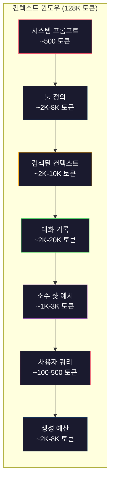
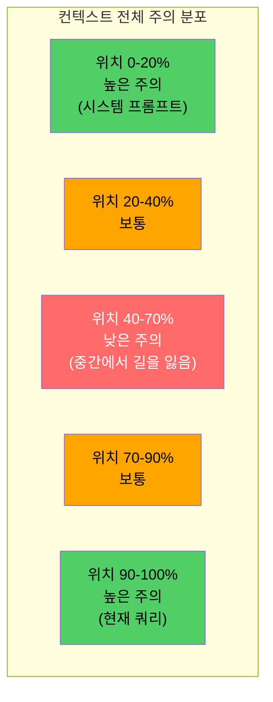
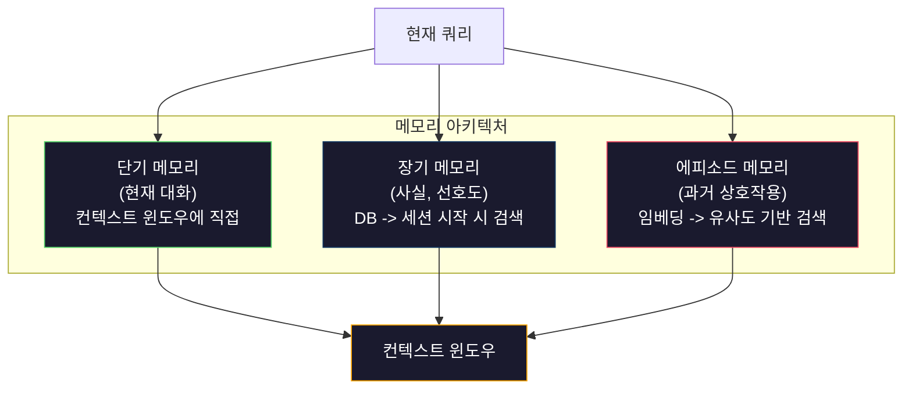

# 컨텍스트 엔지니어링: 윈도우, 예산, 메모리, 그리고 검색

> 프롬프트 엔지니어링은 하위 집합입니다. 컨텍스트 엔지니어링이 전체 게임입니다. 프롬프트는 입력하는 문자열입니다. 컨텍스트는 모델의 윈도우에 들어가는 모든 것: 시스템 지시문, 검색된 문서, 도구 정의, 대화 기록, 소수 샷 예시, 그리고 프롬프트 자체입니다. 2026년 최고의 AI 엔지니어는 컨텍스트 엔지니어입니다. 그들은 무엇이 들어가고, 무엇이 빠지며, 어떤 순서로 배치될지 결정합니다.

**유형:** 구축(Build)  
**언어:** Python  
**선수 조건:** Phase 10 (LLMs from Scratch), Phase 11 Lesson 01-02  
**소요 시간:** ~90분  
**관련 내용:** Phase 11 · 15 (프롬프트 캐싱) — 캐시 친화적인 레이아웃은 컨텍스트 엔지니어링의 확장입니다. Phase 5 · 28 (장문 컨텍스트 평가)에서 NIAH/RULER를 활용한 중간 손실 측정 방법을 다룹니다.

## 학습 목표

- 모든 컨텍스트 윈도우 구성 요소(시스템 프롬프트, 도구, 히스토리, 검색된 문서, 생성 여유 공간)에 걸쳐 토큰 예산을 계산
- 대화 히스토리에 대한 컨텍스트 윈도우 관리 전략 구현: 잘림(truncation), 요약(summarization), 슬라이딩 윈도우(sliding window)
- 가장 관련성 높은 정보에 모델의 어텐션(attention)을 최대화할 수 있도록 컨텍스트 구성 요소를 우선순위화하고 순서 지정
- 쿼리 유형과 사용 가능한 윈도우 공간에 따라 동적으로 토큰을 할당하는 컨텍스트 어셈블러(context assembler) 구축

## 문제 정의

Claude Opus 4.7은 200K 토큰 윈도우(베타 버전에서는 1M)를 가지고 있습니다. GPT-5는 400K, Gemini 3 Pro는 2M, Llama 4는 10M을 주장합니다. 이 숫자들은 실제로 채워보기 전까지는 엄청나게 들립니다.

다음은 코딩 어시스턴트를 위한 실제 분석입니다. 시스템 프롬프트: 500 토큰. 50개 도구에 대한 정의: 8,000 토큰. 검색된 문서: 4,000 토큰. 대화 기록(10턴): 6,000 토큰. 현재 사용자 질문: 200 토큰. 생성 예산(최대 출력): 4,000 토큰. 총계: 22,700 토큰. 이는 128K 윈도우의 18%에 불과합니다.

하지만 어텐션은 컨텍스트 길이에 선형적으로 비례하지 않습니다. 128K 토큰 컨텍스트를 가진 모델은 이차 어텐션 비용(vanilla 트랜스포머에서는 O(n^2), 하지만 대부분의 프로덕션 모델은 효율적인 어텐션 변형 사용)을 지불합니다. 더 중요한 것은 검색 정확도가 저하된다는 점입니다. "Needle in a Haystack" 테스트에서 모델들은 긴 컨텍스트 중간에 배치된 정보를 찾는 데 어려움을 겪습니다. Liu et al. (2023)의 연구에 따르면 LLM은 긴 컨텍스트의 시작과 끝에 있는 정보를 거의 완벽하게 검색하지만, 중간에 위치한 정보(컨텍스트의 40-70% 위치)에 대한 정확도는 10-20% 하락합니다. 이 "lost-in-the-middle" 효과는 모델마다 다르지만 모든 현재 아키텍처에 영향을 미칩니다.

실용적인 교훈: 200K 토큰을 사용할 수 있다고 해서 200K 토큰을 모두 사용하는 것이 효과적인 것은 아닙니다. 신중하게 선별된 10K 토큰 컨텍스트가 종종 덤프된 100K 토큰 컨텍스트보다 더 나은 성능을 보입니다. 컨텍스트 엔지니어링은 컨텍스트 윈도우 내에서 신호 대 잡음 비율을 최대화하는 학문입니다.

윈도우에 넣는 모든 토큰은 더 관련성 높은 정보를 전달할 수 있는 다른 토큰을 대체합니다. 관련 없는 도구 정의, 오래된 대화 기록, 질문에 답하지 않는 검색된 텍스트 조각들 - 각각이 모델의 작업 수행 능력을 약간 저하시킵니다.

## 개념

### 컨텍스트 윈도우는 희소한 자원

컨텍스트 윈도우를 디스크가 아닌 RAM으로 생각하세요. 빠르고 직접 접근이 가능하지만 제한적입니다. 모든 것을 담을 수 없습니다. 선택해야 합니다.



각 구성 요소는 공간을 놓고 경쟁합니다. 더 많은 툴 정의를 추가하면 대화 기록을 위한 공간이 줄어듭니다. 더 많은 검색된 컨텍스트를 추가하면 소수 샷 예시를 위한 공간이 줄어듭니다. 컨텍스트 엔지니어링은 작업 성능을 최대화하기 위해 이 예산을 할당하는 기술입니다.

### 중간에서 길을 잃다

컨텍스트 엔지니어링에서 가장 중요한 경험적 발견입니다. 모델은 컨텍스트의 시작과 끝에 있는 정보에 더 잘 주의를 기울입니다. 중간에 있는 정보는 주의 점수가 낮아지고 무시될 가능성이 높습니다.

Liu et al. (2023)은 이를 체계적으로 테스트했습니다. 20개의 관련 없는 문서 사이에 관련 문서를 다양한 위치에 배치하고 답변 정확도를 측정했습니다. 관련 문서가 첫 번째나 마지막일 때 정확도는 85-90%였습니다. 중간(20개 중 10번째 위치)에 있을 때 정확도는 60-70%로 떨어졌습니다.

이는 직접적인 엔지니어링적 함의를 가집니다:

- 가장 중요한 정보를 먼저 배치하세요 (시스템 프롬프트, 중요한 지시사항)
- 현재 쿼리와 가장 관련성 높은 컨텍스트를 마지막에 배치하세요 (최신성 편향이 도움이 됨)
- 컨텍스트 중간을 가장 낮은 우선순위 영역으로 취급하세요
- 중간에 정보를 포함해야 한다면 핵심 내용을 끝에 중복 배치하세요



### 컨텍스트 구성 요소

**시스템 프롬프트**: 페르소나, 제약 조건, 행동 규칙을 설정합니다. 이것은 첫 번째에 위치하며 턴마다 일정하게 유지됩니다. Claude Code는 툴 정의와 행동 지시사항을 포함하여 시스템 프롬프트에 대략 6,000 토큰을 사용합니다. 간결하게 유지하세요. 시스템 프롬프트의 모든 단어는 API 호출마다 반복됩니다.

**툴 정의**: 각 툴은 50-200 토큰(이름, 설명, 매개변수 스키마)을 추가합니다. 150 토큰씩 50개의 툴은 대화가 시작되기 전에 7,500 토큰을 차지합니다. 동적 툴 선택 - 현재 쿼리와 관련된 툴만 포함 - 은 이를 60-80% 줄일 수 있습니다.

**검색된 컨텍스트**: 벡터 데이터베이스의 문서, 검색 결과, 파일 내용. 검색의 품질은 응답의 품질을 직접 결정합니다. 나쁜 검색은 검색이 없는 것보다 더 나쁩니다 - 윈도우를 노이즈로 채우고 모델을 적극적으로 오도합니다.

**대화 기록**: 모든 이전 사용자 메시지와 어시스턴트 응답. 대화 길이에 따라 선형적으로 증가합니다. 턴당 200 토큰의 50턴 대화는 10,000 토큰의 기록입니다. 대부분은 현재 쿼리와 관련이 없습니다.

**소수 샷 예시**: 원하는 동작을 보여주는 입력/출력 쌍. 잘 선택된 2-3개의 예시는 수천 토큰의 지시사항보다 출력 품질을 더 향상시킬 수 있습니다. 하지만 공간을 소모합니다.

**생성 예산**: 모델의 응답을 위해 예약된 토큰. 윈도우를 가득 채우면 모델이 답변할 공간이 없습니다. 생성을 위해 최소 2,000-4,000 토큰을 예약하세요.

### 컨텍스트 압축 전략

**기록 요약**: 모든 이전 턴을 그대로 유지하는 대신 주기적으로 대화를 요약합니다. "우리는 X에 대해 논의했고, Y를 결정했으며, 사용자는 Z를 원합니다"라는 100 토큰이 2,000 토큰을 차지하는 10턴을 대체합니다. 기록이 임계값(예: 5,000 토큰)을 초과할 때 요약을 실행하세요.

**관련성 필터링**: 각 검색된 문서를 현재 쿼리와 비교하여 점수를 매기고 임계값 미만의 문서를 제거합니다. 10개의 청크를 검색했지만 3개만 관련이 있다면 나머지 7개를 버리세요. 10개의 평범한 청크보다 3개의 매우 관련성 높은 청크가 더 좋습니다.

**툴 가지치기**: 사용자 쿼리의 의도를 분류하고 해당 의도와 관련된 툴만 포함합니다. 코드 질문에는 캘린더 툴이 필요 없습니다. 일정 질문에는 파일 시스템 툴이 필요 없습니다. 이를 통해 툴 정의를 8,000 토큰에서 1,000 토큰으로 줄일 수 있습니다.

**재귀적 요약**: 매우 긴 문서의 경우 단계별로 요약합니다. 먼저 각 섹션을 요약한 다음 요약본을 다시 요약합니다. 50페이지 문서는 핵심 내용을 담은 500 토큰의 요약본이 됩니다.

### 메모리 시스템

컨텍스트 엔지니어링은 세 가지 시간 범위를 아우릅니다.

**단기 메모리**: 현재 대화. 컨텍스트 윈도우에 직접 저장됩니다. 턴이 늘어날수록 성장합니다. 요약과 잘림으로 관리됩니다.

**장기 메모리**: 대화 간에 지속되는 사실과 선호도. "사용자는 TypeScript를 선호합니다." "프로젝트는 PostgreSQL을 사용합니다." 데이터베이스에 저장되고 세션 시작 시 검색됩니다. Claude Code는 이를 CLAUDE.md 파일에 저장합니다. ChatGPT는 메모리 기능에 저장합니다.

**에피소드 메모리**: 관련성이 있을 수 있는 특정 과거 상호작용. "지난 화요일, 우리는 인증 모듈에서 비슷한 문제를 디버깅했습니다." 임베딩으로 저장되고 현재 대화가 과거 에피소드와 일치할 때 검색됩니다.



### 동적 컨텍스트 조립

핵심 통찰: 다른 쿼리는 다른 컨텍스트를 필요로 합니다. 정적 시스템 프롬프트 + 정적 툴 + 정적 기록은 낭비입니다. 최고의 시스템은 쿼리마다 컨텍스트를 동적으로 조립합니다.

1. 쿼리 의도 분류
2. 관련 툴만 선택 (모든 툴이 아님)
3. 관련 문서 검색 (고정된 집합이 아님)
4. 관련 대화 턴 포함 (모든 기록이 아님)
5. 작업 유형과 일치하는 소수 샷 예시 추가
6. 모든 것을 중요도 순으로 정렬: 중요한 것 먼저, 중요한 것 마지막, 선택적인 것 중간

이것이 좋은 AI 애플리케이션과 훌륭한 애플리케이션을 구분하는 요소입니다. 모델은 동일합니다. 컨텍스트가 차별화 요소입니다.

## 구축 단계

### 1단계: 토큰 카운터

측정할 수 없는 것은 예산할 수 없습니다. 간단한 토큰 카운터(화이트스페이스 분할을 사용한 근사치, 정확한 카운트는 토크나이저에 따라 다름)를 구축합니다.

```python
import json
import numpy as np
from collections import OrderedDict

def count_tokens(text):
    if not text:
        return 0
    return int(len(text.split()) * 1.3)

def count_tokens_json(obj):
    return count_tokens(json.dumps(obj))
```

### 2단계: 컨텍스트 예산 관리자

핵심 추상화입니다. 예산 관리자는 각 구성 요소가 사용하는 토큰 수를 추적하고 제한을 강제합니다.

```python
class ContextBudget:
    def __init__(self, max_tokens=128000, generation_reserve=4000):
        self.max_tokens = max_tokens
        self.generation_reserve = generation_reserve
        self.available = max_tokens - generation_reserve
        self.allocations = OrderedDict()

    def allocate(self, component, content, max_tokens=None):
        tokens = count_tokens(content)
        if max_tokens and tokens > max_tokens:
            words = content.split()
            target_words = int(max_tokens / 1.3)
            content = " ".join(words[:target_words])
            tokens = count_tokens(content)

        used = sum(self.allocations.values())
        if used + tokens > self.available:
            allowed = self.available - used
            if allowed <= 0:
                return None, 0
            words = content.split()
            target_words = int(allowed / 1.3)
            content = " ".join(words[:target_words])
            tokens = count_tokens(content)

        self.allocations[component] = tokens
        return content, tokens

    def remaining(self):
        used = sum(self.allocations.values())
        return self.available - used

    def utilization(self):
        used = sum(self.allocations.values())
        return used / self.max_tokens

    def report(self):
        total_used = sum(self.allocations.values())
        lines = []
        lines.append(f"컨텍스트 예산 보고서 ({self.max_tokens:,} 토큰 윈도우)")
        lines.append("-" * 50)
        for component, tokens in self.allocations.items():
            pct = tokens / self.max_tokens * 100
            bar = "#" * int(pct / 2)
            lines.append(f"  {component:<25} {tokens:>6} 토큰 ({pct:>5.1f}%) {bar}")
        lines.append("-" * 50)
        lines.append(f"  {'사용됨':<25} {total_used:>6} 토큰 ({total_used/self.max_tokens*100:.1f}%)")
        lines.append(f"  {'생성 예약':<25} {self.generation_reserve:>6} 토큰")
        lines.append(f"  {'남은 토큰':<25} {self.remaining():>6} 토큰")
        return "\n".join(lines)
```

### 3단계: 중간 소실 재정렬

재정렬 전략을 구현합니다: 가장 중요한 항목은 처음과 끝에, 가장 덜 중요한 항목은 중간에 배치합니다.

```python
def reorder_lost_in_middle(items, scores):
    paired = sorted(zip(scores, items), reverse=True)
    sorted_items = [item for _, item in paired]

    if len(sorted_items) <= 2:
        return sorted_items

    first_half = sorted_items[::2]
    second_half = sorted_items[1::2]
    second_half.reverse()

    return first_half + second_half

def score_relevance(query, documents):
    query_words = set(query.lower().split())
    scores = []
    for doc in documents:
        doc_words = set(doc.lower().split())
        if not query_words:
            scores.append(0.0)
            continue
        overlap = len(query_words & doc_words) / len(query_words)
        scores.append(round(overlap, 3))
    return scores
```

### 4단계: 대화 기록 압축기

오래된 대화 턴을 요약하여 토큰 예산을 회수합니다.

```python
class ConversationManager:
    def __init__(self, max_history_tokens=5000):
        self.turns = []
        self.summaries = []
        self.max_history_tokens = max_history_tokens

    def add_turn(self, role, content):
        self.turns.append({"role": role, "content": content})
        self._compress_if_needed()

    def _compress_if_needed(self):
        total = sum(count_tokens(t["content"]) for t in self.turns)
        if total <= self.max_history_tokens:
            return

        while total > self.max_history_tokens and len(self.turns) > 4:
            old_turns = self.turns[:2]
            summary = self._summarize_turns(old_turns)
            self.summaries.append(summary)
            self.turns = self.turns[2:]
            total = sum(count_tokens(t["content"]) for t in self.turns)

    def _summarize_turns(self, turns):
        parts = []
        for t in turns:
            content = t["content"]
            if len(content) > 100:
                content = content[:100] + "..."
            parts.append(f"{t['role']}: {content}")
        return "이전: " + " | ".join(parts)

    def get_context(self):
        parts = []
        if self.summaries:
            parts.append("[대화 요약]")
            for s in self.summaries:
                parts.append(s)
        parts.append("[최근 대화]")
        for t in self.turns:
            parts.append(f"{t['role']}: {t['content']}")
        return "\n".join(parts)

    def token_count(self):
        return count_tokens(self.get_context())
```

### 5단계: 동적 도구 선택기

현재 쿼리와 관련된 도구만 포함합니다. 의도를 분류한 후 필터링합니다.

```python
TOOL_REGISTRY = {
    "read_file": {
        "description": "파일 내용 읽기",
        "tokens": 120,
        "categories": ["코드", "파일"],
    },
    "write_file": {
        "description": "파일에 내용 쓰기",
        "tokens": 150,
        "categories": ["코드", "파일"],
    },
    "search_code": {
        "description": "코드베이스에서 패턴 검색",
        "tokens": 130,
        "categories": ["코드"],
    },
    "run_command": {
        "description": "셸 명령어 실행",
        "tokens": 140,
        "categories": ["코드", "시스템"],
    },
    "create_calendar_event": {
        "description": "새 캘린더 이벤트 생성",
        "tokens": 180,
        "categories": ["캘린더"],
    },
    "list_emails": {
        "description": "최근 이메일 목록 표시",
        "tokens": 160,
        "categories": ["이메일"],
    },
    "send_email": {
        "description": "이메일 메시지 전송",
        "tokens": 200,
        "categories": ["이메일"],
    },
    "web_search": {
        "description": "웹에서 정보 검색",
        "tokens": 140,
        "categories": ["연구"],
    },
    "query_database": {
        "description": "데이터베이스에 SQL 쿼리 실행",
        "tokens": 170,
        "categories": ["코드", "데이터"],
    },
    "generate_chart": {
        "description": "데이터로 차트 생성",
        "tokens": 190,
        "categories": ["데이터", "시각화"],
    },
}

def classify_intent(query):
    query_lower = query.lower()

    intent_keywords = {
        "코드": ["코드", "함수", "버그", "오류", "파일", "구현", "리팩터", "디버그", "테스트"],
        "캘린더": ["회의", "일정", "캘린더", "약속", "이벤트"],
        "이메일": ["이메일", "메일", "보내기", "받은편지함", "메시지"],
        "연구": ["검색", "찾기", "무엇인가", "어떻게", "설명", "찾아보기"],
        "데이터": ["데이터", "쿼리", "데이터베이스", "차트", "그래프", "분석", "SQL"],
    }

    scores = {}
    for intent, keywords in intent_keywords.items():
        score = sum(1 for kw in keywords if kw in query_lower)
        if score > 0:
            scores[intent] = score

    if not scores:
        return ["코드"]

    max_score = max(scores.values())
    return [intent for intent, score in scores.items() if score >= max_score * 0.5]

def select_tools(query, token_budget=2000):
    intents = classify_intent(query)
    relevant = {}
    total_tokens = 0

    for name, tool in TOOL_REGISTRY.items():
        if any(cat in intents for cat in tool["categories"]):
            if total_tokens + tool["tokens"] <= token_budget:
                relevant[name] = tool
                total_tokens += tool["tokens"]

    return relevant, total_tokens
```

### 6단계: 전체 컨텍스트 조립 파이프라인

모든 것을 연결합니다. 쿼리가 주어지면 최적의 컨텍스트를 동적으로 조립합니다.

```python
class ContextEngine:
    def __init__(self, max_tokens=128000, generation_reserve=4000):
        self.budget = ContextBudget(max_tokens, generation_reserve)
        self.conversation = ConversationManager(max_history_tokens=5000)
        self.system_prompt = (
            "당신은 도움이 되는 AI 어시스턴트입니다. 코드 편집, 파일 관리, 웹 검색, 데이터 분석 도구를 사용할 수 있습니다. "
            "각 작업에 적합한 도구를 사용하세요. 간결하고 정확하게 답변하세요."
        )
        self.knowledge_base = [
            "Python 3.12는 제네릭 클래스에 대괄호 표기법을 사용한 타입 매개변수 구문을 도입했습니다.",
            "프로젝트는 임베딩 저장을 위해 PostgreSQL 16과 pgvector를 사용합니다.",
            "인증은 JWT 토큰을 사용하는 Supabase Auth로 처리됩니다.",
            "프론트엔드는 App Router를 사용하는 Next.js 15로 구축되었습니다.",
            "API 요청 제한은 사용자당 분당 100회입니다.",
            "배포 파이프라인은 Docker 멀티스테이지 빌드와 GitHub Actions를 사용합니다.",
            "모든 새 모듈의 테스트 커버리지는 80% 이상이어야 합니다.",
            "코드베이스는 데이터 액세스를 위해 리포지토리 패턴을 따릅니다.",
        ]

    def assemble(self, query):
        self.budget = ContextBudget(self.budget.max_tokens, self.budget.generation_reserve)

        system_content, _ = self.budget.allocate("시스템 프롬프트", self.system_prompt, max_tokens=1000)

        tools, tool_tokens = select_tools(query, token_budget=2000)
        tool_text = json.dumps(list(tools.keys()))
        tool_content, _ = self.budget.allocate("도구", tool_text, max_tokens=2000)

        relevance = score_relevance(query, self.knowledge_base)
        threshold = 0.1
        relevant_docs = [
            doc for doc, score in zip(self.knowledge_base, relevance)
            if score >= threshold
        ]

        if relevant_docs:
            doc_scores = [s for s in relevance if s >= threshold]
            reordered = reorder_lost_in_middle(relevant_docs, doc_scores)
            doc_text = "\n".join(reordered)
            doc_content, _ = self.budget.allocate("검색된 컨텍스트", doc_text, max_tokens=3000)

        history_text = self.conversation.get_context()
        if history_text.strip():
            history_content, _ = self.budget.allocate("대화 기록", history_text, max_tokens=5000)

        query_content, _ = self.budget.allocate("사용자 쿼리", query, max_tokens=500)

        return self.budget

    def chat(self, query):
        self.conversation.add_turn("사용자", query)
        budget = self.assemble(query)
        response = f"[응답: {query[:50]}...]"
        self.conversation.add_turn("어시스턴트", response)
        return budget


def run_demo():
    print("=" * 60)
    print("  컨텍스트 엔지니어링 파이프라인 데모")
    print("=" * 60)

    engine = ContextEngine(max_tokens=128000, generation_reserve=4000)

    print("\n--- 쿼리 1: 코드 작업 ---")
    budget = engine.chat("JWT 토큰이 너무 일찍 만료되는 인증 모듈의 버그를 수정하세요")
    print(budget.report())

    print("\n--- 쿼리 2: 연구 작업 ---")
    budget = engine.chat("PostgreSQL에서 벡터 검색을 구현하는 최선의 방법은 무엇인가요?")
    print(budget.report())

    print("\n--- 쿼리 3: 대화 기록이 쌓인 후 ---")
    for i in range(8):
        engine.conversation.add_turn("사용자", f"시스템 구현 세부 사항에 대한 후속 질문 {i+1}번")
        engine.conversation.add_turn("어시스턴트", f"후속 질문 {i+1}에 대한 응답입니다. 아키텍처에 대한 기술적 세부 사항을 포함합니다.")

    budget = engine.chat("이제 논의한 변경 사항을 구현하세요")
    print(budget.report())

    print("\n--- 도구 선택 예제 ---")
    test_queries = [
        "auth.py의 버그를 수정하세요",
        "화요일 팀과 회의를 예약하세요",
        "데이터베이스 쿼리 성능 통계를 보여주세요",
        "오류 처리에 대한 모범 사례를 검색하세요",
    ]

    for q in test_queries:
        tools, tokens = select_tools(q)
        intents = classify_intent(q)
        print(f"\n  쿼리: {q}")
        print(f"  의도: {intents}")
        print(f"  도구: {list(tools.keys())} ({tokens} 토큰)")

    print("\n--- 중간 소실 재정렬 ---")
    docs = ["문서 A (가장 관련성 높음)", "문서 B (다소 관련성 있음)", "문서 C (가장 관련성 낮음)",
            "문서 D (관련성 있음)", "문서 E (중간 관련성)"]
    scores = [0.95, 0.60, 0.20, 0.80, 0.50]
    reordered = reorder_lost_in_middle(docs, scores)
    print(f"  원본 순서: {docs}")
    print(f"  점수:         {scores}")
    print(f"  재정렬:       {reordered}")
    print(f"  (가장 관련성 높은 항목이 시작과 끝에, 가장 낮은 항목이 중간에 위치)")
```

## 사용 방법

### Claude Code의 컨텍스트 전략

Claude Code는 계층적 접근 방식으로 컨텍스트를 관리합니다. 시스템 프롬프트에는 행동 규칙과 도구 정의(~6K 토큰)가 포함됩니다. 파일을 열면 해당 내용이 컨텍스트로 주입됩니다. 검색을 수행하면 결과가 추가되고, 오래된 대화 내용은 요약됩니다. CLAUDE.md는 세션 간에 지속되는 장기 메모리를 제공합니다.

핵심 엔지니어링 결정: Claude Code는 전체 코드베이스를 컨텍스트에 덤프하지 않습니다. 관련 파일을 필요 시 검색합니다. 이것이 실제 컨텍스트 엔지니어링입니다.

### Cursor의 동적 컨텍스트 로딩

Cursor는 전체 코드베이스를 임베딩으로 인덱싱합니다. 쿼리를 입력하면 벡터 유사도를 기반으로 가장 관련성 높은 파일과 코드 블록을 검색합니다. 이 조각들만 컨텍스트 창에 포함됩니다. 500K 라인 코드베이스는 5-10개의 가장 관련성 높은 코드 블록으로 압축됩니다.

이것이 패턴입니다: 모든 것을 임베딩하고, 필요 시 검색하며, 중요한 것만 포함합니다.

### ChatGPT 메모리

ChatGPT는 사용자 선호도와 사실을 장기 메모리로 저장합니다. 각 대화 시작 시 관련 메모리가 검색되어 시스템 프롬프트에 포함됩니다. "사용자는 Python을 선호합니다"는 5토큰만 소모하지만, 대화 간 반복되는 지시어 수백 토큰을 절약합니다.

### RAG를 통한 컨텍스트 엔지니어링

검색 증강 생성(RAG)은 컨텍스트 엔지니어링을 공식화한 것입니다. 모델 가중치(훈련)나 시스템 프롬프트(정적 컨텍스트)에 지식을 채우는 대신, 쿼리 시 관련 문서를 검색하여 컨텍스트 창에 주입합니다. 청킹, 임베딩, 검색, 재순위 지정 등 RAG 파이프라인 전체는 단 하나의 문제를 해결하기 위해 존재합니다: 컨텍스트 창에 올바른 정보를 배치하는 것.

## Ship It

이 레슨은 `outputs/prompt-context-optimizer.md`를 생성합니다. 이는 컨텍스트 조립 전략을 감사하고 최적화 방안을 추천하는 재사용 가능한 프롬프트입니다. 시스템 프롬프트, 도구 수, 평균 히스토리 길이, 검색 전략을 입력하면 토큰 낭비를 식별하고 개선 방안을 제안합니다.

또한 `outputs/skill-context-engineering.md`를 생성합니다. 이는 작업 유형, 컨텍스트 윈도우 크기, 지연 시간 예산을 기반으로 컨텍스트 조립 파이프라인을 설계하기 위한 결정 프레임워크입니다.

## 연습 문제

1. ContextBudget 클래스에 "토큰 낭비 감지기"를 추가하세요. 예산의 30% 이상을 사용하는 구성 요소를 표시하고 각 구성 요소 유형에 맞는 압축 전략(히스토리 요약, 도구 정리, 문서 재순위 지정)을 제안해야 합니다.

2. 검색된 컨텍스트에 대한 의미적 중복 제거 기능을 구현하세요. 두 검색된 문서가 80% 이상 유사한 경우(단어 겹침 또는 임베딩의 코사인 유사도 기준) 점수가 더 높은 문서만 유지하세요. 이 방법으로 절약되는 토큰 예산을 측정하세요.

3. "컨텍스트 재생" 도구를 구축하세요. 대화 기록을 입력으로 받아 ContextEngine을 통해 재생하고 예산 할당이 턴별로 어떻게 변하는지 시각화하세요. 시간에 따른 구성 요소별 토큰 사용량을 그래프로 표시하고 컨텍스트 압축이 시작되는 턴을 식별하세요.

4. 우선순위 기반 도구 선택기를 구현하세요. 이진 포함/제외 대신 각 도구에 현재 쿼리와의 관련성 점수를 할당하세요. 도구 예산이 소진될 때까지 관련성 점수 내림차순으로 도구를 포함시키세요. 5개, 10개, 20개, 50개 도구가 포함될 때의 작업 성능을 비교하세요.

5. 다중 전략 컨텍스트 압축기를 구축하세요. 세 가지 압축 전략(잘라내기, 요약, 핵심 문장 추출)을 구현하고 20개 문서 집합에 대해 벤치마크하세요. 압축 비율과 정보 보존 간의 트레이드오프를 측정하세요(압축된 버전에 여전히 쿼리 답변이 포함되어 있는가?).

## 주요 용어

| 용어 | 사람들이 말하는 표현 | 실제 의미 |
|------|----------------|----------------------|
| 컨텍스트 윈도우(Context window) | "모델이 읽을 수 있는 양" | 모델이 단일 순전파(forward pass)에서 처리하는 최대 토큰 수(입력 + 출력) — GPT-5는 400K, Claude Opus 4.7은 200K(1M 베타), Gemini 3 Pro는 2M |
| 컨텍스트 엔지니어링(Context engineering) | "고급 프롬프트 엔지니어링" | 컨텍스트 윈도우에 무엇을, 어떤 순서로, 어떤 우선순위로 넣을지 결정하는 학문 — 검색(retrieval), 압축(compression), 도구 선택(tool selection), 메모리 관리(memory management)를 포괄 |
| 중간 정보 손실(Lost-in-the-middle) | "모델이 중간 내용을 잊어버림" | LLM이 컨텍스트의 시작과 끝에 더 잘 주의를 기울이는 경험적 발견 — 중간에 배치된 정보의 정확도가 10-20% 감소 |
| 토큰 예산(Token budget) | "남은 토큰 수" | 시스템 프롬프트(system prompt), 도구(tools), 히스토리(history), 검색(retrieval), 생성(generation) 등 구성 요소별로 컨텍스트 윈도우 용량을 명시적으로 할당하고 구성 요소별 제한을 설정 |
| 동적 컨텍스트(Dynamic context) | "실시간으로 내용 로드" | 의도 분류(intent classification), 관련 도구 선택(tool selection), 검색 결과(retrieval results)에 따라 각 쿼리마다 컨텍스트 윈도우를 다르게 구성 |
| 히스토리 요약(History summarization) | "대화 압축" | 장황한 이전 대화 내용을 간결한 요약으로 대체하여 토큰 비용을 줄이면서 핵심 정보 보존 |
| 도구 가지치기(Tool pruning) | "관련 도구만 포함" | 쿼리 의도를 분류하고 일치하는 도구 정의만 포함하여 도구 토큰 비용을 60-80% 감소 |
| 장기 메모리(Long-term memory) | "세션 간 기억" | 데이터베이스에 저장된 사실과 선호도 — 세션 시작 시 검색됨 — CLAUDE.md, ChatGPT Memory 및 유사 시스템 |
| 에피소드 메모리(Episodic memory) | "특정 과거 사건 기억" | 임베딩(embedding)으로 저장된 과거 상호작용 — 현재 쿼리가 과거 대화와 유사할 때 검색됨 |
| 생성 예산(Generation budget) | "답변을 위한 공간" | 모델 출력을 위해 예약된 토큰 — 컨텍스트가 윈도우를 완전히 채우면 모델이 응답할 공간이 없음 |

## 추가 자료

- [Liu et al., 2023 -- "Lost in the Middle: How Language Models Use Long Contexts"](https://arxiv.org/abs/2307.03172) -- 위치 의존적 어텐션에 대한 결정적 연구로, 모델이 긴 컨텍스트 중간 정보 처리에 어려움을 보인다는 것을 입증
- [Anthropic의 Contextual Retrieval 블로그 글](https://www.anthropic.com/news/contextual-retrieval) -- Anthropic의 컨텍스트 인식 청크 검색 접근법, 검색 실패율 49% 감소
- [Simon Willison의 "Context Engineering"](https://simonwillison.net/2025/Jun/27/context-engineering/) -- 해당 분야를 명명하고 프롬프트 엔지니어링과 구분한 블로그 글
- [LangChain의 RAG 문서](https://python.langchain.com/docs/tutorials/rag/) -- 컨텍스트 엔지니어링 패턴으로서의 검색 증강 생성(RAG) 실용적 구현
- [Greg Kamradt의 Needle in a Haystack 테스트](https://github.com/gkamradt/LLMTest_NeedleInAHaystack) -- 모든 주요 모델에서 위치 의존적 검색 실패를 드러낸 벤치마크
- [Pope et al., "Efficiently Scaling Transformer Inference" (2022)](https://arxiv.org/abs/2211.05102) -- 컨텍스트 길이가 메모리 및 지연 시간에 미치는 영향, KV 캐시, MQA, GQA가 예산 계산을 어떻게 변화시키는지 설명
- [Agrawal et al., "SARATHI: Efficient LLM Inference by Piggybacking Decodes with Chunked Prefills" (2023)](https://arxiv.org/abs/2308.16369) -- 긴 프롬프트가 TTFT에서는 비싸지만 TPOT에서는 저렴한 두 추론 단계; 컨텍스트 패킹 트레이드오프의 근거
- [Ainslie et al., "GQA: Training Generalized Multi-Query Transformer Models from Multi-Head Checkpoints" (EMNLP 2023)](https://arxiv.org/abs/2305.13245) -- 품질 손실 없이 프로덕션 디코더에서 KV 메모리를 8배 절감한 그룹화 쿼리 어텐션 논문