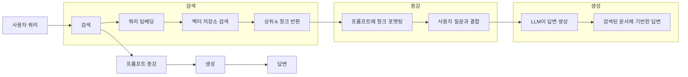
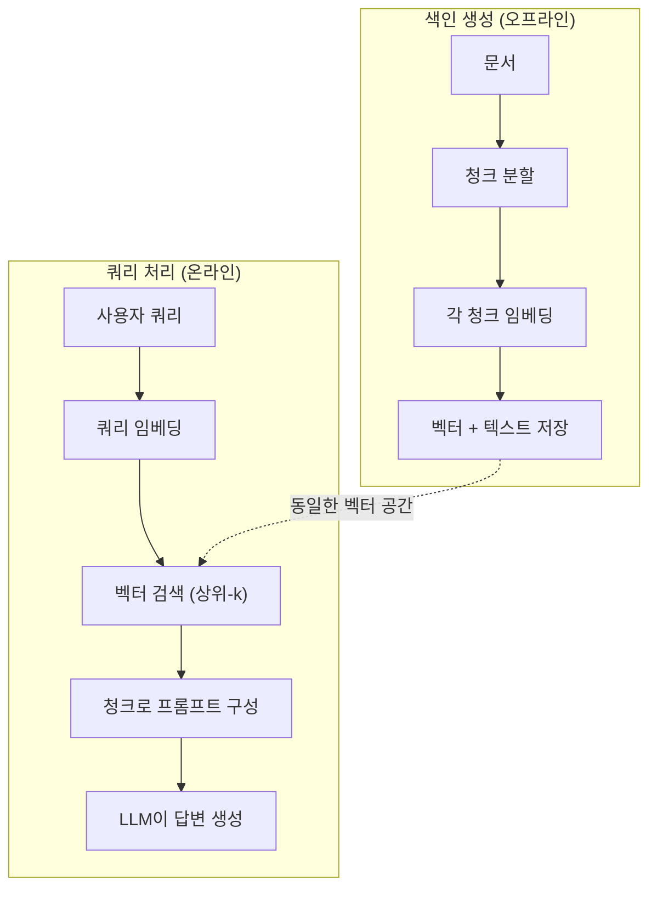

# RAG (검색-증강 생성)

> 당신의 LLM은 학습 커트라인까지의 모든 정보를 알고 있습니다. 하지만 회사 문서, 코드베이스, 지난 주 회의록에 대해서는 아무것도 모릅니다. RAG는 관련 문서를 검색하여 프롬프트에 주입함으로써 이 문제를 해결합니다. 이는 프로덕션 AI에서 가장 많이 배포되는 패턴입니다. 이 과정에서 단 한 가지를 구축한다면 RAG 파이프라인을 구축하세요.

**유형:** 구축
**언어:** Python
**사전 요구 사항:** 10단계 (기초부터 시작하는 LLM), 11단계 레슨 01-05
**소요 시간:** ~90분
**관련 자료:** 5단계 · 23 (RAG를 위한 청킹 전략)에서 6가지 청킹 알고리즘과 각 알고리즘의 우위 조건을 확인하세요. 5단계 · 22 (임베딩 모델 심층 분석)에서 임베더 선택 방법을 참고하세요. 11단계 · 07 (고급 RAG)에서 하이브리드 검색, 재정렬, 쿼리 변환에 대해 학습하세요.

## 학습 목표

- 문서 로딩, 청킹, 임베딩, 벡터 저장소, 검색, 생성 단계를 포함한 완전한 RAG 파이프라인 구축
- 적절한 인덱싱을 활용한 벡터 데이터베이스(ChromaDB, FAISS, Pinecone)를 이용한 의미론적 검색 구현
- 지식 기반 애플리케이션에서 파인튜닝 대비 RAG 선호 이유 설명 (비용, 최신성, 출처 추적)
- 검색 지표(정밀도, 재현율) 및 생성 지표(충실도, 관련성)를 활용한 RAG 품질 평가

## 문제

회사용 챗봇을 구축합니다. 고객이 "엔터프라이즈 플랜의 환불 정책은 어떻게 되나요?"라고 질문합니다. LLM은 일반적인 SaaS 환불 정책에 대한 답변을 제공합니다. 실제 정책은 200페이지 분량의 내부 위키에 묻혀 있는데, 엔터프라이즈 고객은 60일 이내에 비례 배분된 환불을 받을 수 있다고 명시되어 있습니다. LLM은 이 문서를 본 적이 없습니다. 학습되지 않은 내용은 알 수 없습니다.

파인튜닝(fine-tuning)이 하나의 해결책입니다. LLM을 내부 문서들로 추가 학습시킨 후 업데이트된 모델을 배포합니다. 이 방법은 작동하지만 심각한 문제가 있습니다. 파인튜닝에는 수천 달러의 컴퓨팅 비용이 듭니다. 문서가 변경되는 순간 모델은 구식이 됩니다. 모델이 어떤 소스를 참조했는지 알 방법이 없습니다. 그리고 회사가 다음 달에 다른 제품 라인을 인수하면 다시 파인튜닝을 수행해야 합니다.

RAG(Retrieval-Augmented Generation)가 다른 해결책입니다. 모델은 그대로 유지합니다. 질문이 들어오면 문서 저장소에서 관련 구절을 검색한 후, 질문 앞에 해당 구절을 프롬프트에 붙여넣고 모델이 이 구절을 컨텍스트로 활용해 답변하도록 합니다. 문서 저장소는 몇 분 안에 업데이트할 수 있습니다. 어떤 문서가 검색되었는지 정확히 확인할 수 있습니다. 모델 자체는 절대 변경되지 않습니다. 이것이 RAG가 프로덕션 환경에서 지배적인 패턴인 이유입니다: 더 저렴하고, 최신 정보를 반영하며, 감사(audit)가 가능하고, 모든 LLM과 호환됩니다.

## 개념

### RAG 패턴

전체 패턴은 4단계로 구성됩니다:



쿼리 -> 검색 -> 프롬프트 증강 -> 생성. 모든 RAG 시스템은 이 패턴을 따릅니다. 프로덕션 RAG 시스템 간 차이는 각 단계의 세부 사항에 있습니다: 청크 분할 방법, 임베딩 방법, 검색 방법, 프롬프트 구성 방법.

### RAG가 파인튜닝을 능가하는 이유

| 고려 사항 | 파인튜닝 | RAG |
|---------|------------|-----|
| 비용 | 훈련당 $1,000-$100,000+ | 쿼리당 $0.01-$0.10 (임베딩 + LLM) |
| 최신성 | 재훈련 전까지 오래된 정보 | 문서 재색인 시 몇 분 내 업데이트 |
| 감사 가능성 | 답변 출처 추적 불가 | 정확한 검색된 구절 표시 가능 |
| 환각 | 여전히 자유롭게 환각 발생 | 검색된 문서에 기반 |
| 데이터 프라이버시 | 훈련 데이터가 가중치에 포함 | 문서는 벡터 저장소에 유지 |

파인튜닝은 모델 가중치를 영구적으로 변경합니다. RAG는 모델 컨텍스트를 일시적으로 변경합니다. 대부분의 애플리케이션에서는 일시적 컨텍스트가 필요합니다.

파인튜닝이 유리한 유일한 경우: 프롬프트만으로는 달성할 수 없는 특정 스타일, 톤 또는 추론 패턴을 모델이 채택해야 할 때. 사실적 지식 검색에서는 RAG가 항상 승리합니다.

### 임베딩 모델

임베딩 모델은 텍스트를 밀집 벡터로 변환합니다. 유사한 텍스트는 이 고차원 공간에서 서로 가까운 벡터를 생성합니다. "비밀번호 재설정 방법은?"과 "비밀번호 변경해야 함"은 단어가 거의 겹치지 않지만 거의 동일한 벡터를 생성합니다. "고양이가 매트 위에 앉았다"는 매우 다른 벡터를 생성합니다.

일반적인 임베딩 모델 (2026 라인업 — 전체 분석은 Phase 5 · 22 참조):

| 모델 | 차원 | 제공업체 | 비고 |
|-------|-----------|----------|-------|
| text-embedding-3-small | 1536 (마트료시카) | OpenAI | 대부분의 사용 사례에서 최고의 가성비 |
| text-embedding-3-large | 3072 (마트료시카) | OpenAI | 더 높은 정확도, 256/512/1024로 절단 가능 |
| Gemini Embedding 2 | 3072 (마트료시카) | Google | 최고 MTEB 검색 성능; 8K 컨텍스트 |
| voyage-4 | 1024/2048 (마트료시카) | Voyage AI | 도메인 변형 (코드, 금융, 법률) |
| Cohere embed-v4 | 1024 (마트료시카) | Cohere | 강력한 다국어 지원, 128K 컨텍스트 |
| BGE-M3 | 1024 (밀집 + 희소 + ColBERT) | BAAI (오픈 가중치) | 하나의 모델에서 세 가지 뷰 제공 |
| Qwen3-Embedding | 4096 (마트료시카) | Alibaba (오픈 가중치) | 최고 오픈 가중치 검색 점수 |
| all-MiniLM-L6-v2 | 384 | 오픈 가중치 (Sentence Transformers) | 프로토타이핑 기준선 |

이 레슨에서는 TF-IDF를 사용하여 간단한 임베딩을 직접 구축합니다. TF-IDF가 프로덕션 시스템에서 사용되는 것은 아니지만, 개념을 구체화하기 위해: 텍스트가 입력되면 벡터가 출력되고, 유사한 텍스트는 유사한 벡터를 생성합니다.

### 벡터 유사도

두 벡터가 주어졌을 때 유사도를 측정하는 방법:

**코사인 유사도**: 두 벡터 사이 각도의 코사인 값. -1(반대)에서 1(동일) 범위. 크기는 무시하고 방향만 고려. RAG의 기본값입니다.

```
cosine_sim(a, b) = dot(a, b) / (||a|| * ||b||)
```

**내적**: 원시 내적. 큰 벡터가 더 높은 점수를 받습니다. 크기가 정보를 전달할 때 유용 (긴 문서가 더 관련성이 높을 수 있음).

```
dot(a, b) = sum(a_i * b_i)
```

**L2(유클리드) 거리**: 벡터 공간에서의 직선 거리. 거리가 작을수록 유사. 크기 차이에 민감.

```
L2(a, b) = sqrt(sum((a_i - b_i)^2))
```

코사인 유사도가 표준입니다. 크기를 정규화하므로 길이가 다른 문서를 우아하게 처리합니다. "벡터 검색"이라고 하면 거의 항상 코사인 유사도를 의미합니다.

### 청크 분할 전략

문서는 단일 벡터로 임베딩하기에는 너무 깁니다. 50페이지 PDF는 수십 가지 주제를 포함하므로 끔찍한 임베딩을 생성할 수 있습니다. 대신 문서를 청크로 분할하고 각 청크를 별도로 임베딩합니다.

**고정 크기 청크 분할**: N 토큰마다 분할. 간단하고 예측 가능. 512 토큰 청크에 50 토큰 오버랩이 있으면 청크 1은 토큰 0-511, 청크 2는 토큰 462-973 등입니다. 오버랩은 문장 경계를 무작위로 분할하지 않도록 보장합니다.

**의미 기반 청크 분할**: 자연스러운 경계에서 분할. 단락, 섹션 또는 마크다운 헤더. 각 청크는 일관된 의미 단위입니다. 구현이 더 복잡하지만 더 나은 검색 결과를 생성합니다.

**재귀적 청크 분할**: 가장 큰 경계(섹션 헤더)에서 먼저 분할 시도. 섹션이 여전히 너무 크면 단락 경계에서 분할. 단락이 여전히 너무 크면 문장 경계에서 분할. LangChain의 RecursiveCharacterTextSplitter 접근 방식이며 실제로 잘 작동합니다.

청크 크기는 사람들이 생각하는 것보다 더 중요합니다:

- 너무 작음 (64-128 토큰): 각 청크에 컨텍스트 부족. "지난 분기 15% 증가"는 "그것"이 무엇을 가리키는지 모르면 의미가 없음.
- 너무 큼 (2048+ 토큰): 각 청크가 여러 주제를 다루어 관련성 희석. 수익 데이터를 검색하면 10%는 수익, 90%는 인력 관련 청크를 얻음.
- 적정 크기 (256-512 토큰): 자체 포함 가능한 충분한 컨텍스트, 관련성 집중.

대부분의 프로덕션 RAG 시스템은 256-512 토큰 청크와 50 토큰 오버랩을 사용합니다. Anthropic의 RAG 가이드라인도 이 범위를 권장합니다.

### 벡터 데이터베이스

임베딩을 생성한 후에는 저장하고 검색할 장소가 필요합니다. 옵션:

| 데이터베이스 | 유형 | 최적 사용처 |
|----------|------|----------|
| FAISS | 라이브러리 (인프로세스) | 프로토타이핑, 소규모~중규모 데이터셋 |
| Chroma | 경량 DB | 로컬 개발, 소규모 배포 |
| Pinecone | 관리형 서비스 | 운영 오버헤드 없는 프로덕션 |
| Weaviate | 오픈소스 DB | 자체 호스팅 프로덕션 |
| pgvector | Postgres 확장 | 이미 Postgres 사용 중 |
| Qdrant | 오픈소스 DB | 고성능 자체 호스팅 |

이 레슨에서는 간단한 인메모리 벡터 저장소를 구축합니다. 벡터를 리스트에 저장하고 무차별 대입 코사인 유사도 검색을 수행합니다. 이는 FAISS의 플랫 인덱스와 동일합니다. 느려지기 전까지 약 100,000개 벡터까지 확장 가능. 프로덕션 시스템은 HNSW 같은 근사 최근접 이웃(ANN) 알고리즘을 사용하여 수백만 개 벡터를 밀리초 단위로 검색합니다.

### 전체 파이프라인



색인 생성 단계는 문서당 한 번(또는 문서 업데이트 시) 실행됩니다. 쿼리 처리 단계는 모든 사용자 요청 시 실행됩니다. 프로덕션에서는 색인 생성이 수백만 개 문서를 몇 시간에 걸쳐 처리할 수 있습니다. 쿼리 처리는 1초 이내에 응답해야 합니다.

### 실제 수치

대부분의 프로덕션 RAG 시스템은 다음 매개변수를 사용합니다:

- **k = 5~10** 검색된 청크/쿼리
- **청크 크기 = 256~512 토큰** + 50 토큰 오버랩
- **컨텍스트 예산**: 쿼리당 2,500-5,000 토큰의 검색된 콘텐츠
- **총 프롬프트**: ~8,000-16,000 토큰 (시스템 프롬프트 + 검색된 청크 + 대화 기록 + 사용자 쿼리)
- **임베딩 차원**: 모델에 따라 384-3072
- **색인 처리량**: API 임베딩으로 초당 100-1,000개 문서
- **쿼리 지연 시간**: 검색 50-200ms, 생성 500-3000ms

## 구축 방법

### 단계 1: 문서 청킹

```python
def chunk_text(text, chunk_size=200, overlap=50):
    words = text.split()
    chunks = []
    start = 0
    while start < len(words):
        end = start + chunk_size
        chunk = " ".join(words[start:end])
        chunks.append(chunk)
        start += chunk_size - overlap
    return chunks
```

### 단계 2: TF-IDF 임베딩

간단한 임베딩 함수를 구축합니다. TF-IDF(Term Frequency-Inverse Document Frequency)는 신경망 임베딩은 아니지만, 단어 중요도를 포착하는 방식으로 텍스트를 벡터로 변환합니다. 문서 내에서 빈번한 단어는 높은 TF 값을 얻고, 코퍼스 전체에서 희귀한 단어는 높은 IDF 값을 얻습니다. 이 두 값의 곱은 중요하고 독특한 단어가 높은 값을 갖는 벡터를 생성합니다.

```python
import math
from collections import Counter

def build_vocabulary(documents):
    vocab = set()
    for doc in documents:
        vocab.update(doc.lower().split())
    return sorted(vocab)

def compute_tf(text, vocab):
    words = text.lower().split()
    count = Counter(words)
    total = len(words)
    return [count.get(word, 0) / total for word in vocab]

def compute_idf(documents, vocab):
    n = len(documents)
    idf = []
    for word in vocab:
        doc_count = sum(1 for doc in documents if word in doc.lower().split())
        idf.append(math.log((n + 1) / (doc_count + 1)) + 1)
    return idf

def tfidf_embed(text, vocab, idf):
    tf = compute_tf(text, vocab)
    return [t * i for t, i in zip(tf, idf)]
```

### 단계 3: 코사인 유사도 검색

```python
def cosine_similarity(a, b):
    dot = sum(x * y for x, y in zip(a, b))
    norm_a = math.sqrt(sum(x * x for x in a))
    norm_b = math.sqrt(sum(x * x for x in b))
    if norm_a == 0 or norm_b == 0:
        return 0.0
    return dot / (norm_a * norm_b)

def search(query_embedding, stored_embeddings, top_k=5):
    scores = []
    for i, emb in enumerate(stored_embeddings):
        sim = cosine_similarity(query_embedding, emb)
        scores.append((i, sim))
    scores.sort(key=lambda x: x[1], reverse=True)
    return scores[:top_k]
```

### 단계 4: 프롬프트 구성

RAG에서 "증강"이 발생하는 부분입니다. 검색된 청크를 프롬프트로 포맷하고, LLM에게 제공된 컨텍스트를 기반으로 답변을 요청합니다.

```python
def build_rag_prompt(query, retrieved_chunks):
    context = "\n\n---\n\n".join(
        f"[Source {i+1}]\n{chunk}"
        for i, chunk in enumerate(retrieved_chunks)
    )
    return f"""다음 컨텍스트만을 기반으로 질문에 답변하세요.
컨텍스트에 충분한 정보가 없는 경우 "그 질문에 답변할 충분한 정보가 없습니다."라고 말하세요.

컨텍스트:
{context}

질문: {query}

답변:"""
```

### 단계 5: 완전한 RAG 파이프라인

```python
class RAGPipeline:
    def __init__(self):
        self.chunks = []
        self.embeddings = []
        self.vocab = []
        self.idf = []

    def index(self, documents):
        all_chunks = []
        for doc in documents:
            all_chunks.extend(chunk_text(doc))
        self.chunks = all_chunks
        self.vocab = build_vocabulary(all_chunks)
        self.idf = compute_idf(all_chunks, self.vocab)
        self.embeddings = [
            tfidf_embed(chunk, self.vocab, self.idf)
            for chunk in all_chunks
        ]

    def query(self, question, top_k=5):
        query_emb = tfidf_embed(question, self.vocab, self.idf)
        results = search(query_emb, self.embeddings, top_k)
        retrieved = [(self.chunks[i], score) for i, score in results]
        prompt = build_rag_prompt(
            question, [chunk for chunk, _ in retrieved]
        )
        return prompt, retrieved
```

### 단계 6: 생성 (시뮬레이션)

실제 운영 환경에서는 LLM API를 호출하는 부분입니다. 이 레슨에서는 검색된 컨텍스트에서 가장 관련성 높은 문장을 추출하여 생성을 시뮬레이션합니다.

```python
def simple_generate(prompt, retrieved_chunks):
    query_words = set(prompt.lower().split("질문:")[-1].split())
    best_sentence = ""
    best_score = 0
    for chunk in retrieved_chunks:
        for sentence in chunk.split("."):
            sentence = sentence.strip()
            if not sentence:
                continue
            words = set(sentence.lower().split())
            overlap = len(query_words & words)
            if overlap > best_score:
                best_score = overlap
                best_sentence = sentence
    return best_sentence if best_sentence else "충분한 정보가 없습니다."
```

## 사용 방법

실제 임베딩 모델과 LLM을 사용할 때 코드는 거의 변경되지 않습니다:

```python
from openai import OpenAI

client = OpenAI()

def embed(text):
    response = client.embeddings.create(
        model="text-embedding-3-small",
        input=text
    )
    return response.data[0].embedding

def generate(prompt):
    response = client.chat.completions.create(
        model="gpt-4o-mini",
        messages=[{"role": "user", "content": prompt}],
        temperature=0
    )
    return response.choices[0].message.content
```

또는 Anthropic을 사용할 경우:

```python
import anthropic

client = anthropic.Anthropic()

def generate(prompt):
    response = client.messages.create(
        model="claude-sonnet-4-20250514",
        max_tokens=1024,
        messages=[{"role": "user", "content": prompt}]
    )
    return response.content[0].text
```

파이프라인은 동일합니다. 임베딩 함수를 교체하고 생성 함수를 교체하면 됩니다. 검색 로직, 청킹, 프롬프트 구성 등은 사용하는 모델에 관계없이 모두 동일합니다.

대규모 벡터 저장을 위해 무차별 대입 검색을 적절한 벡터 데이터베이스로 교체합니다:

```python
import chromadb

client = chromadb.Client()
collection = client.create_collection("my_docs")

collection.add(
    documents=chunks,
    ids=[f"chunk_{i}" for i in range(len(chunks))]
)

results = collection.query(
    query_texts=["환불 정책은 무엇인가요?"],
    n_results=5
)
```

Chroma는 내부적으로 임베딩을 처리(기본값으로 all-MiniLM-L6-v2 사용)하고 로컬 데이터베이스에 벡터를 저장합니다. 패턴은 동일하지만 구현 방식이 다릅니다.

## Ship It

이 레슨은 다음을 생성합니다:
- `outputs/prompt-rag-architect.md` -- 특정 사용 사례에 맞는 RAG 시스템 설계를 위한 프롬프트
- `outputs/skill-rag-pipeline.md` -- 에이전트가 RAG 파이프라인을 구축하고 디버깅하는 방법을 가르치는 기술(skill)

## 연습 문제

1. TF-IDF 임베딩을 간단한 단어 가방(bag-of-words) 접근법(단어 존재 여부: 있으면 1, 없으면 0)으로 대체해 보세요. 샘플 문서에서 검색 품질을 비교해 보세요. TF-IDF는 희귀 단어에 더 높은 가중치를 부여하기 때문에 더 나은 성능을 보여야 합니다.

2. 청크 크기 실험: 동일한 문서 집합에 대해 50, 100, 200, 500단어 크기의 청크를 시도해 보세요. 각 크기마다 동일한 5개의 쿼리를 실행하고 상위 3개 결과에 관련 청크가 반환되는 횟수를 세어 보세요. 검색 품질이 최고점을 보이는 최적의 크기를 찾아보세요.

3. 각 청크에 메타데이터(소스 문서 이름, 청크 위치)를 추가해 보세요. 프롬프트 템플릿을 수정하여 소스 출처를 포함하도록 하면 LLM이 출처를 인용할 수 있습니다.

4. 간단한 평가 구현: 10개의 질문-답변 쌍을 주고, 각 질문을 RAG 파이프라인에 실행한 후 검색된 청크 중 답변을 포함하는 비율을 측정해 보세요. 이는 검색 재현율(retrieval recall at k)입니다.

5. 대화 인식 RAG 파이프라인 구축: 최근 3번의 대화 기록을 유지하고 검색된 청크와 함께 프롬프트에 포함시켜 보세요. "가격 정책에 대해 물어본 후 '기업용은 어떤가요?'와 같은 후속 질문으로 테스트해 보세요.

## 주요 용어

| 용어 | 사람들이 말하는 것 | 실제 의미 |
|------|----------------|----------------------|
| RAG | "문서를 읽는 AI" | 관련 문서를 검색하고, 프롬프트에 붙여넣은 후 해당 문서를 기반으로 답변 생성 |
| 임베딩(embedding) | "텍스트를 숫자로 변환" | 유사한 의미를 가진 텍스트가 유사한 벡터를 생성하는 밀집 벡터 표현 |
| 벡터 데이터베이스(vector database) | "AI용 검색 엔진" | 벡터 저장 및 유사도 기반 최근접 이웃 검색에 최적화된 데이터 저장소 |
| 청킹(chunking) | "문서를 조각들로 분할" | 문서를 더 작은 세그먼트(일반적으로 256-512 토큰)로 분할하여 각각을 독립적으로 임베딩하고 검색할 수 있도록 함 |
| 코사인 유사도(cosine similarity) | "두 벡터의 유사도" | 두 벡터 사이 각도의 코사인 값; 1 = 동일 방향, 0 = 직교, -1 = 반대 방향 |
| Top-k 검색(top-k retrieval) | "k개의 최적 매칭 결과 가져오기" | 벡터 저장소에서 쿼리와 가장 유사한 상위 k개 청크 반환 |
| 컨텍스트 윈도우(context window) | "LLM이 볼 수 있는 텍스트 양" | LLM이 단일 요청에서 처리할 수 있는 최대 토큰 수; 검색된 청크는 이 범위 내에 들어가야 함 |
| 증강 생성(augmented generation) | "주어진 컨텍스트를 사용한 답변" | 학습된 지식에만 의존하지 않고 검색된 문서를 컨텍스트로 사용하여 응답 생성 |
| TF-IDF(TF-IDF) | "단어 중요도 점수" | 용어 빈도(Term Frequency) × 역문서 빈도(Inverse Document Frequency); 코퍼스 내에서 단어의 독특성에 따라 가중치 부여 |
| 인덱싱(indexing) | "검색을 위한 문서 준비" | 쿼리 시간에 검색할 수 있도록 문서를 청킹, 임베딩, 저장하는 오프라인 프로세스

## 추가 자료

- Lewis et al., "지식 집약적 NLP 작업을 위한 검색 증강 생성(Retrieval-Augmented Generation)" (2020) -- 검색-생성 패턴을 공식화한 Facebook AI Research의 원본 RAG 논문
- Anthropic의 RAG 문서 (docs.anthropic.com) -- 청크 크기, 프롬프트 구성, 평가에 대한 실용적인 가이드라인
- Pinecone Learning Center, "RAG란?" -- 프로덕션 고려사항을 포함한 RAG 파이프라인의 명확한 시각적 설명
- Sentence-BERT: Reimers & Gurevych (2019) -- 모든 MiniLM 임베딩 모델의 기반이 되는 논문, 의미적 유사성을 위한 양방향 인코더(bi-encoder) 훈련 방법 제시
- [Karpukhin et al., "오픈 도메인 질의응답을 위한 밀집 패스지 검색(Dense Passage Retrieval)" (EMNLP 2020)](https://arxiv.org/abs/2004.04906) -- 오픈 도메인 QA에서 BM25를 능가하는 밀집 양방향 인코더 검색(DPR)을 증명한 논문, 현대 RAG 검색기의 패턴 확립
- [LlamaIndex 고수준 개념](https://docs.llamaindex.ai/en/stable/getting_started/concepts.html) -- RAG 파이프라인 구축 시 알아야 할 주요 개념: 데이터 로더, 노드 파서, 인덱스, 검색기, 응답 합성기
- [LangChain RAG 튜토리얼](https://python.langchain.com/docs/tutorials/rag/) -- 반대 접근 방식의 오케스트레이터; 실행 가능한 요소들의 연쇄(chain-of-runnables) 관점에서 본 동일한 검색-생성 패턴