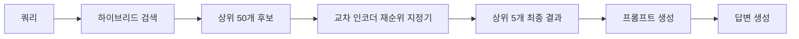
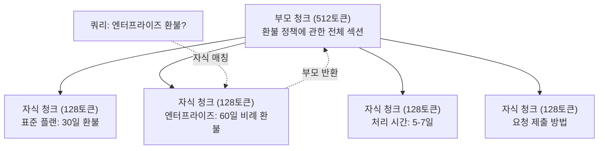
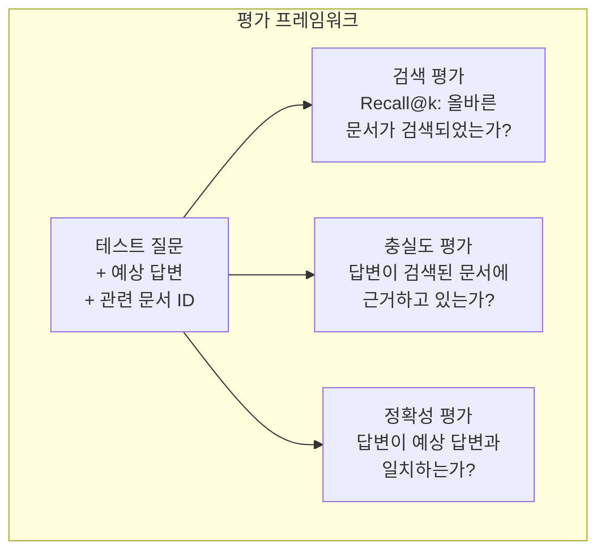

# 고급 RAG (청킹, 재순위 지정, 하이브리드 검색)

> 기본 RAG는 가장 유사한 상위 k개의 청크를 검색합니다. 이는 단순한 질문에는 효과적이지만, 다중 추론(multi-hop reasoning), 모호한 쿼리, 대규모 코퍼스에서는 제대로 작동하지 않습니다. 고급 RAG는 10개 문서에서 작동하는 데모와 1,000만 개 문서에서 작동하는 시스템 사이의 차이를 만듭니다.

**유형:** 구축(Build)
**언어:** Python
**사전 요구 사항:** 11단계, 06강 (RAG)
**소요 시간:** ~90분
**관련 내용:** 5단계 · 23강 (RAG를 위한 청킹 전략)에서는 재귀적, 의미론적, 문장, 부모-문서, 지연 청킹, 컨텍스트 검색 등 6가지 청킹 알고리즘을 Vectara/Anthropic 벤치마크와 함께 다룹니다. 이 강의는 이를 기반으로 하이브리드 검색, 재순위 지정, 쿼리 변환을 추가로 설명합니다.

## 학습 목표

- 문서 구조와 문맥을 보존하는 고급 청킹 전략(의미 기반, 재귀적, 부모-자식) 구현
- BM25 키워드 매칭과 의미 벡터 검색, 크로스-인코더 재순위 지정기를 결합한 하이브리드 검색 파이프라인 구축
- 모호한 질문이나 복잡한 질의에 대한 검색 성능 향상을 위한 질의 변환 기법(HyDE, 멀티쿼리, 스텝백) 적용
- 일반적인 RAG 실패 사례 진단 및 수정: 잘못된 청크 검색, 문맥에 답변 없음, 다중 추론 단계 실패

## 문제

레슨 06에서 기본 RAG 파이프라인을 구축했습니다. 소규모 코퍼스에 대한 직관적인 질문에는 작동합니다. 이제 다음 사례를 시도해 보세요:

**모호한 쿼리**: "지난 분기 매출은 얼마였나요?" 시맨틱 검색은 매출 전략, 매출 예측, CFO의 매출 성장에 대한 의견을 포함한 청크를 반환합니다. 모두 단어 "매출"과 시맨틱적으로 유사합니다. 실제 숫자를 포함한 청크는 없습니다. 정답 청크는 "$47.2M in Q3 2025"라고 명시하지만 "매출" 대신 "수익(earnings)"이라는 단어를 사용합니다. 임베딩 모델은 "Q3 수익은 $47.2M"보다 "매출 전략"이 쿼리와 더 가깝다고 판단합니다.

**다중 홉 질문**: "어떤 팀이 고객 만족도 점수 개선도가 가장 높았나요?" 이는 각 팀의 만족도 점수를 찾고, 비교한 후 최대값을 식별해야 합니다. 단일 청크에 정답이 없습니다. 정보는 팀 보고서 전체에 흩어져 있습니다.

**대규모 코퍼스 문제**: 200만 개의 청크가 있습니다. 정답은 청크 #1,847,293에 있습니다. 상위 5개 검색 결과는 청크 #14, #89,201, #1,200,000, #44, #901,333을 반환합니다. 임베딩 공간에서는 가깝지만 정답을 포함한 청크는 없습니다. 이 규모에서는 근사 최근접 이웃 검색(ANN)이 충분한 오류를 유발하여 관련 결과가 상위 k개 밖으로 밀려납니다.

기본 RAG는 벡터 유사도가 관련성과 동일하지 않기 때문에 실패합니다. 청크가 쿼리와 시맨틱적으로 유사하더라도 답변에 유용하지 않을 수 있습니다. 고급 RAG는 다음 4가지 기법으로 이를 해결합니다: 하이브리드 검색(키워드 매칭 추가), 재랭킹(후보를 더 신중하게 점수화), 쿼리 변환(검색 전 쿼리 수정), 더 나은 청킹(적절한 세분성으로 검색).

## 개념

### 하이브리드 검색: 의미 기반 + 키워드

의미 기반 검색(벡터 유사도)은 의미 이해에 강점이 있습니다. "구독을 어떻게 취소하나요?"는 "플랜 종료 단계"와 단어가 겹치지 않아도 매칭됩니다. 하지만 정확한 매칭은 놓칩니다. "오류 코드 E-4021"은 임베딩 모델이 노이즈로 처리하면 "E-4021"을 포함한 청크와 매칭되지 않을 수 있습니다.

키워드 검색(BM25)은 반대입니다. 정확한 매칭에 뛰어납니다. "E-4021"은 완벽히 매칭됩니다. 하지만 "구독 취소"는 문서에 "플랜 종료"라고 되어 있으면 결과가 0개입니다.

하이브리드 검색은 두 방식을 모두 실행한 후 결과를 통합합니다.

**BM25**(Best Matching 25)는 표준 키워드 검색 알고리즘입니다. 1990년대부터 검색 엔진의 핵심이었습니다. 공식:

```
BM25(q, d) = q에 있는 모든 텀 t에 대해 합산:
    IDF(t) * (tf(t,d) * (k1 + 1)) / (tf(t,d) + k1 * (1 - b + b * |d| / avgdl))
```

여기서 `tf(t,d)`는 문서 `d`에서 텀 `t`의 빈도, `IDF(t)`는 역문서 빈도, `|d|`는 문서 길이, `avgdl`은 평균 문서 길이, `k1`은 텀 빈도 포화 제어(기본값 1.2), `b`는 길이 정규화 제어(기본값 0.75)입니다.

간단히 말해: BM25는 쿼리 텀(특히 희귀한 텀)을 포함하는 문서에 높은 점수를 주지만, 반복된 텀에 대한 점수는 점차 감소합니다. "수익"이라는 단어가 50번 등장하는 문서가 한 번 등장하는 문서보다 50배 더 관련성이 높은 것은 아닙니다.

### 순위 융합(RRF)

두 개의 순위 목록이 있습니다: 하나는 벡터 검색 결과, 다른 하나는 BM25 결과입니다. 어떻게 통합할까요? 순위 융합(RRF)이 표준 접근법입니다.

```
RRF_score(d) = 모든 순위 R에 대해 합산:
    1 / (k + rank_R(d))
```

여기서 `k`는 상수(일반적으로 60)로, 최상위 결과가 지나치게 우세해지는 것을 방지합니다.

벡터 검색에서 1위, BM25에서 5위인 문서는:  
`1/(60+1) + 1/(60+5) = 0.0164 + 0.0154 = 0.0318`

벡터 검색에서 3위, BM25에서 2위인 문서는:  
`1/(60+3) + 1/(60+2) = 0.0159 + 0.0161 = 0.0320`

RRF는 두 신호를 자연스럽게 균형 잡습니다. 두 목록에서 모두 높은 순위를 차지한 문서가 최고 점수를 얻습니다. 한 목록에서 1위지만 다른 목록에 없는 문서는 중간 점수를 받습니다. 순위(생점수가 아님)를 사용하므로 두 시스템 간 점수 분포 차이는 무시됩니다.

### 재순위 지정

검색(벡터, 키워드, 하이브리드)은 빠르지만 부정확합니다. 양방향 인코더(bi-encoder)를 사용합니다: 쿼리와 각 문서를 독립적으로 임베딩한 후 비교합니다. 임베딩은 한 번 계산되어 캐시됩니다. 이는 수백만 문서까지 확장 가능합니다.

재순위 지정은 교차 인코더(cross-encoder)를 사용합니다: 쿼리와 후보 문서를 함께 모델에 입력해 관련성 점수를 출력합니다. 모델은 두 텍스트를 동시에 보고 세부적인 상호작용을 포착할 수 있습니다. 교차 인코더는 "3분기 수익은 얼마였나요?"가 "3분기 $47.2M"을 포함한 청크와 높은 관련성이 있음을 이해할 수 있습니다. 양방향 인코더는 이 연결을 놓칠 수 있습니다.

단점: 교차 인코더는 쿼리-문서 쌍을 공동으로 처리하므로 양방향 인코더보다 100~1000배 느립니다. 백만 문서에 대한 교차 인코더 점수를 미리 계산할 수 없습니다. 해결책: 더 큰 후보 집합(하이브리드 검색 상위 50개)을 검색한 후 교차 인코더로 재순위 지정해 최종 상위 5개를 얻습니다.



일반적인 재순위 지정 모델(2026년 라인업):
- Cohere Rerank 3.5: 관리형 API, 다국어, 혼합 코퍼스에서 최고 재현율 향상
- Voyage rerank-2.5: 관리형 API, 호스팅 옵션 중 최저 지연 시간
- Jina-Reranker-v2 Multilingual: 오픈소스 가중치, 100+ 언어
- bge-reranker-v2-m3: 오픈소스 가중치, 강력한 기준선
- cross-encoder/ms-marco-MiniLM-L-6-v2: 오픈소스 가중치, 프로토타이핑을 위한 CPU 실행
- ColBERTv2 / Jina-ColBERT-v2: 후기 상호작용 다중 벡터 재순위 지정기 — 채점 시 O(토큰)이지 O(문서)가 아님

### 쿼리 변환

때로는 검색 문제가 아니라 쿼리 자체에 문제가 있습니다. "새로운 정책 변경에 관한 그 내용이 뭐였지?"는 끔찍한 검색 쿼리입니다. 구체적인 용어가 없습니다. 임베딩도 모호합니다. 어떤 검색 시스템도 이 쿼리로 올바른 문서를 찾을 수 없습니다.

**쿼리 재작성**: 사용자의 쿼리를 더 나은 검색 쿼리로 다시 표현합니다. LLM이 이를 수행할 수 있습니다:

```
사용자: "새로운 정책 변경에 관한 그 내용이 뭐였지?"
재작성: "최근 정책 변경 및 업데이트"
```

**HyDE**(가상 문서 임베딩): 쿼리로 검색하는 대신 가상 답변을 생성하고, 이를 임베딩한 후 유사한 실제 문서를 검색합니다.

```
쿼리: "엔터프라이즈 환불 정책은 무엇인가요?"
가상 답변: "엔터프라이즈 고객은 구매 후 60일 이내에 전액 환불을 요청할 수 있습니다. 환불은 남은 구독 기간에 따라 비례 배분되며 5-7 영업일 이내에 처리됩니다."
```

가상 답변을 임베딩하고 이와 유사한 실제 문서를 검색합니다. 직관: 가상 답변은 원본 질문보다 실제 답변과 임베딩 공간에서 더 가깝게 위치합니다. 질문과 답변은 다른 언어 구조를 가집니다. 가상 답변을 생성함으로써 "질문 공간"과 "답변 공간" 사이의 격차를 줄입니다.

HyDE는 검색 전에 LLM 호출을 한 번 추가합니다. 이는 지연 시간을 500~2000ms 증가시킵니다. 원시 쿼리에서 검색 품질이 낮을 때 가치가 있습니다.

### 부모-자식 청킹

표준 청킹은 정밀 검색을 위한 작은 청크와 충분한 문맥을 위한 큰 청크 사이의 트레이드오프를 강요합니다. 부모-자식 청킹은 이 트레이드오프를 제거합니다.

검색을 위해 작은 청크(128토큰)를 인덱싱합니다. 작은 청크가 검색되면 프롬프트를 위해 해당 부모 청크(512토큰)를 반환합니다. 작은 청크는 쿼리와 정확히 매칭됩니다. 부모 청크는 LLM이 좋은 답변을 생성할 수 있는 충분한 문맥을 제공합니다.



"엔터프라이즈 환불?" 쿼리는 자식 청크 C2와 정확히 매칭됩니다. 하지만 프롬프트는 처리 시간과 제출 절차에 대한 주변 문맥을 포함한 전체 부모 청크 P를 받습니다.

### 메타데이터 필터링

벡터 검색을 실행하기 전에 메타데이터(날짜, 출처, 카테고리, 작성자, 언어)로 코퍼스를 필터링합니다. 이는 검색 공간을 줄이고 관련 없는 결과를 방지합니다.

"지난 달 보안 정책에서 무엇이 변경되었나요?"는 보안 카테고리의 지난 30일 내 문서만 검색해야 합니다. 메타데이터 필터링이 없으면 전체 코퍼스를 검색하고 의미적으로 유사한 2년 전 보안 문서를 검색할 수 있습니다.

프로덕션 RAG 시스템은 각 청크와 함께 메타데이터를 저장합니다: 출처 문서, 생성 날짜, 카테고리, 작성자, 버전. 벡터 데이터베이스는 유사도 검색 전 메타데이터 기반 사전 필터링을 지원하며, 이는 대규모 성능 향상에 중요합니다.

### 평가

RAG 시스템을 구축했습니다. 작동 여부를 어떻게 알 수 있을까요? 세 가지 지표:

**검색 관련성(Recall@k)**: 알려진 관련 문서가 있는 테스트 질문 집합에 대해, 관련 문서의 몇 퍼센트가 상위-k 결과에 나타나는가? 질문에 대한 답변이 청크 #47에 있다면, 청크 #47이 상위 5개 결과에 포함되는가?

**충실도**: 생성된 답변이 검색된 문서에 근거하고 있는가? 검색된 청크가 "60일 환불 기간"이라고 하는데 모델이 "90일 환불 기간"이라고 하면 충실도 실패입니다. 모델은 올바른 문맥을 가지고도 환각(hallucination)을 일으켰습니다.

**답변 정확성**: 생성된 답변이 예상 답변과 일치하는가? 이는 엔드투엔드 지표입니다. 검색 품질과 생성 품질을 결합합니다.

간단한 충실도 검사: 생성된 답변의 각 주장을 가져와 검색된 청크에 (실질적으로) 나타나는지 확인합니다. 답변에 검색된 청크에 없는 사실이 포함되어 있다면 환각일 가능성이 높습니다.



## 구축

### 단계 1: BM25 구현

```python
import math
from collections import Counter

class BM25:
    def __init__(self, k1=1.2, b=0.75):
        self.k1 = k1
        self.b = b
        self.docs = []
        self.doc_lengths = []
        self.avg_dl = 0
        self.doc_freqs = {}
        self.n_docs = 0

    def index(self, documents):
        self.docs = documents
        self.n_docs = len(documents)
        self.doc_lengths = []
        self.doc_freqs = {}

        for doc in documents:
            words = doc.lower().split()
            self.doc_lengths.append(len(words))
            unique_words = set(words)
            for word in unique_words:
                self.doc_freqs[word] = self.doc_freqs.get(word, 0) + 1

        self.avg_dl = sum(self.doc_lengths) / self.n_docs if self.n_docs else 1

    def score(self, query, doc_idx):
        query_words = query.lower().split()
        doc_words = self.docs[doc_idx].lower().split()
        doc_len = self.doc_lengths[doc_idx]
        word_counts = Counter(doc_words)
        score = 0.0

        for term in query_words:
            if term not in word_counts:
                continue
            tf = word_counts[term]
            df = self.doc_freqs.get(term, 0)
            idf = math.log((self.n_docs - df + 0.5) / (df + 0.5) + 1)
            numerator = tf * (self.k1 + 1)
            denominator = tf + self.k1 * (1 - self.b + self.b * doc_len / self.avg_dl)
            score += idf * numerator / denominator

        return score

    def search(self, query, top_k=10):
        scores = [(i, self.score(query, i)) for i in range(self.n_docs)]
        scores.sort(key=lambda x: x[1], reverse=True)
        return scores[:top_k]
```

### 단계 2: 상호 순위 융합(Reciprocal Rank Fusion)

```python
def reciprocal_rank_fusion(ranked_lists, k=60):
    scores = {}
    for ranked_list in ranked_lists:
        for rank, (doc_id, _) in enumerate(ranked_list):
            if doc_id not in scores:
                scores[doc_id] = 0.0
            scores[doc_id] += 1.0 / (k + rank + 1)
    fused = sorted(scores.items(), key=lambda x: x[1], reverse=True)
    return fused
```

### 단계 3: 하이브리드 검색 파이프라인

```python
def hybrid_search(query, chunks, vector_embeddings, vocab, idf, bm25_index, top_k=5, fusion_k=60):
    query_emb = tfidf_embed(query, vocab, idf)
    vector_results = search(query_emb, vector_embeddings, top_k=top_k * 3)
    bm25_results = bm25_index.search(query, top_k=top_k * 3)
    fused = reciprocal_rank_fusion([vector_results, bm25_results], k=fusion_k)
    return fused[:top_k]
```

### 단계 4: 단순 재랭커

실제 운영 환경에서는 교차 인코더 모델을 사용합니다. 여기서는 단어 겹침, 용어 중요도, 구문 일치를 사용하여 쿼리-문서 관련성을 점수화하는 재랭커를 구축합니다.

```python
def rerank(query, candidates, chunks):
    query_words = set(query.lower().split())
    stop_words = {"the", "a", "an", "is", "are", "was", "were", "what", "how",
                  "why", "when", "where", "do", "does", "for", "of", "in", "to",
                  "and", "or", "on", "at", "by", "it", "its", "this", "that",
                  "with", "from", "be", "has", "have", "had", "not", "but"}
    query_terms = query_words - stop_words

    scored = []
    for doc_id, initial_score in candidates:
        chunk = chunks[doc_id].lower()
        chunk_words = set(chunk.split())

        term_overlap = len(query_terms & chunk_words)

        query_bigrams = set()
        q_list = [w for w in query.lower().split() if w not in stop_words]
        for i in range(len(q_list) - 1):
            query_bigrams.add(q_list[i] + " " + q_list[i + 1])
        bigram_matches = sum(1 for bg in query_bigrams if bg in chunk)

        position_boost = 0
        for term in query_terms:
            pos = chunk.find(term)
            if pos != -1 and pos < len(chunk) // 3:
                position_boost += 0.5

        rerank_score = (
            term_overlap * 1.0
            + bigram_matches * 2.0
            + position_boost
            + initial_score * 5.0
        )
        scored.append((doc_id, rerank_score))

    scored.sort(key=lambda x: x[1], reverse=True)
    return scored
```

### 단계 5: HyDE (가상 문서 임베딩)

```python
def hyde_generate_hypothesis(query):
    templates = {
        "what": "The answer to '{query}' is as follows: Based on our documentation, {topic} involves specific policies and procedures that define how the process works.",
        "how": "To address '{query}': The process involves several steps. First, you need to initiate the request. Then, the system processes it according to the defined rules.",
        "default": "Regarding '{query}': Our records indicate specific details and policies related to this topic that provide a comprehensive answer."
    }
    query_lower = query.lower()
    if query_lower.startswith("what"):
        template = templates["what"]
    elif query_lower.startswith("how"):
        template = templates["how"]
    else:
        template = templates["default"]

    topic_words = [w for w in query.lower().split()
                   if w not in {"what", "is", "the", "how", "do", "does", "a", "an",
                                "for", "of", "to", "in", "on", "at", "by", "and", "or"}]
    topic = " ".join(topic_words) if topic_words else "this topic"

    return template.format(query=query, topic=topic)


def hyde_search(query, chunks, vector_embeddings, vocab, idf, top_k=5):
    hypothesis = hyde_generate_hypothesis(query)
    hypothesis_emb = tfidf_embed(hypothesis, vocab, idf)
    results = search(hypothesis_emb, vector_embeddings, top_k)
    return results, hypothesis
```

### 단계 6: 부모-자식 청킹

```python
def create_parent_child_chunks(text, parent_size=200, child_size=50):
    words = text.split()
    parents = []
    children = []
    child_to_parent = {}

    parent_idx = 0
    start = 0
    while start < len(words):
        parent_end = min(start + parent_size, len(words))
        parent_text = " ".join(words[start:parent_end])
        parents.append(parent_text)

        child_start = start
        while child_start < parent_end:
            child_end = min(child_start + child_size, parent_end)
            child_text = " ".join(words[child_start:child_end])
            child_idx = len(children)
            children.append(child_text)
            child_to_parent[child_idx] = parent_idx
            child_start += child_size

        parent_idx += 1
        start += parent_size

    return parents, children, child_to_parent
```

### 단계 7: 충실도 평가

```python
def evaluate_faithfulness(answer, retrieved_chunks):
    answer_sentences = [s.strip() for s in answer.split(".") if len(s.strip()) > 10]
    if not answer_sentences:
        return 1.0, []

    grounded = 0
    ungrounded = []
    context = " ".join(retrieved_chunks).lower()

    for sentence in answer_sentences:
        words = set(sentence.lower().split())
        stop_words = {"the", "a", "an", "is", "are", "was", "were", "and", "or",
                      "to", "of", "in", "for", "on", "at", "by", "it", "this", "that"}
        content_words = words - stop_words
        if not content_words:
            grounded += 1
            continue

        matched = sum(1 for w in content_words if w in context)
        ratio = matched / len(content_words) if content_words else 0

        if ratio >= 0.5:
            grounded += 1
        else:
            ungrounded.append(sentence)

    score = grounded / len(answer_sentences) if answer_sentences else 1.0
    return score, ungrounded


def evaluate_retrieval_recall(queries_with_relevant, retrieval_fn, k=5):
    total_recall = 0.0
    results = []

    for query, relevant_indices in queries_with_relevant:
        retrieved = retrieval_fn(query, k)
        retrieved_indices = set(idx for idx, _ in retrieved)
        relevant_set = set(relevant_indices)
        hits = len(retrieved_indices & relevant_set)
        recall = hits / len(relevant_set) if relevant_set else 1.0
        total_recall += recall
        results.append({
            "query": query,
            "recall": recall,
            "hits": hits,
            "total_relevant": len(relevant_set)
        })

    avg_recall = total_recall / len(queries_with_relevant) if queries_with_relevant else 0
    return avg_recall, results
```

## 사용 방법

실제 크로스 인코더로 재랭킹하기:

```python
from sentence_transformers import CrossEncoder

reranker = CrossEncoder("cross-encoder/ms-marco-MiniLM-L-6-v2")

def rerank_with_cross_encoder(query, candidates, chunks, top_k=5):
    pairs = [(query, chunks[doc_id]) for doc_id, _ in candidates]
    scores = reranker.predict(pairs)
    scored = list(zip([doc_id for doc_id, _ in candidates], scores))
    scored.sort(key=lambda x: x[1], reverse=True)
    return scored[:top_k]
```

Cohere의 관리형 재랭커 사용:

```python
import cohere

co = cohere.Client()

def rerank_with_cohere(query, candidates, chunks, top_k=5):
    docs = [chunks[doc_id] for doc_id, _ in candidates]
    response = co.rerank(
        model="rerank-english-v3.0",
        query=query,
        documents=docs,
        top_n=top_k
    )
    return [(candidates[r.index][0], r.relevance_score) for r in response.results]
```

실제 LLM을 사용한 HyDE 구현:

```python
import anthropic

client = anthropic.Anthropic()

def hyde_with_llm(query):
    response = client.messages.create(
        model="claude-sonnet-4-20250514",
        max_tokens=256,
        messages=[{
            "role": "user",
            "content": f"이 질문에 대한 좋은 답변이 될 짧은 단락을 작성하세요. 모른다고 말하지 마세요. 답변의 형태가 어떻게 될지 그대로 작성하세요.\n\n질문: {query}"
        }]
    )
    return response.content[0].text
```

Weaviate를 사용한 프로덕션 하이브리드 검색:

```python
import weaviate

client = weaviate.connect_to_local()

collection = client.collections.get("Documents")
response = collection.query.hybrid(
    query="기업 환불 정책",
    alpha=0.5,
    limit=10
)
```

알파(alpha) 파라미터는 균형을 제어합니다: 0.0 = 순수 키워드(BM25), 1.0 = 순수 벡터, 0.5 = 동일 가중치. 대부분의 프로덕션 시스템은 0.3에서 0.7 사이의 알파 값을 사용합니다.

## Ship It

이 레슨은 다음을 생성합니다:
- `outputs/prompt-advanced-rag-debugger.md` -- RAG 품질 문제 진단 및 수정을 위한 프롬프트
- `outputs/skill-advanced-rag.md` -- 하이브리드 검색 및 재정렬을 활용한 프로덕션급 RAG 구축을 위한 스킬

## 연습 문제

1. 샘플 문서에서 BM25 vs 벡터 검색 vs 하이브리드 검색을 비교하시오. 5개의 테스트 쿼리 각각에 대해, 어떤 접근 방식이 가장 관련성 높은 청크를 1위에 반환하는지 기록하시오. 하이브리드 검색은 5개 중 최소 3개에서 승리해야 합니다.

2. 메타데이터 필터를 구현하시오. 각 문서에 "category" 필드(security, billing, api, product)를 추가하시오. 벡터 검색 실행 전, 관련 카테고리로만 청크를 필터링하시오. "What encryption is used?" 쿼리로 테스트하고 security-category 청크만 검색하는지 확인하시오.

3. Lesson 06의 간단한 생성 함수를 사용하여 전체 HyDE 파이프라인을 구축하시오. 5개 테스트 쿼리 모두에서 직접 쿼리 검색과 HyDE 검색 간 검색 품질(상위 3개 관련성)을 비교하시오. HyDE는 모호한 쿼리에서 결과를 개선해야 합니다.

4. 샘플 문서에 부모-자식 청킹 전략을 구현하시오. child_size=30과 parent_size=100을 사용하시오. 자식 청크로 검색하되 프롬프트에는 부모 청크를 반환하시오. 생성된 답변을 표준 청킹(chunk_size=50)과 비교하시오.

5. 평가 데이터셋을 생성하시오: 알려진 답변 청크가 있는 10개의 질문. (a) 벡터 검색만, (b) BM25만, (c) 하이브리드 검색, (d) 하이브리드 + 재정렬에 대해 Recall@3, Recall@5, Recall@10을 측정하시오. 결과를 플롯하고 재정렬이 가장 도움이 되는 지점을 식별하시오.

## 주요 용어

| 용어 | 사람들이 말하는 표현 | 실제 의미 |
|------|----------------|----------------------|
| BM25 | "키워드 검색" | 용어 빈도, 역문서 빈도, 문서 길이 정규화를 기반으로 문서를 점수화하는 확률적 순위 알고리즘 |
| 하이브리드 검색 | "두 세계의 장점" | 의미적(벡터) 검색과 키워드(BM25) 검색을 병렬로 실행한 후 순위 융합으로 결과 통합 |
| 상호 순위 융합(Reciprocal Rank Fusion) | "순위 목록 병합" | 모든 목록에서 각 문서에 대해 1/(k + 순위) 값을 합산하여 여러 순위 목록 결합 |
| 재순위화(Reranking) | "두 번째 단계 점수화" | 초기 검색에서 얻은 후보 집합에 대해 더 비싼 크로스-인코더 모델을 사용해 재점수화 |
| 크로스-인코더(Cross-encoder) | "쿼리-문서 결합 모델" | 쿼리와 문서를 단일 입력으로 받아 관련성 점수를 생성하는 모델; 바이-인코더보다 정확하지만 전체 코퍼스 검색에는 너무 느림 |
| 바이-인코더(Bi-encoder) | "독립 임베딩 모델" | 쿼리와 문서를 독립적으로 임베딩하는 모델; 임베딩이 미리 계산되어 빠르지만 크로스-인코더보다 정확도가 낮음 |
| HyDE | "가짜 답변으로 검색" | 쿼리에 대한 가상의 답변을 생성하고 임베딩한 후, 이와 유사한 실제 문서 검색 |
| 부모-자식 청킹(Parent-child chunking) | "작은 검색, 큰 컨텍스트" | 정확한 검색을 위해 작은 청크를 인덱싱하지만 충분한 컨텍스트 제공을 위해 더 큰 부모 청크 반환 |
| 메타데이터 필터링(Metadata filtering) | "검색 전 범위 축소" | 벡터 검색 실행 전 속성(날짜, 출처, 카테고리)으로 문서를 필터링해 검색 공간 축소 |
| 충실도(Faithfulness) | "근거에 충실했는가" | 생성된 답변이 검색된 문서에 의해 지지되는지, 아니면 모델 학습 데이터에서 환각(hallucination)된 것인지 여부 |

## 추가 자료

- Robertson & Zaragoza, "The Probabilistic Relevance Framework: BM25 and Beyond" (2009) -- BM25의 공식적 기반 확률론적 이론을 설명하는 BM25의 표준 참고서
- Cormack et al., "Reciprocal Rank Fusion Outperforms Condorcet and Individual Rank Learning Methods" (2009) -- 더 복잡한 융합 방법보다 우수함을 입증한 RRF(원본 논문)
- Gao et al., "Precise Zero-Shot Dense Retrieval without Relevance Labels" (2022) -- 훈련 데이터 없이도 가설적 문서 임베딩이 검색 성능을 향상시킴을 입증한 HyDE 논문
- Nogueira & Cho, "Passage Re-ranking with BERT" (2019) -- BM25 기반 크로스-인코더 재순위지정이 검색 품질을 크게 향상시킴을 입증
- [Khattab et al., "DSPy: Compiling Declarative Language Model Calls into Self-Improving Pipelines" (2023)](https://arxiv.org/abs/2310.03714) -- 프롬프트 구성과 가중치 선택을 검색 파이프라인 최적화 문제로 접근; "프롬프트 LLM" 대신 "프로그램 LLM"을 위한 자료
- [Edge et al., "From Local to Global: A Graph RAG Approach to Query-Focused Summarization" (Microsoft Research 2024)](https://arxiv.org/abs/2404.16130) -- GraphRAG 논문: 엔티티-관계 추출 + 라이덴 커뮤니티 감지를 통한 쿼리 중심 요약; 로컬 vs 글로벌 검색 구분
- [Asai et al., "Self-RAG: Learning to Retrieve, Generate, and Critique through Self-Reflection" (ICLR 2024)](https://arxiv.org/abs/2310.11511) -- 자기 반성 토큰을 활용한 자기 평가 RAG; 정적 검색-생성 방식을 넘어선 에이전트적 접근
- [LangChain Query Construction 블로그](https://blog.langchain.dev/query-construction/) -- 자연어 쿼리를 구조화된 데이터베이스 쿼리(Text-to-SQL, Cypher)로 변환하는 방법(검색 전 단계)