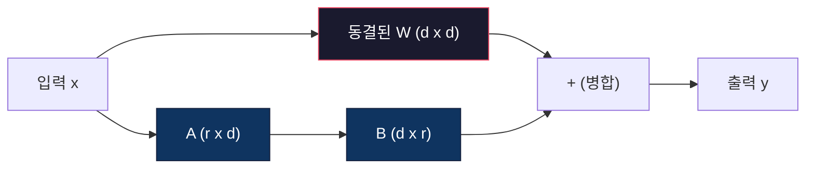
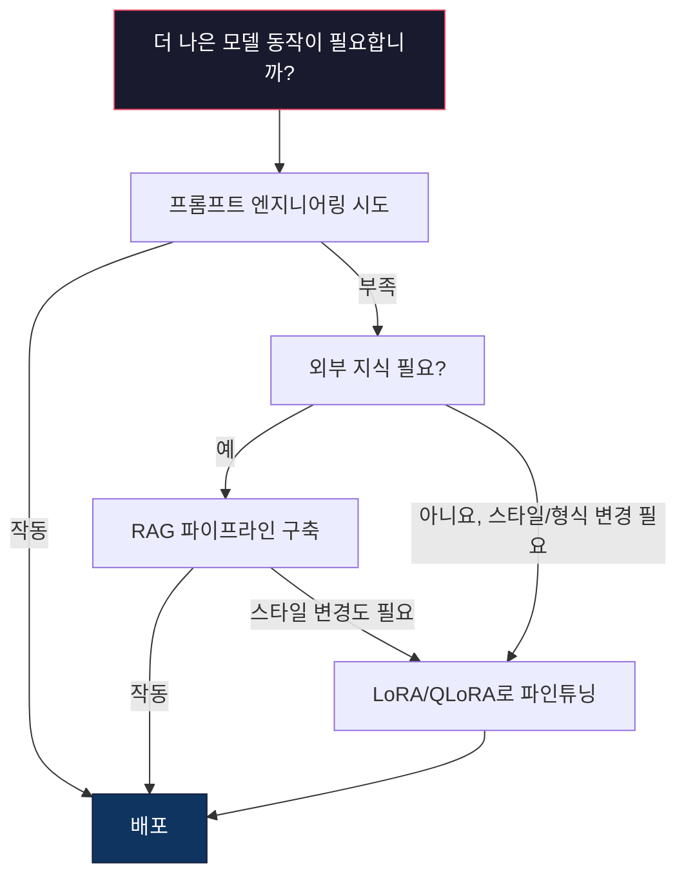

# LoRA & QLoRA를 활용한 파인튜닝

> 7B 모델 전체를 파인튜닝하려면 56GB VRAM이 필요합니다. 하지만 당신은 그만큼의 VRAM을 갖고 있지 않습니다. 대부분의 기업들도 마찬가지입니다. LoRA를 사용하면 파라미터의 1% 미만만 학습시켜 동일한 모델을 6GB에서 파인튜닝할 수 있습니다. 이는 타협이 아닙니다 — 대부분의 작업에서 전체 파인튜닝 품질과 동등합니다. 오픈소스 파인튜닝 생태계 전체가 이 하나의 기법에 의존하고 있습니다.

**유형:** 구축(Build)
**언어:** Python
**선수 지식:** Phase 10, Lesson 06 (지시 튜닝/지도 미세조정(SFT))
**소요 시간:** ~75분
**관련 내용:** Phase 10에서는 SFT/DPO 루프를 처음부터 다룹니다. 이 레슨에서는 2026 PEFT 툴킷(PEFT, TRL, Unsloth, Axolotl, LLaMA-Factory)에 해당 내용을 적용합니다.

## 학습 목표

- 사전 학습된 모델의 어텐션 레이어에 저랭크 어댑터 행렬(A와 B)을 주입하여 LoRA 구현
- LoRA와 전체 파인튜닝 간 파라미터 절감량 계산: d_model 차원의 랭크 r은 d² 대신 2*r*d 파라미터만 학습
- QLoRA(4비트 양자화된 베이스 + LoRA 어댑터)를 사용해 소비자 GPU 메모리 내에서 모델 파인튜닝
- 배포를 위해 LoRA 가중치를 베이스 모델에 병합하고 어댑터 유무에 따른 추론 속도 비교

## 문제

기본 모델인 Llama 3 8B가 있습니다. 이 모델을 회사 고유의 톤으로 고객 지원 티켓에 답변하도록 만들고 싶습니다. SFT(Supervised Fine-Tuning)가 해결책이지만, 비용 문제가 있습니다.

전체 미세 조정(Full Fine-Tuning)은 모델의 모든 파라미터를 업데이트합니다. Llama 3 8B는 80억 개의 파라미터를 가지고 있습니다. fp16 형식에서 각 파라미터는 2바이트를 차지합니다. 가중치만 로드하는 데 16GB가 필요합니다. 훈련 중에는 그래디언트(16GB), Adam 옵티마이저 상태(32GB: 모멘텀 + 분산), 그리고 활성화 값도 필요합니다. 총 약 56GB의 VRAM이 단일 8B 모델에 필요합니다.

A100 80GB GPU는 이를 간신히 수용할 수 있습니다. A100 2개는 클라우드 제공업체에서 시간당 $3-4의 비용이 듭니다. 50,000개 예시에 대해 3에폭 훈련에는 6-10시간이 소요됩니다. 이는 실험당 $30-40의 비용입니다. 하이퍼파라미터를 조정하기 위해 10번의 실험을 수행하면 배포 전에 $400를 지출하게 됩니다.

Llama 3 70B로 확장하면 숫자가 비현실적으로 증가합니다. 가중치만 140GB가 필요합니다. 클러스터가 필요하며, 실험당 $100+의 비용이 듭니다.

더 깊은 문제도 있습니다. 전체 미세 조정은 모델의 모든 가중치를 수정합니다. 고객 지원 데이터로 미세 조정하면 모델의 일반적인 능력이 저하될 수 있습니다. 이를 **파괴적 망각(catastrophic forgetting)**이라고 합니다. 모델은 특정 작업에서는 개선되지만 다른 모든 작업에서는 성능이 떨어집니다.

더 적은 파라미터를 훈련하고, 메모리를 적게 사용하며, 모델의 기존 지식을 파괴하지 않는 방법이 필요합니다.

## 개념

### LoRA: 저랭크 적응(Low-Rank Adaptation)

Edward Hu와 Microsoft 동료들이 2021년 6월 LoRA를 발표했습니다. 논문의 핵심 통찰: 파인튜닝 중 가중치 업데이트는 낮은 고유 랭크를 가집니다. 4096x4096 가중치 행렬의 1670만 개 파라미터를 모두 업데이트할 필요가 없습니다. 업데이트의 유용한 정보는 랭크 16 또는 32 행렬로 포착할 수 있습니다.

수학적으로 설명하면, 표준 선형 레이어는 다음을 계산합니다:

```
y = Wx
```

여기서 W는 d_out x d_in 행렬입니다. 4096x4096 어텐션 프로젝션의 경우 16,777,216개의 파라미터가 있습니다.

LoRA는 W를 동결하고 저랭크 분해를 추가합니다:

```
y = Wx + BAx
```

여기서 B는 (d_out x r), A는 (r x d_in)입니다. 랭크 r은 d보다 훨씬 작습니다. 일반적으로 8, 16, 32입니다.

4096x4096 레이어에서 r=16일 때:
- 원본 파라미터: 4096 x 4096 = 16,777,216
- LoRA 파라미터: (4096 x 16) + (16 x 4096) = 65,536 + 65,536 = 131,072
- 감소율: 131,072 / 16,777,216 = 0.78%

파라미터의 0.78%만 학습하면서도 95-100%의 품질을 얻습니다.



A는 무작위 가우시안으로 초기화됩니다. B는 0으로 초기화됩니다. 이는 LoRA 기여도가 0에서 시작함을 의미합니다. 모델은 원래 동작에서 시작해 점진적으로 적응을 학습합니다.

### 스케일링 팩터: 알파(Alpha)

LoRA는 저랭크 업데이트가 출력에 미치는 영향을 제어하는 스케일링 팩터 알파를 도입합니다:

```
y = Wx + (alpha / r) * BAx
```

알파 = r일 때 스케일링은 1배입니다. 알파 = 2r(일반적인 기본값)일 때 스케일링은 2배입니다. 이 하이퍼파라미터는 기본 학습률과 독립적으로 LoRA 경로의 학습률을 제어합니다.

실용적 지침:
- 알파 = 2 * 랭크는 커뮤니티에서 일반적인 관례입니다(원래 논문은 대부분의 실험에서 알파 = 랭크 사용)
- 알파 = 랭크는 1배 스케일링으로 보수적이지만 안정적입니다
- 높은 알파는 단계당 더 큰 업데이트를 의미하며, 수렴 속도를 높이거나 불안정성을 유발할 수 있습니다

### LoRA 적용 위치

트랜스포머에는 많은 선형 레이어가 있습니다. 모든 레이어에 LoRA를 추가할 필요는 없습니다. 원래 논문은 다양한 조합을 테스트했습니다:

| 대상 레이어 | 학습 가능 파라미터 (7B) | 품질 |
|--------------|----------------------|---------|
| q_proj만 | 4.7M | 좋음 |
| q_proj + v_proj | 9.4M | 더 좋음 |
| q_proj + k_proj + v_proj + o_proj | 18.9M | 어텐션에 최적 |
| 모든 선형 (어텐션 + MLP) | 37.7M | 미미한 향상, 2배 파라미터 |

대부분의 작업에 대한 최적 지점: q_proj + v_proj. 이는 셀프 어텐션의 쿼리 및 값 프로젝션을 대상으로 하며, 모델이 주목하는 대상과 추출하는 정보를 제어합니다. MLP 레이어를 추가하면 코드 생성과 같은 복잡한 작업에 도움이 되지만, 단순한 작업에서는 파라미터 수가 두 배로 늘어나도 효과가 미미합니다.

### 랭크 선택

랭크 r은 적응의 표현력을 제어합니다:

| 랭크 | 학습 가능 파라미터 (레이어당) | 최적 작업 |
|------|---------------------------|----------|
| 4 | 32,768 | 단순 분류, 감정 분석 |
| 8 | 65,536 | 단일 도메인 Q&A, 요약 |
| 16 | 131,072 | 다중 도메인 작업, 지시 따르기 |
| 32 | 262,144 | 복잡한 추론, 코드 생성 |
| 64 | 524,288 | 대부분의 작업에서 효과 감소 |
| 128 | 1,048,576 | 거의 정당화되지 않음 |

Hu 등은 r=4가 단순 작업에 필요한 대부분의 적응을 포착함을 보였습니다. r=8과 r=16이 실제로 가장 일반적으로 선택됩니다. r=64를 넘어가면 품질이 거의 향상되지 않으며 LoRA의 메모리 이점을 잃기 시작합니다.

### QLoRA: 4비트 양자화 + LoRA

Tim Dettmers와 워싱턴 대학 동료들이 2023년 5월 QLoRA를 발표했습니다. 아이디어: 동결된 기본 모델을 4비트 정밀도로 양자화한 후, 그 위에 fp16의 LoRA 어댑터를 연결합니다.

이는 메모리 방정식을 크게 변경합니다:

| 방법 | 가중치 메모리 (7B) | 훈련 메모리 (7B) | 필요한 GPU |
|--------|-------------------|---------------------|-------------|
| 전체 파인튜닝 (fp16) | 14GB | ~56GB | 1x A100 80GB |
| LoRA (fp16 기본) | 14GB | ~18GB | 1x A100 40GB |
| QLoRA (4비트 기본) | 3.5GB | ~6GB | 1x RTX 3090 24GB |

QLoRA는 세 가지 기술적 기여를 합니다:

**NF4 (정규 부동소수점 4비트)**: 신경망 가중치를 위해 특별히 설계된 새로운 데이터 타입입니다. 신경망 가중치는 대략 정규 분포를 따릅니다. NF4는 16개의 양자화 레벨을 표준 정규 분포의 분위수에 배치합니다. 이는 정규 분포 데이터에 대해 정보 이론적으로 최적입니다. 균일 4비트 양자화(INT4)나 표준 Float4보다 정보 손실이 적습니다.

**이중 양자화**: 양자화 상수 자체도 메모리를 차지합니다. 64개의 가중치 블록마다 fp32 스케일 팩터(4바이트)가 필요합니다. 7B 모델의 경우 추가로 0.4GB가 필요합니다. 이중 양자화는 이러한 상수를 fp8로 양자화하여 오버헤드를 0.1GB로 줄입니다. 작지만 누적됩니다.

**페이지 기반 옵티마이저**: 훈련 중 옵티마이저 상태(Adam의 모멘텀 및 분산)는 긴 시퀀스에서 GPU 메모리를 초과할 수 있습니다. 페이지 기반 옵티마이저는 NVIDIA의 통합 메모리를 사용하여 GPU 메모리가 부족할 때 옵티마이저 상태를 CPU RAM으로 자동 페이징하고, 필요할 때 다시 페이징합니다. 이는 OOM 충돌을 방지하지만 처리량이 일부 감소합니다.

### 품질 질문

파라미터 감소 또는 기본 모델 양자화가 품질에 영향을 미칠까요? 여러 논문의 결과:

| 방법 | MMLU (5샷) | MT-Bench | HumanEval |
|--------|--------------|----------|-----------|
| 전체 파인튜닝 (Llama 2 7B) | 48.3 | 6.72 | 14.6 |
| LoRA r=16 | 47.9 | 6.68 | 14.0 |
| QLoRA r=16 (NF4) | 47.5 | 6.61 | 13.4 |
| QLoRA r=64 (NF4) | 48.1 | 6.70 | 14.2 |

r=16의 LoRA는 대부분의 벤치마크에서 전체 파인튜닝과 1% 이내입니다. r=16의 QLoRA는 추가로 1% 미만의 품질 손실이 있습니다. r=64의 QLoRA는 메모리를 90% 적게 사용하면서도 전체 파인튜닝과 거의 동일한 성능을 보입니다.

### 실제 비용

50,000개 예제(3에폭)로 Llama 3 8B 파인튜닝:

| 방법 | GPU | 시간 | 비용 |
|--------|-----|------|------|
| 전체 파인튜닝 | 2x A100 80GB | 8시간 | ~$32 |
| LoRA r=16 | 1x A100 40GB | 4시간 | ~$8 |
| QLoRA r=16 | 1x RTX 4090 24GB | 6시간 | ~$5 |
| QLoRA r=16 (Unsloth) | 1x RTX 4090 24GB | 2.5시간 | ~$2 |
| QLoRA r=16 | 1x T4 16GB | 12시간 | ~$4 |

단일 소비자 GPU에서 QLoRA를 사용하면 점심값보다 저렴합니다. 이것이 2023년 오픈소스 가중치 파인튜닝 커뮤니티가 폭발적으로 성장한 이유이며, 2026년 모든 훈련 프레임워크가 기본적으로 QLoRA를 제공하는 이유입니다.

### 2026 PEFT 스택

| 프레임워크 | 설명 | 선택 시기 |
|-----------|-----------|-----------|
| **Hugging Face PEFT** | 표준 LoRA/QLoRA/DoRA/IA3 라이브러리 | `transformers.Trainer`에 훈련 루프가 이미 있는 경우 |
| **TRL** | HF의 강화 학습 피드백 트레이너(SFT, DPO, GRPO, PPO, ORPO) | SFT 후 DPO/GRPO가 필요한 경우; PEFT 위에 구축됨 |
| **Unsloth** | Triton 커널로 포워드/백워드 패스 재작성 | 정확도 손실 없이 2-5배 속도 향상 + VRAM 절반 사용; Llama/Mistral/Qwen 계열 |
| **Axolotl** | PEFT + TRL + DeepSpeed + Unsloth를 위한 YAML 구성 래퍼 | 재현 가능한 버전 제어 훈련 실행이 필요한 경우 |
| **LLaMA-Factory** | PEFT + TRL을 위한 GUI/CLI/API | 코드 없는 파인튜닝이 필요한 경우; 100+ 모델 계열 지원 |
| **torchtune** | `transformers` 종속성 없는 네이티브 PyTorch 레시피 | 최소한의 종속성 필요 + 조직이 이미 PyTorch를 표준으로 사용하는 경우 |

경험적 규칙: 연구용 또는 일회성 실험 → PEFT. 반복 가능한 프로덕션 파이프라인 → Unsloth 커널이 활성화된 Axolotl. 일회성 프로토타이핑 → LLaMA-Factory.

### 어댑터 병합

훈련 후 두 가지 항목이 있습니다: 동결된 기본 모델과 작은 LoRA 어댑터(일반적으로 10-100MB). 다음 중 하나를 선택할 수 있습니다:

1. **분리 유지**: 기본 모델을 로드하고 어댑터를 그 위에 로드합니다. 다른 작업을 위해 어댑터를 교체합니다. 이는 하나의 기본 모델에서 여러 파인튜닝된 변형을 제공하는 방법입니다.

2. **영구 병합**: W' = W + (alpha/r) * BA를 계산하고 결과를 새 전체 모델로 저장합니다. 병합된 모델은 원본과 크기가 같습니다. 추론 오버헤드 없음. 관리할 어댑터 없음.

여러 작업(고객 지원 어댑터, 코드 어댑터, 번역 어댑터)을 서빙할 때는 분리 유지합니다. 단일 특수화된 모델을 배포할 때는 병합합니다.

여러 어댑터를 결합하는 고급 병합 기술:

- **TIES-Merging** (Yadav et al. 2023): 작은 크기의 파라미터를 제거하고 부호 충돌을 해결한 후 병합합니다. 어댑터 간 간섭을 줄입니다.
- **DARE** (Yu et al. 2023): 병합 전 어댑터 파라미터를 무작위로 삭제하고 나머지를 재조정합니다. 기능을 결합하는 데 놀랍도록 효과적입니다.
- **작업 산술**: 어댑터 가중치를 단순히 더하거나 뺍니다. "코드" 어댑터와 "수학" 어댑터를 더하면 종종 둘 다에 능숙한 모델이 생성됩니다.

### 파인튜닝을 하지 말아야 할 때

파인튜닝은 첫 번째가 아닌 세 번째 옵션입니다.

**첫 번째: 프롬프트 엔지니어링**. 더 나은 시스템 프롬프트를 작성합니다. 몇 가지 예시를 추가합니다. 사고 체인을 사용합니다. 이는 비용이 들지 않으며 몇 분이면 됩니다. 프롬프트로 80%를 달성했다면 파인튜닝이 필요 없을 수 있습니다.

**두 번째: RAG**. 모델이 특정 데이터(문서, 지식 베이스, 제품 카탈로그)를 알아야 하는 경우, 검색은 가중치에 굽는 것보다 저렴하고 유지 관리가 용이합니다. 레슨 06을 참조하세요.

**세 번째: 파인튜닝**. 프롬프트로 달성할 수 없는 특정 스타일, 형식 또는 추론 패턴을 모델이 채택해야 할 때 사용합니다. 일관된 구조화된 출력이 필요할 때. 더 큰 모델을 더 작은 모델로 증류해야 할 때. 지연 시간이 중요하고 몇 가지 예시 프롬프트의 추가 토큰을 감당할 수 없을 때.



## 직접 구현하기

PyTorch로 LoRA를 처음부터 구현합니다. 외부 라이브러리 없이 순수 PyTorch로 LoRA 레이어를 만들고, 모델에 주입하고, 훈련한 후 가중치를 병합하는 방법을 설명합니다.

### 1단계: LoRA 레이어

```python
import torch
import torch.nn as nn
import math

class LoRALayer(nn.Module):
    def __init__(self, in_features, out_features, rank=8, alpha=16):
        super().__init__()
        self.rank = rank
        self.alpha = alpha
        self.scaling = alpha / rank

        self.A = nn.Parameter(torch.randn(in_features, rank) * (1 / math.sqrt(rank)))
        self.B = nn.Parameter(torch.zeros(rank, out_features))

    def forward(self, x):
        return (x @ self.A @ self.B) * self.scaling
```

A는 스케일링된 랜덤 값으로 초기화됩니다. B는 0으로 초기화됩니다. BA 행렬 곱은 0에서 시작하므로 모델은 원래 동작을 유지합니다.

### 2단계: LoRA가 적용된 선형 레이어

```python
class LinearWithLoRA(nn.Module):
    def __init__(self, linear, rank=8, alpha=16):
        super().__init__()
        self.linear = linear
        self.lora = LoRALayer(
            linear.in_features, linear.out_features, rank, alpha
        )

        for param in self.linear.parameters():
            param.requires_grad = False

    def forward(self, x):
        return self.linear(x) + self.lora(x)
```

원본 선형 레이어는 고정됩니다. LoRA 파라미터(A와 B)만 훈련 가능합니다.

### 3단계: 모델에 LoRA 주입

```python
def inject_lora(model, target_modules, rank=8, alpha=16):
    for param in model.parameters():
        param.requires_grad = False

    lora_layers = {}
    for name, module in model.named_modules():
        if isinstance(module, nn.Linear):
            if any(t in name for t in target_modules):
                parent_name = ".".join(name.split(".")[:-1])
                child_name = name.split(".")[-1]
                parent = dict(model.named_modules())[parent_name]
                lora_linear = LinearWithLoRA(module, rank, alpha)
                setattr(parent, child_name, lora_linear)
                lora_layers[name] = lora_linear
    return lora_layers
```

먼저 모델 내 모든 파라미터를 고정합니다. 그런 다음 모델 트리를 탐색하여 대상 이름과 일치하는 선형 레이어를 찾아 LoRA가 적용된 버전으로 교체합니다. LoRA의 A와 B 행렬이 전체 모델에서 유일한 훈련 가능 파라미터입니다.

### 4단계: 파라미터 수 계산

```python
def count_parameters(model):
    total = sum(p.numel() for p in model.parameters())
    trainable = sum(p.numel() for p in model.parameters() if p.requires_grad)
    frozen = total - trainable
    return {
        "total": total,
        "trainable": trainable,
        "frozen": frozen,
        "trainable_pct": 100 * trainable / total if total > 0 else 0
    }
```

### 5단계: 가중치 병합

```python
def merge_lora_weights(model):
    for name, module in model.named_modules():
        if isinstance(module, LinearWithLoRA):
            with torch.no_grad():
                merged = (
                    module.lora.A @ module.lora.B
                ) * module.lora.scaling
                module.linear.weight.data += merged.T
            parent_name = ".".join(name.split(".")[:-1])
            child_name = name.split(".")[-1]
            if parent_name:
                parent = dict(model.named_modules())[parent_name]
            else:
                parent = model
            setattr(parent, child_name, module.linear)
```

병합 후 LoRA 레이어는 사라집니다. 모델은 원래 크기와 동일하며 적응이 가중치에 반영됩니다. 추론 시 오버헤드가 없습니다.

### 6단계: QLoRA 양자화 시뮬레이션

```python
def quantize_to_nf4(tensor, block_size=64):
    blocks = tensor.reshape(-1, block_size)
    scales = blocks.abs().max(dim=1, keepdim=True).values / 7.0
    scales = torch.clamp(scales, min=1e-8)
    quantized = torch.round(blocks / scales).clamp(-8, 7).to(torch.int8)
    return quantized, scales

def dequantize_from_nf4(quantized, scales, original_shape):
    dequantized = quantized.float() * scales
    return dequantized.reshape(original_shape)
```

이 함수는 64개 블록 내에서 가중치를 16개의 이산 수준으로 매핑하여 4비트 양자화를 시뮬레이션합니다. 실제 QLoRA는 bitsandbytes 라이브러리를 사용하여 GPU에서 진정한 NF4를 구현합니다.

### 7단계: 훈련 루프

```python
def train_lora(model, data, epochs=5, lr=1e-3, batch_size=4):
    optimizer = torch.optim.AdamW(
        [p for p in model.parameters() if p.requires_grad], lr=lr
    )
    criterion = nn.MSELoss()

    losses = []
    for epoch in range(epochs):
        epoch_loss = 0.0
        n_batches = 0
        indices = torch.randperm(len(data["inputs"]))

        for i in range(0, len(indices), batch_size):
            batch_idx = indices[i:i + batch_size]
            x = data["inputs"][batch_idx]
            y = data["targets"][batch_idx]

            output = model(x)
            loss = criterion(output, y)

            optimizer.zero_grad()
            loss.backward()
            optimizer.step()

            epoch_loss += loss.item()
            n_batches += 1

        avg_loss = epoch_loss / n_batches
        losses.append(avg_loss)

    return losses
```

### 8단계: 전체 데모

```python
def demo():
    torch.manual_seed(42)
    d_model = 256
    n_classes = 10

    model = nn.Sequential(
        nn.Linear(d_model, 512),
        nn.ReLU(),
        nn.Linear(512, 512),
        nn.ReLU(),
        nn.Linear(512, n_classes),
    )

    n_samples = 500
    x = torch.randn(n_samples, d_model)
    y = torch.randint(0, n_classes, (n_samples,))
    y_onehot = torch.zeros(n_samples, n_classes).scatter_(1, y.unsqueeze(1), 1.0)

    data = {"inputs": x, "targets": y_onehot}

    params_before = count_parameters(model)

    lora_layers = inject_lora(
        model, target_modules=["0", "2"], rank=8, alpha=16
    )

    params_after = count_parameters(model)

    losses = train_lora(model, data, epochs=20, lr=1e-3)

    merge_lora_weights(model)
    params_merged = count_parameters(model)

    return {
        "params_before": params_before,
        "params_after": params_after,
        "params_merged": params_merged,
        "losses": losses,
    }
```

데모는 작은 모델을 생성하고 두 레이어에 LoRA를 주입한 후 훈련하고 가중치를 병합합니다. 파라미터 수는 전체 훈련 가능 상태에서 LoRA 훈련 중 약 1%로 감소한 후 병합 시 원래 아키텍처로 돌아갑니다.

## 사용 방법

Hugging Face 생태계를 사용하면 실제 모델에 LoRA를 적용하는 데 약 20줄의 코드만 필요합니다:

```python
from transformers import AutoModelForCausalLM, AutoTokenizer
from peft import LoraConfig, get_peft_model, TaskType

model = AutoModelForCausalLM.from_pretrained("meta-llama/Llama-3.1-8B")
tokenizer = AutoTokenizer.from_pretrained("meta-lllama/Llama-3.1-8B")

lora_config = LoraConfig(
    task_type=TaskType.CAUSAL_LM,
    r=16,
    lora_alpha=32,
    lora_dropout=0.05,
    target_modules=["q_proj", "v_proj"],
)

model = get_peft_model(model, lora_config)
model.print_trainable_parameters()
```

QLoRA의 경우 bitsandbytes 양자화를 추가합니다:

```python
from transformers import BitsAndBytesConfig

bnb_config = BitsAndBytesConfig(
    load_in_4bit=True,
    bnb_4bit_quant_type="nf4",
    bnb_4bit_compute_dtype=torch.bfloat16,
    bnb_4bit_use_double_quant=True,
)

model = AutoModelForCausalLM.from_pretrained(
    "meta-llama/Llama-3.1-8B",
    quantization_config=bnb_config,
    device_map="auto",
)

model = get_peft_model(model, lora_config)
```

이게 전부입니다. 동일한 학습 루프. 동일한 데이터 파이프라인. 기본 모델은 이제 4비트로 저장되고, LoRA 어댑터는 fp16에서 훈련되며, 전체 시스템은 6GB에 적합합니다.

Hugging Face Trainer를 사용한 학습 방법:

```python
from transformers import TrainingArguments, Trainer
from datasets import load_dataset

dataset = load_dataset("tatsu-lab/alpaca", split="train[:5000]")

training_args = TrainingArguments(
    output_dir="./lora-llama",
    num_train_epochs=3,
    per_device_train_batch_size=4,
    gradient_accumulation_steps=4,
    learning_rate=2e-4,
    fp16=True,
    logging_steps=10,
    save_strategy="epoch",
    optim="paged_adamw_8bit",
)

trainer = Trainer(
    model=model,
    args=training_args,
    train_dataset=dataset,
)

trainer.train()

model.save_pretrained("./lora-adapter")
```

저장된 어댑터는 10-100MB입니다. 기본 모델은 변경되지 않습니다. 전체 모델을 재배포하지 않고도 Hugging Face Hub에서 어댑터를 공유할 수 있습니다.

## Ship It

이 레슨은 다음을 생성합니다:
- `outputs/prompt-lora-advisor.md` -- 특정 작업에 대한 LoRA(LoRA) 랭크, 대상 모듈, 하이퍼파라미터를 결정하는 데 도움이 되는 프롬프트
- `outputs/skill-fine-tuning-guide.md` -- 에이전트에게 파인튜닝(fine-tuning) 시기와 방법을 위한 의사결정 트리를 가르치는 스킬

## 연습 문제

1. **랭크 제거 연구(Rank ablation study).** 랭크 2, 4, 8, 16, 32, 64로 데모를 실행합니다. 최종 손실(loss) 대 랭크(rank) 그래프를 그립니다. 랭크를 두 배로 늘려도 손실이 절반으로 줄어들지 않는 한계점(diminishing returns)을 찾습니다. 256차원 특징(feature)에 대한 간단한 분류 작업에서는 이 지점이 r=8-16 정도여야 합니다.

2. **타겟 모듈 비교(Target module comparison).** `inject_lora`를 수정하여 "0" 레이어만, "2" 레이어만, "4" 레이어만, 그리고 세 레이어 모두를 타겟팅하는 변형을 만듭니다. 각 변형을 20 에포크(epoch) 동안 훈련시킵니다. 수렴 속도와 최종 손실을 비교합니다. 이는 q_proj 대 v_proj 대 모든 선형 레이어를 타겟팅하는 실제 결정을 반영합니다.

3. **양자화 오류 분석(Quantization error analysis).** 훈련된 모델의 가중치 행렬을 `quantize_to_nf4`/`dequantize_from_nf4` 적용 전후로 비교합니다. 평균 제곱 오차(mean squared error), 최대 절대 오차(max absolute error), 원본과 복원된 가중치 간의 상관 관계(correlation)를 계산합니다. 블록 크기(block_size) 값 32, 64, 128, 256으로 실험합니다.

4. **다중 어댑터 서빙(Multi-adapter serving).** 서로 다른 데이터 하위 집합(짝수 인덱스 대 홀수 인덱스)에 대해 두 개의 LoRA 어댑터를 훈련시킵니다. 두 어댑터를 저장합니다. 기본 모델(base model)을 한 번 로드한 후 어댑터를 교체하고, 각 어댑터가 동일한 입력에 대해 서로 다른 출력을 생성하는지 확인합니다. 이는 프로덕션 시스템에서 하나의 기본 모델로부터 여러 미세 조정 모델을 서빙하는 방식입니다.

5. **병합 vs. 비병합 추론(Merge vs. unmerged inference).** 동일한 100개 입력에 대해 `merge_lora_weights` 적용 전후의 LoRA 모델 출력을 비교합니다. 출력이 동일한지(1e-5 부동소수점 허용 오차 내에서) 확인합니다. 그런 다음 두 경우의 추론 속도를 벤치마킹합니다. 병합된 버전은 두 번의 행렬 곱셈이 아닌 단일 행렬 곱셈으로 인해 약간 더 빠를 것입니다.

## 주요 용어

| 용어 | 사람들이 말하는 것 | 실제 의미 |
|------|----------------|----------------------|
| LoRA | "효율적인 파인튜닝" | 저랭크 적응(Low-Rank Adaptation): 기본 가중치 동결, 전체 가중치 업데이트를 근사하는 두 개의 작은 행렬 A와 B를 훈련 |
| QLoRA | "노트북에서 파인튜닝" | 양자화된 LoRA: 기본 모델을 4비트 NF4로 로드, 상위에서 fp16으로 LoRA 어댑터 훈련, 6GB VRAM에서 7B 파인튜닝 가능 |
| 랭크(r) | "모델이 학습할 수 있는 양" | A와 B 행렬의 내부 차원; 표현력 대 매개변수 수 제어 |
| 알파(Alpha) | "LoRA 학습률" | LoRA 출력에 적용되는 스케일링 계수; alpha/r은 최종 출력에 대한 적응 기여도 조정 |
| NF4 | "4비트 양자화" | 정규화 부동소수점 4비트(Normal Float 4): 정규 분포 분위수에 양자화 레벨을 가진 4비트 데이터 타입, 신경망 가중치에 최적화 |
| 어댑터(Adapter) | "작은 훈련 부분" | 별도의 파일로 저장된 LoRA A와 B 행렬(10-100MB), 기본 모델 복사본 위에 로드 가능 |
| 대상 모듈(Target modules) | "LoRA 적용할 레이어" | LoRA 어댑터가 주입되는 특정 선형 레이어(q_proj, v_proj 등) |
| 병합(Merging) | "고정하기" | W + (alpha/r) * BA 계산 및 원본 가중치 교체, 추론 시 어댑터 오버헤드 제거 |
| 페이징 옵티마이저(Paged optimizers) | "훈련 중 OOM 방지" | GPU 메모리 부족 시 옵티마이저 상태(Adam 모멘텀, 분산)를 CPU로 오프로딩 |
| 치명적 망각(Catastrophic forgetting) | "파인튜닝이 다른 모든 것을 망가뜨렸다" | 모든 가중치 업데이트 시 모델이 이전에 학습한 능력을 상실하는 현상

## 추가 자료

- Hu et al., "LoRA: 대규모 언어 모델의 저랭크 적응" (2021) -- GPT-3 175B에서 랭크 4까지 테스트한 저랭크 분해 방법 소개 논문
- Dettmers et al., "QLoRA: 양자화된 언어 모델의 효율적 파인튜닝" (2023) -- NF4, 이중 양자화, 페이징 옵티마이저 도입으로 48GB 단일 GPU에서 65B 파인튜닝 가능
- PEFT 라이브러리 문서 (huggingface.co/docs/peft) -- 허깅 페이스 생태계에서 LoRA, QLoRA 및 기타 파라미터 효율적 방법을 위한 표준 라이브러리
- Yadav et al., "TIES-Merging: 모델 병합 시 간섭 해결" (2023) -- 품질 저하 없이 여러 LoRA 어댑터 결합 기술
- [Rafailov et al., "직접 선호 최적화: 언어 모델은 비밀리에 보상 모델이다" (NeurIPS 2023)](https://arxiv.org/abs/2305.18290) -- DPO 유도; SFT 이후 진행되는 선호 튜닝 단계, 보상 모델 불필요
- [TRL 문서](https://huggingface.co/docs/trl/) -- `SFTTrainer`, `DPOTrainer`, `KTOTrainer` 및 PEFT/bitsandbytes/Unsloth와의 통합 인터페이스에 대한 공식 참조
- [Unsloth 문서](https://docs.unsloth.ai/) -- 파인튜닝 처리량 2배 증가 및 메모리 절반 감소 퓨즈드 커널; TRL의 성능 계층
- [Axolotl 문서](https://axolotl-ai-cloud.github.io/axolotl/) -- YAML 구성 다중 GPU SFT/DPO/QLoRA 트레이너; 수작업 스크립트 대신 코드형 구성 대안