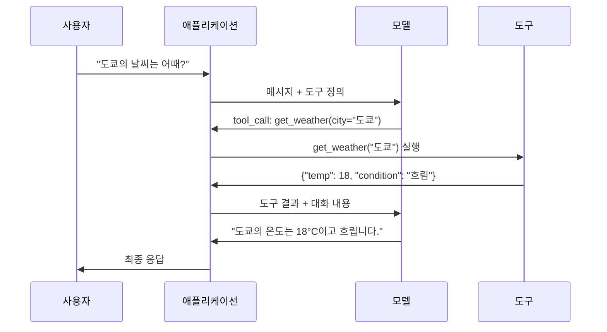

# 함수 호출 & 도구 사용

> LLM은 아무것도 할 수 없습니다. 텍스트를 생성할 뿐입니다. 그것이 전부입니다. 날씨를 확인하거나, 데이터베이스를 조회하거나, 이메일을 보내거나, 코드를 실행하거나, 파일을 읽을 수 없습니다. 지금까지 본 모든 "AI 에이전트"는 LLM이 어떤 함수를 호출해야 하는지 JSON을 생성하고, 실제 코드는 이를 실행하는 것입니다. 모델은 두뇌입니다. 도구는 손입니다. 함수 호출은 이들을 연결하는 신경계입니다.

**유형:** 구축
**언어:** Python
**선수 지식:** 11단계 03레슨 (구조화된 출력)
**소요 시간:** ~75분
**관련:** 11단계 · 14레슨 (모델 컨텍스트 프로토콜) — 도구가 호스트 간에 공유될 때, 인라인 함수 호출에서 MCP 서버로 전환합니다. 이 레슨은 인라인 사례를 다루며, MCP는 프로토콜 사례를 다룹니다.

## 학습 목표

- 함수 호출 루프 구현: 도구 스키마 정의, 모델의 도구 호출 JSON 파싱, 함수 실행 및 결과 반환
- 모델이 안정적으로 호출할 수 있는 명확한 설명과 타입이 지정된 매개변수를 가진 도구 스키마 설계
- 복잡한 질의에 답변하기 위해 여러 함수 호출을 연결하는 다중 턴(turn) 에이전트 루프 구축
- 함수 호출 에지 케이스 처리: 병렬 도구 호출, 오류 전파, 무한 도구 루프 방지

## 문제

챗봇을 구축합니다. 사용자가 다음과 같이 질문합니다: "도쿄의 현재 날씨는 어때요?"

모델은 다음과 같이 응답합니다: "실시간 날씨 데이터에는 접근할 수 없지만, 계절을 고려할 때 도쿄는 약 15도 섭씨 정도일 것 같습니다..."

이는 면책 조항으로 포장된 환각(hallucination)입니다. 모델은 날씨를 알지 못합니다. 앞으로도 절대 알 수 없습니다. 날씨는 매시간 변합니다. 모델의 학습 데이터는 몇 달 전 것입니다.

올바른 답변을 제공하려면 OpenWeatherMap API를 호출하고 현재 온도를 가져온 후 실제 숫자를 반환해야 합니다. 모델은 API를 호출할 수 없습니다. 하지만 코드는 가능합니다. 필요한 것은 모델이 "이 인수로 날씨 API를 호출해야 합니다"라고 말할 수 있고, 코드가 이를 실행한 후 결과를 다시 피드백할 수 있는 구조화된 프로토콜입니다.

이것이 함수 호출(function calling)입니다. 모델은 어떤 함수를 어떤 인수로 호출해야 하는지 설명하는 구조화된 JSON을 출력합니다. 애플리케이션은 해당 함수를 실행합니다. 결과는 대화로 다시 들어갑니다. 모델은 이 결과를 사용하여 최종 답변을 생성합니다.

함수 호출이 없다면 LLM은 백과사전에 불과합니다. 함수 호출이 있다면 LLM은 에이전트(agent)가 됩니다.

## 개념

## 함수 호출 루프

모든 도구 사용 상호작용은 동일한 5단계 루프를 따릅니다.



1단계: 사용자가 메시지를 보냅니다. 2단계: 모델은 메시지와 도구 정의(사용 가능한 함수를 설명하는 JSON 스키마)를 함께 받습니다. 3단계: 텍스트로 응답하는 대신, 모델은 함수 이름과 인수를 포함한 구조화된 JSON 객체인 도구 호출을 출력합니다. 4단계: 코드가 함수를 실행하고 결과를 캡처합니다. 5단계: 결과가 모델로 돌아가 실제 데이터를 바탕으로 최종 답변을 생성합니다.

모델은 절대 직접 실행하지 않습니다. 어떤 함수를 어떤 인수로 호출할지 결정할 뿐입니다. 실행은 코드가 담당합니다.

## 도구 정의: JSON 스키마 계약

각 도구는 함수가 수행하는 작업, 필요한 인수, 인수의 데이터 유형을 모델에 알려주는 JSON 스키마로 정의됩니다.

```json
{
  "type": "function",
  "function": {
    "name": "get_weather",
    "description": "도시의 현재 날씨를 가져옵니다. 섭씨 온도와 상태를 반환합니다.",
    "parameters": {
      "type": "object",
      "properties": {
        "city": {
          "type": "string",
          "description": "도시 이름, 예: '도쿄' 또는 '샌프란시스코'"
        },
        "units": {
          "type": "string",
          "enum": ["celsius", "fahrenheit"],
          "description": "온도 단위"
        }
      },
      "required": ["city"]
    }
  }
}
```

`description` 필드는 매우 중요합니다. 모델은 이 설명을 읽고 도구를 언제 어떻게 사용할지 결정합니다. "날씨를 가져온다"와 같은 모호한 설명은 "도시의 현재 날씨를 가져옵니다. 섭씨 온도와 상태를 반환합니다."보다 도구 선택 품질을 떨어뜨립니다. 설명은 도구 선택을 위한 프롬프트 역할을 합니다.

## 공급자 비교

모든 주요 공급자는 함수 호출을 지원하지만 API 표면(surface)은 다릅니다.

| 공급자 | API 파라미터 | 도구 호출 형식 | 병렬 호출 | 강제 호출 |
|----------|--------------|-----------------|---------------|----------------|
| OpenAI (GPT-5, o4) | `tools` | `tool_calls[].function` | 예 (턴당 여러 개) | `tool_choice="required"` |
| Anthropic (Claude 4.6/4.7) | `tools` | `content[].type="tool_use"` | 예 (여러 블록) | `tool_choice={"type":"any"}` |
| Google (Gemini 3) | `function_declarations` | `functionCall` | 예 | `function_calling_config` |
| 오픈소스 (Llama 4, Qwen3, DeepSeek-V3) | Llama 4의 네이티브 `tools`; 기타는 Hermes 또는 ChatML | 혼합 | 모델 종속 | 프롬프트 기반 또는 지원 시 `tool_choice` |

2026년까지 폐쇄형 3사는 거의 동일한 JSON 스키마 기반 형식으로 수렴했습니다. Llama 4는 OpenAI 형식과 일치하는 네이티브 `tools` 필드를 탑재했습니다. 오픈소스 파인튜닝은 여전히 다양합니다. 서드파티 파인튜닝에서 가장 일반적인 형식은 NousResearch의 Hermes입니다. 호스트 간 공유 도구의 경우 인라인 함수 호출보다 MCP(Phase 11 · 14)를 선호하세요. 서버는 모든 경우에 동일합니다.

## 도구 선택: 자동, 필수, 특정

모델이 도구를 사용하는 시점을 제어할 수 있습니다.

**자동** (기본값): 모델은 도구 호출 여부를 직접 결정합니다. "2+2는 얼마인가요?" → 직접 응답. "날씨는 어때요?" → 도구 호출.

**필수**: 모델은 반드시 하나 이상의 도구를 호출해야 합니다. 사용자 의도가 도구 사용을 필요로 할 때 사용하세요. 실제 데이터를 조회하지 않고 추측하는 것을 방지합니다.

**특정 함수**: 특정 함수 호출을 강제합니다. `tool_choice={"type":"function", "function": {"name": "get_weather"}}`는 쿼리와 무관하게 날씨 도구 호출을 보장합니다. 라우팅에 사용하세요. 상위 로직에서 이미 필요한 도구를 결정한 경우입니다.

## 병렬 함수 호출

GPT-4o와 Claude는 단일 턴에서 여러 함수를 호출할 수 있습니다. 사용자가 "도쿄와 뉴욕의 날씨는 어때요?"라고 물으면 모델은 동시에 두 도구 호출을 출력합니다:

```json
[
  {"name": "get_weather", "arguments": {"city": "도쿄"}},
  {"name": "get_weather", "arguments": {"city": "뉴욕"}}
]
```

코드는 두 호출을 실행(이상적으로는 동시 실행)하고 결과를 반환하면, 모델은 단일 응답을 종합합니다. 이렇게 하면 왕복 횟수가 2회에서 1회로 줄어듭니다. 쿼리당 5-10개 도구 호출을 하는 에이전트의 경우 병렬 호출로 지연 시간을 60-80% 줄일 수 있습니다.

## 구조화된 출력 vs 함수 호출

레슨 03에서 구조화된 출력을 다뤘습니다. 함수 호출은 동일한 JSON 스키마 메커니즘을 사용하지만 목적이 다릅니다.

**구조화된 출력**: 모델이 특정 형식의 데이터를 생성하도록 강제합니다. 출력은 최종 결과물입니다. 예: 텍스트에서 제품 정보를 `{name, price, in_stock}` 형식으로 추출.

**함수 호출**: 모델이 작업 실행 의도를 선언합니다. 출력은 중간 단계입니다. 예: `get_weather(city="도쿄")` → 모델은 최종 답변을 생성하는 것이 아니라 작업 실행을 요청합니다.

데이터 추출이 필요할 때는 구조화된 출력을, 외부 시스템과 상호작용할 때는 함수 호출을 사용하세요.

## 보안: 절대 양보할 수 없는 규칙

함수 호출은 LLM에 부여할 수 있는 가장 위험한 기능입니다. 모델이 실행할 내용을 선택합니다. 도구 세트에 데이터베이스 쿼리가 포함되면 모델이 쿼리를 생성합니다. 셸 명령이 포함되면 모델이 명령을 작성합니다.

**규칙 1: 모델 생성 SQL을 직접 데이터베이스에 전달하지 마세요.** 모델은 DROP TABLE, UNION 인젝션 또는 모든 행을 반환하는 쿼리를 생성할 수 있습니다. 항상 파라미터화하세요. 항상 검증하세요. 항상 허용된 작업 목록을 사용하세요.

**규칙 2: 함수 허용 목록 사용.** 모델은 명시적으로 정의한 함수만 호출할 수 있습니다. "이름으로 모든 함수 실행" 같은 범용 도구를 만들지 마세요. 50개의 내부 함수가 있다면 사용자가 필요한 5개만 노출하세요.

**규칙 3: 인수 검증.** 모델이 `"; DROP TABLE users; --"` 같은 도시 이름을 전달할 수 있습니다. 실행 전 모든 인수를 예상 유형, 범위, 형식과 대조해 검증하세요.

**규칙 4: 도구 결과 정제.** 도구가 민감한 데이터(API 키, PII, 내부 오류)를 반환하면 모델에 다시 보내기 전에 필터링하세요. 모델은 도구 결과를 응답에 그대로 포함합니다.

**규칙 5: 도구 호출 속도 제한.** 루프에 빠진 모델은 수백 번 도구 호출을 할 수 있습니다. 최대치(대화당 10-20회)를 설정하세요. 무한 루프를 방지하세요.

## 오류 처리

도구는 실패할 수 있습니다. API가 시간 초과될 수 있고, 데이터베이스가 다운될 수 있으며, 파일이 존재하지 않을 수 있습니다. 모델은 도구 실패 여부와 원인을 알아야 합니다.

예외가 아닌 구조화된 도구 결과로 오류를 반환하세요:

```json
{
  "error": true,
  "message": "도시 'Toky'를 찾을 수 없습니다. '도쿄'를 의미하셨나요?",
  "code": "CITY_NOT_FOUND"
}
```

모델은 이 메시지를 읽고 인수를 조정한 후 재시도합니다. 모델은 구조화된 오류 메시지에서 자가 수정하는 데 능숙합니다. 빈 응답이나 "알 수 없는 오류" 같은 일반적인 오류에서는 복구가 어렵습니다.

## MCP: 모델 컨텍스트 프로토콜

MCP는 Anthropic의 도구 상호 운용성을 위한 개방형 표준입니다. 모든 애플리케이션이 자체 도구를 정의하는 대신, MCP는 범용 프로토콜을 제공합니다. 도구는 MCP 서버에서 제공되고, MCP 클라이언트(Claude Code, Cursor 또는 애플리케이션)에서 소비됩니다.

하나의 MCP 서버는 모든 호환 클라이언트에 도구를 노출할 수 있습니다. Postgres MCP 서버는 모든 MCP 호환 에이전트에 데이터베이스 접근 권한을 부여합니다. GitHub MCP 서버는 모든 에이전트에 리포지토리 접근 권한을 부여합니다. 도구는 한 번 정의되고 어디서나 사용됩니다.

MCP는 함수 호출에서 HTTP가 네트워킹에 해당하는 역할을 합니다. 전송 계층을 표준화하여 도구를 이식 가능하게 만듭니다.

## 빌드하기

## 단계 1: 도구 레지스트리 정의

도구 정의와 구현을 저장하는 레지스트리를 구축합니다. 각 도구는 JSON 스키마 정의(모델이 보는 것)와 Python 함수(코드가 실행하는 것)를 가집니다.

```python
import json
import math
import time
import hashlib


TOOL_REGISTRY = {}


def register_tool(name, description, parameters, function):
    TOOL_REGISTRY[name] = {
        "definition": {
            "type": "function",
            "function": {
                "name": name,
                "description": description,
                "parameters": parameters,
            },
        },
        "function": function,
    }
```

## 단계 2: 5가지 도구 구현

계산기, 날씨 조회, 웹 검색 시뮬레이터, 파일 리더, 코드 실행기를 구축합니다.

```python
def calculator(expression, precision=2):
    allowed = set("0123456789+-*/.() ")
    if not all(c in allowed for c in expression):
        return {"error": True, "message": f"Invalid characters in expression: {expression}"}
    try:
        result = eval(expression, {"__builtins__": {}}, {"math": math})
        return {"result": round(float(result), precision), "expression": expression}
    except Exception as e:
        return {"error": True, "message": str(e)}


WEATHER_DB = {
    "tokyo": {"temp_c": 18, "condition": "cloudy", "humidity": 72, "wind_kph": 14},
    "new york": {"temp_c": 22, "condition": "sunny", "humidity": 45, "wind_kph": 8},
    "london": {"temp_c": 12, "condition": "rainy", "humidity": 88, "wind_kph": 22},
    "san francisco": {"temp_c": 16, "condition": "foggy", "humidity": 80, "wind_kph": 18},
    "sydney": {"temp_c": 25, "condition": "sunny", "humidity": 55, "wind_kph": 10},
}


def get_weather(city, units="celsius"):
    key = city.lower().strip()
    if key not in WEATHER_DB:
        suggestions = [c for c in WEATHER_DB if c.startswith(key[:3])]
        return {
            "error": True,
            "message": f"City '{city}' not found.",
            "suggestions": suggestions,
            "code": "CITY_NOT_FOUND",
        }
    data = WEATHER_DB[key].copy()
    if units == "fahrenheit":
        data["temp_f"] = round(data["temp_c"] * 9 / 5 + 32, 1)
        del data["temp_c"]
    data["city"] = city
    return data


SEARCH_DB = {
    "python function calling": [
        {"title": "OpenAI Function Calling Guide", "url": "https://platform.openai.com/docs/guides/function-calling", "snippet": "Learn how to connect LLMs to external tools."},
        {"title": "Anthropic Tool Use", "url": "https://docs.anthropic.com/en/docs/tool-use", "snippet": "Claude can interact with external tools and APIs."},
    ],
    "MCP protocol": [
        {"title": "Model Context Protocol", "url": "https://modelcontextprotocol.io", "snippet": "An open standard for connecting AI models to data sources."},
    ],
    "weather API": [
        {"title": "OpenWeatherMap API", "url": "https://openweathermap.org/api", "snippet": "Free weather API with current, forecast, and historical data."},
    ],
}


def web_search(query, max_results=3):
    key = query.lower().strip()
    for db_key, results in SEARCH_DB.items():
        if db_key in key or key in db_key:
            return {"query": query, "results": results[:max_results], "total": len(results)}
    return {"query": query, "results": [], "total": 0}


FILE_SYSTEM = {
    "data/config.json": '{"model": "gpt-4o", "temperature": 0.7, "max_tokens": 4096}',
    "data/users.csv": "name,email,role\nAlice,alice@example.com,admin\nBob,bob@example.com,user",
    "README.md": "# My Project\nA tool-use agent built from scratch.",
}


def read_file(path):
    if ".." in path or path.startswith("/"):
        return {"error": True, "message": "Path traversal not allowed.", "code": "FORBIDDEN"}
    if path not in FILE_SYSTEM:
        available = list(FILE_SYSTEM.keys())
        return {"error": True, "message": f"File '{path}' not found.", "available_files": available, "code": "NOT_FOUND"}
    content = FILE_SYSTEM[path]
    return {"path": path, "content": content, "size_bytes": len(content), "lines": content.count("\n") + 1}


def run_code(code, language="python"):
    if language != "python":
        return {"error": True, "message": f"Language '{language}' not supported. Only 'python' is available."}
    forbidden = ["import os", "import sys", "import subprocess", "exec(", "eval(", "__import__", "open("]
    for pattern in forbidden:
        if pattern in code:
            return {"error": True, "message": f"Forbidden operation: {pattern}", "code": "SECURITY_VIOLATION"}
    try:
        local_vars = {}
        exec(code, {"__builtins__": {"print": print, "range": range, "len": len, "str": str, "int": int, "float": float, "list": list, "dict": dict, "sum": sum, "min": min, "max": max, "abs": abs, "round": round, "sorted": sorted, "enumerate": enumerate, "zip": zip, "map": map, "filter": filter, "math": math}}, local_vars)
        result = local_vars.get("result", None)
        return {"success": True, "result": result, "variables": {k: str(v) for k, v in local_vars.items() if not k.startswith("_")}}
    except Exception as e:
        return {"error": True, "message": f"{type(e).__name__}: {e}"}
```

## 단계 3: 모든 도구 등록

```python
def register_all_tools():
    register_tool(
        "calculator", "수학 표현식을 평가합니다. +, -, *, /, 괄호, 소수점을 지원합니다. 숫자 결과를 반환합니다.",
        {"type": "object", "properties": {"expression": {"type": "string", "description": "수학 표현식, 예: '(10 + 5) * 3'"}, "precision": {"type": "integer", "description": "결과의 소수점 자리수", "default": 2}}, "required": ["expression"]},
        calculator,
    )
    register_tool(
        "get_weather", "도시의 현재 날씨를 가져옵니다. 온도, 상태, 습도, 풍속을 반환합니다.",
        {"type": "object", "properties": {"city": {"type": "string", "description": "도시 이름, 예: 'Tokyo' 또는 'San Francisco'"}, "units": {"type": "string", "enum": ["celsius", "fahrenheit"], "description": "온도 단위, 기본값은 섭씨"}}, "required": ["city"]},
        get_weather,
    )
    register_tool(
        "web_search", "정보를 웹에서 검색합니다. 제목, URL, 스니펫이 포함된 결과 목록을 반환합니다.",
        {"type": "object", "properties": {"query": {"type": "string", "description": "검색 쿼리"}, "max_results": {"type": "integer", "description": "반환할 최대 결과 수", "default": 3}}, "required": ["query"]},
        web_search,
    )
    register_tool(
        "read_file", "파일 내용을 읽습니다. 파일 내용, 크기, 줄 수를 반환합니다.",
        {"type": "object", "properties": {"path": {"type": "string", "description": "상대 파일 경로, 예: 'data/config.json'"}}, "required": ["path"]},
        read_file,
    )
    register_tool(
        "run_code", "샌드박스 환경에서 Python 코드를 실행합니다. 'result' 변수를 설정하여 출력을 반환합니다.",
        {"type": "object", "properties": {"code": {"type": "string", "description": "실행할 Python 코드"}, "language": {"type": "string", "enum": ["python"], "description": "프로그래밍 언어"}}, "required": ["code"]},
        run_code,
    )
```

## 단계 4: 함수 호출 루프 구축

이것은 핵심 엔진입니다. 모델이 어떤 도구를 호출할지 결정하고, 도구를 실행하며, 결과를 다시 피드백하는 과정을 시뮬레이션합니다.

```python
def simulate_model_decision(user_message, tools, conversation_history):
    msg = user_message.lower()

    if any(word in msg for word in ["weather", "temperature", "forecast"]):
        cities = []
        for city in WEATHER_DB:
            if city in msg:
                cities.append(city)
        if not cities:
            for word in msg.split():
                if word.capitalize() in [c.title() for c in WEATHER_DB]:
                    cities.append(word)
        if not cities:
            cities = ["tokyo"]
        calls = []
        for city in cities:
            calls.append({"name": "get_weather", "arguments": {"city": city.title()}})
        return calls

    if any(word in msg for word in ["calculate", "compute", "math", "what is", "how much"]):
        for token in msg.split():
            if any(c in token for c in "+-*/"):
                return [{"name": "calculator", "arguments": {"expression": token}}]
        if "+" in msg or "-" in msg or "*" in msg or "/" in msg:
            expr = "".join(c for c in msg if c in "0123456789+-*/.() ")
            if expr.strip():
                return [{"name": "calculator", "arguments": {"expression": expr.strip()}}]
        return [{"name": "calculator", "arguments": {"expression": "0"}}]

    if any(word in msg for word in ["search", "find", "look up", "google"]):
        query = msg.replace("search for", "").replace("look up", "").replace("find", "").strip()
        return [{"name": "web_search", "arguments": {"query": query}}]

    if any(word in msg for word in ["read", "file", "open", "cat", "show"]):
        for path in FILE_SYSTEM:
            if path.split("/")[-1].split(".")[0] in msg:
                return [{"name": "read_file", "arguments": {"path": path}}]
        return [{"name": "read_file", "arguments": {"path": "README.md"}}]

    if any(word in msg for word in ["run", "execute", "code", "python"]):
        return [{"name": "run_code", "arguments": {"code": "result = 'Hello from the sandbox!'", "language": "python"}}]

    return []


def execute_tool_call(tool_call):
    name = tool_call["name"]
    args = tool_call["arguments"]

    if name not in TOOL_REGISTRY:
        return {"error": True, "message": f"Unknown tool: {name}", "code": "UNKNOWN_TOOL"}

    tool = TOOL_REGISTRY[name]
    func = tool["function"]
    start = time.time()

    try:
        result = func(**args)
    except TypeError as e:
        result = {"error": True, "message": f"Invalid arguments: {e}"}

    elapsed_ms = round((time.time() - start) * 1000, 2)
    return {"tool": name, "result": result, "execution_time_ms": elapsed_ms}


def run_function_calling_loop(user_message, max_iterations=5):
    conversation = [{"role": "user", "content": user_message}]
    tool_definitions = [t["definition"] for t in TOOL_REGISTRY.values()]
    all_tool_results = []

    for iteration in range(max_iterations):
        tool_calls = simulate_model_decision(user_message, tool_definitions, conversation)

        if not tool_calls:
            break

        results = []
        for call in tool_calls:
            result = execute_tool_call(call)
            results.append(result)

        conversation.append({"role": "assistant", "content": None, "tool_calls": tool_calls})

        for result in results:
            conversation.append({"role": "tool", "content": json.dumps(result["result"]), "tool_name": result["tool"]})

        all_tool_results.extend(results)
        break

    return {"conversation": conversation, "tool_results": all_tool_results, "iterations": iteration + 1 if tool_calls else 0}
```

## 단계 5: 인수 검증

실행 전에 JSON 스키마에 대해 도구 호출 인수를 검증하는 검증기를 구축합니다.

```python
def validate_tool_arguments(tool_name, arguments):
    if tool_name not in TOOL_REGISTRY:
        return [f"Unknown tool: {tool_name}"]

    schema = TOOL_REGISTRY[tool_name]["definition"]["function"]["parameters"]
    errors = []

    if not isinstance(arguments, dict):
        return [f"Arguments must be an object, got {type(arguments).__name__}"]

    for required_field in schema.get("required", []):
        if required_field not in arguments:
            errors.append(f"Missing required argument: {required_field}")

    properties = schema.get("properties", {})
    for arg_name, arg_value in arguments.items():
        if arg_name not in properties:
            errors.append(f"Unknown argument: {arg_name}")
            continue

        prop_schema = properties[arg_name]
        expected_type = prop_schema.get("type")

        type_checks = {"string": str, "integer": int, "number": (int, float), "boolean": bool, "array": list, "object": dict}
        if expected_type in type_checks:
            if not isinstance(arg_value, type_checks[expected_type]):
                errors.append(f"Argument '{arg_name}': expected {expected_type}, got {type(arg_value).__name__}")

        if "enum" in prop_schema and arg_value not in prop_schema["enum"]:
            errors.append(f"Argument '{arg_name}': '{arg_value}' not in {prop_schema['enum']}")

    return errors
```

## 단계 6: 데모 실행

```python
def run_demo():
    register_all_tools()

    print("=" * 60)
    print("  함수 호출 & 도구 사용 데모")
    print("=" * 60)

    print("\n--- 등록된 도구 ---")
    for name, tool in TOOL_REGISTRY.items():
        desc = tool["definition"]["function"]["description"][:60]
        params = list(tool["definition"]["function"]["parameters"].get("properties", {}).keys())
        print(f"  {name}: {desc}...")
        print(f"    params: {params}")

    print(f"\n--- 인수 검증 ---")
    validation_tests = [
        ("get_weather", {"city": "Tokyo"}, "유효한 호출"),
        ("get_weather", {}, "필수 인수 누락"),
        ("get_weather", {"city": "Tokyo", "units": "kelvin"}, "잘못된 enum 값"),
        ("calculator", {"expression": 123}, "잘못된 타입 (문자열에 대한 정수)"),
        ("unknown_tool", {"x": 1}, "알 수 없는 도구"),
    ]
    for tool_name, args, label in validation_tests:
        errors = validate_tool_arguments(tool_name, args)
        status = "유효" if not errors else f"오류: {errors}"
        print(f"  {label}: {status}")

    print(f"\n--- 도구 실행 ---")
    direct_tests = [
        {"name": "calculator", "arguments": {"expression": "(10 + 5) * 3 / 2"}},
        {"name": "get_weather", "arguments": {"city": "Tokyo"}},
        {"name": "get_weather", "arguments": {"city": "Mars"}},
        {"name": "web_search", "arguments": {"query": "python function calling"}},
        {"name": "read_file", "arguments": {"path": "data/config.json"}},
        {"name": "read_file", "arguments": {"path": "../etc/passwd"}},
        {"name": "run_code", "arguments": {"code": "result = sum(range(1, 101))"}},
        {"name": "run_code", "arguments": {"code": "import os; os.system('rm -rf /')"}},
    ]
    for call in direct_tests:
        result = execute_tool_call(call)
        print(f"\n  {call['name']}({json.dumps(call['arguments'])})")
        print(f"    -> {json.dumps(result['result'], indent=None)[:100]}")
        print(f"    시간: {result['execution_time_ms']}ms")

    print(f"\n--- 전체 함수 호출 루프 ---")
    test_queries = [
        "도쿄의 날씨는 어때요?",
        "Calculate (100 + 250) * 0.15",
        "MCP 프로토콜 검색",
        "설정 파일 읽기",
        "Python 코드 실행",
        "농담 하나 해줘",
    ]
    for query in test_queries:
        print(f"\n  사용자: {query}")
        result = run_function_calling_loop(query)
        if result["tool_results"]:
            for tr in result["tool_results"]:
                print(f"    도구: {tr['tool']} ({tr['execution_time_ms']}ms)")
                print(f"    결과: {json.dumps(tr['result'], indent=None)[:90]}")
        else:
            print(f"    [도구 호출 없음 -- 직접 응답]")
        print(f"    반복 횟수: {result['iterations']}")

    print(f"\n--- 병렬 도구 호출 ---")
    multi_city_query = "도쿄와 런던의 날씨는 어때요?"
    print(f"  사용자: {multi_city_query}")
    result = run_function_calling_loop(multi_city_query)
    print(f"  도구 호출 수: {len(result['tool_results'])}")
    for tr in result["tool_results"]:
        city = tr["result"].get("city", "알 수 없음")
        temp = tr["result"].get("temp_c", "N/A")
        print(f"    {city}: {temp}C, {tr['result'].get('condition', 'N/A')}")

    print(f"\n--- 보안 검사 ---")
    security_tests = [
        ("read_file", {"path": "../../etc/passwd"}),
        ("run_code", {"code": "import subprocess; subprocess.run(['ls'])"}),
        ("calculator", {"expression": "__import__('os').system('ls')"}),
    ]
    for tool_name, args in security_tests:
        result = execute_tool_call({"name": tool_name, "arguments": args})
        blocked = result["result"].get("error", False)
        print(f"  {tool_name}({list(args.values())[0][:40]}): {'차단됨' if blocked else '허용됨'}")
```

## 사용 방법

## OpenAI 함수 호출

```python
# from openai import OpenAI
# client = OpenAI()
# tools = [{
#     "type": "function",
#     "function": {
#         "name": "get_weather",
#         "description": "도시의 현재 날씨 가져오기",
#         "parameters": {
#             "type": "object",
#             "properties": {
#                 "city": {"type": "string"},
#                 "units": {"type": "string", "enum": ["celsius", "fahrenheit"]}
#             },
#             "required": ["city"]
#         }
#     }
# }]
# response = client.chat.completions.create(
#     model="gpt-4o",
#     messages=[{"role": "user", "content": "도쿄 날씨?"}],
#     tools=tools,
#     tool_choice="auto",
# )
# tool_call = response.choices[0].message.tool_calls[0]
# args = json.loads(tool_call.function.arguments)
# result = get_weather(**args)
# final = client.chat.completions.create(
#     model="gpt-4o",
#     messages=[
#         {"role": "user", "content": "도쿄 날씨?"},
#         response.choices[0].message,
#         {"role": "tool", "tool_call_id": tool_call.id, "content": json.dumps(result)},
#     ],
# )
# print(final.choices[0].message.content)
```

OpenAI는 `response.choices[0].message.tool_calls`로 도구 호출을 반환합니다. 각 호출에는 결과를 반환할 때 포함해야 하는 `id`가 있습니다. 모델은 이 ID를 사용하여 결과와 호출을 매칭합니다. GPT-4o는 단일 응답에서 여러 도구 호출을 반환할 수 있으므로 모든 호출을 반복하고 실행해야 합니다.

## Anthropic 도구 사용

```python
# import anthropic
# client = anthropic.Anthropic()
# response = client.messages.create(
#     model="claude-sonnet-4-20250514",
#     max_tokens=1024,
#     tools=[{
#         "name": "get_weather",
#         "description": "도시의 현재 날씨 가져오기",
#         "input_schema": {
#             "type": "object",
#             "properties": {
#                 "city": {"type": "string"},
#                 "units": {"type": "string", "enum": ["celsius", "fahrenheit"]}
#             },
#             "required": ["city"]
#         }
#     }],
#     messages=[{"role": "user", "content": "도쿄 날씨?"}],
# )
# tool_block = next(b for b in response.content if b.type == "tool_use")
# result = get_weather(**tool_block.input)
# final = client.messages.create(
#     model="claude-sonnet-4-20250514",
#     max_tokens=1024,
#     tools=[...],
#     messages=[
#         {"role": "user", "content": "도쿄 날씨?"},
#         {"role": "assistant", "content": response.content},
#         {"role": "user", "content": [{"type": "tool_result", "tool_use_id": tool_block.id, "content": json.dumps(result)}]},
#     ],
# )
```

Anthropic은 `type: "tool_use"`인 콘텐츠 블록으로 도구 호출을 반환합니다. 도구 결과는 `type: "tool_result"`인 사용자 메시지에 들어갑니다. 주요 차이점은 Anthropic은 도구 매개변수 정의에 `input_schema`를 사용하는 반면 OpenAI는 `parameters`를 사용한다는 점입니다.

## MCP 통합

```python
# MCP 서버는 표준화된 프로토콜을 통해 도구를 노출합니다.
# MCP 호환 클라이언트는 이러한 도구를 발견하고 호출할 수 있습니다.
# 예시: Postgres MCP 서버 연결
# from mcp import ClientSession, StdioServerParameters
# from mcp.client.stdio import stdio_client
# server_params = StdioServerParameters(
#     command="npx",
#     args=["-y", "@modelcontextprotocol/server-postgres", "postgresql://localhost/mydb"],
# )
# async with stdio_client(server_params) as (read, write):
#     async with ClientSession(read, write) as session:
#         await session.initialize()
#         tools = await session.list_tools()
#         result = await session.call_tool("query", {"sql": "SELECT count(*) FROM users"})
```

MCP는 도구 구현과 도구 소비를 분리합니다. Postgres 서버는 SQL을 알고, GitHub 서버는 API를 압니다. 에이전트는 도구를 발견하고 호출하기만 하면 되며, 각 통합에 대해 공급자별 코드가 필요하지 않습니다.

## Ship It

이 레슨은 `outputs/prompt-tool-designer.md`를 생성합니다. 이는 도구 정의 설계를 위한 재사용 가능한 프롬프트 템플릿입니다. 도구가 수행해야 할 작업에 대한 설명을 제공하면, 설명, 타입, 제약 조건이 포함된 완전한 JSON 스키마 정의를 생성합니다.

또한 `outputs/skill-function-calling-patterns.md`를 생성합니다. 이는 프로덕션 환경에서 함수 호출을 구현하기 위한 결정 프레임워크로, 도구 설계, 오류 처리, 보안, 공급자별 패턴을 다룹니다.

## 연습 문제

1. **6번째 도구 추가: 데이터베이스 쿼리.** 인메모리 테이블을 사용하는 시뮬레이션된 SQL 도구를 구현하세요. 이 도구는 테이블 이름과 필터 조건(원자 SQL 아님)을 입력으로 받습니다. 테이블 이름이 허용 목록에 있는지, 필터 연산자가 `=`, `>`, `<`, `>=`, `<=`로 제한되는지 검증하세요. 일치하는 행을 JSON 형식으로 반환합니다.

2. **오류 피드백과 함께 재시도 구현.** 도구 호출이 실패했을 때(예: 도시 미발견), 오류 메시지를 모델 결정 함수에 다시 전달하고 인수를 수정할 수 있도록 합니다. 각 호출에 필요한 재시도 횟수를 추적하세요. 도구 호출당 최대 재시도 횟수를 3회로 설정합니다.

3. **다단계 에이전트 구축.** 일부 쿼리는 도구 호출을 연결해야 합니다: "설정 파일을 읽고 구성된 모델을 알려준 다음, 해당 모델의 가격을 웹에서 검색하세요." 모델이 더 이상 도구가 필요하지 않다고 결정할 때까지 실행되는 루프를 구현하세요. 각 결정 단계에 누적된 결과를 전달합니다. 무한 루프를 방지하기 위해 10회로 제한합니다.

4. **도구 선택 정확도 측정.** 예상 도구 이름이 포함된 30개의 테스트 쿼리를 생성합니다. 30개 전체에 대해 결정 함수를 실행하고 올바른 도구를 선택한 비율을 측정하세요. 어떤 쿼리가 도구 간 가장 많은 혼동을 일으키는지 식별합니다.

5. **도구 호출 캐싱 구현.** 동일한 도구가 60초 이내에 동일한 인수로 호출되면 다시 실행하지 않고 캐시된 결과를 반환합니다. `(tool_name, frozenset(args.items()))`를 키로 사용하는 딕셔너리를 활용하세요. 20개 쿼리로 구성된 대화에서 캐시 적중률을 측정하세요.

## 주요 용어

| 용어 | 사람들이 말하는 표현 | 실제 의미 |
|------|----------------|----------------------|
| 함수 호출 | "툴 사용" | 모델이 특정 인수로 호출할 함수를 설명하는 구조화된 JSON을 출력 -- 코드에서 실행하며 모델 자체가 실행하지 않음 |
| 툴 정의 | "함수 스키마" | 툴의 이름, 목적, 매개변수, 타입을 설명하는 JSON 스키마 객체 -- 모델이 이를 읽어 언제 어떻게 툴을 사용할지 결정 |
| 툴 선택 | "호출 모드" | 모델이 반드시 툴을 호출해야 하는지(필수), 호출할 수 있는지(자동), 특정 툴을 반드시 호출해야 하는지(이름 지정) 제어 |
| 병렬 호출 | "멀티툴" | 모델이 한 턴에 여러 툴 호출을 출력하여 왕복 횟수 감소 -- GPT-4o와 Claude 모두 지원 |
| 툴 결과 | "함수 출력" | 툴의 실행 반환값, 모델에게 메시지로 다시 전송되어 실제 데이터를 응답에 활용 가능 |
| 인수 검증 | "입력 확인" | 툴의 실행 전 모델 생성 인수가 예상 타입, 범위, 제약 조건과 일치하는지 확인 |
| MCP | "툴 프로토콜" | 모델 컨텍스트 프로토콜(Model Context Protocol) -- Anthropic의 오픈 표준으로, 호환 가능한 클라이언트가 발견하고 호출할 수 있는 서버를 통해 툴 노출 |
| 에이전트 루프 | "ReAct 루프" | 모델-툴 결정, 코드-툴 실행, 결과-피드백의 반복 주기 -- 모델이 응답할 충분한 정보를 얻을 때까지 계속 |
| 툴 포이즈닝 | "툴을 통한 프롬프트 인젝션" | 툴 결과에 모델 동작을 조작하는 지시가 포함된 공격 -- 모든 툴 출력 검증 필요 |
| 속도 제한 | "호출 예산" | 무한 루프 및 API 비용 폭주 방지를 위해 대화당 최대 툴 호출 횟수 설정 |

## 추가 자료

- [OpenAI 함수 호출 가이드](https://platform.openai.com/docs/guides/function-calling) -- GPT-4o의 도구 사용(병렬 호출, 강제 호출, 구조화된 인수 포함)에 대한 공식 참조 문서
- [Anthropic 도구 사용 가이드](https://docs.anthropic.com/en/docs/tool-use) -- Claude의 도구 사용 구현(input_schema, 다중 도구 응답, tool_choice 구성 포함)
- [모델 컨텍스트 프로토콜 사양](https://modelcontextprotocol.io) -- AI 애플리케이션 간 도구 상호 운용성을 위한 개방형 표준(서버/클라이언트 아키텍처 포함)
- [Schick et al., 2023 -- "Toolformer: 언어 모델은 스스로 도구 사용법을 학습할 수 있다"](https://arxiv.org/abs/2302.04761) -- LLM이 외부 도구를 언제 어떻게 호출할지 결정하는 훈련에 대한 기초 논문
- [Patil et al., 2023 -- "Gorilla: 대규모 API와 연결된 대형 언어 모델"](https://arxiv.org/abs/2305.15334) -- 1,645개 API에 대한 정확한 호출과 환각 감소를 위한 LLM 파인튜닝
- [버클리 함수 호출 리더보드](https://gorilla.cs.berkeley.edu/leaderboard.html) -- GPT-4o, Claude, Gemini 및 오픈 모델 간 함수 호출 정확도 비교 실시간 벤치마크
- [Yao et al., "ReAct: 언어 모델에서 추론과 행동의 시너지 효과" (ICLR 2023)](https://arxiv.org/abs/2210.03629) -- 모든 도구 호출의 외부 에이전트 루프인 사고-행동-관찰 루프; 이 레슨이 끝나는 지점에서 14단계가 시작됩니다.
- [Anthropic — 효과적인 에이전트 구축 (2024년 12월)](https://www.anthropic.com/research/building-effective-agents) -- 단일 도구 사용 기본 요소에서 구축된 5가지 조합 가능한 패턴(프롬프트 체이닝, 라우팅, 병렬화, 오케스트레이터-워커, 평가자-최적화기).