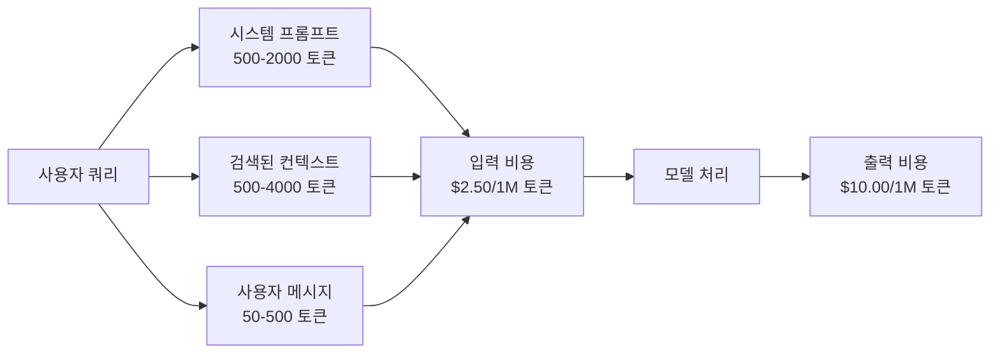
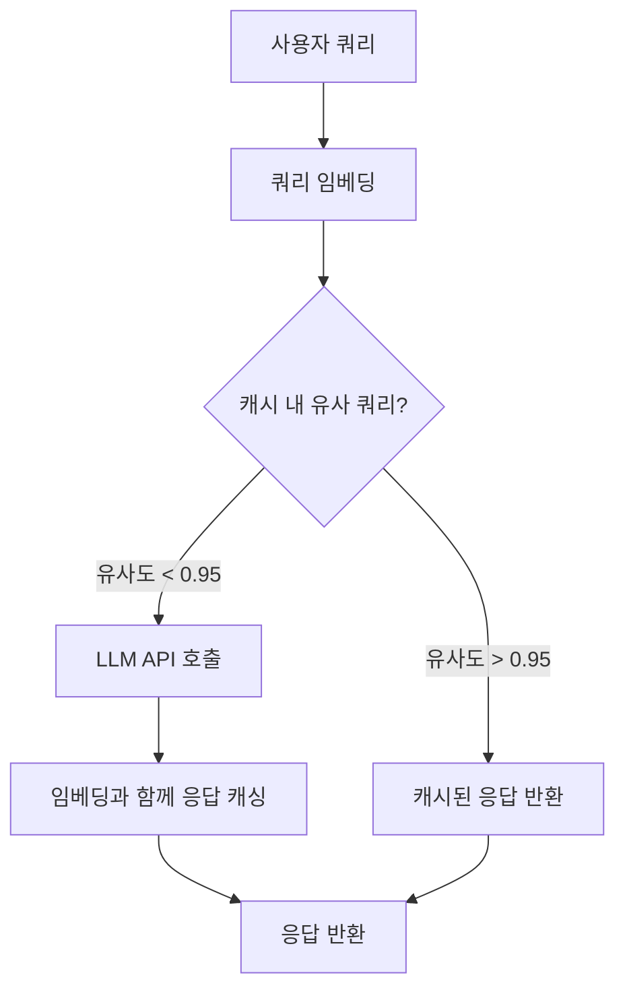
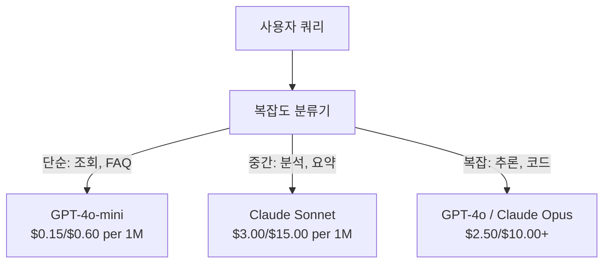

# 캐싱, 요청 제한 및 비용 최적화

> 대부분의 AI 스타트업은 나쁜 모델 때문에 망하지 않습니다. 나쁜 단위 경제 때문에 망합니다. 단일 GPT-4o 호출 비용은 몇 센트 단위입니다. 1만 명의 사용자가 하루에 10번 호출하면 입력 토큰 비용만 $250가 발생합니다 — 단 1달러도 청구하기 전입니다. 생존하는 기업은 모든 API 호출을 함수 호출이 아닌 금융 거래로 취급하는 기업입니다.

**유형:** 구현
**언어:** Python
**사전 요구 사항:** 11단계 09강 (함수 호출)
**소요 시간:** ~45분
**관련:** 11단계 · 15강 (프롬프트 캐싱) — 이 강의에서는 애플리케이션 계층 캐싱(의미 기반 캐시, 정확한 해시 캐시, 모델 라우팅)을 다룹니다. 15강에서는 공급자 계층 프롬프트 캐싱(Anthropic cache_control, OpenAI 자동, Gemini CachedContent)을 다룹니다. 둘 다 결합하면 50-95% 비용 절감이 가능합니다.

## 학습 목표

- 새로운 API 호출 대신 캐시에서 반복되거나 유사한 쿼리를 제공하는 시맨틱 캐싱 구현
- 공급자별 요청 비용 계산 및 토큰 인식 속도 제한 및 예산 경고 구현
- 프롬프트 압축, 모델 라우팅(고비용 vs 저비용), 응답 캐싱을 활용한 비용 최적화 계층 구축
- 다양한 쿼리 유형에 대한 정확한 일치, 시맨틱 유사성, 접두사 캐싱을 사용하는 계층형 캐싱 전략 설계

## 문제

RAG 챗봇을 구축했습니다. 완벽하게 작동합니다. 사용자들도 매우 좋아합니다.

그런 다음 청구서가 도착합니다.

GPT-5는 입력 토큰 100만 개당 $5, 출력 토큰 100만 개당 $15입니다. Claude Opus 4.7은 입력 $15/출력 $75입니다. Gemini 3 Pro는 입력 $1.25/출력 $5입니다. GPT-5-mini는 $0.25/$2입니다. 아래 가격은 예시이며, 항상 제공업체의 최신 가격 페이지를 확인하세요.

다음은 스타트업을 무너뜨리는 계산식입니다:

- 일일 활성 사용자 10,000명
- 사용자당 하루 10회 쿼리
- 쿼리당 1,000개 입력 토큰(시스템 프롬프트 + 컨텍스트 + 사용자 메시지)
- 응답당 500개 출력 토큰

**일일 입력 비용:** 10,000 x 10 x 1,000 / 1,000,000 x $2.50 = **$250/일**  
**일일 출력 비용:** 10,000 x 10 x 500 / 1,000,000 x $10.00 = **$500/일**  
**월간 총액:** **$22,500/월**

이는 LLM 비용만 계산한 것입니다. 임베딩, 벡터 데이터베이스 호스팅, 인프라를 추가하면 챗봇 운영 비용이 **월 $30,000**에 달합니다.

잔인한 점은: 해당 쿼리의 40-60%가 거의 중복된다는 것입니다. 사용자들이 약간 다른 표현으로 같은 질문을 합니다. 모든 요청에서 동일한 시스템 프롬프트가 매번 과금됩니다. RAG로 검색된 컨텍스트 문서도 같은 주제를 묻는 사용자들 사이에서 반복됩니다.

중복 계산에 대해 정가를 지불하고 있는 것입니다.

## 개념

## LLM 호출의 비용 구조

모든 API 호출에는 5가지 비용 구성 요소가 있습니다.



시스템 프롬프트는 소리 없는 비용 유발자입니다. 모든 요청에 포함된 1,500토큰 시스템 프롬프트는 해당 접두사만으로 백만 요청당 $3.75의 비용이 발생합니다. 하루 10만 요청 시 $375/일 — $11,250/월의 비용이 발생하며, 이 텍스트는 절대 변경되지 않습니다.

## 공급자 캐싱: 내장된 할인

2026년 기준 세 주요 공급자 모두 공급자 측 프롬프트 캐싱을 제공하지만 메커니즘은 다릅니다. 심층 분석은 11단계 · 15단계를 참조하십시오.

| 공급자 | 메커니즘 | 할인 | 최소 | 캐시 기간 |
|----------|-----------|----------|---------|----------------|
| Anthropic | 명시적 cache_control 마커 | 캐시 히트 시 90% 할인 (쓰기 시 25% 추가 비용) | 1,024 토큰 (Sonnet/Opus), 2,048 (Haiku) | 기본 5분; 확장 1시간 (2배 쓰기 프리미엄) |
| OpenAI | 자동 접두사 매칭 | 캐시 히트 시 50% 할인 | 1,024 토큰 | 최대 1시간(노력 기반) |
| Google Gemini | 명시적 CachedContent API | ~75% 감소 (저장 비용 추가) | 4,096 (Flash) / 32,768 (Pro) | 사용자 설정 TTL |

**Anthropic의 접근 방식**은 명시적입니다. 프롬프트 섹션에 `cache_control: {"type": "ephemeral"}`을 표시합니다. 첫 요청은 25% 쓰기 프리미엄이 발생합니다. 동일한 접두사를 가진 후속 요청은 90% 할인을 받습니다. 일반적으로 $0.005인 2,000토큰 시스템 프롬프트는 캐시 히트 시 $0.000625로 감소합니다. 10만 요청 시 $437.50/일을 절약할 수 있습니다.

**OpenAI의 접근 방식**은 자동입니다. 이전 요청과 일치하는 프롬프트 접두사는 50% 할인을 받습니다. 마커가 필요 없습니다. 단점은 할인율이 낮고 제어 권한이 없지만 구현 노력이 전혀 필요 없다는 점입니다.

## 의미론적 캐싱: 사용자 정의 계층

공급자 캐싱은 동일한 접두사에만 작동합니다. 의미론적 캐싱은 더 어려운 경우인 동일한 의미를 가진 다른 쿼리를 처리합니다.

"반품 정책은 무엇인가요?"와 "상품을 어떻게 반품하나요?"는 다른 문자열이지만 동일한 의도입니다. 의미론적 캐시는 두 쿼리를 임베딩하고 코사인 유사도를 계산한 후 임계값(일반적으로 0.92-0.95)을 초과하면 캐시된 응답을 반환합니다.



임베딩 비용은 무시할 수 있습니다. OpenAI의 text-embedding-3-small은 백만 토큰당 $0.02입니다. 캐시 확인 비용은 전체 LLM 호출에 비해 거의 없습니다.

## 정확한 캐싱: 해시 및 매칭

결정론적 호출(온도=0, 동일 모델, 동일 프롬프트)의 경우 정확한 캐싱이 더 간단하고 빠릅니다. 전체 프롬프트를 해시하고 캐시를 확인한 후 발견되면 반환합니다.

이 방법은 다음에 완벽하게 작동합니다:
- 시스템 프롬프트 + 고정 컨텍스트 + 동일한 사용자 쿼리
- 동일한 도구 정의를 사용한 함수 호출
- 동일한 문서가 여러 번 처리되는 배치 처리

## 속도 제한: 예산 보호

속도 제한은 공정성뿐만 아니라 생존을 위한 것입니다.

**토큰 버킷 알고리즘:** 각 사용자는 초당 R 비율로 채워지는 N 토큰 버킷을 가집니다. 요청은 버킷에서 토큰을 소비합니다. 버킷이 비어 있으면 요청이 거부됩니다. 이를 통해 버스트(한 번에 전체 버킷 사용)를 허용하면서 평균 속도를 강제할 수 있습니다.

**사용자별 할당량:** 사용자 계층별로 일일/월간 토큰 한도를 설정합니다.

| 계층 | 일일 토큰 한도 | 최대 요청/분 | 모델 접근 |
|------|------------------|------------------|-------------|
| 무료 | 50,000 | 10 | GPT-4o-mini만 |
| 프로 | 500,000 | 60 | GPT-4o, Claude Sonnet |
| 엔터프라이즈 | 5,000,000 | 300 | 모든 모델 |

## 모델 라우팅: 작업에 적합한 모델

모든 쿼리가 GPT-4o를 필요로 하는 것은 아닙니다.

"매장 영업 시간은 언제인가요?"는 $10/M 출력 모델이 필요하지 않습니다. GPT-4o-mini($0.60/M 출력) 또는 Claude Haiku($1.25/M 출력)로 완벽하게 처리할 수 있습니다. 간단한 분류기는 저렴한 쿼리를 저렴한 모델로, 복잡한 쿼리를 비싼 모델로 라우팅합니다.



잘 조정된 라우터는 모델 비용만 40-70% 절약합니다.

## 비용 추적: 지출 위치 파악

측정하지 않으면 최적화할 수 없습니다. 모든 API 호출에 다음을 기록합니다:
- 타임스탬프
- 모델 이름
- 입력 토큰
- 출력 토큰
- 지연 시간(ms)
- 계산된 비용($)
- 사용자 ID
- 캐시 히트/미스
- 요청 범주

이 데이터는 어떤 기능이 비용이 많이 드는지, 어떤 사용자가 많은 토큰을 소비하는지, 캐싱이 가장 큰 영향을 미치는 위치를 보여줍니다.

## 배치 처리: 대량 할인

OpenAI의 배치 API는 비동기적으로 요청을 처리하며 50% 할인을 제공합니다. 최대 50,000개의 요청을 배치로 제출하면 24시간 이내에 결과가 반환됩니다.

배치 처리는 다음에 사용합니다:
- 야간 문서 처리
- 대량 분류
- 평가 실행
- 데이터 보강 파이프라인

실시간 사용자 대면 쿼리에는 적합하지 않습니다(지연 시간이 중요).

## 예산 경고 및 회로 차단기

회로 차단기는 한도에 도달하면 지출을 중지합니다. 없으면 버그나 남용으로 월간 예산을 몇 시간 만에 소진할 수 있습니다.

세 가지 임계값을 설정합니다:
1. **경고** (예산의 70%): 경고 전송
2. **제한** (예산의 85%): 저렴한 모델로만 전환
3. **중지** (예산의 95%): 새 요청 거부, 캐시된 응답만 반환

## 최적화 스택

이 기술들을 순서대로 적용하십시오. 각 계층은 이전 계층 위에 복합적으로 적용됩니다.

| 계층 | 기술 | 일반적인 절감 | 구현 노력 |
|-------|-----------|----------------|----------------------|
| 1 | 공급자 프롬프트 캐싱 | 30-50% | 낮음 (캐시 마커 추가) |
| 2 | 정확한 캐싱 | 10-20% | 낮음 (해시 + 딕셔너리) |
| 3 | 의미론적 캐싱 | 15-30% | 중간 (임베딩 + 유사도) |
| 4 | 모델 라우팅 | 40-70% | 중간 (분류기) |
| 5 | 속도 제한 | 예산 보호 | 낮음 (토큰 버킷) |
| 6 | 프롬프트 압축 | 10-30% | 중간 (프롬프트 재작성) |
| 7 | 배치 처리 | 적격 요청 50% | 낮음 (배치 API) |

1-5계층을 적용한 RAG 앱은 일반적으로 비용을 월 $22,500에서 $4,000-6,000로 절감합니다. 이는 런웨이를 태우는 것과 사업을 구축하는 것의 차이입니다.

## 실제 절감 효과: 최적화 전후

다음은 10,000 DAU를 지원하는 RAG 챗봇의 실제 분석입니다.

| 메트릭 | 최적화 전 | 최적화 후 | 절감 |
|--------|--------------------|--------------------|---------|
| 월간 LLM 비용 | $22,500 | $5,200 | 77% |
| 쿼리당 평균 비용 | $0.0075 | $0.0017 | 77% |
| 캐시 히트율 | 0% | 52% | -- |
| 미니로 라우팅된 쿼리 | 0% | 65% | -- |
| P95 지연 시간 | 2,800ms | 900ms (캐시 히트: 50ms) | 68% |
| 월간 임베딩 비용 | $0 | $180 | (새 비용) |
| 총 월간 비용 | $22,500 | $5,380 | 76% |

의미론적 캐싱을 위한 임베딩 비용($180/월)은 캐시 히트 첫 시간 내에 비용을 상환합니다.

## 구축

## 1단계: 비용 계산기

주요 모델의 현재 가격을 알고 있는 토큰 비용 계산기를 구축합니다.

```python
import hashlib
import time
import json
import math
from dataclasses import dataclass, field


MODEL_PRICING = {
    "gpt-4o": {"input": 2.50, "output": 10.00, "cached_input": 1.25},
    "gpt-4o-mini": {"input": 0.15, "output": 0.60, "cached_input": 0.075},
    "gpt-4.1": {"input": 2.00, "output": 8.00, "cached_input": 0.50},
    "gpt-4.1-mini": {"input": 0.40, "output": 1.60, "cached_input": 0.10},
    "gpt-4.1-nano": {"input": 0.10, "output": 0.40, "cached_input": 0.025},
    "o3": {"input": 2.00, "output": 8.00, "cached_input": 0.50},
    "o3-mini": {"input": 1.10, "output": 4.40, "cached_input": 0.55},
    "o4-mini": {"input": 1.10, "output": 4.40, "cached_input": 0.275},
    "claude-opus-4": {"input": 15.00, "output": 75.00, "cached_input": 1.50},
    "claude-sonnet-4": {"input": 3.00, "output": 15.00, "cached_input": 0.30},
    "claude-haiku-3.5": {"input": 0.80, "output": 4.00, "cached_input": 0.08},
    "gemini-2.5-pro": {"input": 1.25, "output": 10.00, "cached_input": 0.3125},
    "gemini-2.5-flash": {"input": 0.15, "output": 0.60, "cached_input": 0.0375},
}


def calculate_cost(model, input_tokens, output_tokens, cached_input_tokens=0):
    if model not in MODEL_PRICING:
        return {"error": f"알 수 없는 모델: {model}"}
    pricing = MODEL_PRICING[model]
    non_cached = input_tokens - cached_input_tokens
    input_cost = (non_cached / 1_000_000) * pricing["input"]
    cached_cost = (cached_input_tokens / 1_000_000) * pricing["cached_input"]
    output_cost = (output_tokens / 1_000_000) * pricing["output"]
    total = input_cost + cached_cost + output_cost
    return {
        "model": model,
        "input_tokens": input_tokens,
        "output_tokens": output_tokens,
        "cached_input_tokens": cached_input_tokens,
        "input_cost": round(input_cost, 6),
        "cached_input_cost": round(cached_cost, 6),
        "output_cost": round(output_cost, 6),
        "total_cost": round(total, 6),
    }
```

## 2단계: 정확한 캐시

전체 프롬프트를 해시하여 동일한 요청에 대해 캐시된 응답을 반환합니다.

```python
class ExactCache:
    def __init__(self, max_size=1000, ttl_seconds=3600):
        self.cache = {}
        self.max_size = max_size
        self.ttl = ttl_seconds
        self.hits = 0
        self.misses = 0

    def _hash(self, model, messages, temperature):
        key_data = json.dumps({"model": model, "messages": messages, "temperature": temperature}, sort_keys=True)
        return hashlib.sha256(key_data.encode()).hexdigest()

    def get(self, model, messages, temperature=0.0):
        if temperature > 0:
            self.misses += 1
            return None
        key = self._hash(model, messages, temperature)
        if key in self.cache:
            entry = self.cache[key]
            if time.time() - entry["timestamp"] < self.ttl:
                self.hits += 1
                entry["access_count"] += 1
                return entry["response"]
            del self.cache[key]
        self.misses += 1
        return None

    def put(self, model, messages, temperature, response):
        if temperature > 0:
            return
        if len(self.cache) >= self.max_size:
            oldest_key = min(self.cache, key=lambda k: self.cache[k]["timestamp"])
            del self.cache[oldest_key]
        key = self._hash(model, messages, temperature)
        self.cache[key] = {
            "response": response,
            "timestamp": time.time(),
            "access_count": 1,
        }

    def stats(self):
        total = self.hits + self.misses
        return {
            "hits": self.hits,
            "misses": self.misses,
            "hit_rate": round(self.hits / total, 4) if total > 0 else 0,
            "cache_size": len(self.cache),
        }
```

## 3단계: 의미론적 캐시

쿼리를 임베딩하고 유사도가 임계값을 초과할 때 캐시된 응답을 반환합니다.

```python
def simple_embed(text):
    words = text.lower().split()
    vocab = {}
    for w in words:
        vocab[w] = vocab.get(w, 0) + 1
    norm = math.sqrt(sum(v * v for v in vocab.values()))
    if norm == 0:
        return {}
    return {k: v / norm for k, v in vocab.items()}


def cosine_similarity(a, b):
    if not a or not b:
        return 0.0
    all_keys = set(a) | set(b)
    dot = sum(a.get(k, 0) * b.get(k, 0) for k in all_keys)
    return dot


class SemanticCache:
    def __init__(self, similarity_threshold=0.85, max_size=500, ttl_seconds=3600):
        self.entries = []
        self.threshold = similarity_threshold
        self.max_size = max_size
        self.ttl = ttl_seconds
        self.hits = 0
        self.misses = 0

    def get(self, query):
        query_embedding = simple_embed(query)
        now = time.time()
        best_match = None
        best_sim = 0.0
        for entry in self.entries:
            if now - entry["timestamp"] > self.ttl:
                continue
            sim = cosine_similarity(query_embedding, entry["embedding"])
            if sim > best_sim:
                best_sim = sim
                best_match = entry
        if best_match and best_sim >= self.threshold:
            self.hits += 1
            best_match["access_count"] += 1
            return {"response": best_match["response"], "similarity": round(best_sim, 4), "original_query": best_match["query"]}
        self.misses += 1
        return None

    def put(self, query, response):
        if len(self.entries) >= self.max_size:
            self.entries.sort(key=lambda e: e["timestamp"])
            self.entries.pop(0)
        self.entries.append({
            "query": query,
            "embedding": simple_embed(query),
            "response": response,
            "timestamp": time.time(),
            "access_count": 1,
        })

    def stats(self):
        total = self.hits + self.misses
        return {
            "hits": self.hits,
            "misses": self.misses,
            "hit_rate": round(self.hits / total, 4) if total > 0 else 0,
            "cache_size": len(self.entries),
        }
```

## 4단계: 속도 제한기

사용자별 할당량이 있는 토큰 버킷 속도 제한기입니다.

```python
class TokenBucketRateLimiter:
    def __init__(self):
        self.buckets = {}
        self.tiers = {
            "free": {"capacity": 50_000, "refill_rate": 500, "max_requests_per_min": 10},
            "pro": {"capacity": 500_000, "refill_rate": 5_000, "max_requests_per_min": 60},
            "enterprise": {"capacity": 5_000_000, "refill_rate": 50_000, "max_requests_per_min": 300},
        }

    def _get_bucket(self, user_id, tier="free"):
        if user_id not in self.buckets:
            tier_config = self.tiers.get(tier, self.tiers["free"])
            self.buckets[user_id] = {
                "tokens": tier_config["capacity"],
                "capacity": tier_config["capacity"],
                "refill_rate": tier_config["refill_rate"],
                "last_refill": time.time(),
                "request_timestamps": [],
                "max_rpm": tier_config["max_requests_per_min"],
                "tier": tier,
                "total_tokens_used": 0,
            }
        return self.buckets[user_id]

    def _refill(self, bucket):
        now = time.time()
        elapsed = now - bucket["last_refill"]
        refill = int(elapsed * bucket["refill_rate"])
        if refill > 0:
            bucket["tokens"] = min(bucket["capacity"], bucket["tokens"] + refill)
            bucket["last_refill"] = now

    def check(self, user_id, tokens_needed, tier="free"):
        bucket = self._get_bucket(user_id, tier)
        self._refill(bucket)
        now = time.time()
        bucket["request_timestamps"] = [t for t in bucket["request_timestamps"] if now - t < 60]
        if len(bucket["request_timestamps"]) >= bucket["max_rpm"]:
            return {"allowed": False, "reason": "rate_limit", "retry_after_seconds": 60 - (now - bucket["request_timestamps"][0])}
        if bucket["tokens"] < tokens_needed:
            deficit = tokens_needed - bucket["tokens"]
            wait = deficit / bucket["refill_rate"]
            return {"allowed": False, "reason": "token_limit", "tokens_available": bucket["tokens"], "retry_after_seconds": round(wait, 1)}
        return {"allowed": True, "tokens_available": bucket["tokens"]}

    def consume(self, user_id, tokens_used, tier="free"):
        bucket = self._get_bucket(user_id, tier)
        bucket["tokens"] -= tokens_used
        bucket["request_timestamps"].append(time.time())
        bucket["total_tokens_used"] += tokens_used

    def get_usage(self, user_id):
        if user_id not in self.buckets:
            return {"error": "사용자를 찾을 수 없음"}
        b = self.buckets[user_id]
        return {
            "user_id": user_id,
            "tier": b["tier"],
            "tokens_remaining": b["tokens"],
            "capacity": b["capacity"],
            "total_tokens_used": b["total_tokens_used"],
            "utilization": round(b["total_tokens_used"] / b["capacity"], 4) if b["capacity"] else 0,
        }
```

## 5단계: 비용 추적기

모든 호출을 로깅하고 실행 중인 총계를 계산합니다.

```python
class CostTracker:
    def __init__(self, monthly_budget=1000.0):
        self.logs = []
        self.monthly_budget = monthly_budget
        self.alerts = []

    def log_call(self, model, input_tokens, output_tokens, cached_input_tokens=0, latency_ms=0, user_id="anonymous", cache_status="miss"):
        cost = calculate_cost(model, input_tokens, output_tokens, cached_input_tokens)
        entry = {
            "timestamp": time.time(),
            "model": model,
            "input_tokens": input_tokens,
            "output_tokens": output_tokens,
            "cached_input_tokens": cached_input_tokens,
            "latency_ms": latency_ms,
            "cost": cost["total_cost"],
            "user_id": user_id,
            "cache_status": cache_status,
        }
        self.logs.append(entry)
        self._check_budget()
        return entry

    def _check_budget(self):
        total = self.total_cost()
        pct = total / self.monthly_budget if self.monthly_budget > 0 else 0
        if pct >= 0.95 and not any(a["level"] == "stop" for a in self.alerts):
            self.alerts.append({"level": "stop", "message": f"예산 95% 소비됨: ${total:.2f}/${self.monthly_budget:.2f}", "timestamp": time.time()})
        elif pct >= 0.85 and not any(a["level"] == "throttle" for a in self.alerts):
            self.alerts.append({"level": "throttle", "message": f"예산 85% 소비됨: ${total:.2f}/${self.monthly_budget:.2f}", "timestamp": time.time()})
        elif pct >= 0.70 and not any(a["level"] == "warning" for a in self.alerts):
            self.alerts.append({"level": "warning", "message": f"예산 70% 소비됨: ${total:.2f}/${self.monthly_budget:.2f}", "timestamp": time.time()})

    def total_cost(self):
        return round(sum(e["cost"] for e in self.logs), 6)

    def cost_by_model(self):
        by_model = {}
        for e in self.logs:
            m = e["model"]
            if m not in by_model:
                by_model[m] = {"calls": 0, "cost": 0, "input_tokens": 0, "output_tokens": 0}
            by_model[m]["calls"] += 1
            by_model[m]["cost"] = round(by_model[m]["cost"] + e["cost"], 6)
            by_model[m]["input_tokens"] += e["input_tokens"]
            by_model[m]["output_tokens"] += e["output_tokens"]
        return by_model

    def cache_savings(self):
        cache_hits = [e for e in self.logs if e["cache_status"] == "hit"]
        if not cache_hits:
            return {"saved": 0, "cache_hits": 0}
        saved = 0
        for e in cache_hits:
            full_cost = calculate_cost(e["model"], e["input_tokens"], e["output_tokens"])
            saved += full_cost["total_cost"]
        return {"saved": round(saved, 4), "cache_hits": len(cache_hits)}

    def summary(self):
        if not self.logs:
            return {"total_calls": 0, "total_cost": 0}
        total_latency = sum(e["latency_ms"] for e in self.logs)
        cache_hits = sum(1 for e in self.logs if e["cache_status"] == "hit")
        return {
            "total_calls": len(self.logs),
            "total_cost": self.total_cost(),
            "avg_cost_per_call": round(self.total_cost() / len(self.logs), 6),
            "avg_latency_ms": round(total_latency / len(self.logs), 1),
            "cache_hit_rate": round(cache_hits / len(self.logs), 4),
            "cost_by_model": self.cost_by_model(),
            "cache_savings": self.cache_savings(),
            "budget_remaining": round(self.monthly_budget - self.total_cost(), 2),
            "budget_utilization": round(self.total_cost() / self.monthly_budget, 4) if self.monthly_budget > 0 else 0,
            "alerts": self.alerts,
        }
```

## 6단계: 모델 라우터

쿼리를 처리할 수 있는 가장 저렴한 모델로 라우팅합니다.

```python
SIMPLE_KEYWORDS = ["what time", "hours", "address", "phone", "price", "return policy", "hello", "hi", "thanks", "yes", "no"]
COMPLEX_KEYWORDS = ["analyze", "compare", "explain why", "write code", "debug", "architect", "design", "trade-off", "evaluate"]


def classify_complexity(query):
    q = query.lower()
    if len(q.split()) <= 5 or any(kw in q for kw in SIMPLE_KEYWORDS):
        return "simple"
    if any(kw in q for kw in COMPLEX_KEYWORDS):
        return "complex"
    return "medium"


def route_model(query, tier="pro"):
    complexity = classify_complexity(query)
    routing_table = {
        "simple": {"free": "gpt-4.1-nano", "pro": "gpt-4o-mini", "enterprise": "gpt-4o-mini"},
        "medium": {"free": "gpt-4o-mini", "pro": "claude-sonnet-4", "enterprise": "claude-sonnet-4"},
        "complex": {"free": "gpt-4o-mini", "pro": "gpt-4o", "enterprise": "claude-opus-4"},
    }
    model = routing_table[complexity].get(tier, "gpt-4o-mini")
    return {"query": query, "complexity": complexity, "model": model, "tier": tier}
```

## 7단계: 데모 실행

```python
def simulate_llm_call(model, query):
    input_tokens = len(query.split()) * 4 + 500
    output_tokens = 150 + (len(query.split()) * 2)
    latency = 200 + (output_tokens * 2)
    return {
        "model": model,
        "response": f"[시뮬레이션된 {model} 응답: {query[:50]}...]",
        "input_tokens": input_tokens,
        "output_tokens": output_tokens,
        "latency_ms": latency,
    }


def run_demo():
    print("=" * 60)
    print("  캐싱, 속도 제한 및 비용 최적화 데모")
    print("=" * 60)

    print("\n--- 모델 가격 ---")
    for model, pricing in list(MODEL_PRICING.items())[:6]:
        cost_1k = calculate_cost(model, 1000, 500)
        print(f"  {model}: 1K 입력 + 500 출력당 ${cost_1k['total_cost']:.6f}")

    print("\n--- 비용 비교: 100K 요청 ---")
    for model in ["gpt-4o", "gpt-4o-mini", "claude-sonnet-4", "claude-haiku-3.5"]:
        cost = calculate_cost(model, 1000 * 100_000, 500 * 100_000)
        print(f"  {model}: ${cost['total_cost']:.2f}")

    print("\n--- Anthropic 캐시 절감 ---")
    no_cache = calculate_cost("claude-sonnet-4", 2000, 500, 0)
    with_cache = calculate_cost("claude-sonnet-4", 2000, 500, 1500)
    saving = no_cache["total_cost"] - with_cache["total_cost"]
    print(f"  캐시 없음: ${no_cache['total_cost']:.6f}")
    print(f"  1500 캐시된 토큰: ${with_cache['total_cost']:.6f}")
    print(f"  호출당 절감: ${saving:.6f} ({saving/no_cache['total_cost']*100:.1f}%)")

    exact_cache = ExactCache(max_size=100, ttl_seconds=300)
    semantic_cache = SemanticCache(similarity_threshold=0.75, max_size=100)
    rate_limiter = TokenBucketRateLimiter()
    tracker = CostTracker(monthly_budget=100.0)

    print("\n--- 정확한 캐시 ---")
    messages_1 = [{"role": "user", "content": "반품 정책은 무엇인가요?"}]
    result = exact_cache.get("gpt-4o-mini", messages_1, 0.0)
    print(f"  첫 번째 조회: {'HIT' if result else 'MISS'}")
    exact_cache.put("gpt-4o-mini", messages_1, 0.0, "30일 이내에 영수증과 함께 반품할 수 있습니다.")
    result = exact_cache.get("gpt-4o-mini", messages_1, 0.0)
    print(f"  두 번째 조회: {'HIT' if result else 'MISS'} -> {result}")
    result = exact_cache.get("gpt-4o-mini", messages_1, 0.7)
    print(f"  온도=0.7: {'HIT' if result else 'MISS (비결정적, 캐시 건너뜀)'}")
    print(f"  통계: {exact_cache.stats()}")

    print("\n--- 의미론적 캐시 ---")
    test_queries = [
        ("반품 정책은 무엇인가요?", "영수증과 함께 30일 이내에 반품할 수 있습니다."),
        ("물건을 어떻게 반품하나요?", None),
        ("매장 운영 시간은 어떻게 되나요?", "월요일부터 토요일까지 오전 9시부터 오후 9시까지 영업합니다."),
        ("매장은 언제 열리나요?", None),
        ("양자 컴퓨팅에 대해 알려주세요", "양자 컴퓨터는 큐비트를 사용합니다..."),
        ("양자 역학을 설명해주세요", None),
    ]
    for query, response in test_queries:
        cached = semantic_cache.get(query)
        if cached:
            print(f"  '{query[:40]}' -> 캐시 히트 (유사도={cached['similarity']}, 원본='{cached['original_query'][:40]}')")
        elif response:
            semantic_cache.put(query, response)
            print(f"  '{query[:40]}' -> 미스 (저장됨)")
        else:
            print(f"  '{query[:40]}' -> 미스 (일치 없음)")
    print(f"  통계: {semantic_cache.stats()}")

    print("\n--- 속도 제한 ---")
    for i in range(12):
        check = rate_limiter.check("user_1", 1000, "free")
        if check["allowed"]:
            rate_limiter.consume("user_1", 1000, "free")
        status = "OK" if check["allowed"] else f"차단됨 ({check['reason']})"
        if i < 5 or not check["allowed"]:
            print(f"  요청 {i+1}: {status}")
    print(f"  사용량: {rate_limiter.get_usage('user_1')}")

    print("\n--- 모델 라우팅 ---")
    routing_queries = [
        "몇 시에 문을 닫나요?",
        "이번 분기 실적 보고서를 요약해 주세요",
        "마이크로서비스와 모놀리스의 장단점을 분석해 주세요",
        "안녕하세요",
        "리스트 정렬 파이썬 함수를 작성해 주세요",
    ]
    for q in routing_queries:
        route = route_model(q, "pro")
        print(f"  '{q[:50]}' -> {route['model']} ({route['complexity']})")

    print("\n--- 전체 파이프라인: 최적화 전후 ---")
    queries = [
        "반품 정책은 무엇인가요?",
        "물건을 어떻게 반품하나요?",
        "운영 시간은 어떻게 되나요?",
        "언제 문을 여나요?",
        "TCP와 UDP의 차이점을 설명해 주세요",
        "TCP vs UDP 프로토콜을 비교해 주세요",
        "안녕하세요",
        "전화번호가 무엇인가요?",
        "리스트 정렬 파이썬 함수를 작성해 주세요",
        "서버리스 아키텍처의 장단점을 분석해 주세요",
    ]

    print("\n  [이전: 캐시 없음, 단일 모델 (gpt-4o)]")
    tracker_before = CostTracker(monthly_budget=1000.0)
    for q in queries:
        result = simulate_llm_call("gpt-4o", q)
        tracker_before.log_call("gpt-4o", result["input_tokens"], result["output_tokens"], latency_ms=result["latency_ms"], cache_status="miss")
    before = tracker_before.summary()
    print(f"  총 비용: ${before['total_cost']:.6f}")
    print(f"  호출당 평균 비용: ${before['avg_cost_per_call']:.6f}")
    print(f"  평균 지연 시간: {before['avg_latency_ms']}ms")

    print("\n  [이후: 캐싱 + 라우팅 + 속도 제한]")
    exact_c = ExactCache()
    semantic_c = SemanticCache(similarity_threshold=0.75)
    tracker_after = CostTracker(monthly_budget=1000.0)

    for q in queries:
        messages = [{"role": "user", "content": q}]
        cached = exact_c.get("gpt-4o", messages, 0.0)
        if cached:
            tracker_after.log_call("gpt-4o-mini", 0, 0, latency_ms=5, cache_status="hit")
            continue
        sem_cached = semantic_c.get(q)
        if sem_cached:
            tracker_after.log_call("gpt-4o-mini", 0, 0, latency_ms=15, cache_status="hit")
            continue
        route = route_model(q)
        result = simulate_llm_call(route["model"], q)
        tracker_after.log_call(route["model"], result["input_tokens"], result["output_tokens"], latency_ms=result["latency_ms"], cache_status="miss")
        exact_c.put(route["model"], messages, 0.0, result["response"])
        semantic_c.put(q, result["response"])

    after = tracker_after.summary()
    print(f"  총 비용: ${after['total_cost']:.6f}")
    print(f"  호출당 평균 비용: ${after['avg_cost_per_call']:.6f}")
    print(f"  평균 지연 시간: {after['avg_latency_ms']}ms")
    print(f"  캐시 히트율: {after['cache_hit_rate']:.0%}")

    if before["total_cost"] > 0:
        savings_pct = (1 - after["total_cost"] / before["total_cost"]) * 100
        print(f"\n  절감: {savings_pct:.1f}% 비용 감소")
        print(f"  지연 시간 개선: {(1 - after['avg_latency_ms'] / before['avg_latency_ms']) * 100:.1f}% 더 빠름")

    print("\n--- 예산 경고 데모 ---")
    alert_tracker = CostTracker(monthly_budget=0.01)
    for i in range(5):
        alert_tracker.log_call("gpt-4o", 5000, 2000, latency_ms=500)
    print(f"  총 지출: ${alert_tracker.total_cost():.6f} / ${alert_tracker.monthly_budget}")
    for alert in alert_tracker.alerts:
        print(f"  경고 [{alert['level'].upper()}]: {alert['message']}")

    print("\n--- 모델별 비용 분석 ---")
    multi_tracker = CostTracker(monthly_budget=500.0)
    for _ in range(50):
        multi_tracker.log_call("gpt-4o-mini", 800, 200, latency_ms=150)
    for _ in range(30):
        multi_tracker.log_call("claude-sonnet-4", 1500, 500, latency_ms=400)
    for _ in range(10):
        multi_tracker.log_call("gpt-4o", 2000, 800, latency_ms=600)
    for _ in range(10):
        multi_tracker.log_call("claude-opus-4", 3000, 1000, latency_ms=1200)
    breakdown = multi_tracker.cost_by_model()
    for model, data in sorted(breakdown.items(), key=lambda x: x[1]["cost"], reverse=True):
        print(f"  {model}: {data['calls']} 호출, ${data['cost']:.6f}, {data['input_tokens']:,} 입력 / {data['output_tokens']:,} 출력")
    print(f"  총계: ${multi_tracker.total_cost():.6f}")

    print("\n" + "=" * 60)
    print("  데모 완료.")
    print("=" * 60)


if __name__ == "__main__":
    run_demo()
```

## 사용 방법

## Anthropic 프롬프트 캐싱

```python
# import anthropic
# client = anthropic.Anthropic()
# response = client.messages.create(
#     model="claude-sonnet-4-20250514",
#     max_tokens=1024,
#     system=[
#         {
#             "type": "text",
#             "text": "You are a helpful customer support agent for Acme Corp...",
#             "cache_control": {"type": "ephemeral"},
#         }
#     ],
#     messages=[{"role": "user", "content": "What is the return policy?"}],
# )
# print(f"Input tokens: {response.usage.input_tokens}")
# print(f"Cache creation tokens: {response.usage.cache_creation_input_tokens}")
# print(f"Cache read tokens: {response.usage.cache_read_input_tokens}")
```

첫 번째 호출은 캐시에 기록됩니다(25% 프리미엄). 동일한 시스템 프롬프트 접두사를 사용하는 모든 후속 호출은 캐시에서 읽힙니다(90% 할인). 캐시는 5분 동안 유지되며, 히트 시 타이머가 재설정됩니다.

## OpenAI 자동 캐싱

```python
# from openai import OpenAI
# client = OpenAI()
# response = client.chat.completions.create(
#     model="gpt-4o",
#     messages=[
#         {"role": "system", "content": "You are a helpful customer support agent..."},
#         {"role": "user", "content": "What is the return policy?"},
#     ],
# )
# print(f"Prompt tokens: {response.usage.prompt_tokens}")
# print(f"Cached tokens: {response.usage.prompt_tokens_details.cached_tokens}")
# print(f"Completion tokens: {response.usage.completion_tokens}")
```

OpenAI는 자동으로 캐싱합니다. 최근 요청과 일치하는 1,024+ 토큰의 프롬프트 접두사는 50% 할인을 받습니다. 코드 변경 없이 응답의 `prompt_tokens_details.cached_tokens`를 확인하여 작동 여부를 확인할 수 있습니다.

## OpenAI 배치 API

```python
# import json
# from openai import OpenAI
# client = OpenAI()
# requests = []
# for i, query in enumerate(queries):
#     requests.append({
#         "custom_id": f"request-{i}",
#         "method": "POST",
#         "url": "/v1/chat/completions",
#         "body": {
#             "model": "gpt-4o-mini",
#             "messages": [{"role": "user", "content": query}],
#         },
#     })
# with open("batch_input.jsonl", "w") as f:
#     for r in requests:
#         f.write(json.dumps(r) + "\n")
# batch_file = client.files.create(file=open("batch_input.jsonl", "rb"), purpose="batch")
# batch = client.batches.create(input_file_id=batch_file.id, endpoint="/v1/chat/completions", completion_window="24h")
# print(f"Batch ID: {batch.id}, Status: {batch.status}")
```

배치 API는 모든 토큰에 대해 50% 할인을 제공합니다. 결과는 24시간 이내에 도착합니다. 실시간 처리가 필요 없는 작업(평가, 데이터 라벨링, 대량 요약)에 적합합니다.

## Redis를 활용한 프로덕션 시맨틱 캐시

```python
# import redis
# import numpy as np
# from openai import OpenAI
# r = redis.Redis()
# client = OpenAI()
# def get_embedding(text):
#     response = client.embeddings.create(model="text-embedding-3-small", input=text)
#     return response.data[0].embedding
# def semantic_cache_lookup(query, threshold=0.95):
#     query_emb = np.array(get_embedding(query))
#     keys = r.keys("cache:emb:*")
#     best_sim, best_key = 0, None
#     for key in keys:
#         stored_emb = np.frombuffer(r.get(key), dtype=np.float32)
#         sim = np.dot(query_emb, stored_emb) / (np.linalg.norm(query_emb) * np.linalg.norm(stored_emb))
#         if sim > best_sim:
#             best_sim, best_key = sim, key
#     if best_sim >= threshold and best_key:
#         response_key = best_key.decode().replace("cache:emb:", "cache:resp:")
#         return r.get(response_key).decode()
#     return None
```

프로덕션 환경에서는 선형 스캔을 벡터 인덱스(Redis Vector Search, Pinecone, pgvector)로 대체해야 합니다. 선형 스캔은 1,000개 미만의 항목에 대해 작동합니다. 그 이상의 경우 O(log n) 조회를 위해 ANN(근사 최근접 이웃)을 사용하세요.

## Ship It

이 레슨은 `outputs/prompt-cost-optimizer.md`를 생성합니다. 이 파일은 LLM 애플리케이션을 분석하고 예상 절감액과 함께 구체적인 비용 최적화 방안을 추천하는 재사용 가능한 프롬프트입니다.

또한 `outputs/skill-cost-patterns.md`를 생성합니다. 이 파일은 사용 사례에 적합한 캐싱 전략, 요청 제한(rate limiting) 구성, 모델 라우팅 규칙을 선택하기 위한 의사 결정 프레임워크입니다.

## 연습 문제

1. **의미 캐시에 LRU 교체 정책 구현.** 가장 오래된 항목부터 교체하는 방식을 최소 최근 사용(LRU) 방식으로 대체합니다. 각 항목의 마지막 접근 시간을 추적하고, 캐시가 가득 찼을 때 가장 오래된 접근 시간을 가진 항목을 교체합니다. 100개의 쿼리를 대상으로 두 전략 간 히트율을 비교합니다.

2. **비용 예측 도구 구축.** API 호출 로그(CostTracker 로그)를 기반으로 최근 7일 평균을 사용하여 월간 비용을 예측합니다. 평일/주말 패턴을 고려합니다. 예상 월간 비용이 예산을 20% 이상 초과할 경우 경고를 트리거합니다.

3. **계층형 의미 캐싱 구현.** 두 가지 유사도 임계값을 사용합니다: 0.98은 고신뢰 히트(즉시 반환), 0.90은 중신뢰 히트("유사한 이전 질문을 기반으로 한 답변입니다"라는 설명과 함께 반환). 각 히트가 어떤 계층에서 발생했는지 추적하고 사용자 만족도 차이를 측정합니다.

4. **모델 라우팅 분류기 구축.** 키워드 기반 분류기를 임베딩 기반 분류기로 대체합니다. 50개의 레이블이 지정된 쿼리(단순/중간/복잡)를 임베딩한 후, 새로운 쿼리를 가장 가까운 레이블 예제와 비교하여 분류합니다. 20개의 테스트 쿼리 세트를 대상으로 분류 정확도를 측정합니다.

5. **단계적 장애 조치 회로 차단기 구현.** 예산의 70%에서 경고 로그를 기록합니다. 85%에서 모든 라우팅을 가장 저렴한 모델(gpt-4o-mini)로 자동 전환합니다. 95%에서 캐시된 응답만 제공하고 새 쿼리는 거부합니다. $1.00 예산에 대해 1,000개의 요청을 시뮬레이션하여 각 임계값이 올바르게 트리거되는지 검증합니다.

## 주요 용어

| 용어 | 사람들이 말하는 표현 | 실제 의미 |
|------|----------------|----------------------|
| 프롬프트 캐싱 | "시스템 프롬프트 캐싱" | 공급자 수준의 캐싱으로, 반복되는 프롬프트 접두사에 할인 적용 (Anthropic 90%, OpenAI 50%) -- OpenAI는 코드 변경 불필요, Anthropic은 명시적 마커 필요 |
| 시맨틱 캐싱 | "스마트 캐싱" | 쿼리 임베딩 후 과거 쿼리와의 유사도 계산, 임계값 초과 시 캐시된 응답 반환 -- 정확한 매칭이 놓치는 의역 포착 |
| 정확한 캐싱 | "해시 캐싱" | 전체 프롬프트(해시 + 메시지 + 온도) 해싱 후 동일한 입력에 캐시된 응답 반환 -- 온도=0의 결정적 호출에만 작동 |
| 토큰 버킷 | "속도 제한기" | 각 사용자에게 초당 R 비율로 재충전되는 N 토큰 버킷을 가진 알고리즘 -- N까지 버스트 허용하면서 평균 속도 R 강제 |
| 모델 라우팅 | "저렴한 라우팅" | 분류기를 사용해 단순 쿼리는 저렴한 모델(GPT-4o-mini, Haiku)로, 복잡한 쿼리는 비싼 모델(GPT-4o, Opus)로 전송 -- 모델 비용 40-70% 절감 |
| 비용 추적 | "측정" | 모든 API 호출을 모델, 토큰, 지연 시간, 비용, 사용자 ID와 함께 로깅해 자금 사용처와 고비용 기능 정확히 파악 |
| 서킷 브레이커 | "킬 스위치" | 예산 한도에 근접 시 서비스 자동 저하(더 저렴한 모델, 캐시 전용) 또는 요청 완전 중단 |
| 배치 API | "대량 할인" | OpenAI의 비동기 처리로 50% 할인 -- 최대 50,000개 요청 제출, 24시간 내 결과 수신 |
| 프롬프트 압축 | "토큰 다이어트" | 의미 유지하면서 시스템 프롬프트와 컨텍스트를 더 적은 토큰으로 재작성 -- 짧은 프롬프트는 비용 절감 및 성능 향상 |
| 캐시 히트율 | "캐시 효율성" | LLM 호출 대신 캐시에서 처리된 요청 비율 -- 프로덕션 챗봇의 일반적 수치는 40-60%, 비용 절감 효과 비례 |

## 추가 자료

- [Anthropic 프롬프트 캐싱 가이드](https://docs.anthropic.com/en/docs/build-with-claude/prompt-caching) -- Anthropic의 명시적 `cache_control` 마커, 가격 정책, 캐시 수명 동작에 대한 공식 문서
- [OpenAI 프롬프트 캐싱](https://platform.openai.com/docs/guides/prompt-caching) -- OpenAI의 자동 캐싱, 사용량 필드를 통한 캐시 히트 확인 방법, 최소 접두사 길이
- [OpenAI 배치 API](https://platform.openai.com/docs/guides/batch) -- 비동기 처리 시 50% 할인, JSONL 형식, 24시간 처리 창, 50K 요청 제한
- [GPTCache](https://github.com/zilliztech/GPTCache) -- 여러 임베딩 백엔드, 벡터 저장소, 교체 정책을 지원하는 오픈소스 시맨틱 캐싱 라이브러리
- [Martian 모델 라우터](https://docs.withmartian.com) -- 각 쿼리를 처리할 수 있는 가장 저렴한 모델을 자동으로 선택하는 프로덕션 모델 라우팅
- [Not Diamond](https://www.notdiamond.ai) -- 트래픽 패턴을 학습하여 공급자 간 비용/품질 트레이드오프를 최적화하는 ML 기반 모델 라우터
- [Helicone](https://www.helicone.ai) -- 프록시 계층으로 비용 추적, 캐싱, 속도 제한, 예산 알림을 제공하는 LLM 관측 가능성 플랫폼
- [Dean & Barroso, "대규모 시스템에서의 테일(The Tail at Scale)" (CACM 2013)](https://research.google/pubs/the-tail-at-scale/) -- 지연 시간, 처리량, TTFT/TPOT 백분위수, 헤징 요청; "P95를 충족하는 가장 저렴한 모델 선택" 비용 모델 배경
- [Kwon et al., "페이징 어텐션을 활용한 대규모 언어 모델 서빙을 위한 효율적 메모리 관리" (SOSP 2023)](https://arxiv.org/abs/2309.06180) -- vLLM 논문; 페이징 KV-캐시 + 연속 배칭이 처리량에서 순진한 서버를 24배 능가하는 이유, "캐싱과 비용"의 인프라 계층
- [Dao et al., "FlashAttention-2: 더 나은 병렬화 및 작업 분할을 통한 빠른 어텐션" (ICLR 2024)](https://arxiv.org/abs/2307.08691) -- 프롬프트 캐싱과 직교하는 커널 수준 비용 절감; 추측 디코딩 및 GQA와 함께 읽어 전체 비용 곡선 파악.