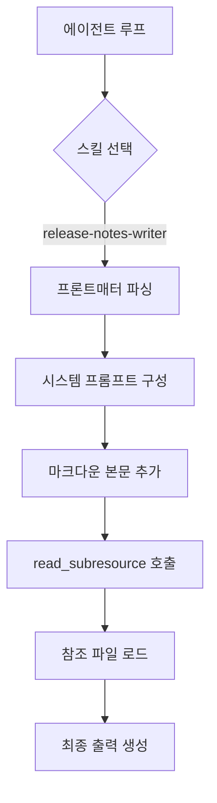

# 기술(Skills)과 에이전트 SDK — Anthropic 기술(Skills), AGENTS.md, OpenAI 앱 SDK

> MCP는 "어떤 도구가 존재하는가"를 말합니다. 기술(Skills)은 "작업을 어떻게 수행하는가"를 말합니다. 2026년 스택 레이어는 이 둘을 모두 포함합니다. Anthropic의 에이전트 기술(Skills) (2025년 12월 공개된 개방형 표준)은 점진적 공개(progressive disclosure) 방식으로 SKILL.md로 제공됩니다. OpenAI의 앱 SDK는 MCP에 위젯 메타데이터를 추가한 것입니다. AGENTS.md(현재 60,000개 이상의 리포지토리에 존재)는 프로젝트 수준의 에이전트 컨텍스트로 리포지토리 루트에 위치합니다. 이 강의에서는 각각이 다루는 내용을 명명하고, 에이전트 간 이동이 가능한 최소한의 SKILL.md + AGENTS.md 번들을 구축합니다.

**유형:** 학습
**언어:** Python (표준 라이브러리, SKILL.md 파서 및 로더)
**선수 조건:** 13단계 · 07 (MCP 서버)
**소요 시간:** ~45분

## 학습 목표

- 세 가지 계층 구분: **AGENTS.md** (프로젝트 컨텍스트), **SKILL.md** (재사용 가능한 노하우), **MCP** (도구).
- YAML 프론트매터와 점진적 공개(progressive disclosure)를 적용한 **SKILL.md** 작성.
- 에이전트 런타임에 파일 시스템 방식으로 스킬 로드.
- MCP 서버와 **AGENTS.md**로 스킬을 구성하여 하나의 패키지가 **Claude Code**, **Cursor**, **Codex**에서 작동하도록 조합.

## 문제

한 엔지니어가 릴리스 노트 작성 워크플로우를 다단계 프롬프트로 정리합니다: "최신 병합된 PR(풀 리퀘스트)을 읽어. 영역별로 그룹화해. 각각을 요약해. 팀 스타일대로 변경 로그 항목을 작성해. Slack 초안으로 게시해." 그리고 이를 팀용 Notion 문서에 저장합니다.

이제 이 워크플로우를 Claude Code, Cursor, Codex CLI에서 사용하려고 합니다. 각 에이전트는 지시사항을 로드하는 방식이 다릅니다: Claude Code는 슬래시 명령어, Cursor는 규칙, Codex는 `.codex.md` 파일을 사용합니다. 엔지니어는 워크플로우를 세 번 복사해 세 개의 복사본을 유지합니다.

**AGENTS.md**와 **SKILL.md**는 이 문제를 해결합니다:

- **AGENTS.md**는 리포지토리 루트에 위치합니다. 모든 호환 가능한 에이전트는 세션 시작 시 이를 읽습니다. "이 프로젝트는 어떻게 작동하나요? 관례는 무엇인가요? 어떤 명령어로 테스트를 실행하나요?"
- **SKILL.md**는 휴대용 번들입니다: YAML 프론트매터(이름, 설명) + 마크다운 본문 + 선택적 리소스. 스킬을 지원하는 에이전트는 필요 시 이름으로 로드합니다.
- **MCP**(Phase 13 · 06-14)는 스킬이 호출해야 하는 도구들을 처리합니다.

세 개의 계층, 하나의 휴대용 아티팩트.

## 개념

### AGENTS.md (agents.md)

2025년 말에 출시되어 2026년 4월까지 60,000+ 리포지토리에서 채택되었습니다. 리포지토리 루트에 하나의 파일로 존재합니다. 형식:

```markdown
# 프로젝트: my-service

```

## 규칙
- 엄격한 모드(strict mode)의 TypeScript 사용.
- Python 측 모델에는 Pydantic 사용.
- 테스트는 `pnpm test`로 실행.

## 빌드 및 실행
- 로컬 개발 서버 실행: `pnpm dev`
- 프로덕션 번들 생성: `pnpm build`

에이전트는 세션 시작 시 이 내용을 읽고 해당 프로젝트에 대한 행동을 조정합니다. 2026년의 모든 코딩 에이전트(Claude Code, Cursor, Codex, Copilot Workspace, opencode, Windsurf, Zed)는 AGENTS.md를 지원합니다.

### SKILL.md 형식

Anthropic의 에이전트 기술(2025년 12월 오픈 표준으로 공개):

```markdown
---
name: release-notes-writer
description: 이 프로젝트의 스타일 가이드를 따라 최신 병합된 PR에 대한 변경 로그 항목을 작성합니다.
---

# 릴리스 노트 작성자

호출 시 다음 단계를 실행합니다:

1. 마지막 태그 이후 병합된 PR 목록을 확인합니다. `gh pr list --base main --state merged` 명령어 사용.
2. 라벨별로 그룹화: feature, fix, chore, docs.
3. 각 그룹의 PR마다 한 줄씩 작성: `- <제목> (#<번호>)`.
4. 릴리스 노트를 작성하고 CHANGELOG.md에 스테이징합니다.

사용자가 "ship"이라고 입력하면 `git tag vX.Y.Z` 및 `gh release create`를 실행합니다.

```

## 참고 사항

- PR 없이 커밋을 포함하지 마세요.
- 공개 변경 로그에서 "chore" 항목은 건너뜁니다.

```

프런트매터는 스킬의 정체성을 선언합니다. 본문은 스킬이 로드될 때 모델에 표시되는 프롬프트입니다.

### 점진적 공개

스킬은 에이전트가 필요할 때만 가져오는 하위 리소스를 참조할 수 있습니다. 예시:

```
skills/
  release-notes-writer/
    SKILL.md
    style-guide.md
    template.md
    scripts/
      generate.sh
```

SKILL.md는 "스타일 규칙은 style-guide.md를 참조하세요"라고 명시합니다. 에이전트는 스킬이 활발히 실행 중일 때만 style-guide.md를 가져옵니다. 이렇게 하면 모델이 필요로 하지 않을 수 있는 세부 정보로 프롬프트가 비대해지는 것을 방지할 수 있습니다.

### 파일 시스템 검색

에이전트 런타임은 알려진 디렉토리에서 SKILL.md 파일을 스캔합니다:

- `~/.anthropic/skills/*/SKILL.md`
- 프로젝트 `./skills/*/SKILL.md`
- `~/.claude/skills/*/SKILL.md`

로딩은 폴더 이름과 프런트매터의 `name`을 기준으로 이루어집니다. Claude Code, Anthropic Claude Agent SDK, SkillKit(크로스 에이전트) 모두 이 패턴을 따릅니다.

### Anthropic Claude Agent SDK

`@anthropic-ai/claude-agent-sdk` (TypeScript)와 `claude-agent-sdk` (Python)는 세션 시작 시 스킬을 로드하고, 런타임 내부에서 호출 가능한 "에이전트"로 노출합니다. 에이전트 루프는 사용자가 스킬을 호출할 때 해당 스킬로 디스패치합니다.

### OpenAI Apps SDK

2025년 10월 출시; MCP 위에 직접 구축되었습니다. OpenAI의 이전 커넥터와 커스텀 GPT 액션을 단일 개발자 인터페이스로 통합합니다. Apps SDK 앱은 다음과 같습니다:

- MCP 서버(도구, 리소스, 프롬프트).
- ChatGPT UI를 위한 위젯 메타데이터 추가.
- 대화형 표면을 위한 선택적 MCP Apps `ui://` 리소스.

동일한 프로토콜, 더 풍부한 UX.

### SkillKit을 통한 크로스 에이전트 이식성

SkillKit 및 유사한 크로스 에이전트 배포 계층 도구는 단일 SKILL.md를 32개 이상의 AI 에이전트(Claude Code, Cursor, Codex, Gemini CLI, OpenCode 등)의 네이티브 형식으로 변환합니다. 하나의 소스 오브 트루스; 다양한 소비자.

### 3계층 스택

| 계층 | 파일 | 로드 시점 | 목적 |
|-------|------|-------------|---------|
| AGENTS.md | 리포지토리 루트 | 세션 시작 | 프로젝트 수준 규칙 |
| SKILL.md | skills 디렉토리 | 스킬 호출 시 | 재사용 가능한 워크플로우 |
| MCP 서버 | 외부 프로세스 | 도구 필요 시 | 호출 가능한 액션 |

세 가지 모두 조합됩니다: 에이전트는 세션 시작 시 AGENTS.md를 읽고, 사용자가 스킬을 호출하면 스킬의 지침에 MCP 도구 호출이 포함되며, 에이전트는 MCP 클라이언트를 통해 디스패치합니다.

## 사용 방법

`code/main.py`는 표준 라이브러리 SKILL.md 파서와 로더를 포함합니다. `./skills/` 하위 디렉터리에서 스킬을 탐색하고, YAML 프론트매터와 마크다운 본문을 파싱하여 스킬 이름을 키로 하는 딕셔너리를 생성합니다. 그런 다음 `release-notes-writer`를 이름으로 호출하는 에이전트 루프를 시뮬레이션합니다.

확인해야 할 사항:

- 최소한의 표준 라이브러리 파서로 파싱된 YAML 프론트매터(`pyyaml` 의존성 없음)
- 스킬 본문은 그대로 저장되며, 에이전트 호출 시 시스템 프롬프트 앞에 추가됩니다.
- `read_subresource` 함수를 통해 참조된 파일을 온디맨드로 가져오는 점진적 공개(Progressive Disclosure) 데모



## Ship It

이 레슨은 `outputs/skill-agent-bundle.md`를 생성합니다. 워크플로우가 주어지면, 스킬은 SKILL.md + AGENTS.md + MCP-server-blueprint 번들을 생성하며, 이는 에이전트 간에 이식 가능합니다.

## 연습 문제

1. `code/main.py`를 실행하세요. `skills/` 아래에 두 번째 스킬(skill)을 추가하고 로더가 이를 정상적으로 인식하는지 확인하세요.

2. 이 코스 리포지토리를 위한 AGENTS.md를 작성하세요. 테스트 명령어, 스타일 규칙, 그리고 Phase 13 정신 모델(mental model)을 포함하세요.

3. 팀 내부 문서에 있는 다단계 워크플로우를 SKILL.md로 이식하세요. Claude Code에서 정상적으로 로드되는지 검증하세요.

4. 해당 스킬을 Cursor와 Codex의 네이티브 규칙 형식으로 수동 변환하세요. 형식 간 차이(diff)를 계산하세요 — 이것이 SkillKit이 자동화하는 번역 표면(translation surface)입니다.

5. Anthropic 에이전트 스킬 블로그 포스트를 읽으세요. 이번 레슨의 로더가 다루지 않는 Claude 에이전트 SDK의 한 가지 기능(힌트: 에이전트 하위 호출(sub-invocation))을 식별하세요.

## 주요 용어

| 용어 | 사람들이 말하는 표현 | 실제 의미 |
|------|----------------|------------------------|
| SKILL.md | "스킬 파일" | 에이전트 런타임에서 로드되는 YAML 프론트매터 + 마크다운 본문 |
| AGENTS.md | "리포지토리 루트 에이전트 컨텍스트" | 세션 시작 시 읽히는 프로젝트 수준 규칙 파일 |
| 점진적 노출 | "지연 로딩 서브 리소스" | 스킬 본문이 필요할 때만 참조하는 파일 |
| 프론트매터 | "상단의 YAML 블록" | `---` 구분자 내의 메타데이터(이름, 설명) |
| Claude Agent SDK | "Anthropic의 스킬 런타임" | `@anthropic-ai/claude-agent-sdk`, 스킬 로드 및 라우팅 담당 |
| OpenAI Apps SDK | "MCP + 위젯 메타" | MCP 기반 OpenAI 개발 환경 + ChatGPT UI 연동 |
| 스킬 발견 | "파일 시스템 스캔" | SKILL.md를 찾기 위해 알려진 디렉토리 탐색, 이름으로 키 생성 |
| 에이전트 간 이식성 | "하나의 스킬을 여러 에이전트에" | SkillKit 스타일 도구를 통해 하나의 SKILL.md를 32개 이상의 에이전트로 변환 |
| 에이전트 스킬 | "이식 가능한 노하우" | MCP의 도구 개념 외부에서 재사용 가능한 작업 템플릿 |
| Apps SDK | "MCP + ChatGPT UI" | 커넥터와 커스텀 GPT가 MCP에서 통합됨 |

## 추가 자료

- [Anthropic — 에이전트 스킬 발표](https://www.anthropic.com/engineering/equipping-agents-for-the-real-world-with-agent-skills) — 2025년 12월 출시
- [Anthropic — 에이전트 스킬 문서](https://platform.claude.com/docs/en/agents-and-tools/agent-skills/overview) — SKILL.md 형식 참조
- [OpenAI — 앱 SDK](https://developers.openai.com/apps-sdk) — ChatGPT용 MCP 기반 개발자 플랫폼
- [agents.md](https://agents.md/) — AGENTS.md 형식 및 채택 목록
- [Anthropic — anthropics/skills GitHub](https://github.com/anthropics/skills) — 공식 스킬 예제