# 통신 프로토콜

> 같은 언어를 말하지 못하는 에이전트들은 팀이 아닙니다. 그들은 공허 속으로 소리치는 낯선 사람들일 뿐입니다.

**유형:** 구축
**언어:** TypeScript
**선수 조건:** 14단계 (에이전트 엔지니어링), 16.01강 (멀티-에이전트 이유)
**소요 시간:** ~120분

## 학습 목표

- 외부 서버에서 노출된 도구를 에이전트가 사용할 수 있도록 MCP 도구 검색 및 호출 구현
- HTTP를 통해 한 에이전트가 다른 에이전트에게 작업을 위임할 수 있는 A2A 에이전트 카드 및 작업 엔드포인트 구축
- MCP(도구 접근), A2A(에이전트 간 통신), ACP(기업 감사), ANP(분산 신뢰) 프로토콜 비교 및 각 프로토콜이 해결하는 문제 설명
- 에이전트가 MCP를 통해 도구를 검색하고 A2A를 통해 작업을 위임하는 단일 시스템에서 여러 프로토콜을 연동하는 방법 학습

## 문제

시스템을 여러 에이전트(연구자, 코더, 검토자)로 분할했습니다. 각 에이전트는 개별 작업에 탁월합니다. 하지만 이제 이들이 실제로 서로 통신해야 합니다.

첫 번째 시도는 당연했습니다: 문자열을 전달하는 것입니다. 연구자가 텍스트 덩어리를 반환하면 코더가 어떻게든 이를 파싱합니다. 코더가 연구 요약을 잘못 해석하거나, 두 에이전트가 서로를 기다리며 교착 상태에 빠지거나, 다른 팀이 구축한 에이전트들이 협업해야 할 때까지 이 방식은 작동합니다. 갑자기 "문자열만 전달"하는 접근법이 무너집니다.

이것이 통신 프로토콜 문제입니다. 에이전트 간 정보 교환 방식에 대한 공유된 계약(contract)이 없으면, 다중 에이전트 시스템은 취약하고, 감사할 수 없으며, 직접 작성한 소수의 에이전트를 넘어서는 확장이 불가능합니다.

AI 생태계는 이 문제의 다양한 측면을 해결하는 네 가지 프로토콜을 제시했습니다:

- **도구 접근을 위한 MCP**
- **에이전트 간 협업을 위한 A2A**
- **기업 감사 기능을 위한 ACP**
- **분산 신원 및 신뢰를 위한 ANP**

이 강의에서는 각 사양의 실제 와이어 포맷을 분석하고, 작동하는 구현을 구축하며, 네 가지 프로토콜을 통합 시스템으로 연결하는 방법을 심층적으로 다룹니다.

## 개념

### 프로토콜 환경

이 네 가지 프로토콜을 계층으로 생각해 보세요. 각각 다른 수준의 문제를 해결합니다:

```mermaid
block-beta
  columns 1
  block:ANP["ANP — 에이전트는 어떻게 낯선 사람을 신뢰할까?\n분산 신원(DID), E2EE, 메타 프로토콜"]
  end
  block:A2A["A2A — 에이전트는 어떻게 목표를 위해 협력할까?\n에이전트 카드, 작업 라이프사이클, 스트리밍, 협상"]
  end
  block:ACP["ACP — 에이전트는 어떻게 감사 가능한 시스템에서 대화할까?\n실행, 궤적 메타데이터, 세션 연속성"]
  end
  block:MCP["MCP — 에이전트는 어떻게 도구를 사용할까?\n도구 발견, 실행, 컨텍스트 공유"]
  end

  style ANP fill:#f3e8ff,stroke:#7c3aed
  style A2A fill:#dbeafe,stroke:#2563eb
  style ACP fill:#fef3c7,stroke:#d97706
  style MCP fill:#d1fae5,stroke:#059669
```

이들은 경쟁자가 아닙니다. 서로 다른 수준의 문제를 해결합니다.

### MCP (요약)

MCP는 13단계에서 깊이 다룹니다. 간단히 요약하면, MCP는 LLM이 외부 도구 및 데이터 소스에 연결하는 방법을 표준화합니다. 에이전트(클라이언트)가 서버가 노출하는 도구를 발견하고 호출하는 **클라이언트-서버** 프로토콜입니다.

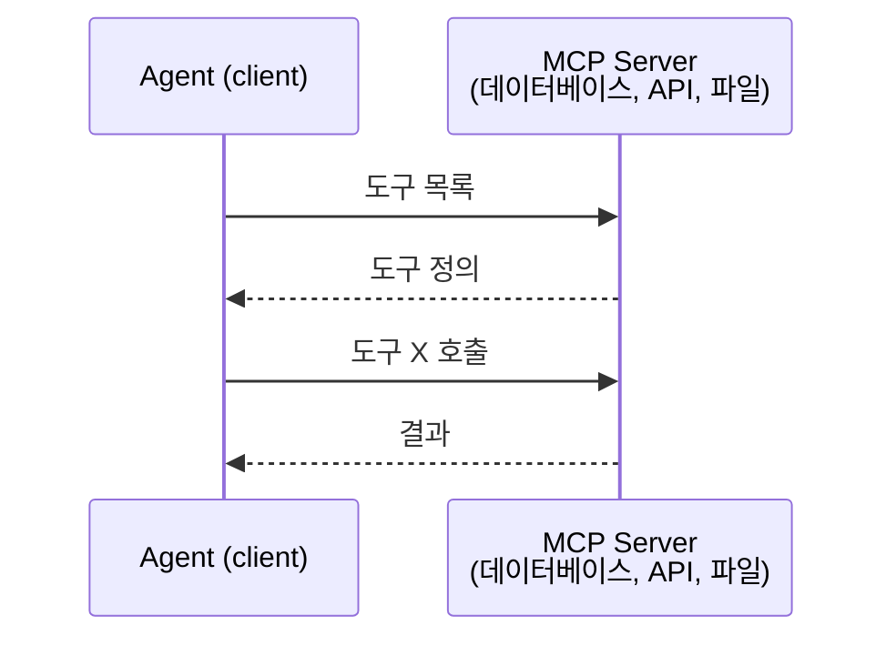

MCP는 **에이전트-도구** 통신입니다. 에이전트 간 대화에는 도움이 되지 않습니다.

### A2A (에이전트 간 프로토콜)

**제작자:** Google (현재 Linux Foundation에서 `lf.a2a.v1`로 관리)
**사양 버전:** 1.0.0
**문제:** 자율 에이전트는 어떻게 서로 협력, 협상, 작업을 위임할까?

A2A는 **피어-투-피어 에이전트 협력** 프로토콜입니다. MCP가 에이전트를 도구에 연결한다면, A2A는 에이전트를 다른 에이전트에 연결합니다. 각 에이전트는 잘 알려진 URL에 **에이전트 카드**를 게시하고, 다른 에이전트가 이를 발견, 협상, 작업을 위임합니다.


#### A2A 작동 방식

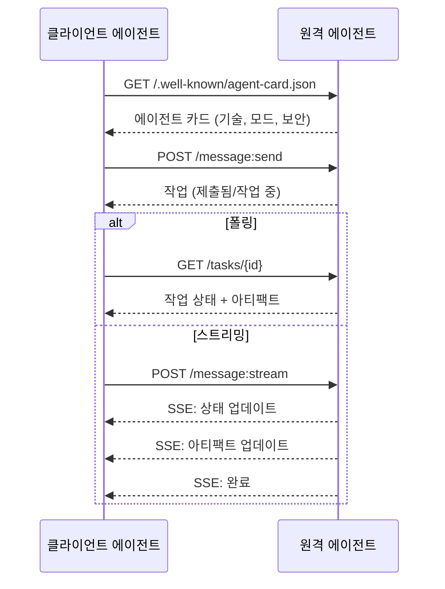


#### 실제 에이전트 카드

A2A 에이전트 카드는 다음과 같이 `GET /.well-known/agent-card.json`에서 제공됩니다:

```json
{
  "name": "연구 에이전트",
  "description": "문서를 검색하고 결과를 요약합니다",
  "version": "1.0.0",
  "supportedInterfaces": [
    {
      "url": "https://research-agent.example.com/a2a/v1",
      "protocolBinding": "JSONRPC",
      "protocolVersion": "1.0"
    },
    {
      "url": "https://research-agent.example.com/a2a/rest",
      "protocolBinding": "HTTP+JSON",
      "protocolVersion": "1.0"
    }
  ],
  "provider": {
    "organization": "귀사",
    "url": "https://example.com"
  },
  "capabilities": {
    "streaming": true,
    "pushNotifications": false
  },
  "defaultInputModes": ["text/plain", "application/json"],
  "defaultOutputModes": ["text/plain", "application/json"],
  "skills": [
    {
      "id": "web-research",
      "name": "웹 연구",
      "description": "웹을 검색하고 결과를 종합합니다",
      "tags": ["연구", "검색", "요약"],
      "examples": ["React 19의 최신 변경 사항 연구"]
    },
    {
      "id": "doc-analysis",
      "name": "문서 분석",
      "description": "기술 문서를 읽고 분석합니다",
      "tags": ["문서", "분석"],
      "inputModes": ["text/plain", "application/pdf"],
      "outputModes": ["application/json"]
    }
  ],
  "securitySchemes": {
    "bearer": {
      "httpAuthSecurityScheme": {
        "scheme": "Bearer",
        "bearerFormat": "JWT"
      }
    }
  },
  "security": [{ "bearer": [] }]
}
```

주목할 점:
- **기술(Skills)**은 에이전트가 할 수 있는 일입니다. 각각 ID, 태그, 지원되는 입력/출력 MIME 유형이 있습니다. 클라이언트 에이전트가 이 원격 에이전트가 요청을 처리할 수 있는지 판단하는 방법입니다.
- **supportedInterfaces**는 여러 프로토콜 바인딩을 나열합니다. 단일 에이전트가 JSON-RPC, REST, gRPC를 동시에 사용할 수 있습니다.
- **보안**은 카드에 내장되어 있습니다. 클라이언트는 단일 요청을 하기 전에 필요한 인증 방식을 알 수 있습니다.


#### 작업 라이프사이클

작업은 A2A의 핵심 작업 단위입니다. 정의된 상태를 이동합니다:

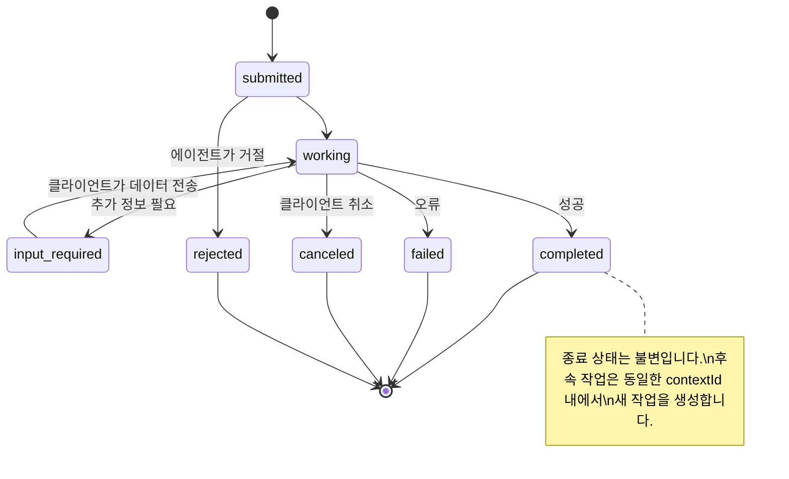

8가지 상태(여기서는 생략된 `UNSPECIFIED`도 사양에 정의됨):

| 상태 | 종료 상태? | 의미 |
|---|---|---|
| `TASK_STATE_SUBMITTED` | 아니오 | 접수됨, 아직 처리되지 않음 |
| `TASK_STATE_WORKING` | 아니오 | 활발히 처리 중 |
| `TASK_STATE_INPUT_REQUIRED` | 아니오 | 클라이언트가 추가 정보 필요 |
| `TASK_STATE_AUTH_REQUIRED` | 아니오 | 인증 필요 |
| `TASK_STATE_COMPLETED` | 예 | 성공적으로 완료 |
| `TASK_STATE_FAILED` | 예 | 오류로 완료 |
| `TASK_STATE_CANCELED` | 예 | 완료 전 취소 |
| `TASK_STATE_REJECTED` | 예 | 에이전트가 작업 거절 |

작업이 종료 상태에 도달하면 불변입니다. 더 이상 메시지를 받지 않습니다. 후속 작업은 동일한 `contextId` 내에서 새 작업을 생성합니다.


#### 와이어 포맷

A2A는 JSON-RPC 2.0을 사용합니다. 실제 메시지 교환 예시는 다음과 같습니다:

**클라이언트가 작업 전송:**
```json
{
  "jsonrpc": "2.0",
  "id": 1,
  "method": "SendMessage",
  "params": {
    "message": {
      "messageId": "msg-001",
      "role": "ROLE_USER",
      "parts": [{ "text": "React 19 컴파일러 기능 연구" }]
    },
    "configuration": {
      "acceptedOutputModes": ["text/plain", "application/json"],
      "historyLength": 10
    }
  }
}
```

**에이전트가 작업 응답:**
```json
{
  "jsonrpc": "2.0",
  "id": 1,
  "result": {
    "task": {
      "id": "task-abc-123",
      "contextId": "ctx-xyz-789",
      "status": {
        "state": "TASK_STATE_COMPLETED",
        "timestamp": "2026-03-27T10:30:00Z"
      },
      "artifacts": [
        {
          "artifactId": "art-001",
          "name": "research-results",
          "parts": [{
            "data": {
              "findings": [
                "React 19 컴파일러는 컴포넌트를 자동 메모이제이션합니다",
                "더 이상 수동 useMemo/useCallback이 필요 없습니다",
                "컴파일러는 런타임이 아닌 빌드 시간에 실행됩니다"
              ]
            },
            "mediaType": "application/json"
          }]
        }
      ]
    }
  }
}
```

**SSE를 통한 스트리밍:**
```text
POST /message:stream HTTP/1.1
Content-Type: application/json
A2A-Version: 1.0

data: {"task":{"id":"task-123","status":{"state":"TASK_STATE_WORKING"}}}

data: {"statusUpdate":{"taskId":"task-123","status":{"state":"TASK_STATE_WORKING","message":{"role":"ROLE_AGENT","parts":[{"text":"문서 검색 중..."}]}}}}

data: {"artifactUpdate":{"taskId":"task-123","artifact":{"artifactId":"art-1","parts":[{"text":"부분 결과..."}]},"append":true,"lastChunk":false}}

data: {"statusUpdate":{"taskId":"task-123","status":{"state":"TASK_STATE_COMPLETED"}}}
```

### ACP (에이전트 통신 프로토콜)

**제작자:** IBM / BeeAI
**사양 버전:** 0.2.0 (OpenAPI 3.1.1)
**상태:** Linux Foundation에서 A2A와 병합 중
**문제:** 에이전트는 어떻게 완전한 감사 가능성, 세션 연속성, 궤적 추적을 통해 통신할까?

ACP는 **엔터프라이즈 프로토콜**입니다. 많은 요약과 달리 ACP는 **JSON-LD를 사용하지 않습니다**. OpenAPI로 정의된 간단한 REST/JSON API입니다. 특별한 점은 **TrajectoryMetadata**입니다. 모든 에이전트 응답은 이를 생성한 추론 단계와 도구 호출에 대한 상세 로그를 포함할 수 있습니다.

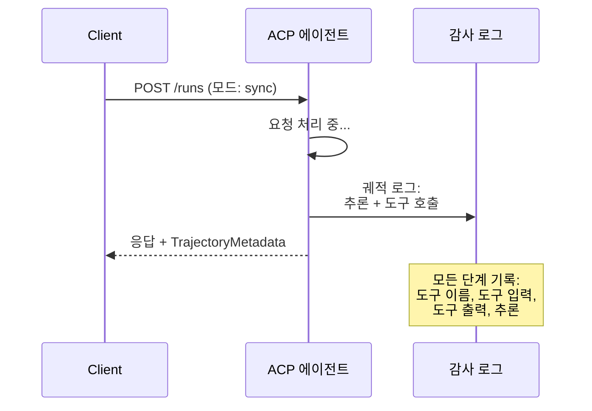


#### ACP의 에이전트 발견

ACP는 네 가지 발견 방법을 정의합니다:

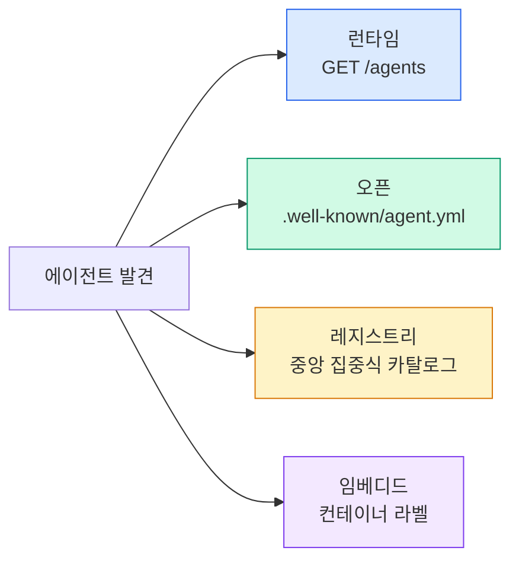

**에이전트 매니페스트**는 A2A의 에이전트 카드보다 간단합니다:

```json
{
  "name": "summarizer",
  "description": "출처 인용과 함께 문서 요약",
  "input_content_types": ["text/plain", "application/pdf"],
  "output_content_types": ["text/plain", "application/json"],
  "metadata": {
    "tags": ["요약", "RAG"],
    "framework": "BeeAI",
    "capabilities": [
      {
        "name": "문서 요약",
        "description": "긴 문서를 핵심 포인트로 압축"
      }
    ],
    "recommended_models": ["llama3.3:70b-instruct-fp16"],
    "license": "Apache-2.0",
    "programming_language": "Python"
  }
}
```


#### 실행 라이프사이클

ACP는 "작업" 대신 "실행(Run)"을 사용합니다. 실행은 세 가지 모드가 있습니다:

| 모드 | 동작 |
|---|---|
| `sync` | 블로킹. 응답에 완전한 결과 포함. |
| `async` | 즉시 202 반환. `GET /runs/{id}`로 상태 폴링. |
| `stream` | SSE 스트림. 작업 진행 시 이벤트 발생. |

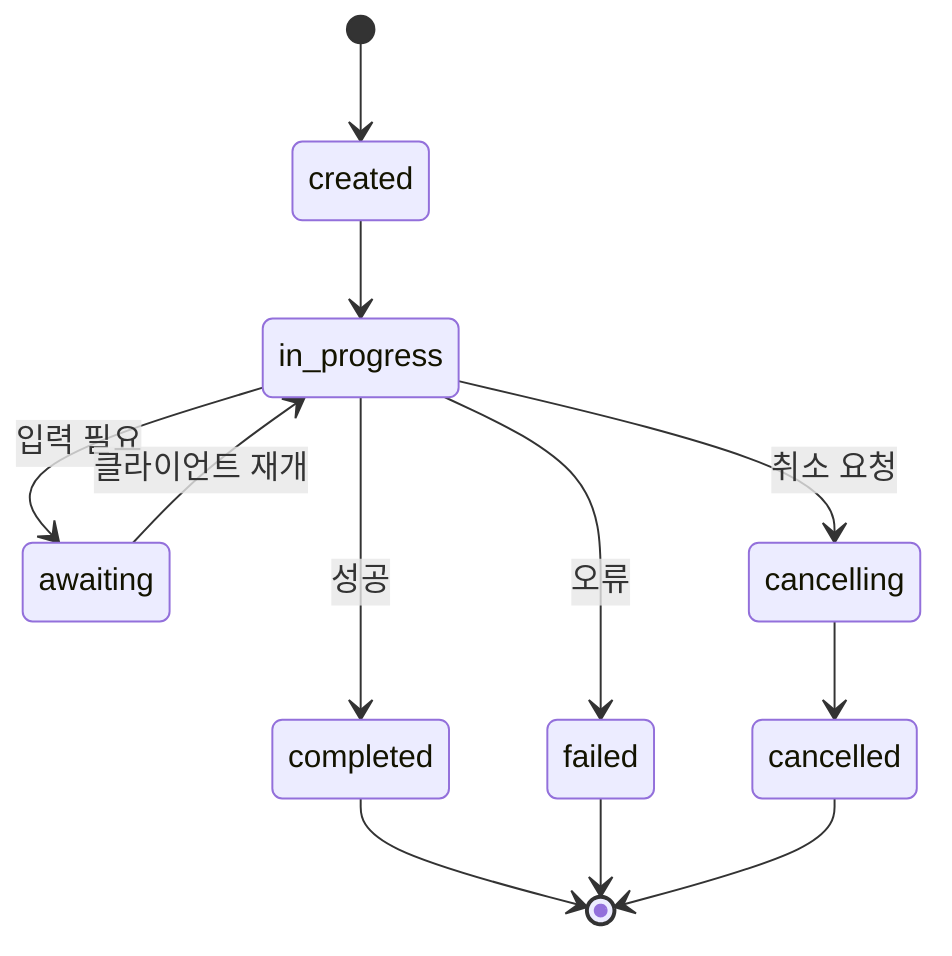


#### TrajectoryMetadata (감사 추적)

이것이 ACP의 차별점입니다. 모든 메시지 부분은 에이전트가 수행한 작업을 보여주는 메타데이터를 포함할 수 있습니다:

```json
{
  "role": "agent/researcher",
  "parts": [
    {
      "content_type": "text/plain",
      "content": "샌프란시스코 날씨는 72F이고 맑습니다.",
      "metadata": {
        "kind": "trajectory",
        "message": "이 위치의 날씨를 확인해야 합니다",
        "tool_name": "weather_api",
        "tool_input": { "location": "샌프란시스코, CA" },
        "tool_output": { "temperature": 72, "condition": "sunny" }
      }
    }
  ]
}
```

규제 산업에서는 이 기능이 매우 중요합니다. 모든 답변에는 증명 가능한 추론 체인이 포함됩니다: 어떤 도구가 호출되었는지, 어떤 입력이 사용되었는지, 어떤 출력이 수신되었는지. 블랙박스가 없습니다.

ACP는 **인용 메타데이터**도 지원하여 출처를 명시합니다:

```json
{
  "kind": "citation",
  "start_index": 0,
  "end_index": 47,
  "url": "https://weather.gov/sf",
  "title": "NWS 샌프란시스코 예보"
}
```

### ANP (에이전트 네트워크 프로토콜)

**제작자:** 오픈소스 커뮤니티 (GaoWei Chang 설립)
**저장소:** [github.com/agent-network-protocol/AgentNetworkProtocol](https://github.com/agent-network-protocol/AgentNetworkProtocol)
**문제:** 중앙 권한 없이 서로 다른 조직의 에이전트는 어떻게 서로를 신뢰할까?

ANP는 **분산 신원 프로토콜**입니다. W3C 분산 식별자(DID)와 종단 간 암호화(E2EE)를 사용하여 신뢰를 구축합니다. 알려진 엔드포인트를 통해 에이전트를 발견하는 A2A와 달리, ANP는 에이전트가 암호학적으로 신원을 증명할 수 있게 합니다.

ANP는 세 계층으로 구성됩니다:

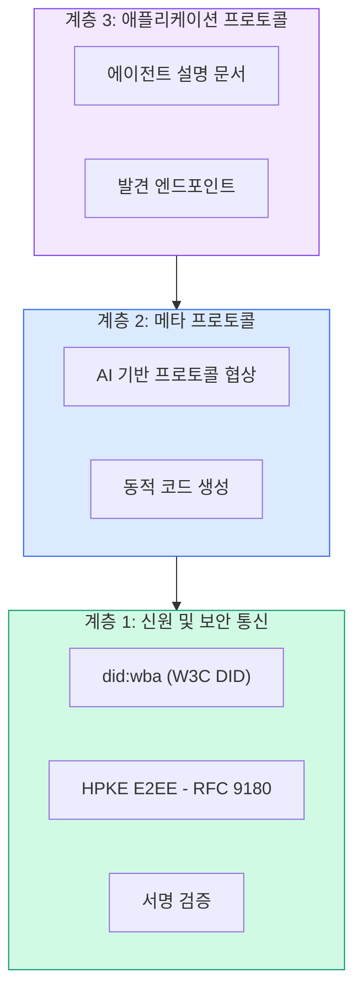


#### DID 문서 (실제 구조)

ANP는 `did:wba`(웹 기반 에이전트)라는 사용자 정의 DID 방법을 사용합니다. DID `did:wba:example.com:user:alice`는 `https://example.com/user/alice/did.json`로 확인됩니다:

```json
{
  "@context": [
    "https://www.w3.org/ns/did/v1",
    "https://w3id.org/security/suites/jws-2020/v1",
    "https://w3id.org/security/suites/secp256k1-2019/v1"
  ],
  "id": "did:wba:example.com:user:alice",
  "verificationMethod": [
    {
      "id": "did:wba:example.com:user:alice#key-1",
      "type": "EcdsaSecp256k1VerificationKey2019",
      "controller": "did:wba:example.com:user:alice",
      "publicKeyJwk": {
        "crv": "secp256k1",
        "x": "NtngWpJUr-rlNNbs0u-Aa8e16OwSJu6UiFf0Rdo1oJ4",
        "y": "qN1jKupJlFsPFc1UkWinqljv4YE0mq_Ickwnjgasvmo",
        "kty": "EC"
      }
    },
    {
      "id": "did:wba:example.com:user:alice#key-x25519-1",
      "type": "X25519KeyAgreementKey2019",
      "controller": "did:wba:example.com:user:alice",
      "publicKeyMultibase": "z9hFgmPVfmBZwRvFEyniQDBkz9LmV7gDEqytWyGZLmDXE"
    }
  ],
  "authentication": [
    "did:wba:example.com:user:alice#key-1"
  ],
  "keyAgreement": [
    "did:wba:example.com:user:alice#key-x25519-1"
  ],
  "humanAuthorization": [
    "did:wba:example.com:user:alice#key-1"
  ],
  "service": [
    {
      "id": "did:wba:example.com:user:alice#agent-description",
      "type": "AgentDescription",
      "serviceEndpoint": "https://example.com/agents/alice/ad.json"
    }
  ]
}
```

주목할 점:
- **키 분리**가 강제됩니다. 서명 키(secp256k1)와 암호화 키(X25519)는 분리됩니다.
- **`humanAuthorization`**은 ANP에만 있습니다. 이 키는 사용 전 명시적 인간 승인(생체 인증, 비밀번호, HSM)이 필요합니다. 자금 이체와 같은 고위험 작업은 이 경로를 거칩니다.
- **`keyAgreement`** 키는 HPKE 종단 간 암호화(RFC 9180)에 사용됩니다.
- **서비스** 섹션은 에이전트 설명 문서로 연결됩니다.


#### ANP의 신뢰 작동 방식

ANP는 **웹 오브 트러스트**나 보증 그래프를 사용하지 않습니다. 신뢰는 양방향이며 상호작용마다 검증됩니다:

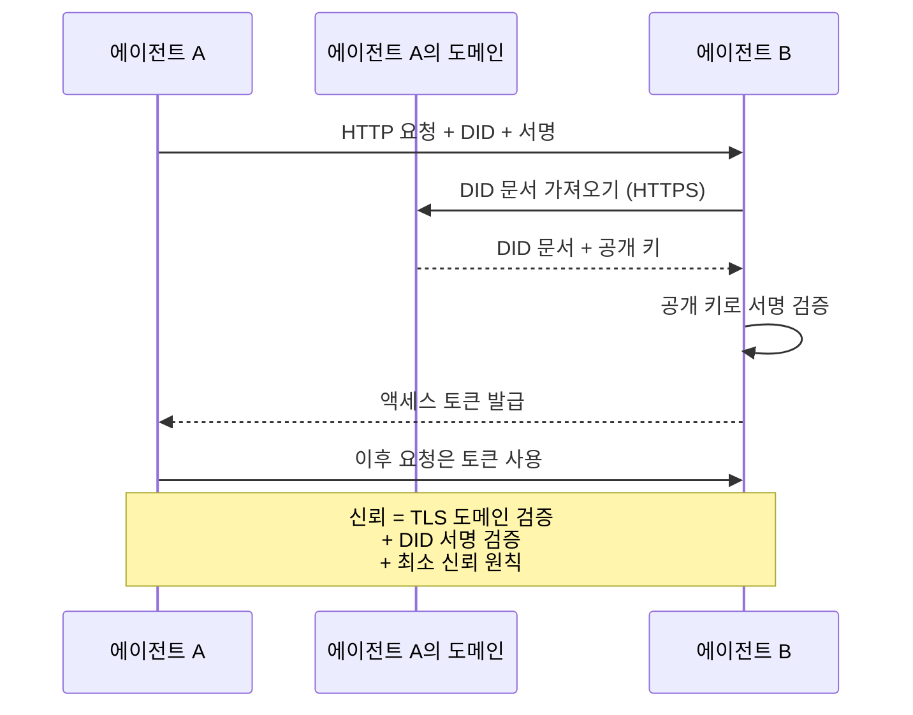

신뢰는 세 가지 소스에서 나옵니다:
1. **도메인 수준 TLS**는 DID 문서 호스트를 검증합니다
2. **DID 암호화 서명**은 에이전트의 신원을 검증합니다
3. **최소 신뢰 원칙**은 최소 권한만 부여합니다

신뢰 전파를 위한 가십이나 페이지랭크 점수화는 없습니다. 각 에이전트를 DID를 통해 직접 검증합니다.


#### 메타 프로토콜 협상

이것이 ANP의 가장 독창적인 기능입니다. 서로 다른 생태계의 두 에이전트가 만나면 미리 합의된 데이터 형식이 필요 없습니다. 자연어로 협상합니다:

```json
{
  "action": "protocolNegotiation",
  "sequenceId": 0,
  "candidateProtocols": "다음과 같이 통신할 수 있습니다:\n1. 호텔 예약 스키마가 있는 JSON-RPC\n2. OpenAPI 3.1 사양이 있는 REST\n3. HTTP를 통한 자연어",
  "modificationSummary": "초기 제안",
  "status": "negotiating"
}
```

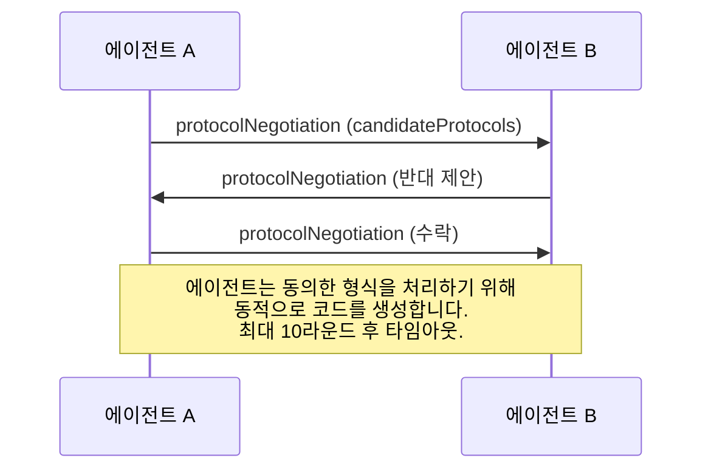

에이전트는 형식에 동의할 때까지(최대 10라운드) 왕복한 후, 동의한 형식을 처리하기 위해 동적으로 코드를 생성합니다. 상태 값: `negotiating`, `rejected`, `accepted`, `timeout`.

이것은 서로 본 적 없는 두 에이전트가 사전 정의된 공유 스키마 없이도 통신 방법을 알아낼 수 있음을 의미합니다.

### 비교 (수정됨)

| | MCP | A2A | ACP | ANP |
|---|---|---|---|---|
| **제작자** | Anthropic | Google / Linux Foundation | IBM / BeeAI | 커뮤니티 |
| **사양 형식** | JSON-RPC | JSON-RPC / REST / gRPC | OpenAPI 3.1 (REST) | JSON-RPC |
| **주요 용도** | 에이전트-도구 | 에이전트-에이전트 | 에이전트-에이전트 | 에이전트-에이전트 |
| **발견** | 도구 목록 | `/.well-known/agent-card.json` | `GET /agents`, `/.well-known/agent.yml` | `/.well-known/agent-descriptions`, DID 서비스 엔드포인트 |
| **신원** | 암시적 (로컬) | 보안 체계 (OAuth, mTLS) | 서버 수준 | W3C DID (`did:wba`) + E2EE |
| **감사 추적** | N/A | 기본 (작업 기록) | TrajectoryMetadata (도구 호출, 추론) | 공식적으로 정의되지 않음 |
| **상태 머신** | N/A | 9개 작업 상태 | 7개 실행 상태 | N/A |
| **스트리밍** | N/A | SSE | SSE | 전송 계층 독립적 |
| **고유 기능** | 도구 스키마 | 에이전트 카드 + 기술 | 궤적 감사 추적 | 메타 프로토콜 협상 |
| **최적 용도** | 도구 및 데이터 | 동적 협력 | 규제 산업 | 조직 간 신뢰 |
| **상태** | 안정 | 안정 (v1.0) | A2A와 병합 중 | 활성 개발 중 |

### 함께 작동하는 방식

이 프로토콜들은 상호 배타적이지 않습니다. 현실적인 엔터프라이즈 시스템은 여러 프로토콜을 사용합니다:

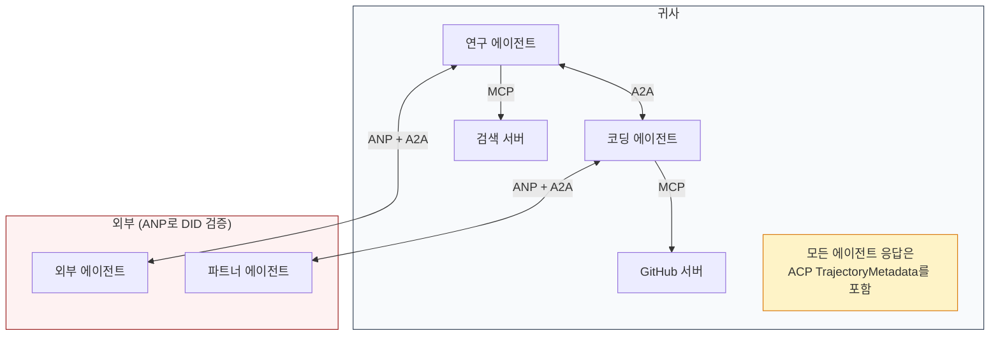

- **MCP**는 각 에이전트를 도구에 연결합니다
- **A2A**는 에이전트 간 협력(내부 및 외부)을 처리합니다
- **ACP**는 감사 가능성을 위해 응답에 궤적 메타데이터를 추가합니다
- **ANP**는 제어하지 않는 에이전트의 신원 검증을 제공합니다

## 구축 방법

### 1단계: 핵심 메시지 유형

모든 다중 에이전트 시스템은 메시지 형식으로 시작합니다. 실제 프로토콜에서 사용하는 것과 매핑되는 유형을 정의합니다:

```typescript
import crypto from "node:crypto";

type MessageRole = "user" | "agent";

type MessagePart =
  | { kind: "text"; text: string }
  | { kind: "data"; data: unknown; mediaType: string }
  | { kind: "file"; name: string; url: string; mediaType: string };

type TrajectoryEntry = {
  reasoning: string;
  toolName?: string;
  toolInput?: unknown;
  toolOutput?: unknown;
  timestamp: number;
};

type AgentMessage = {
  id: string;
  role: MessageRole;
  parts: MessagePart[];
  trajectory?: TrajectoryEntry[];
  replyTo?: string;
  timestamp: number;
};

function createMessage(
  role: MessageRole,
  parts: MessagePart[],
  replyTo?: string
): AgentMessage {
  return {
    id: crypto.randomUUID(),
    role,
    parts,
    replyTo,
    timestamp: Date.now(),
  };
}

function textMessage(role: MessageRole, text: string): AgentMessage {
  return createMessage(role, [{ kind: "text", text }]);
}
```

참고: `MessagePart`는 실제 A2A 및 ACP 사양과 마찬가지로 멀티모달(텍스트, 구조화된 데이터, 파일)입니다. `TrajectoryEntry`는 ACP의 TrajectoryMetadata와 일치하는 추론 체인을 캡처합니다.

### 2단계: A2A 에이전트 카드 및 레지스트리

실제 A2A 사양과 일치하는 에이전트 발견을 구축합니다:

```typescript
type Skill = {
  id: string;
  name: string;
  description: string;
  tags: string[];
  inputModes: string[];
  outputModes: string[];
};

type AgentCard = {
  name: string;
  description: string;
  version: string;
  url: string;
  capabilities: {
    streaming: boolean;
    pushNotifications: boolean;
  };
  defaultInputModes: string[];
  defaultOutputModes: string[];
  skills: Skill[];
};

class AgentRegistry {
  private cards: Map<string, AgentCard> = new Map();

  register(card: AgentCard) {
    this.cards.set(card.name, card);
  }

  discoverBySkillTag(tag: string): AgentCard[] {
    return [...this.cards.values()].filter((card) =>
      card.skills.some((skill) => skill.tags.includes(tag))
    );
  }

  discoverByInputMode(mimeType: string): AgentCard[] {
    return [...this.cards.values()].filter(
      (card) =>
        card.defaultInputModes.includes(mimeType) ||
        card.skills.some((skill) => skill.inputModes.includes(mimeType))
    );
  }

  resolve(name: string): AgentCard | undefined {
    return this.cards.get(name);
  }

  listAll(): AgentCard[] {
    return [...this.cards.values()];
  }
}
```

이것은 단순한 이름-기능 매핑보다 훨씬 풍부합니다. 실제 A2A 사양이 지원하는 것처럼 스킬 태그, 입력 MIME 유형 또는 이름으로 에이전트를 발견할 수 있습니다.

### 3단계: A2A 작업 수명 주기

전체 작업 상태 머신을 구축합니다:

```typescript
type TaskState =
  | "submitted"
  | "working"
  | "input-required"
  | "auth-required"
  | "completed"
  | "failed"
  | "canceled"
  | "rejected";

const TERMINAL_STATES: TaskState[] = [
  "completed",
  "failed",
  "canceled",
  "rejected",
];

type TaskStatus = {
  state: TaskState;
  message?: AgentMessage;
  timestamp: number;
};

type Artifact = {
  id: string;
  name: string;
  parts: MessagePart[];
};

type Task = {
  id: string;
  contextId: string;
  status: TaskStatus;
  artifacts: Artifact[];
  history: AgentMessage[];
};

type TaskEvent =
  | { kind: "statusUpdate"; taskId: string; status: TaskStatus }
  | {
      kind: "artifactUpdate";
      taskId: string;
      artifact: Artifact;
      append: boolean;
      lastChunk: boolean;
    };

type TaskHandler = (
  task: Task,
  message: AgentMessage
) => AsyncGenerator<TaskEvent>;

class TaskManager {
  private tasks: Map<string, Task> = new Map();
  private handlers: Map<string, TaskHandler> = new Map();
  private listeners: Map<string, ((event: TaskEvent) => void)[]> = new Map();

  registerHandler(agentName: string, handler: TaskHandler) {
    this.handlers.set(agentName, handler);
  }

  subscribe(taskId: string, listener: (event: TaskEvent) => void) {
    const existing = this.listeners.get(taskId) ?? [];
    existing.push(listener);
    this.listeners.set(taskId, existing);
  }

  async sendMessage(
    agentName: string,
    message: AgentMessage,
    contextId?: string
  ): Promise<Task> {
    const handler = this.handlers.get(agentName);
    if (!handler) {
      const task = this.createTask(contextId);
      task.status = {
        state: "rejected",
        timestamp: Date.now(),
        message: textMessage("agent", `No handler for ${agentName}`),
      };
      return task;
    }

    const task = this.createTask(contextId);
    task.history.push(message);
    task.status = { state: "submitted", timestamp: Date.now() };

    this.processTask(task, handler, message).catch((err) => {
      task.status = {
        state: "failed",
        timestamp: Date.now(),
        message: textMessage("agent", String(err)),
      };
    });
    return task;
  }

  getTask(taskId: string): Task | undefined {
    return this.tasks.get(taskId);
  }

  cancelTask(taskId: string): boolean {
    const task = this.tasks.get(taskId);
    if (!task || TERMINAL_STATES.includes(task.status.state)) return false;
    task.status = { state: "canceled", timestamp: Date.now() };
    this.emit(taskId, {
      kind: "statusUpdate",
      taskId,
      status: task.status,
    });
    return true;
  }

  private createTask(contextId?: string): Task {
    const task: Task = {
      id: crypto.randomUUID(),
      contextId: contextId ?? crypto.randomUUID(),
      status: { state: "submitted", timestamp: Date.now() },
      artifacts: [],
      history: [],
    };
    this.tasks.set(task.id, task);
    return task;
  }

  private async processTask(
    task: Task,
    handler: TaskHandler,
    message: AgentMessage
  ) {
    task.status = { state: "working", timestamp: Date.now() };
    this.emit(task.id, {
      kind: "statusUpdate",
      taskId: task.id,
      status: task.status,
    });

    try {
      for await (const event of handler(task, message)) {
        if (TERMINAL_STATES.includes(task.status.state)) break;

        if (event.kind === "statusUpdate") {
          task.status = event.status;
        }
        if (event.kind === "artifactUpdate") {
          const existing = task.artifacts.find(
            (a) => a.id === event.artifact.id
          );
          if (existing && event.append) {
            existing.parts.push(...event.artifact.parts);
          } else {
            task.artifacts.push(event.artifact);
          }
        }
        this.emit(task.id, event);
      }
    } catch (err) {
      task.status = {
        state: "failed",
        timestamp: Date.now(),
        message: textMessage("agent", String(err)),
      };
      this.emit(task.id, {
        kind: "statusUpdate",
        taskId: task.id,
        status: task.status,
      });
    }
  }

  private emit(taskId: string, event: TaskEvent) {
    for (const listener of this.listeners.get(taskId) ?? []) {
      listener(event);
    }
  }
}
```

이것은 실제 A2A 작업 수명 주기를 구현합니다: 제출됨, 작업 중, 입력 필요, 종료 상태. 핸들러는 SSE 스트리밍 모델과 일치하는 이벤트(상태 업데이트 및 아티팩트 청크)를 생성하는 비동기 제너레이터입니다.

### 4단계: ACP 스타일 감사 추적

추론 추적과 함께 통신을 래핑합니다:

```typescript
type AuditEntry = {
  runId: string;
  agentName: string;
  input: AgentMessage[];
  output: AgentMessage[];
  trajectory: TrajectoryEntry[];
  status: "created" | "in-progress" | "completed" | "failed" | "awaiting";
  startedAt: number;
  completedAt?: number;
  sessionId?: string;
};

class AuditableRunner {
  private log: AuditEntry[] = [];
  private handlers: Map<
    string,
    (input: AgentMessage[]) => Promise<{
      output: AgentMessage[];
      trajectory: TrajectoryEntry[];
    }>
  > = new Map();

  registerAgent(
    name: string,
    handler: (input: AgentMessage[]) => Promise<{
      output: AgentMessage[];
      trajectory: TrajectoryEntry[];
    }>
  ) {
    this.handlers.set(name, handler);
  }

  async run(
    agentName: string,
    input: AgentMessage[],
    sessionId?: string
  ): Promise<AuditEntry> {
    const entry: AuditEntry = {
      runId: crypto.randomUUID(),
      agentName,
      input: structuredClone(input),
      output: [],
      trajectory: [],
      status: "created",
      startedAt: Date.now(),
      sessionId,
    };
    this.log.push(entry);

    const handler = this.handlers.get(agentName);
    if (!handler) {
      entry.status = "failed";
      return entry;
    }

    entry.status = "in-progress";
    try {
      const result = await handler(input);
      entry.output = structuredClone(result.output);
      entry.trajectory = structuredClone(result.trajectory);
      entry.status = "completed";
      entry.completedAt = Date.now();
    } catch (err) {
      entry.status = "failed";
      entry.trajectory.push({
        reasoning: `Error: ${String(err)}`,
        timestamp: Date.now(),
      });
      entry.completedAt = Date.now();
    }
    return entry;
  }

  getFullAuditLog(): AuditEntry[] {
    return structuredClone(this.log);
  }

  getAuditLogForAgent(agentName: string): AuditEntry[] {
    return structuredClone(
      this.log.filter((e) => e.agentName === agentName)
    );
  }

  getAuditLogForSession(sessionId: string): AuditEntry[] {
    return structuredClone(
      this.log.filter((e) => e.sessionId === sessionId)
    );
  }

  getTrajectoryForRun(runId: string): TrajectoryEntry[] {
    const entry = this.log.find((e) => e.runId === runId);
    return entry ? structuredClone(entry.trajectory) : [];
  }
}
```

모든 에이전트 실행은 완전한 감사 항목을 생성합니다: 입력된 내용, 출력된 내용, 그리고 그 사이의 도구 호출 및 추론 단계의 완전한 추론 추적. 에이전트, 세션 또는 개별 실행별로 쿼리할 수 있습니다.

### 5단계: ANP 스타일 신원 확인

DID 기반 신원 및 확인을 구축합니다:

```typescript
type VerificationMethod = {
  id: string;
  type: string;
  controller: string;
  publicKeyDer: string;
};

type DIDDocument = {
  id: string;
  verificationMethod: VerificationMethod[];
  authentication: string[];
  keyAgreement: string[];
  humanAuthorization: string[];
  service: { id: string; type: string; serviceEndpoint: string }[];
};

type AgentIdentity = {
  did: string;
  document: DIDDocument;
  privateKey: crypto.KeyObject;
  publicKey: crypto.KeyObject;
};

class IdentityRegistry {
  private documents: Map<string, DIDDocument> = new Map();

  publish(doc: DIDDocument) {
    this.documents.set(doc.id, doc);
  }

  resolve(did: string): DIDDocument | undefined {
    return this.documents.get(did);
  }

  verify(did: string, signature: string, payload: string): boolean {
    const doc = this.documents.get(did);
    if (!doc) return false;

    const authKeyIds = doc.authentication;
    const authKeys = doc.verificationMethod.filter((vm) =>
      authKeyIds.includes(vm.id)
    );

    for (const key of authKeys) {
      const publicKey = crypto.createPublicKey({
        key: Buffer.from(key.publicKeyDer, "base64"),
        format: "der",
        type: "spki",
      });
      const isValid = crypto.verify(
        null,
        Buffer.from(payload),
        publicKey,
        Buffer.from(signature, "hex")
      );
      if (isValid) return true;
    }
    return false;
  }

  requiresHumanAuth(did: string, operationKeyId: string): boolean {
    const doc = this.documents.get(did);
    if (!doc) return false;
    return doc.humanAuthorization.includes(operationKeyId);
  }
}

function createIdentity(domain: string, agentName: string): AgentIdentity {
  const did = `did:wba:${domain}:agent:${agentName}`;
  const { publicKey, privateKey } = crypto.generateKeyPairSync("ed25519");

  const publicKeyDer = publicKey
    .export({ format: "der", type: "spki" })
    .toString("base64");

  const keyId = `${did}#key-1`;
  const encKeyId = `${did}#key-x25519-1`;

  const document: DIDDocument = {
    id: did,
    verificationMethod: [
      {
        id: keyId,
        type: "Ed25519VerificationKey2020",
        controller: did,
        publicKeyDer,
      },
      {
        id: encKeyId,
        type: "X25519KeyAgreementKey2019",
        controller: did,
        publicKeyDer,
      },
    ],
    authentication: [keyId],
    keyAgreement: [encKeyId],
    humanAuthorization: [],
    service: [
      {
        id: `${did}#agent-description`,
        type: "AgentDescription",
        serviceEndpoint: `https://${domain}/agents/${agentName}/ad.json`,
      },
    ],
  };

  return { did, document, privateKey, publicKey };
}

function signPayload(identity: AgentIdentity, payload: string): string {
  return crypto
    .sign(null, Buffer.from(payload), identity.privateKey)
    .toString("hex");
}
```

이것은 실제 ANP 신원 모델을 미러링합니다: 에이전트는 별도의 인증, 키 합의 및 인간 승인 키를 가진 DID 문서를 가지고 있습니다. `IdentityRegistry`는 DID 해상도를 시뮬레이션합니다(실제 운영 환경에서는 에이전트의 도메인에 대한 HTTP 페치가 됩니다).

### 6단계: 프로토콜 게이트웨이

네 가지 프로토콜을 통합 시스템으로 연결합니다:

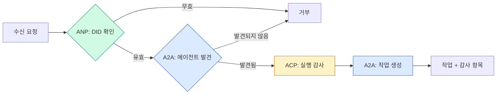

```typescript
class ProtocolGateway {
  private registry: AgentRegistry;
  private taskManager: TaskManager;
  private auditRunner: AuditableRunner;
  private identityRegistry: IdentityRegistry;

  constructor(
    registry: AgentRegistry,
    taskManager: TaskManager,
    auditRunner: AuditableRunner,
    identityRegistry: IdentityRegistry
  ) {
    this.registry = registry;
    this.taskManager = taskManager;
    this.auditRunner = auditRunner;
    this.identityRegistry = identityRegistry;
  }

  async delegateTask(
    fromDid: string,
    signature: string,
    targetAgent: string,
    message: AgentMessage,
    sessionId?: string
  ): Promise<{ task: Task; audit: AuditEntry } | { error: string }> {
    if (!this.identityRegistry.verify(fromDid, signature, message.id)) {
      return { error: "신원 확인 실패" };
    }

    const card = this.registry.resolve(targetAgent);
    if (!card) {
      return { error: `${targetAgent} 에이전트를 레지스트리에서 찾을 수 없음` };
    }

    const audit = await this.auditRunner.run(
      targetAgent,
      [message],
      sessionId
    );
    const task = await this.taskManager.sendMessage(targetAgent, message);

    return { task, audit };
  }

  discoverAndDelegate(
    fromDid: string,
    signature: string,
    skillTag: string,
    message: AgentMessage
  ): Promise<{ task: Task; audit: AuditEntry } | { error: string }> {
    const candidates = this.registry.discoverBySkillTag(skillTag);
    if (candidates.length === 0) {
      return Promise.resolve({
        error: `스킬 태그로 에이전트를 찾을 수 없음: ${skillTag}`,
      });
    }
    return this.delegateTask(
      fromDid,
      signature,
      candidates[0].name,
      message
    );
  }
}
```

게이트웨이는 한 번의 호출로 네 가지 작업을 수행합니다:
1. **ANP**: DID 서명을 통해 호출자의 신원을 확인
2. **A2A**: 대상 에이전트를 발견하고 기능을 확인
3. **ACP**: 추론 추적과 함께 실행을 감사 추적에 래핑
4. **A2A**: 전체 수명 주기 추적을 통해 작업 생성

### 7단계: 전체 통합

```typescript
async function protocolDemo() {
  const registry = new AgentRegistry();
  registry.register({
    name: "researcher",
    description: "검색 및 요약 수행",
    version: "1.0.0",
    url: "https://researcher.local/a2a/v1",
    capabilities: { streaming: true, pushNotifications: false },
    defaultInputModes: ["text/plain"],
    defaultOutputModes: ["text/plain", "application/json"],
    skills: [
      {
        id: "web-research",
        name: "웹 검색",
        description: "웹 검색",
        tags: ["research", "search", "summarization"],
        inputModes: ["text/plain"],
        outputModes: ["application/json"],
      },
    ],
  });
  registry.register({
    name: "coder",
    description: "명세로부터 코드 작성",
    version: "1.0.0",
    url: "https://coder.local/a2a/v1",
    capabilities: { streaming: false, pushNotifications: false },
    defaultInputModes: ["text/plain", "application/json"],
    defaultOutputModes: ["text/plain"],
    skills: [
      {
        id: "code-gen",
        name: "코드 생성",
        description: "코드 생성",
        tags: ["coding", "generation"],
        inputModes: ["text/plain", "application/json"],
        outputModes: ["text/plain"],
      },
    ],
  });

  const taskManager = new TaskManager();
  const auditRunner = new AuditableRunner();

  const researchTrajectory: TrajectoryEntry[] = [];

  taskManager.registerHandler(
    "researcher",
    async function* (task, message) {
      yield {
        kind: "statusUpdate" as const,
        taskId: task.id,
        status: { state: "working" as const, timestamp: Date.now() },
      };

      researchTrajectory.push({
        reasoning: "React 19 문서 검색 중",
        toolName: "web_search",
        toolInput: { query: "React 19 컴파일러 기능" },
        toolOutput: {
          results: ["react.dev/blog/react-19", "github.com/react/react"],
        },
        timestamp: Date.now(),
      });

      researchTrajectory.push({
        reasoning: "검색 결과에서 주요 내용 추출 중",
        toolName: "doc_analysis",
        toolInput: { url: "react.dev/blog/react-19" },
        toolOutput: {
          summary:
            "React 19 컴파일러는 자동 메모이제이션, 수동 useMemo 불필요",
        },
        timestamp: Date.now(),
      });

      yield {
        kind: "artifactUpdate" as const,
        taskId: task.id,
        artifact: {
          id: crypto.randomUUID(),
          name: "research-results",
          parts: [
            {
              kind: "data" as const,
              data: {
                findings: [
                  "React 19 컴파일러는 컴포넌트를 자동 메모이제이션",
                  "더 이상 수동 useMemo/useCallback 불필요",
                  "컴파일러는 런타임이 아닌 빌드 타임에 실행",
                ],
                sources: ["react.dev/blog/react-19"],
              },
              mediaType: "application/json",
            },
          ],
        },
        append: false,
        lastChunk: true,
      };

      yield {
        kind: "statusUpdate" as const,
        taskId: task.id,
        status: { state: "completed" as const, timestamp: Date.now() },
      };
    }
  );

  auditRunner.registerAgent("researcher", async () => ({
    output: [
      textMessage("agent", "React 19 컴파일러는 컴포넌트를 자동 메모이제이션합니다"),
    ],
    trajectory: researchTrajectory,
  }));

  const identityRegistry = new IdentityRegistry();

  const coderIdentity = createIdentity("coder.local", "coder");
  const researcherIdentity = createIdentity("researcher.local", "researcher");

  identityRegistry.publish(coderIdentity.document);
  identityRegistry.publish(researcherIdentity.document);

  const gateway = new ProtocolGateway(
    registry,
    taskManager,
    auditRunner,
    identityRegistry
  );

  console.log("=== 프로토콜 데모 ===\n");

  console.log("1. 에이전트 발견 (A2A)");
  const researchAgents = registry.discoverBySkillTag("research");
  console.log(
    `   ${researchAgents.length}개의 에이전트 발견:`,
    researchAgents.map((a) => a.name)
  );

  console.log("\n2. 신원 확인 (ANP)");
  const message = textMessage("user", "React 19 컴파일러 기능 연구");
  const signature = signPayload(coderIdentity, message.id);
  const verified = identityRegistry.verify(
    coderIdentity.did,
    signature,
    message.id
  );
  console.log(`   코더 DID: ${coderIdentity.did}`);
  console.log(`   서명 확인: ${verified}`);

  console.log("\n3. 작업 위임 (A2A + ACP + ANP)");
  const result = await gateway.delegateTask(
    coderIdentity.did,
    signature,
    "researcher",
    message,
    "session-001"
  );

  if ("error" in result) {
    console.log(`   오류: ${result.error}`);
    return;
  }

  console.log(`   작업 ID: ${result.task.id}`);
  console.log(`   작업 상태: ${result.task.status.state}`);
  console.log(`   아티팩트: ${result.task.artifacts.length}개`);

  console.log("\n4. 감사 추적 (ACP)");
  console.log(`   실행 ID: ${result.audit.runId}`);
  console.log(`   상태: ${result.audit.status}`);
  console.log(`   추론 단계: ${result.audit.trajectory.length}개`);
  for (const step of result.audit.trajectory) {
    console.log(`     - ${step.reasoning}`);
    if (step.toolName) {
      console.log(`       도구: ${step.toolName}`);
    }
  }

  console.log("\n5. 전체 감사 로그");
  const fullLog = auditRunner.getFullAuditLog();
  console.log(`   총 실행 횟수: ${fullLog.length}`);
  for (const entry of fullLog) {
    const duration = entry.completedAt
      ? `${entry.completedAt - entry.startedAt}ms`
      : "진행 중";
    console.log(`   ${entry.agentName}: ${entry.status} (${duration})`);
  }
}

protocolDemo().catch((err) => {
  console.error("프로토콜 데모 실패:", err);
  process.exitCode = 1;
});
```

## 무엇이 잘못되는가

프로토콜은 행복한 경로(happy path)를 해결합니다. 프로덕션에서 발생하는 문제는 다음과 같습니다:

**스키마 드리프트(Schema drift).** 에이전트 A가 `application/json` 출력을 광고하는 에이전트 카드(Agent Card)를 게시합니다. 하지만 버전 간에 JSON 스키마가 변경됩니다. 에이전트 B는 이전 형식을 파싱하고 쓰레기 데이터를 얻습니다. 해결 방법: 스킬과 출력 스키마에 버전을 지정하세요. A2A 사양은 이러한 이유로 에이전트 카드에 `version`을 지원합니다.

**상태 머신 위반(State machine violations).** 에이전트 핸들러가 `completed` 이벤트를 생성한 후 추가 아티팩트를 생성하려고 시도합니다. 작업은 불변(immutable)입니다. 코드는 업데이트를 조용히 무시하거나 오류를 발생시킵니다. 해결 방법: 아티팩트 생성 전 종료 상태를 확인하세요. 위의 `TaskManager`는 종료 상태 후 `break`를 통해 이를 강제합니다.

**신뢰 해결 실패(Trust resolution failures).** 에이전트 A가 에이전트 B의 DID를 검증하려 하지만, 에이전트 B의 도메인이 다운되었습니다. DID 문서를 가져올 수 없습니다. 검증되지 않은 에이전트를 허용(실패 개방)할지, 모든 것을 거부(실패 폐쇄)할지 선택해야 합니다. ANP는 최소 신뢰 원칙에 따라 실패 폐쇄를 권장합니다.

**궤적 팽창(Trajectory bloat).** ACP 궤적 로깅은 강력하지만 비용이 많이 듭니다. 실행당 200개의 도구 호출을 하는 복잡한 에이전트는 막대한 감사 항목을 생성합니다. 해결 방법: 구성 가능한 상세도(verbosity) 수준으로 궤적을 로깅하세요. 규정 준수를 위해 도구 이름과 입출력(I/O)을 기록하고, 비규제 워크로드의 경우 추론 단계를 생략하세요.

**디스커버리 스탬피드(Discovery thundering herd).** 50개의 에이전트가 동시에 `GET /agents`를 쿼리합니다. 해결 방법: TTL(Time-To-Live)로 에이전트 카드를 캐싱하거나, 디스커버리 간격을 조정하거나, 폴링 대신 푸시 기반 등록을 사용하세요.

## 사용 방법

### 실제 구현 사례

**A2A**는 가장 성숙한 프로토콜입니다. Google의 [공식 스펙](https://github.com/google/A2A)은 Linux Foundation에서 오픈소스로 관리됩니다. Python 및 TypeScript용 SDK가 제공됩니다. 에이전트의 동적 발견 및 협업이 필요하다면 여기서 시작하세요.

**ACP**는 A2A로 통합 중입니다. IBM의 [BeeAI 프로젝트](https://github.com/i-am-bee/acp)에서 REST 우선 대안으로 ACP를 만들었지만, 궤적 메타데이터 개념은 A2A 생태계에 흡수되고 있습니다. 전송 계층으로 A2A를 사용하더라도 ACP 패턴(궤적 로깅, 실행 라이프사이클)을 활용하세요.

**ANP**는 가장 실험적인 프로토콜입니다. [커뮤니티 저장소](https://github.com/agent-network-protocol/AgentNetworkProtocol)에는 Python SDK(AgentConnect)가 있습니다. 메타 프로토콜 협상 개념은 정말 혁신적입니다. 조직 간 에이전트 배포 시 주목할 만합니다.

**MCP**는 이미 13단계에서 다뤘습니다. 에이전트가 도구를 사용해야 한다면 MCP가 표준입니다.

### 적합한 프로토콜 선택

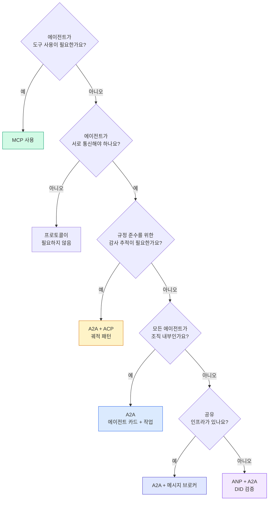

## Ship It

이 레슨은 다음을 생성합니다:
- `code/main.ts` -- 네 가지 프로토콜 패턴의 완전한 구현
- `outputs/prompt-protocol-selector.md` -- 시스템에 사용할 프로토콜을 선택하는 데 도움이 되는 프롬프트

## 연습 문제

1. **다중 홉 작업 위임.** `TaskManager`를 확장하여 에이전트 핸들러가 다른 에이전트에게 하위 작업을 위임할 수 있도록 합니다. 연구자는 작업을 수신한 후 "검색" 및 "요약" 하위 작업을 두 명의 전문 에이전트에게 위임하고, 두 작업이 완료될 때까지 기다린 다음 결과를 자신의 아티팩트로 병합합니다.

2. **스트리밍 감사 추적.** `AuditableRunner`를 수정하여 스트리밍 모드를 지원합니다. 전체 결과를 기다리는 대신, 궤적 항목이 추가될 때마다 실시간으로 `AuditEntry` 업데이트를 생성합니다. 감사 스냅샷을 생성하는 비동기 제너레이터를 사용합니다.

3. **DID 회전.** `IdentityRegistry`에 키 회전 기능을 추가합니다. 에이전트는 이전 키 참조(`previousDid`)를 유지하면서 업데이트된 키로 새 DID 문서를 게시할 수 있어야 합니다. 검증자는 유예 기간 동안 현재 키와 이전 키 모두의 서명을 수락해야 합니다.

4. **프로토콜 협상.** ANP의 메타 프로토콜 개념을 구현합니다. 두 에이전트는 후보 형식(예: "JSON-RPC를 사용할 수 있음" vs "REST를 선호함")을 포함한 `protocolNegotiation` 메시지를 교환합니다. 최대 3라운드 후 형식을 합의하거나 타임아웃됩니다. 합의된 형식은 사용할 `TaskManager` 또는 `AuditableRunner`를 결정합니다.

5. **속도 제한 발견.** 구성 가능한 TTL로 에이전트 카드 조회를 캐시하고 에이전트당 초당 발견 쿼리를 제한하는 `RateLimitedRegistry` 래퍼를 추가합니다. 100개의 에이전트가 시작 시 서로를 발견하는 스탬피드(thundering herd) 시나리오를 시뮬레이션하고 차이를 측정합니다.

## 주요 용어

| 용어 | 사람들이 말하는 것 | 실제 의미 |
|------|----------------|----------------------|
| MCP | "AI 도구를 위한 프로토콜" | 에이전트가 도구를 발견하고 사용하기 위한 클라이언트-서버 프로토콜. 에이전트 간(A2A)이 아닌 에이전트-도구 간(A2T) 프로토콜. |
| A2A | "구글의 에이전트 프로토콜" | 리눅스 재단 산하의 에이전트 협업을 위한 P2P 프로토콜. 에이전트 카드(Agent Card)를 통한 발견, 9단계 작업 수명 주기, SSE(Server-Sent Events)를 통한 스트리밍 지원. JSON-RPC, REST, gRPC 바인딩 제공. |
| ACP | "엔터프라이즈 에이전트 메시징" | IBM/BeeAI의 REST API로, TrajectoryMetadata를 포함한 에이전트 실행 관리. 모든 응답에 추론 체인과 도구 호출 기록을 포함. A2A로 통합 중. |
| ANP | "분산형 에이전트 신원" | `did:wba`(DID) 기반 암호화 신원, HPKE를 통한 E2EE(End-to-End Encryption), 처음 만나는 에이전트 간 AI 기반 메타-프로토콜 협상을 지원하는 커뮤니티 프로토콜. |
| 에이전트 카드 | "에이전트의 명함" | `/.well-known/agent-card.json`에 위치한 JSON 문서로, 기술, 지원 MIME 유형, 보안 체계, 프로토콜 바인딩 등을 설명. |
| DID | "분산형 신원" | W3C 표준의 암호화 검증 가능 신원으로, 에이전트 자체 도메인에 호스팅. ANP는 `did:wba` 메서드 사용. |
| TrajectoryMetadata | "감사 영수증" | ACP의 메커니즘으로, 모든 에이전트 응답에 추론 단계, 도구 호출, 입출력 내용을 첨부. |
| 메타-프로토콜 | "에이전트 간 통신 방식 협상" | ANP의 접근 방식으로, 에이전트가 자연어를 사용해 데이터 형식을 동적으로 합의한 후 이를 처리할 코드를 생성. |
| 작업(Task) | "작업 단위" | A2A의 상태 기반 객체로, 제출부터 완료까지 작업을 추적. 종료 상태 도달 시 불변(immutable). |

## 추가 자료

- [Google A2A 사양](https://github.com/google/A2A) -- 공식 사양 및 SDK(v1.0.0, Linux Foundation)  
- [IBM/BeeAI ACP 사양](https://github.com/i-am-bee/acp) -- 에이전트 실행 및 궤적 메타데이터용 OpenAPI 3.1 사양  
- [에이전트 네트워크 프로토콜](https://github.com/agent-network-protocol/AgentNetworkProtocol) -- DID 기반 신원, E2EE, 메타 프로토콜 협상  
- [모델 컨텍스트 프로토콜 문서](https://modelcontextprotocol.io/) -- Anthropic의 MCP 사양(13단계 다룸)  
- [W3C 분산 식별자](https://www.w3.org/TR/did-core/) -- ANP의 기반 신원 표준  
- [RFC 9180 (HPKE)](https://www.rfc-editor.org/rfc/rfc9180) -- ANP의 E2EE에 사용되는 암호화 방식  
- [FIPA 에이전트 통신 언어](http://www.fipa.org/specs/fipa00061/SC00061G.html) -- 현대 에이전트 프로토콜의 학술적 기반