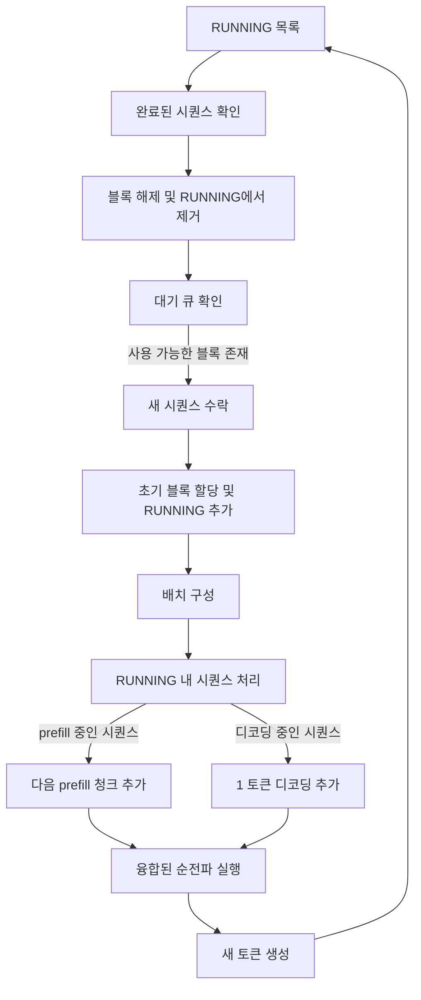

# vLLM 서빙 내부 구조: PagedAttention, 연속 배치, 청크 기반 프리필

> vLLM의 2026년 지배력은 단일 트릭이 아닌 세 가지 복합 기본값에 기반합니다. PagedAttention은 항상 활성화됩니다. 연속 배치는 디코딩 반복 사이에 새로운 요청을 활성 배치에 주입합니다. 청크 기반 프리필은 긴 프롬프트를 분할하여 디코딩 토큰이 굶주리지 않도록 합니다. 세 가지 모두를 활성화하면 Llama 3.3 70B FP8이 H100 SXM5 하나에서 128 동시 처리 시 2,200-2,400 tok/s를 달성합니다. 이는 vLLM 자체 기본값보다 약 25% 높고, 순진한 PyTorch 루프보다 3-4배 높은 성능입니다. 이 레슨은 스케줄러와 어텐션 커널을 다이어그램으로 설명할 수 있는 수준에서 분석하며, vLLM 방식으로 프리필과 디코딩을 스케줄링하는 `code/main.py`의 장난감 연속 배치기로 마무리됩니다.

**유형:** 학습  
**언어:** Python (표준 라이브러리, 장난감 연속 배치 스케줄러)  
**선수 지식:** Phase 17 · 01 (모델 서빙), Phase 11 (LLM 엔지니어링)  
**소요 시간:** ~75분

## 학습 목표

- **PagedAttention을 KV 캐시 할당자로 설명**: 블록, 블록 테이블, 그리고 프로덕션 부하에서 조각화(fragmentation)가 4% 이하로 유지되는 이유.
- **반복(iteration) 수준에서 연속 배치(continuous batching) 다이어그램 작성**: 완료된 시퀀스가 배치를 떠나고 새로운 시퀀스가 추가될 때 배치 비우기(draining) 없이 진행되는 방식.
- **청크 기반 프리필(chunked prefill)을 한 문장으로 설명**하고, 어떤 지연 시간(latency) 지표를 보호하는지 명시 (힌트: 평균 처리량(mean throughput)이 아닌 TTFT 꼬리(tail) 지연 시간).
- **2026년 vLLM v0.18.0에서 모든 최적화를 동시에 활성화할 때 팀을 방해하는 주의 사항(gotcha) 이름**을 대기.

## 문제

순진한 PyTorch 서빙 루프는 한 번에 하나의 요청만 처리합니다: 토큰화, 프리필, EOS(End-of-Sequence)까지 디코딩, 반환. 사용자가 한 명일 때는 작동하지만, 100명이 되면 대기열이 생깁니다. 명백한 해결책인 정적 배치(static batching)는 모든 요청을 윈도우 내 가장 긴 프롬프트에 맞춰 패딩하고, 모든 디코딩을 가장 긴 예상 출력에 맞춰 패딩하며, 가장 느린 시퀀스에 전체 배치를 지연시킵니다. 사용하지도 않는 패딩에 비용을 지불하고, 빠른 요청이 느린 요청을 기다리게 됩니다.

vLLM은 세 가지 문제를 동시에 해결합니다. **PagedAttention**은 기존 연속 할당 방식이 GPU 메모리의 60-80%를 KV 캐시 조각화로 낭비하는 것을 방지합니다. **연속 배치(Continuous batching)**는 각 디코딩 반복 사이에 요청이 배치에 합류하거나 이탈할 수 있게 하여, 배치가 항상 실제 작업으로 가득 차도록 합니다. **청크 기반 프리필(Chunked prefill)**은 32k 토큰 프롬프트를 ~512 토큰 조각으로 나누어 디코딩과 인터리빙하므로, 긴 프롬프트가 GPU의 모든 디코딩 토큰을 멈추지 않게 합니다.

2026년 프로덕션 기본값은 이 세 가지 모두 활성화입니다. 각 기능이 수행하는 역할을 이해해야 합니다. 실패 모드는 모델이 아닌 스케줄러에 모두 존재하기 때문입니다.

## 개념

### 가상 메모리 시스템으로서의 PagedAttention

KV 캐시는 시퀀스당 `num_layers × 2 × num_heads × head_dim × seq_len × bytes_per_element`입니다. 8192 토큰의 Llama 3.3 70B에서는 BF16 기준 시퀀스당 약 1.25GB입니다. 모든 요청에 대해 8192 슬롯을 미리 예약하지만 평균 요청은 1500 토큰만 사용한다면, 예약한 HBM의 약 82%를 낭비하게 됩니다. 기존 배치 방식은 이러한 낭비를 지불합니다.

PagedAttention은 OS 가상 메모리에서 아이디어를 차용했습니다. KV 캐시는 시퀀스당 연속적이지 않습니다. 고정 크기 블록(기본 16 토큰)으로 할당됩니다. 각 시퀀스는 논리적 토큰 위치를 물리적 블록 ID에 매핑하는 블록 테이블을 가집니다. 시퀀스가 할당된 블록을 넘어서면 추가 블록이 할당됩니다. 완료되면 블록은 풀로 반환됩니다.

조각화(fragmentation)는 60-80%(기존 방식)에서 4% 미만(PagedAttention)으로 감소합니다. PagedAttention은 플래그로 활성화하지 않습니다. vLLM이 제공하는 유일한 할당자입니다. 조절 가능한 매개변수는 `--gpu-memory-utilization`(기본값 0.9)로, 가중치 및 활성화 로드 후 KV 블록에 예약할 HBM 양을 지정합니다.

### 반복 수준에서의 연속 배치

기존 "동적 배치"는 배치 채우기 위해 창(예: 10ms)을 기다린 후, 모든 시퀀스가 완료될 때까지 prefill + decode + decode + decode를 실행했습니다. 빠른 시퀀스는 일찍 종료되어 GPU가 느린 시퀀스를 처리하는 동안 유휴 상태로 남았습니다.

연속 배치는 각 디코딩 단계 사이에서 작동합니다. 실행 중인 시퀀스 집합을 `RUNNING` 목록이라고 합니다. 각 반복에서:

1. `RUNNING`에서 EOS 또는 max_tokens에 도달한 시퀀스를 제거합니다.
2. 스케줄러는 대기 큐를 확인합니다. 사용 가능한 KV 블록이 있다면 새 시퀀스(prefill 또는 재개)를 수락합니다.
3. 순전파는 현재 `RUNNING`에 있는 시퀀스에 대해 실행되며, 시퀀스당 하나의 새 토큰을 생성합니다.

배치 크기는 고정된 숫자로 패딩되지 않습니다. 출력의 다른 위치에 있는 시퀀스들이 하나의 융합된 순전파를 공유합니다. 2026년 vLLM에서는 이를 `V1 스케줄러`라고 부릅니다. 핵심 불변 사항: 스케줄러는 요청당 한 번이 아니라 디코딩 반복당 한 번 실행됩니다.

### 청크 기반 prefill이 TTFT 테일을 보호

Prefill은 계산 집약적입니다. Llama 3.3 70B에서 32k 토큰 프롬프트는 H100에서 순수 prefill에 약 800ms가 소요됩니다. Prefill이 실행되는 동안 배치 내 다른 모든 시퀀스의 디코딩 토큰은 대기합니다. 서빙 루프에서 한 긴 프롬프트의 첫 토큰 지연 시간(TTFT)은 수십 명의 다른 사용자들의 토큰 간 지연 시간(ITL) 변동이 됩니다.

청크 기반 prefill은 prefill을 고정 크기 청크(기본 512 토큰)로 분할하고 각 청크를 단위로 예약합니다. 청크 사이에 스케줄러는 디코딩 시퀀스를 한 토큰씩 진행할 수 있습니다. 작은 절대적 prefill 지연 시간 증가(청크당 몇 ms)를 희생하여 디코딩 시간 변동을 크게 줄입니다. 혼합 부하에서 P99 ITL은 게시된 벤치마크에서 ~50ms에서 ~15ms로 감소합니다.

### 세 가지 기본 설정의 상호작용

세 기능 모두 서로를 가정합니다. PagedAttention은 스케줄러에 세밀한 KV 자원을 제공합니다. 연속 배치는 새 시퀀스 수락이 전역 재정렬을 강제하지 않도록 이 세밀한 자원이 필요합니다. 청크 기반 prefill은 스케줄러가 동일한 `RUNNING` 목록에서 결정하는 정책일 뿐, 별도 시스템이 아닙니다.

모든 플래그를 알 필요는 없습니다. 스케줄러가 최적화하는 대상을 알아야 합니다: 청크 기반 prefill 분할 하에서 KV 블록 예산 내 처리량(goodput).

### 2026 v0.18.0 주의 사항

vLLM v0.18.0에서는 `--enable-chunked-prefill`과 초안 모델 추측 디코딩(`--speculative-model`)을 결합할 수 없습니다. 문서화된 예외는 V1 스케줄러의 N-gram GPU 추측 디코딩입니다. 릴리스 노트를 읽지 않고 모든 플래그를 활성화하는 팀은 시작 시 런타임 오류를 겪으며, 부드러운 성능 저하가 아닙니다. 추측 이득이 청크 기반 prefill 활성화 가치가 있었다면 선택을 재검토하세요. 2026년의 올바른 답은 종종 청크 기반 prefill 없이 EAGLE-3을 사용하는 것이지, 컴파일되지 않는 초안 모델 + 청크 기반 prefill이 아닙니다.

### 기억해야 할 숫자

- Llama 3.3 70B FP8, H100 SXM5, 128 동시, 세 기능 모두 활성화: 2,200-2,400 tok/s.
- 동일 모델, 기본 vLLM(청크 기반 prefill 없음): ~1,800 tok/s.
- 동일 모델, 순진한 PyTorch 순전파 루프: ~600 tok/s.
- 프로덕션 부하에서 PagedAttention 하의 KV 조각화 낭비: <4%.
- 혼합 부하에서 P99 ITL: 청크 기반 prefill 사용 시 ~15ms, 미사용 시 ~50ms.

### 스케줄러 구조

`code/main.py`는 가상 토큰 수와 가상 순전파 지연 시간을 사용하는 stdlib Python의 정확한 이 루프입니다. 실행하면 청크 기반 prefill이 긴 prefill 동안 디코딩 시퀀스를 유지하는 방식을 보여줍니다.

## 사용 방법

`code/main.py`는 토글 가능한 기능을 갖춘 vLLM 스타일 스케줄러를 시뮬레이션합니다. 실행하면 다음을 확인할 수 있습니다:

- `NAIVE` 모드: 한 번에 하나의 요청 처리, 배치 없음.
- `STATIC` 모드: 패딩 및 대기, 전통적인 배치 처리.
- `CONTINUOUS` 모드: 반복 수준에서의 요청 수용 및 해제.
- `CONTINUOUS + CHUNKED` 모드: 디코드와 인터리빙된 프리필 슬라이스.

출력에는 총 처리량(가상 초당 토큰 수), TTFT 평균, P99 ITL이 표시됩니다. `CONTINUOUS + CHUNKED` 행이 혼합 트래픽에서 가장 높은 성능을 보여야 합니다.

## Ship It

이 레슨은 `outputs/skill-vllm-scheduler-reader.md`를 생성합니다. 서빙 구성(배치 크기, KV 메모리 사용률, 청크화된 프리필 크기, 추측 구성)이 주어졌을 때, 세 가지 기본 설정 중 어떤 것이 병목 현상을 일으키는지 진단하고 조정해야 할 사항을 명시하는 스케줄러 진단을 생성합니다.

## 연습 문제

1. `code/main.py`를 실행하세요. 짧은 요청과 긴 요청이 혼합된 워크로드에서 `STATIC`과 `CONTINUOUS`를 비교하세요. 처리량(throughput) 차이는 어디에서 발생하나요? — 프리필(prefill) 효율성, 디코드(decode) 효율성, 또는 꼬리 지연(tail latency) 때문인가요?

2. 토이 스케줄러를 수정하여 `--max-num-batched-tokens`를 추가하세요. H100에서 Llama 3.3 70B FP8을 실행할 때 적절한 값은 얼마인가요? (힌트: KV 블록 크기와 사용 가능한 블록 수의 함수이며, 원시 HBM 용량이 아닙니다.)

3. vLLM v0.18.0 릴리스 노트를 다시 읽으세요. 어떤 플래그 조합이 상호 배타적(mutually exclusive)인가요? 나열하세요.

4. 평균 1,500 출력 토큰, 표준편차 600 토큰인 1,000개 요청 트레이스에 대해 KV 캐시 조각화 낭비를 계산하세요. (a) 8192 최대 크기의 요청별 연속 할당(contiguous per-request allocation)과 (b) 16-토큰 블록 PagedAttention 조건에서 각각 계산하세요.

5. 청크화된 프리필(chunked prefill)이 P99 ITL(Inference Tail Latency)에는 도움이 되지만, 처리량(throughput)에는 단독으로 도움이 되지 않는 이유를 한 단락으로 설명하세요. 실제 처리량 향상은 어디에서 오는가요?

## 주요 용어

| 용어 | 사람들이 말하는 표현 | 실제 의미 |
|------|----------------|------------------------|
| PagedAttention | "the KV trick" | KV 캐시를 위한 고정 크기 블록 할당자; 단편화 <4% |
| Block table | "the page table" | 논리적 토큰 위치에서 물리적 KV 블록으로의 시퀀스별 매핑 |
| Continuous batching | "dynamic batching, but right" | 디코딩 반복마다 수행되는 승인/해제 결정 |
| Chunked prefill | "prefill splitting" | 긴 프리필을 512토큰 조각으로 분할하여 디코딩과 교차 실행 |
| TTFT | "first token time" | 프리필 + 큐 + 네트워크; 긴 프롬프트에서 프리필이 지배적 |
| ITL | "inter-token latency" | 연속된 디코딩 토큰 간 시간; 배치 크기에 의해 지배적 |
| Goodput | "throughput that meets SLO" | 모든 요청이 여전히 TTFT 및 ITL 목표를 충족하는 초당 토큰 수 |
| V1 스케줄러 | "the new scheduler" | vLLM의 2026 스케줄러; N-gram 사양 디코딩은 청크된 프리필 호환 경로 |
| `--gpu-memory-utilization` | "the memory knob" | 가중치 및 활성화 후 KV 블록에 예약된 HBM 비율 |

## 추가 자료

- [vLLM 문서 — 추측 디코딩](https://docs.vllm.ai/en/latest/features/spec_decode/) — 청크드 프리필(chunked-prefill)과 추측 디코딩(speculative-decoding) 호환성에 대한 공식 소스.
- [vLLM 릴리스 노트(NVIDIA)](https://docs.nvidia.com/deeplearning/frameworks/vllm-release-notes/index.html) — 2026년 릴리스 주기 및 버전별 동작.
- [vLLM 블로그 — 페이징 어텐션](https://blog.vllm.ai/2023/06/20/vllm.html) — 할당자(allocator) 사고 방식을 정의하는 원본 글.
- [페이징 어텐션 논문(arXiv:2309.06180)](https://arxiv.org/abs/2309.06180) — 단편화 분석 및 스케줄러 설계.
- [Aleksa Gordic — vLLM 내부 구조](https://www.aleksagordic.com/blog/vllm) — 플레임 그래프(flame graph)를 포함한 V1 스케줄러 상세 설명.